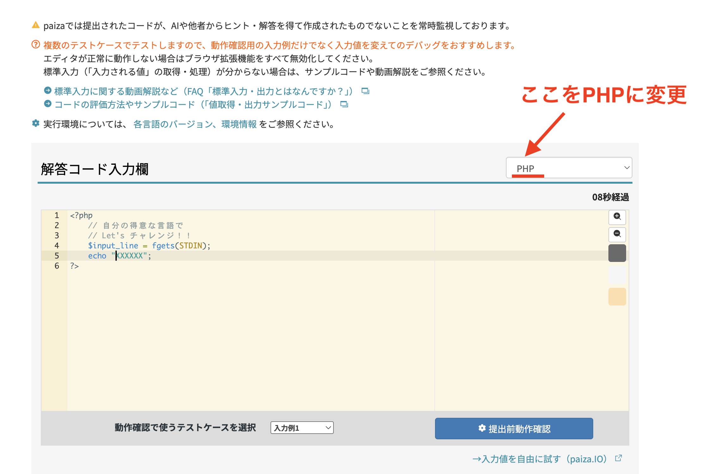

# 演習問題（2026年7月14日）

PHPのサーバをたてることができたので、まずはこれまでの演習問題をやってみてください。

## 準備

- [PHP開発サーバーのたて方](../PHP開発サーバーの立て方.md)

## 演習

1. [20260630_演習](../20260630/20260630_演習.md)
2. [20260707_演習](../20260707/20260707_演習.md)


各問題を1つの `index.php` にまとめて書いてもよいが、[PHP開発サーバーのたて方](../PHP開発サーバーの立て方.md) の「章ごとのディレクトリ構成でアクセスする」の要領で、問題ごとにファイルを分けてもよい（例: `1-1.php` / `1-2.php`）。

### ディレクトリ構成の例

```
study/
  index.php
  0630/
    1.php
    2.php
    3.php
    4.php
  0707/
    1-1.php
    1-2.php
    2-1.php
```

### サーバー起動コマンド

「cd」はディレクトリ移動という意味

```bash
cd /Users/<ユーザー名>/Desktop/study
php -S localhost:8000
```

### URLのアクセス方法

サーバーは `study` ディレクトリ直下で起動する（`php -S localhost:8000`）ので、URLは `study/` からの相対パスに対応する。

```
http://localhost:8000/0630/1.php
http://localhost:8000/0630/2.php
http://localhost:8000/0707/1-1.php
http://localhost:8000/0707/1-2.php
```

## AIの使い方について

**Gemini などのAIは使用してOK！**ただし、以下のポイントを意識すること。

- 言語を理解する
- 調べて分かることは覚えない
- わからなければ「コードの解説コメントを入れて」とAIにお願いする


## 演習が終わって、余裕がある人はPaizaに登録して、スキルチェックをPHPでチャレンジする

https://paiza.jp/challenges

提出言語がデフォルトでは別の言語になっているので、下図のようにPHPに変更してください。



**注意：Paizaのスキルチェックは、AIや他者からヒント・解答を得て作成されたコードでないかを常時監視しています。** ここまでの演習とは異なり、AIを使わず自分の力で解いてください。

