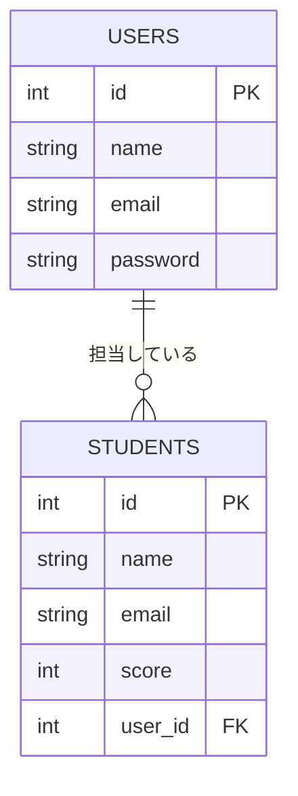

## この記事でわかること

- テーブル・行・列
- 主キー
- 外部キーとテーブル同士のつながり
- テーブルを分ける理由

## データベース = 整理された表の集まり

紙にバラバラにメモするのではなく、表形式で整理して保存する仕組みが「データベース」です。RDB(リレーショナルデータベース)は、この表(テーブル)を複数つなげて(=リレーションさせて)扱えるのが特徴です。

## テーブル・行・列

このアプリには役割の違う2つのテーブルがあります。それぞれを例に、各パーツの名前を確認します。

### 🎓 studentsテーブル(生徒データ)

| id | name | email | score |
|----|------|-------|-------|
| 1  | 田中太郎 | tanaka@example.com | 80 |
| 2  | 佐藤花子 | sato@example.com | 95 |

- **テーブル**: この表そのもの(用途ごとに複数作る)
- **列(カラム)**: `id` `name` `email` `score` のような縦方向の項目
- **行(レコード)**: 1件分のデータ(ここでは生徒1人分の情報)

### 🔑 usersテーブル(先生・管理者のログイン情報)

| id | name | email | password |
|----|------|-------|----------|
| 1  | 小山先生 | koyama@example.com | $2y$10$abcdefGhIjKlmn...(ハッシュ化済み) |
| 2  | 田中先生 | tanaka-t@example.com | $2y$10$OpQrStUvWxYz...(ハッシュ化済み) |

- **テーブル**: `users`(ログイン用のアカウント情報。studentsとは別の役割)
- **列(カラム)**: `id` `name` `email` `password`
- **行(レコード)**: 1件分のデータ(ここでは先生・管理者1人分のログイン情報)

> 💡 `password` は入力されたそのままの文字列(平文)ではなく、ハッシュ化という不可逆な変換をしてから保存します。万が一データベースの中身が漏れても、元のパスワードが分からないようにするためです。

## 主キー:データを一意に見分けるID

`name`(名前)だけで検索すると、同姓同名がいた場合に特定できません。そこで、他の行と絶対に重複しない番号(**主キー**)を使います。上の表の `id` がそれにあたり、「id = 1 のデータをください」と言えば、田中太郎さんのデータに1件だけ絞り込めます。主キー = マイナンバーや会員番号のようなもの、とイメージするとわかりやすいです。

## 外部キー:テーブル同士のつながり

複数のテーブルをIDで関連づけられるのがRDBの本質(=「リレーショナル」の由来)です。

このアプリには、ログイン用の `users` テーブル(先生・管理者アカウント)と、
生徒データの `students` テーブルの2つがあります。今のところこの2つは
IDでつながっていない、独立したテーブルです。

もし「どの先生(user)がどの生徒(student)を登録・担当しているか」を
記録したくなったら、`students` テーブルに `user_id` という列を追加してつなげます。

`USERS.id`(主キー)を `STUDENTS.user_id`(外部キー)が参照する形にすれば、
1人の先生(user)が複数の生徒(student)を担当できる関係(1対多)を表せます。

## なぜテーブルを分けるのか

テーブルを分けずに1つの表にまとめると、同じ担当の先生の名前やメールアドレスが、担当する生徒の人数分だけ重複してしまいます。

| student_id | student_name | staff_name | staff_email |
|-----------|-------|-------------|---------------|
| 101 | 田中花子 | 小山先生 | koyama@example.com |
| 103 | 田中次郎 | 小山先生 | koyama@example.com |

これだと、小山先生がメールアドレスを変更したとき、該当する行を全部探して直す必要があり、直し漏れが起きやすくなります。usersテーブルとstudentsテーブルに分けてIDで関連づければ、小山先生の情報は1箇所だけになり、修正も1箇所で済みます。この「重複を避けてテーブルを分ける」考え方を **正規化** と呼びます。

## まとめ

- データベースとは、データを整理して保存しておく仕組み
- RDBは、データを「テーブル(表)」の形で管理し、テーブルは「列(項目)」と「行(1件分のデータ)」でできている
- 主キーは、1件ごとのデータを重複なく見分けるための目印(ID)
- 外部キーは、別のテーブルの主キーを参照して、テーブル同士を関連づける仕組み
- テーブルを分けて関連づけることで、同じ情報の重複を防ぎ、データを整理しやすくできる

この先は「SQL」「インデックス」「トランザクション」なども登場しますが、まずはこの土台をイメージできればOKです。
