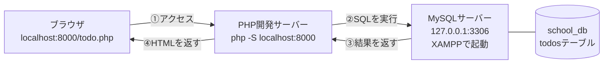
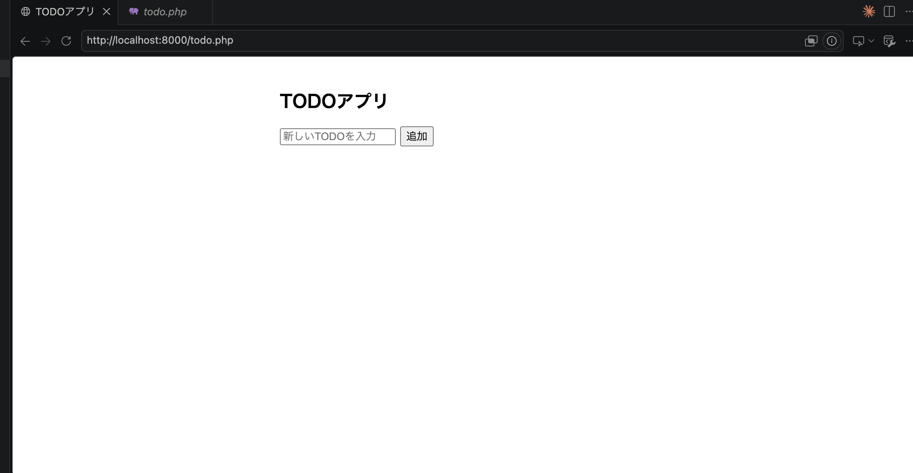

# Todo管理アプリ 起動する流れ

`todo.php` はPHP＋PDOでMySQLに接続し、TODOの追加・編集・完了切り替え・削除ができるアプリです。動かすには「データベースサーバー」と「PHP開発サーバー」の**2つ**を起動しておく必要があります。

## 全体像（起動している状態のイメージ）



- **PHP開発サーバー**：`todo.php`（プログラム本体）を動かす係。ブラウザからのアクセスを受けて、PHPを実行する。
- **MySQLサーバー（XAMPP）**：データそのもの（`school_db` の `todos` テーブル）を保管している係。PHPから頼まれたSQLを実行してデータを返す。
- この2つは**別々のプロセス**として、それぞれ起動しっぱなしにしておく必要がある（どちらか一方でも止まっているとエラーになる）。

## 前提

- XAMPPがインストール済みであること
- PHPがインストール済みであること（`php -v` で確認）
- 以下のコマンド中の `<ユーザー名>` は、自分のパソコンのユーザー名に置き換えること

---

## 0. todo.php を自分の study ディレクトリに用意する

配布された `todo.php` を、自分のパソコンの `study` ディレクトリ以下（例：`study/20260723/`）にコピーしておきます。

- ファイルをそのままドラッグ＆ドロップでコピーするか
- 中身をコピーして、自分の環境で新規作成した `todo.php` に貼り付ける

いずれの方法でもよいので、`php -S` で起動する `study` ディレクトリの中に `todo.php` が存在する状態にしてください。

---

## 1. XAMPPでMySQLを起動する

XAMPP Control Panelを開き、`MySQL` の `Actions` が `Stop` 表示（＝起動中）になっているか確認します。`Start` と表示されている場合はクリックして起動してください。

（詳しい手順は [データベースサーバーの立て方](../データベースサーバーの立て方/データベースサーバーの立て方.md) を参照）

`todo.php` は次の接続情報でMySQLにつなぎに行くため、この設定と合っている必要があります。

```php
$pdo = new PDO(
    'mysql:host=127.0.0.1;port=3306;dbname=school_db;charset=utf8mb4',
    'root',
    '' // XAMPP/DBngin のデフォルトは空パスワード
);
```

- ホスト：`127.0.0.1`（自分のパソコン）
- ポート：`3306`（MySQLの標準ポート）
- データベース名：`school_db`
- ユーザー名：`root`　パスワード：空

`school_db` データベース自体は事前にphpMyAdminなどで作成しておく必要があります（`todos` テーブルは `todo.php` が起動時に自動で作成してくれるので、テーブルまでは手動で作らなくてOK）。

---

## 2. PHP開発サーバーを起動する

ターミナルを開き、`todo.php` が置いてある `study` ディレクトリ直下まで移動してから、PHPの開発用サーバーを起動します。

```bash
cd /Users/<ユーザー名>/Desktop/study
php -S localhost:8000
```

（詳しい手順は [PHP開発サーバーの立て方](../PHP開発サーバーの立て方.md) を参照）

---

## 3. ブラウザでアクセスする

サーバーを起動したまま、ブラウザで `todo.php` を置いた場所に対応するURLにアクセスします。

```
http://localhost:8000/20260723/todo.php
```

上記URLをコピーして、ブラウザのアドレスバーに貼り付けてアクセスしてください。

※ `study/20260723/` の中に置いている場合の例です。実際のURLは「`php -S` を起動したディレクトリ（`study/`）からの相対パス」に合わせてください。

TODOアプリの画面が表示されれば起動成功です。

---

## 4. 動作確認

### この画面が開ければOK！




- 入力欄にテキストを入れて「追加」→ 一覧に追加されるか
- チェックボックスにチェック → 取り消し線がついて完了扱いになるか
- 「編集」→ 内容を書き換えて「保存」できるか
- 「削除」→ 確認ダイアログのあと削除されるか

すべて反映された状態で `index.php`（＝`todo.php`）に戻ってくれば正常に動作しています（PRGパターンにより、操作後は自動でページが再読み込みされる仕組み）。

---

## サーバーの停止

`php -S` を実行したターミナルで `Ctrl + C` を押すとPHP開発サーバーが止まります。MySQLはXAMPP Control Panelの `Stop` ボタンで止められます。

---

## うまく動かないとき

`could not find driver` などPDO関連のエラーが出た場合は、[PDO_MySQL接続エラー対処法](./PDO_MySQL接続エラー対処法.md) を参照してください。
