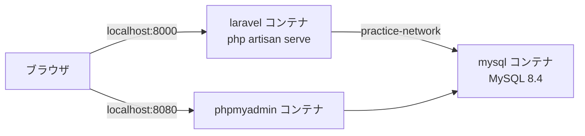
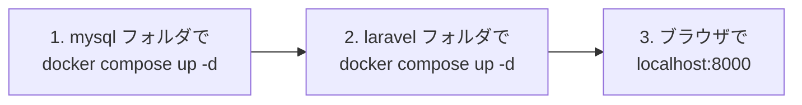

# Laravel × MySQL 練習環境（Docker）

Laravel と MySQL を、**別々のコンテナ** として起動します。
2つのコンテナは `practice-network` というネットワークでつながっています。



```
practice/
  mysql/
    compose.yaml    ← MySQL と phpMyAdmin
  laravel/
    compose.yaml    ← Laravel
    Dockerfile
    entrypoint.sh
    src/            ← 初回起動で Laravel が自動で作られる
```

> Docker Desktop を起動して、左下が **Engine running** になっていることを確認してから始めます。
> Docker Desktop の入れ方 → [Docker Desktopをインストールする](../後期/20261008/20261008_資料.md)

---

## 1. 置き場所

`practice` フォルダを、次のような場所に置きます。

```
C:\Users\<ユーザー名>\Desktop\practice
```

> **OneDrive の中は避ける**
> `C:\Users\<ユーザー名>\OneDrive\...` の中に置くと、同期とぶつかって遅くなったり、エラーになったりします。

---

## 2. 起動する（順番が大事）

**必ず mysql → laravel の順番** で起動します。
ネットワーク `practice-network` は mysql 側で作られるからです。



PowerShell で実行します。

```powershell
cd C:\Users\<ユーザー名>\Desktop\practice\mysql
docker compose up -d
```

```powershell
cd C:\Users\<ユーザー名>\Desktop\practice\laravel
docker compose up -d
```

**初回だけ**、Laravel のインストールに数分かかります。進み具合は次のコマンドで見られます（`Ctrl + C` で見るのをやめる）。

```powershell
docker compose logs -f
```

`Server running on [http://0.0.0.0:8000]` と表示されたら準備完了です。

| 開くURL | 表示されるもの |
|---------|--------------|
| http://localhost:8000 | Laravel のトップページ ✅ |
| http://localhost:8080 | phpMyAdmin（`laravel` データベースにテーブルができている ✅） |

---

## 3. 止める

起動したときの **逆の順番**（laravel → mysql）で止めます。

```powershell
cd C:\Users\<ユーザー名>\Desktop\practice\laravel
docker compose down
```

```powershell
cd C:\Users\<ユーザー名>\Desktop\practice\mysql
docker compose down
```

`down` してもデータベースの中身は消えません（`mysql-data` ボリュームに残っています）。

---

## 4. 接続情報

| 項目 | Laravel から | PC（A5:SQL Mk-2 など）から |
|------|-------------|--------------------------|
| ホスト | `mysql` | `127.0.0.1` |
| ポート | `3306` | **`3307`** |
| データベース | `laravel` | `laravel` |
| ユーザー名 | `laravel` | `laravel` |
| パスワード | `password` | `password` |

PC 側のポートを `3307` にしているのは、XAMPP の MySQL（`3306`）とぶつからないようにするためです。
Laravel の設定は `laravel/src/.env` に書かれています。

---

## 5. artisan コマンドを使う

`php artisan` は、laravel コンテナの中で実行します。laravel フォルダで次のように打ちます。

```powershell
docker compose exec laravel php artisan migrate
docker compose exec laravel php artisan make:controller TodoController
```

---

## 6. うまくいかないとき

| 症状 | 対処 |
|------|------|
| `network practice-network declared as external, but could not be found` | mysql を先に起動していない → mysql フォルダで `docker compose up -d` |
| ログに `MySQL の起動を待っています...` が続く | mysql コンテナが動いているか、Docker Desktop の `Containers` で確認 |
| `port is already allocated`（ポートが使われている） | XAMPP や `php -S` など、同じポートを使うものを止める |
| 初回のインストールが途中で失敗した | laravel フォルダで `docker compose down` → `src` フォルダを削除 → もう一度 `docker compose up -d` |
| データベースを最初からやり直したい | mysql フォルダで `docker compose down -v`（**データが全部消えます**） |
