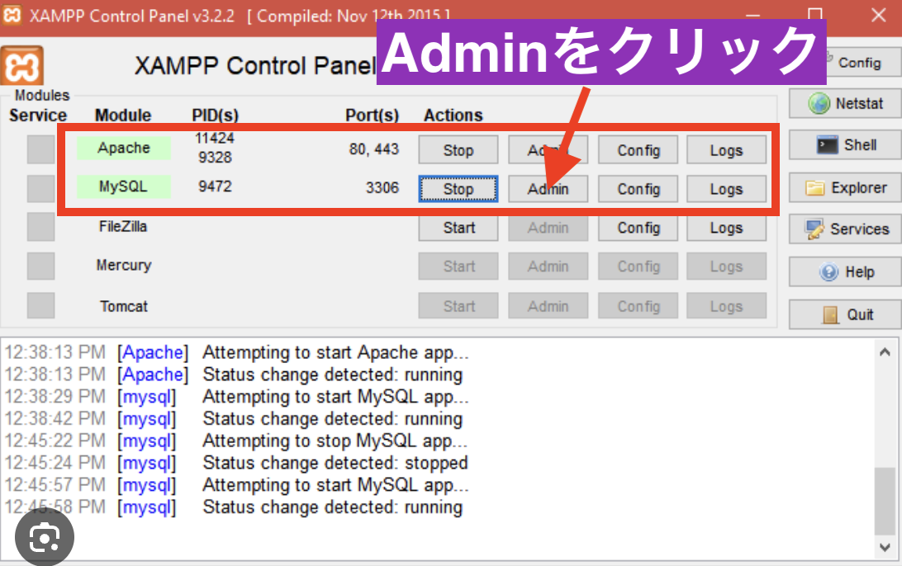
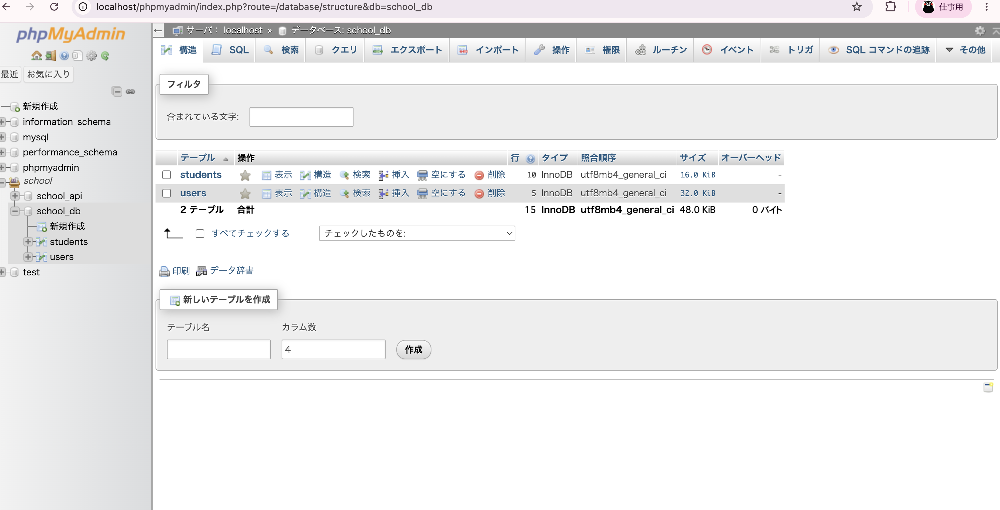
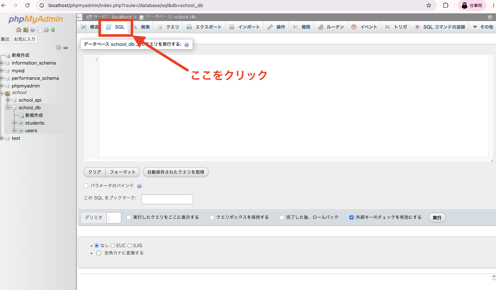

# データベースサーバーの立て方（XAMPP編）

## この記事でわかること

- XAMPPで何を起動しているのか
- phpMyAdmin（データベースの管理画面）の開き方
- phpMyAdminでSQL文を実行する方法

## 1. XAMPPとは

XAMPP（ザンプ）は、Webアプリを動かすのに必要な次の2つを、パソコンに簡単にインストールできるソフトです。

- **Apache**：Webページを表示するためのWebサーバー
- **MySQL**：データを保存しておくためのデータベースサーバー

アプリ開発では「データを保存する場所（データベース）」が必要になるため、まずこのMySQLを起動しておく必要があります。

## 2. XAMPPを起動して、動作確認をする

XAMPPのアプリ（XAMPP Control Panel）を開きます。

`Apache` と `MySQL` の行の `Actions` に `Stop` と表示されていれば、すでに起動している状態です。もし `Start` と表示されている場合は起動していないので、そのボタンをクリックして起動してください。

## 3. phpMyAdmin（管理画面）を開く

MySQLの行にある `Admin` ボタンをクリックします。

すると、ブラウザで **phpMyAdmin** という画面が開きます。phpMyAdminは、MySQLに保存されているデータを、画面上で見たり編集したりできる管理ツールです。ここでは、作成済みのデータベース（例：`school_db`）の中にある各テーブル（`students`、`users`など）の一覧を確認できます。

## 4. SQL文を実行する

テーブルの作成やデータの登録・変更をSQL文で直接行いたい場合は、画面上部の `SQL` タブをクリックします。

タブを開くと、SQL文を入力できる入力欄が表示されるので、そこにSQL文を入力し、「実行」ボタンを押すと、そのSQL文がデータベースに反映されます。

## まとめ

- XAMPPは、Apache（Webサーバー）とMySQL（データベース）をまとめて動かすためのツール
- MySQLの `Admin` から、phpMyAdminというデータベース管理画面を開ける
- phpMyAdminの `SQL` タブから、SQL文を直接実行できる

次は、実際にテーブルを作成し、SQL文でデータを登録・取得する流れを見ていきましょう。
