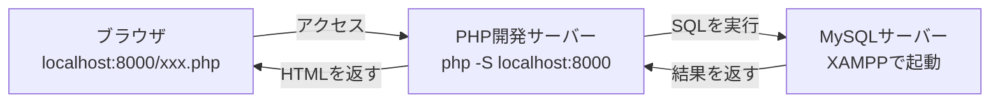

# 前期のふりかえり（復習）

後期に入る前に、前期でやった「アプリを動かすための準備」をざっくり思い出しておきましょう。
前期では、Webアプリを動かすために **2つのサーバー** を立てました。



- **PHP開発サーバー**：PHPのプログラムを動かす係
- **MySQLサーバー（XAMPP）**：データを保存しておく係

どちらか一方でも止まっていると、アプリは動きません。

## 1. PHP開発サーバーを立てた

PHPはサーバー側で動く言語なので、`.php` ファイルをブラウザで直接開いても実行されません。
そこで、PHPに組み込まれている開発用サーバーを使いました。

```bash
cd /Users/<ユーザー名>/Desktop/study
php -S localhost:8000
```

- `php -S` を実行したディレクトリが「Webのルート（`/`）」になる
- ブラウザで `http://localhost:8000/ファイル名.php` にアクセスする
- サブディレクトリに置いたファイルは、URLにもそのディレクトリ名を含める（例：`http://localhost:8000/01-basics/1-3.php`）
- 止めるときは、起動したターミナルで `Ctrl + C`

詳しくは → [PHP開発サーバーの立て方](../../前期/PHP開発サーバーの立て方.md)

## 2. XAMPPでデータベースサーバーを立てた

データを保存しておく場所として、XAMPPでMySQLを起動しました。

- XAMPP Control Panel を開き、`Apache` と `MySQL` を `Start` する（`Stop` と表示されていれば起動中）
- MySQLの行の `Admin` ボタンから **phpMyAdmin**（データベースの管理画面）を開ける
- phpMyAdminの `SQL` タブから、SQL文を直接実行できる

詳しくは → [データベースサーバーの立て方（XAMPP編）](../../前期/データベースサーバーの立て方/データベースサーバーの立て方.md)

## 3. 2つをつないでアプリを動かした

PHPからPDOを使ってMySQLに接続し、Todo管理アプリ（`todo.php`）を動かしました。

1. XAMPPでMySQLを起動する
2. ターミナルで `php -S localhost:8000` を起動する
3. ブラウザで `http://localhost:8000/todo.php` にアクセスする

詳しくは → [Todo管理アプリ 起動する流れ](../../前期/20260723/Todo管理アプリ起動する流れ.md)

## まとめ

- PHPを動かすには **PHP開発サーバー**（`php -S`）が必要
- データを保存するには **MySQLサーバー**（XAMPP）が必要
- アプリを動かすときは、**この2つを両方起動しておく**
