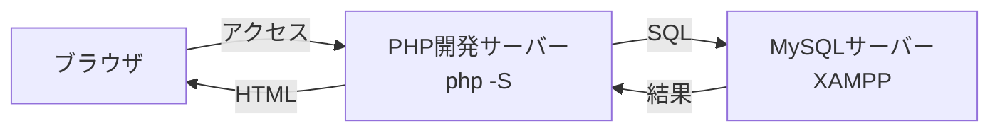
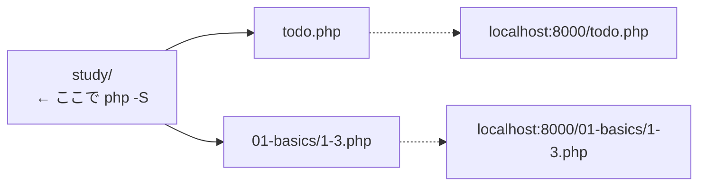
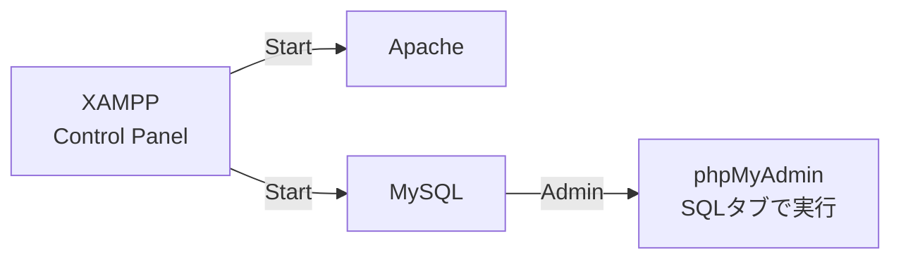
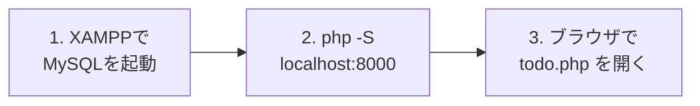

# 前期のふりかえり（復習）

後期に入る前に、前期でやった「アプリを動かすための準備」を思い出しておきましょう。
Webアプリを動かすには **2つのサーバー** が必要でした。



- **PHP開発サーバー**：PHPのプログラムを動かす係
- **MySQLサーバー**：データを保存しておく係

**どちらか一方でも止まっていると、アプリは動きません。**

---

## 1. PHP開発サーバー

PHPはサーバー側で動く言語なので、`.php` ファイルをブラウザで直接開いても実行されません。
そこで、PHPに入っている開発用サーバーを起動しました。

Windowsでは **PowerShell**（スタートメニューで「PowerShell」と検索）で実行します。

```powershell
cd C:\Users\<ユーザー名>\Desktop\study
php -S localhost:8000
```

> **`php` が見つからないと言われたら**
> XAMPPに入っているPHPを、場所を指定して起動します。
>
> ```powershell
> C:\xampp\php\php.exe -S localhost:8000
> ```

`php -S` を実行したフォルダが、URLの `/`（ルート）になります。
フォルダの中にあるファイルは、URLにもそのフォルダ名を付けてアクセスします。



止めるときは、起動したPowerShellで `Ctrl + C` を押します。

詳しくは → [PHP開発サーバーの立て方](../../前期/PHP開発サーバーの立て方.md)

---

## 2. XAMPP（MySQL）

データを保存する場所として、XAMPPでMySQLを起動しました。
XAMPP Control Panel の `Start` ボタンを押し、表示が `Stop` に変われば起動中です。



MySQLの行の `Admin` ボタンを押すと、データベースの管理画面（phpMyAdmin）が開きます。
`SQL` タブから、SQL文を直接実行できました。

詳しくは → [データベースサーバーの立て方（XAMPP編）](../../前期/データベースサーバーの立て方/データベースサーバーの立て方.md)

---

## 3. アプリを動かす順番

PHPからPDOでMySQLに接続し、Todo管理アプリ（`todo.php`）を動かしました。
次の順番で起動します。



詳しくは → [Todo管理アプリ 起動する流れ](../../前期/20260723/Todo管理アプリ起動する流れ.md)
