# ソース管理入門 — SourceTreeとGitHubでコードを管理する

## 今日のゴール
- ソース管理が必要な理由がわかる
- SourceTreeでコミット・プッシュ・プルできる

[前期のふりかえり](./20261001_復習.md)

---

## 1. なぜソース管理が必要？

こんな経験はありませんか？

```
study/
  todo.php
  todo_コピー.php
  todo_動いてたやつ.php
  todo_最新2.php   ← どれが本当の最新？
```

ファイルをコピーして残す方法だと、どれが最新か、どこを直したのかがわからなくなります。
パソコンが壊れたら、全部消えてしまいます。

Gitを使うと、ゲームのように **セーブポイント** を残せます。
壊してしまっても、動いていたときの状態にいつでも戻れます。

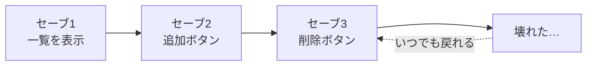

---

## 2. Git・GitHub・SourceTree

名前が似ていますが、それぞれ役割が違います。

| 名前 | なにもの？ | たとえると |
|------|-----------|-----------|
| **Git** | 履歴を記録する仕組み | セーブ機能 |
| **GitHub** | 履歴をネット上に置くサービス | クラウドのセーブ置き場 |
| **SourceTree** | Gitを画面で操作するアプリ | セーブ画面 |

Gitは本来PowerShellなどでコマンドを打って使いますが、今日はSourceTreeを使って **マウス操作** で行います。

---

## 3. 用語は図で覚える

Gitでは、ファイルが「作業フォルダ → 自分のPC → GitHub」の間を行き来します。
矢印の名前が、そのまま操作の名前です。

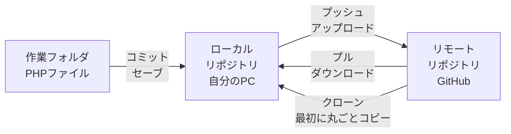

- **リポジトリ**：履歴を管理する「箱」。自分のPCにあるものを **ローカル**、GitHubにあるものを **リモート** と呼ぶ
- **コミット**：変更をセーブポイントとして記録する
- **プッシュ**：自分のPCのセーブをGitHubにアップロードする
- **プル**：GitHubの最新の状態を自分のPCにダウンロードする
- **クローン**：GitHubのリポジトリを、最初に丸ごとコピーしてくる

---

## 4. SourceTreeをインストール

公式サイトからインストーラーをダウンロードして実行します。

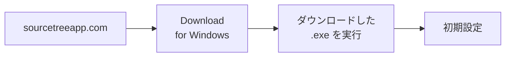

インストーラーの途中で、いくつか質問されます。

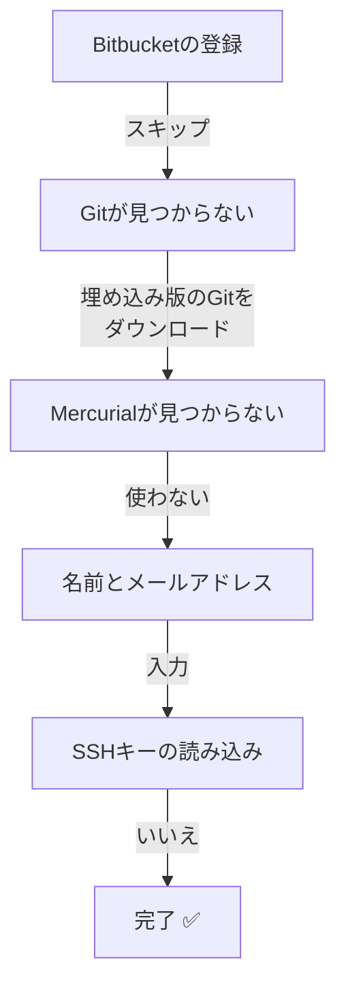

| 聞かれること | 選ぶもの |
|------------|---------|
| Bitbucket（Atlassian）への登録 | `スキップ`（今日は使わない） |
| Gitが見つからない | **埋め込み版のGitをダウンロード**（SourceTree専用のGitが入る） |
| Mercurialが見つからない | `Mercurialを使いたくない`（今日は使わない） |
| 名前とメールアドレス | 入力する。この名前が **コミットの作者** として記録されます |
| SSHキーを読み込むか | `いいえ`（今日はトークンを使うので不要） |

> 画面の文言はバージョンによって少し違うことがあります。迷ったら先生に聞きましょう。

> **名前は自分だとわかるものに**
> 今日は全員で同じリポジトリを使うので、`yamada-taro` のように **誰のコミットかわかる名前** にしましょう。

---

## 5. 今日のしくみ

今日は、先生がGitHubに用意した **練習用リポジトリ** を、クラス全員で使います。
自分のGitHubアカウントはまだ使わず、先生から配られる3つの情報でつなぎます。

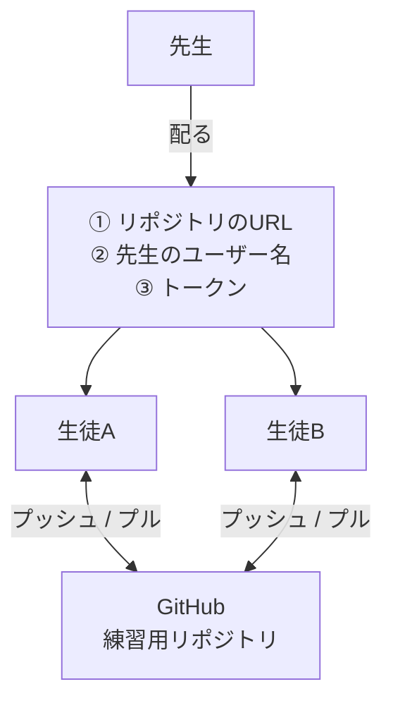

**トークン** は、GitHubに「この人は操作してOK」と伝えるための、パスワード代わりの合言葉です（`github_pat_` で始まる長い文字列）。
今日のトークンは、練習用リポジトリだけを操作できるように制限してあります。

> ⚠️ **トークンは人に見せない・SNSやチャットに貼らない**

---

## 6. クローンする

先生のリポジトリを、自分のPCにコピーします。

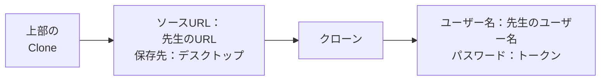

SourceTreeの上部にある `Clone` をクリックし、次のように入力します。

| 項目 | 入力する内容 |
|------|------------|
| 元のパス / URL | 先生から受け取ったリポジトリのURL |
| 保存先のパス | `C:\Users\<ユーザー名>\Desktop\<リポジトリ名>` |

途中でユーザー名とパスワードを聞かれたら、**パスワードの欄にトークンを貼り付けます**。

✅ デスクトップに `<リポジトリ名>` フォルダができ、中に `README.md` があれば成功です。

入力したトークンはWindowsの「資格情報マネージャー」に保存されるので、次からは聞かれません。

> **デスクトップにフォルダが見当たらないとき**
> OneDriveを使っているPCでは、デスクトップの場所が `C:\Users\<ユーザー名>\OneDrive\デスクトップ` になっていることがあります。
> 保存先の `...` ボタンから、エクスプローラーでデスクトップを選ぶと確実です。

---

## 7. コミットする

前期に作ったPHPファイルを、クローンしたフォルダに入れてコミットします。
全員が同じリポジトリを使うので、**自分の名前のフォルダ** を作って、その中に入れます。
こうすると、ほかの人のファイルとぶつかりません。

```
<リポジトリ名>/
  README.md
  yamada-taro/     ← 自分のフォルダ
    todo.php
  suzuki-hanako/   ← ほかの人
    todo.php
```

エクスプローラーでファイルをコピーしたら、SourceTreeの左側の `ファイルステータス` を開きます。
「ステージしていないファイル」に表示されたファイルを「ステージ」に上げ、メッセージを書いてコミットします。

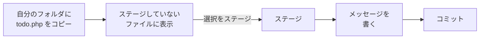

**ステージ** は「今回のセーブに含めるファイル」を選ぶ場所です。

コミットメッセージには、あとで見てわかるように **何をしたか** を書きましょう。

| ❌ 悪いメッセージ | ⭕ 良いメッセージ |
|----------|----------|
| 修正 | Todoの削除ボタンが効かない不具合を修正 |
| 更新 | Todo一覧に期限の列を追加 |

---

## 8. プッシュする

コミットしただけでは、まだ自分のPCの中にしか記録されていません。
プッシュして、GitHubにアップロードします。

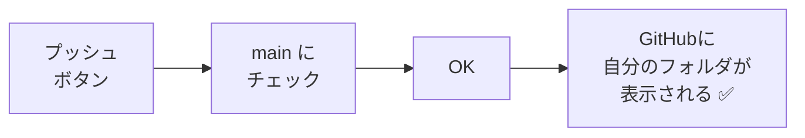

先生が画面に映すGitHubのページに、自分のフォルダが出てくれば成功です。

### エラー（rejected）が出たら

ほかの人が先にプッシュしていると、GitHubの方が新しい状態になっています。
このままプッシュすると、GitHubに断られます（rejected）。
**先にプルして最新を取り込んでから**、もう一度プッシュしましょう。

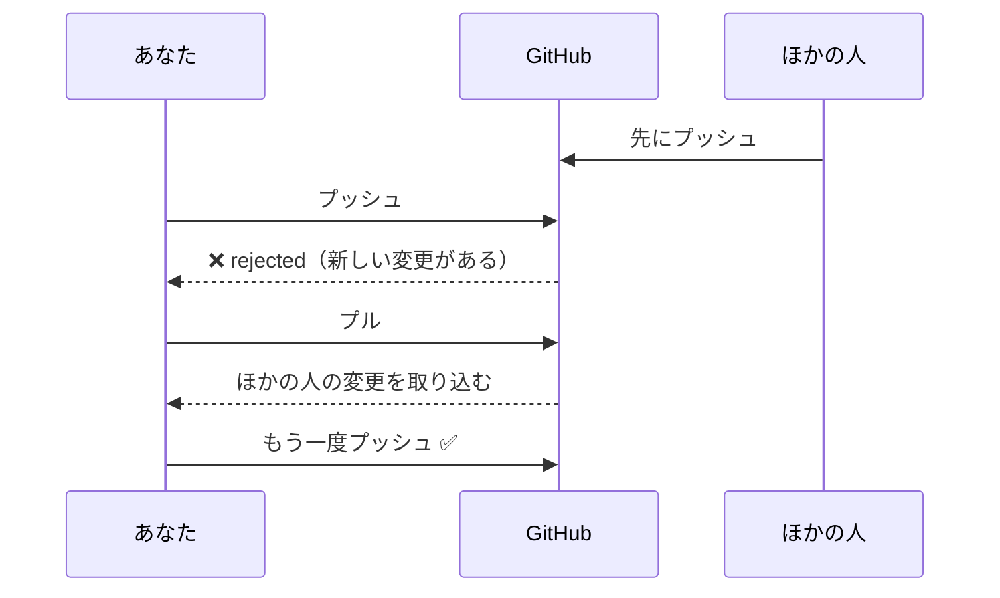

---

## 9. プルする

ほかの人がプッシュした変更を、自分のPCに取り込みます。

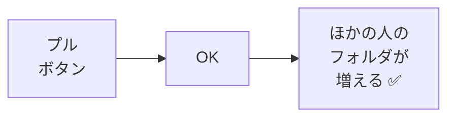

エクスプローラーでデスクトップの `<リポジトリ名>` フォルダを開いて、ほかの人のフォルダが増えていれば成功です。
このように、GitHubを通して **みんなの変更を共有できる** のがGitHubの便利なところです。

---

## 10. 作業の流れ

Gitを使った開発では、次の流れをくり返します。

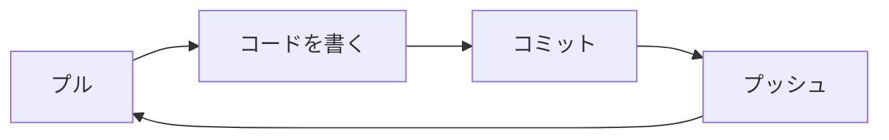

- **作業を始める前にプル**：ほかの人の変更を先に取り込む
- **こまめにコミット**：「ここまで動いた」と思ったらセーブ
- **作業の終わりにプッシュ**：GitHubに保存して共有する

> 今日のリポジトリとトークンは **練習専用** です（授業後に使えなくなります）。
> 自分のリポジトリを作る → [GitHubアカウントとリポジトリの作り方](./20261001_資料_2.md)
