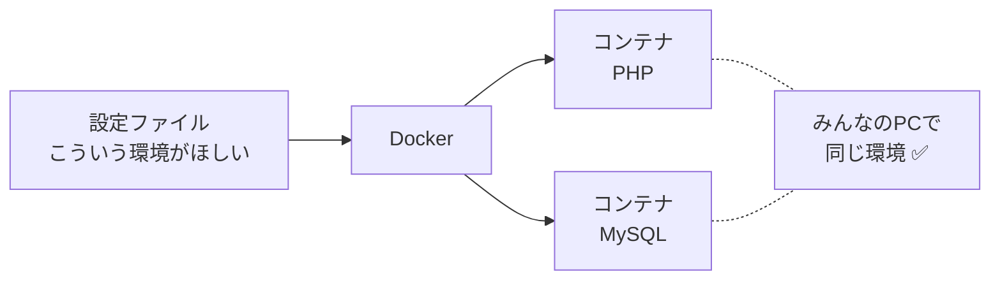
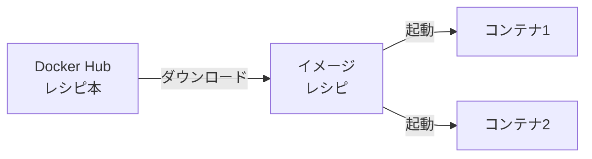
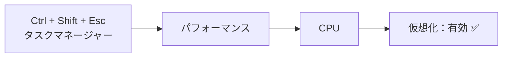
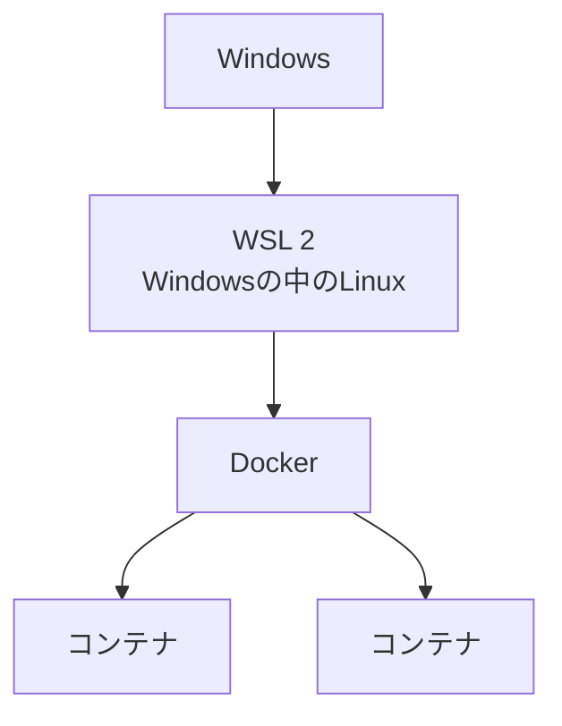
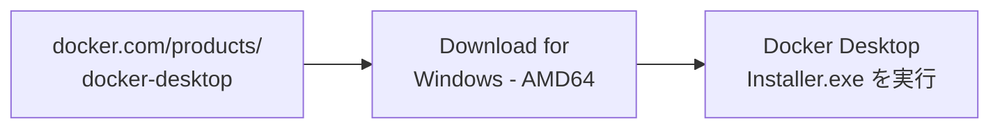
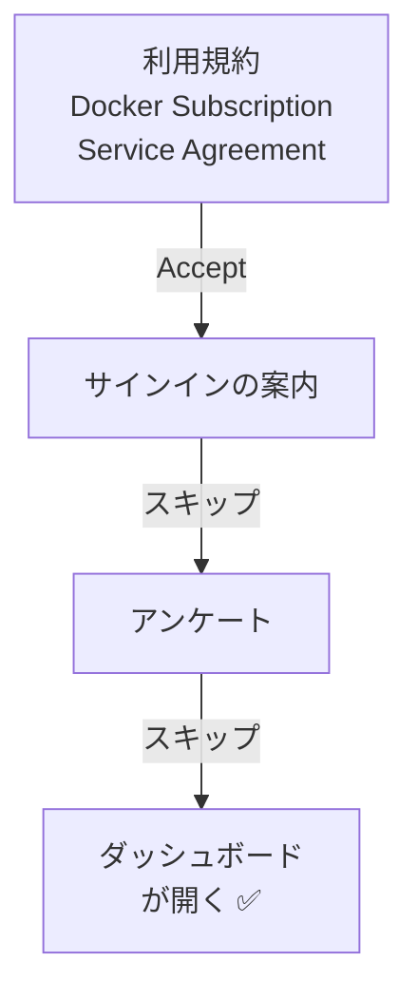
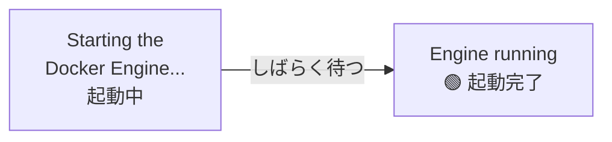
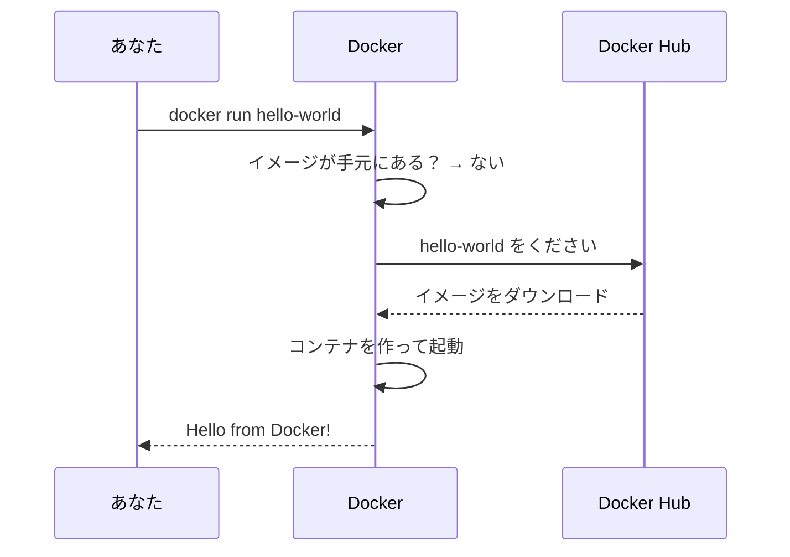
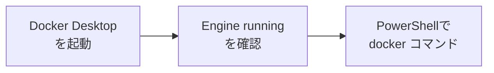

# Docker入門 — Docker Desktopをインストールする

## 今日のゴール
- Dockerが何をしてくれるものかわかる
- Docker Desktopをインストールして、`hello-world` を動かせる

---

## 1. なぜDockerを使う？

前期は、アプリを動かすためにXAMPPを入れて、PHPとMySQLを用意しました。
でも、こんなことが起きがちです。

```
Aさん：「自分のPCでは動くのに…」
Bさん：「PHPのバージョンが違うみたい」
Cさん：「XAMPPの設定をいじったら動かなくなった」
```

**Docker** を使うと、アプリを動かすための環境（PHP・MySQLなど）を **コンテナ** という箱に入れて、どのPCでも同じように動かせます。



- 環境を壊しても、コンテナを作り直せばすぐ元に戻る
- 設定ファイルを共有すれば、チーム全員が同じ環境を用意できる

---

## 2. Docker・イメージ・コンテナ

最初に出てくる言葉を、料理にたとえて覚えましょう。

| 名前 | なにもの？ | たとえると |
|------|-----------|-----------|
| **イメージ** | 環境の設計図 | レシピ |
| **コンテナ** | イメージから作った、実際に動く環境 | レシピから作った料理 |
| **Docker Desktop** | WindowsでDockerを使うためのアプリ | キッチン |
| **Docker Hub** | イメージが公開されているサイト | レシピ本 |

1つのイメージ（レシピ）から、コンテナ（料理）をいくつでも作れます。



---

## 3. インストールの流れ

今日は次の順番で進めます。


---

## 4. 準備の確認

Docker Desktopを入れる前に、PCが次の条件を満たしているか確認します。

| 確認すること | 条件 |
|------------|------|
| Windowsのバージョン | Windows 10（22H2）または Windows 11 |
| 仮想化 | **有効** になっている |
| アカウント | **管理者権限** があるユーザー |

### 仮想化が有効か確認する

Dockerは、PCの中にもう1台小さなPCを動かす **仮想化** という機能を使います。



右下の一覧に **「仮想化：有効」** と表示されていればOKです。

> **「無効」になっていたら**
> BIOS（PCの起動時の設定画面）で有効にする必要があります。PCのメーカーによって操作が違うので、先生を呼んでください。

---

## 5. WSLの準備

**WSL**（Windows Subsystem for Linux）は、Windowsの中でLinuxを動かす仕組みです。
Docker Desktopは、このWSLの上で動きます。



スタートメニューで「PowerShell」と検索し、**右クリック →「管理者として実行」** で開きます。

```powershell
wsl --install
```

すでに入っている場合は、最新にしておきます。

```powershell
wsl --update
```

終わったら、**PCを再起動** します。

✅ 再起動後、PowerShellで次を実行して `既定のバージョン: 2` と表示されればOKです。

```powershell
wsl --status
```

> **`wsl --install` で Ubuntu のユーザー名を聞かれたら**
> Ubuntu（Linuxの一種）の初期設定です。英小文字のユーザー名と、パスワードを決めて入力します。
> パスワードは入力しても画面に何も表示されませんが、ちゃんと入力されています。

---

## 6. Docker Desktopをインストール

公式サイトからインストーラーをダウンロードして実行します。



> **ARM64とAMD64の違い**
> PCのCPUの種類です。ほとんどのWindows PCは **AMD64**（x86_64）です。
> Snapdragonなどのスマホ系CPUのPCだけ ARM64 を選びます。

インストーラーの途中で、設定を聞かれます。

| 聞かれること | 選ぶもの |
|------------|---------|
| Use WSL 2 instead of Hyper-V | **オン**（WSLの上で動かす） |
| Add shortcut to desktop | オン（デスクトップにアイコンができる） |

`OK` を押すとインストールが始まります。
`Close and restart`（または `Close`）が表示されたら、**PCを再起動** します。

---

## 7. 初期設定

再起動後、デスクトップの **Docker Desktop** のアイコンをダブルクリックして起動します。



| 画面 | 選ぶもの |
|------|---------|
| 利用規約（Subscription Service Agreement） | `Accept` |
| サインイン（Sign in / Sign up） | `Skip`（今日はアカウントなしで使う） |
| アンケート（Welcome Survey） | `Skip` |

> 学習目的・個人での利用は無料です。

> 画面の文言はバージョンによって少し違うことがあります。迷ったら先生に聞きましょう。

### 起動しているか確認する

画面左下に **Engine running**（緑色）と表示されていれば、Dockerが動いています。
画面右下のタスクバー（`^` の中）にある **クジラのアイコン** 🐳 でも確認できます。



**DockerはDocker Desktopが起動していないと使えません。**
PCを再起動したら、まずDocker Desktopを起動しましょう。

---

## 8. 動作確認

PowerShell（管理者でなくてOK）を開いて、Dockerのバージョンを確認します。

```powershell
docker --version
```

```
Docker version 28.x.x, build xxxxxxx
```

のように表示されればOKです（数字は人によって違います）。

次に、練習用の **hello-world** イメージを動かしてみます。

```powershell
docker run hello-world
```

このコマンド1つで、Dockerは次のことをしています。



✅ 次のメッセージが表示されれば、インストールは成功です。

```
Hello from Docker!
This message shows that your installation appears to be working correctly.
```

もう一度 `docker run hello-world` を実行すると、今度はダウンロードせずにすぐ動きます。
イメージ（レシピ）がすでに手元にあるからです。

Docker Desktopの左側の `Containers` を開くと、今動かしたコンテナが表示されています。

---

## 9. うまくいかないとき

| 症状 | 対処 |
|------|------|
| `docker` が見つからないと言われる | Docker Desktopが起動しているか確認 → PowerShellを開き直す |
| `Engine stopped` のまま動かない | Docker Desktopを終了して起動し直す → だめならPCを再起動 |
| WSLが古いと言われる（WSL update failed など） | 管理者のPowerShellで `wsl --update` → PCを再起動 |
| 仮想化が無効と言われる（Virtualization support not detected） | [4. 準備の確認](#4-準備の確認) を見る → 先生を呼ぶ |
| `error during connect` と出る | Docker Engineがまだ起動中。左下が `Engine running` になるまで待つ |

---

## 10. まとめ



- **イメージ** は設計図、**コンテナ** はそこから作った実際に動く環境
- Dockerを使う前に、**Docker Desktopを起動** しておく
- `docker run <イメージ名>` で、イメージのダウンロードからコンテナの起動までまとめて行える

次回は、Dockerを使ってPHPとMySQLの環境を作っていきます。
