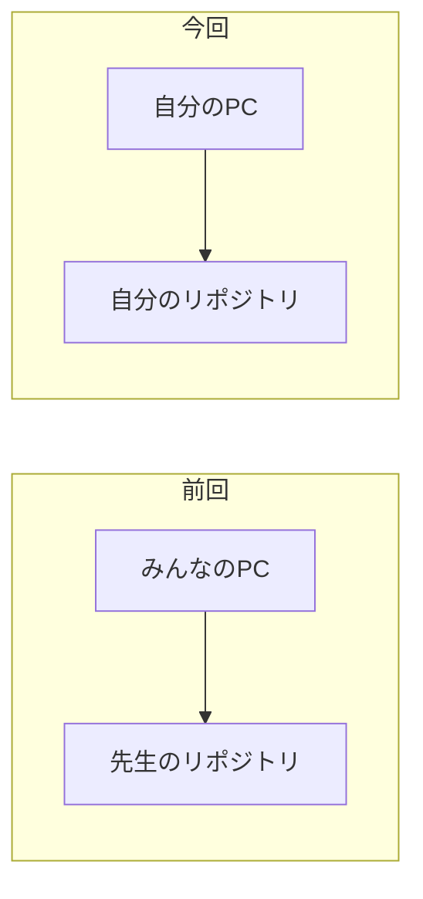
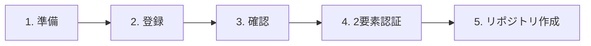
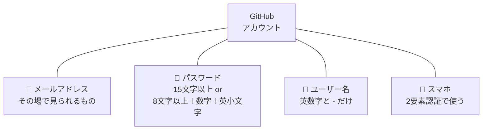
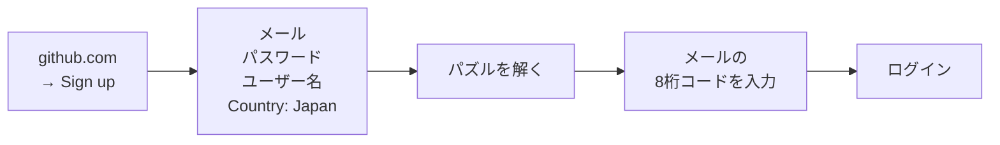
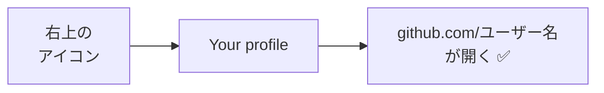
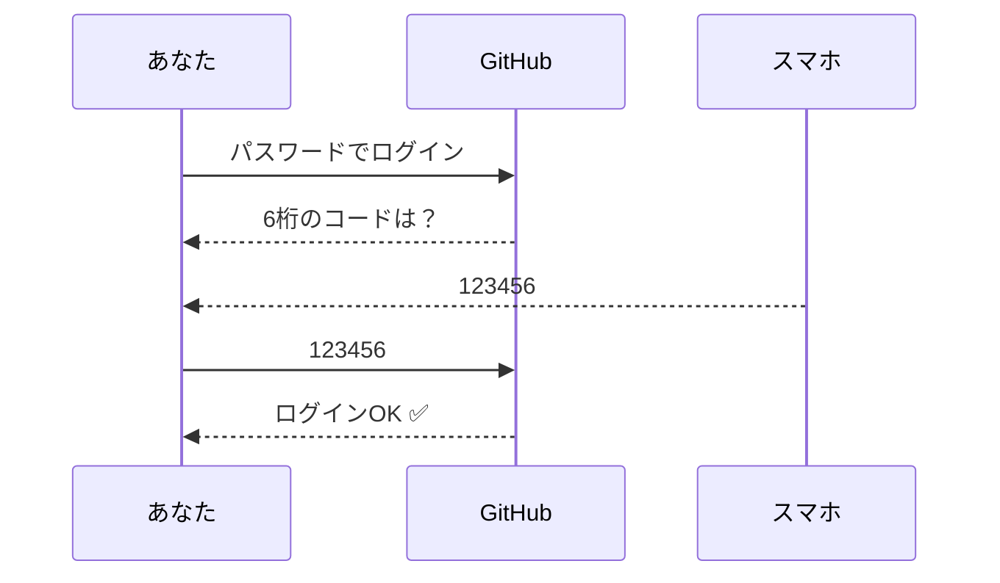
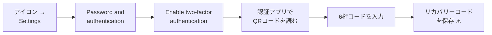
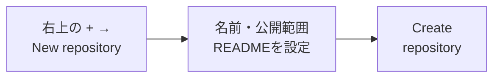
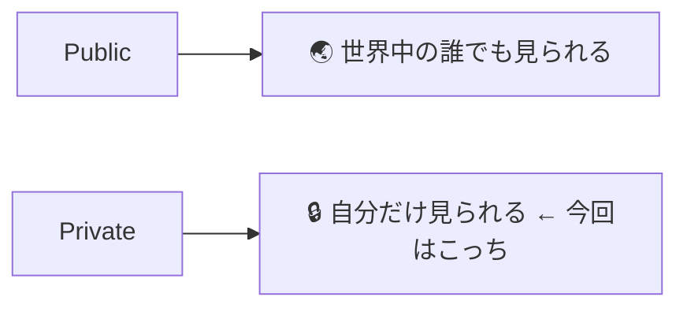

# GitHubアカウントとリポジトリの作り方

## 今日のゴール
- GitHubのアカウントを作れる
- 自分のリポジトリを作れる

[ソース管理入門に戻る](../20261001/20261001_資料_1.md)

---

## 前回のふりかえり

前回の授業では、**先生のGitHubアカウントにあるリポジトリ** に、みんなでプッシュしました。

今回は、**自分のGitHubアカウントを作って、自分のリポジトリ** を用意します。
これで、自分のコードを自分の場所で管理できるようになります。

---

## 全体の流れ

今日は次の5つのステップで、自分専用のコード置き場をGitHubに用意します。

---

## 1. 準備するもの

登録を始める前に、次の4つを用意しておきましょう。

- **メールアドレス**：確認コードが届くので、授業中にその場で見られるものを使います
- **スマホ**：あとで設定する2要素認証で使います

### ユーザー名の決め方

ユーザー名は `https://github.com/<ユーザー名>` のように **URLになり、人に見せる名前** です。
将来ポートフォリオとして見せることもあるので、ふざけた名前は避けましょう。
本名を出したくない人は、本名でなくてもかまいません。

| ❌ 避けたい | ⭕ 良い |
|-------------|----------|
| `unko-man`、`aaaa1234` | `taro-yamada`、`tyamada-dev` |

---

## 2. 登録する

https://github.com を開き、右上の `Sign up` から登録します。

- ユーザー名がすでに使われていると赤字で表示されるので、別の名前にします
- **パズル** は「人間であることの確認」です。画面の指示に従って答えます
- 登録したメールに届く **8桁のコード** を入力すると、登録が完了します

途中で質問やプランの選択が出たら、次のように進めます。

| 画面 | 選ぶもの |
|------|---------|
| 使う目的の質問 | `Skip personalization`（スキップ） |
| プラン | **Free（無料）** |

> **メールが届かないとき**
> 迷惑メールフォルダを確認 → 数分待って `Resend the code` で再送 → それでもダメならアドレスの打ち間違いを確認

---

## 3. 確認する

アカウントができたか、自分のプロフィール画面を開いて確認します。

**自分のユーザー名はメモしておきましょう。** あとで使います。

---

## 4. 2要素認証

**2要素認証（2FA）** は、パスワードに加えて **スマホに表示される6桁のコード** でもログインを確認する仕組みです。
パスワードが知られても、スマホがなければログインされません。

GitHubでは設定が求められ、ログイン後しばらくすると案内が出ます。

### 設定の手順

スマホに認証アプリ（Google Authenticator など）を入れてから始めます。

> ⚠️ **リカバリーコードは必ず保存！**
> スマホをなくしたときに、ログインするための最後の手段です。
> なくすと、アカウントに入れなくなることがあります。

---

## 5. リポジトリを作る

アカウントができたら、自分のコードを保存する **リポジトリ**（履歴を管理する箱）を作ります。

次のように設定します。

| 項目 | 設定 |
|------|------------|
| Repository name | `php-study` |
| 公開範囲 | **`Private`** |
| Add README | **オン** |

**公開範囲** は、誰がこのリポジトリを見られるかの設定です。
練習用のコードは `Private` にしておきましょう。

**README** はリポジトリの説明を書くファイルです。
最初から1つファイルがあると、あとでクローンしたときに中身が入っているか確認できます。

### 確認 ✅

次の3つがそろっていれば完成です。

- URLが `github.com/<ユーザー名>/php-study` になっている
- `README.md` が表示されている
- リポジトリ名の横に `Private` と表示されている

---

次は、作った `php-study` に練習環境をプッシュします → [練習環境を自分のリポジトリにプッシュする](./20261008_資料_2.md)
