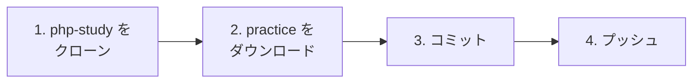
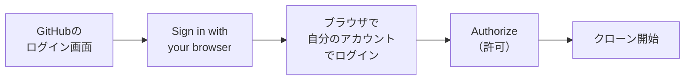
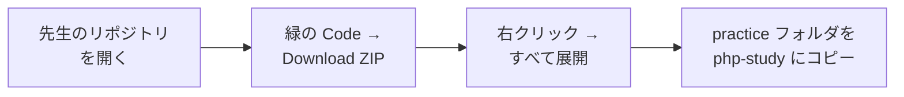
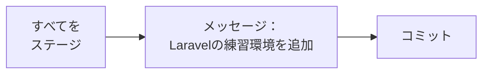

# 練習環境を自分のリポジトリにプッシュする

## 今日のゴール
- 自分のGitHubアカウントでログインして、クローン・プッシュできる
- 練習環境（practice）を自分のリポジトリにプッシュできる

[GitHubアカウントとリポジトリの作り方に戻る](./20261008_資料_1.md)

---

## 全体の流れ

[資料1](./20261008_資料_1.md) で作った `php-study` に、先生が用意した **練習環境（practice フォルダ）** を入れてプッシュします。



---

## 1. php-study をクローンする

前回と同じように、SourceTreeの `Clone` から自分のPCにコピーします。
前回はトークン付きのURLでクローンしましたが、今回は **自分のGitHubアカウントでログイン** してつなぎます。

| 項目 | 入力する内容 |
|------|------------|
| 元のパス / URL | `https://github.com/<自分のユーザー名>/php-study.git` |
| 保存先のパス | `C:\Users\<ユーザー名>\Desktop\php-study` |

`クローン` を押すと、GitHubへのログイン画面が出てきます。
`Sign in with your browser`（ブラウザでサインイン）を選び、**自分のアカウント** でログインします。



- ブラウザでログインを求められたら、資料1で作ったアカウントでログインします（2要素認証の6桁コードも入力）
- `Authorize`（許可）を押すと、SourceTreeに戻ってクローンが始まります
- ログイン情報はWindowsに保存されるので、次からは聞かれません

✅ デスクトップに `php-study` フォルダができ、中に `README.md` があれば成功です。

---

## 2. practice をダウンロードする

先生のリポジトリをZIPでダウンロードして、その中の `practice` フォルダを取り出します。



**先生のリポジトリ：** https://github.com/hakobunet/iica-koyama

展開したフォルダの中の、次の場所に `practice` があります。

```
iica-koyama-main/
  docs/
    1年生_データ設計とアプリ開発/
      practice/   ← これをコピー
```

`practice` フォルダを **丸ごと** `php-study` の中にコピーします。

```
php-study/
  README.md
  practice/        ← コピーしたフォルダ
    README.md
    .gitattributes
    mysql/
      compose.yaml
    laravel/
      .gitignore
      compose.yaml
      Dockerfile
      entrypoint.sh
```

> **中のファイルを1つずつ選ばない**
> `.gitattributes` や `.gitignore` のように、名前が `.` で始まるファイルは大事な設定ファイルです。
> 見えにくいこともあるので、`practice` フォルダごとコピーしましょう。

---

## 3. コミットする

SourceTreeの `ファイルステータス` を開くと、`practice` の中のファイルが「ステージしていないファイル」に表示されます。



---

## 4. プッシュする

`プッシュ` ボタン → `main` にチェック → `OK` でGitHubにアップロードします。

### 確認 ✅

ブラウザで `github.com/<ユーザー名>/php-study` を開き、次のようになっていれば完成です。

- `practice` フォルダが表示されている
- `practice` の中に `mysql` と `laravel` がある

> **クローンやプッシュで `403` や `Repository not found` と出たら**
> URLの `<自分のユーザー名>` が合っているか、ブラウザで **自分のアカウント** にログインしたかを確認しましょう。

練習環境の動かし方は、`practice` フォルダの `README.md` に書いてあります。
フォルダの場所は `C:\Users\<ユーザー名>\Desktop\php-study\practice` になるので、README の `Desktop\practice` は読みかえてください。
