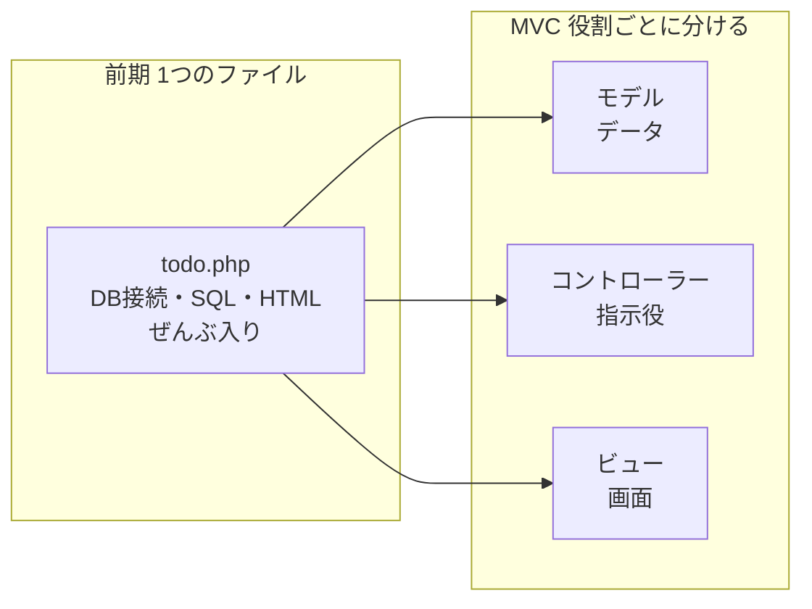
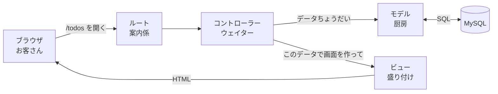
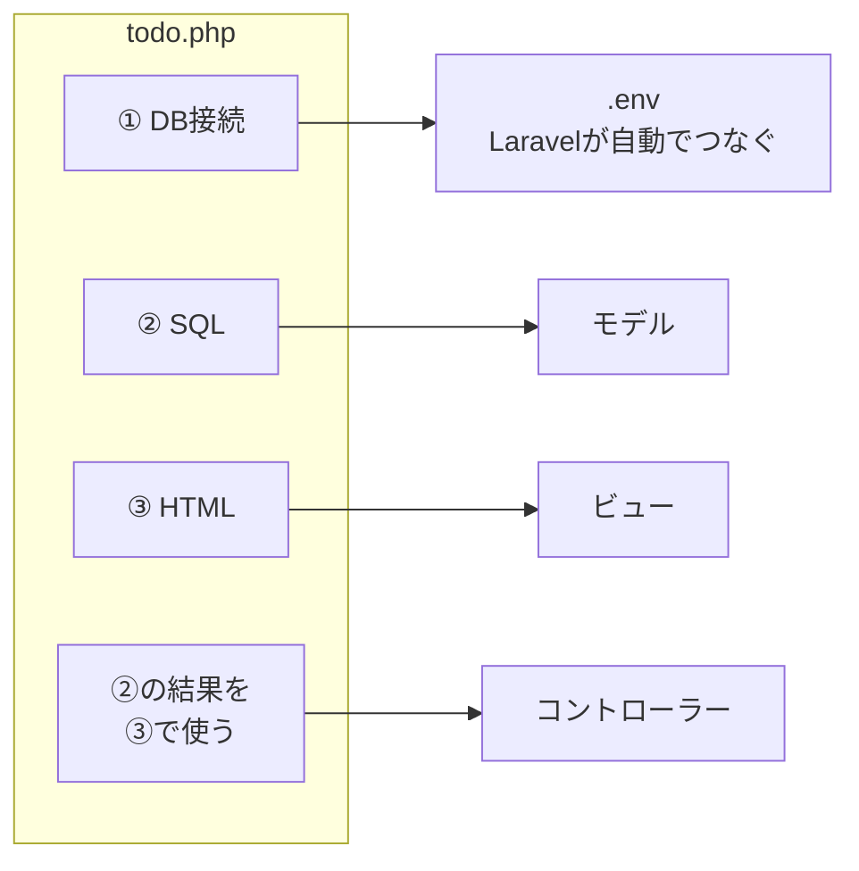
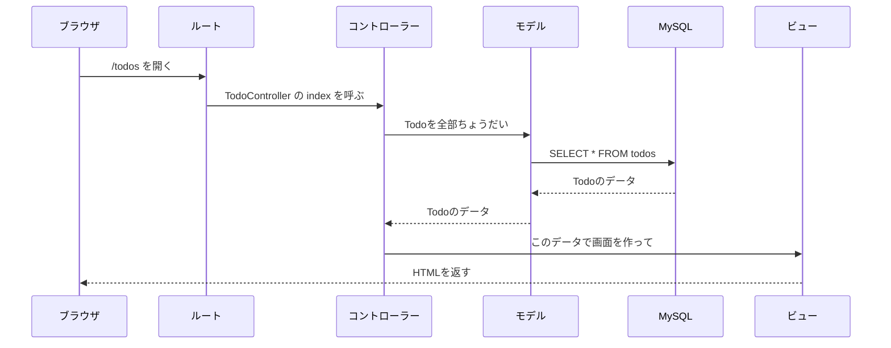
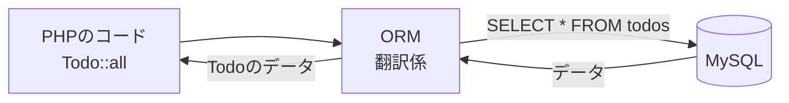
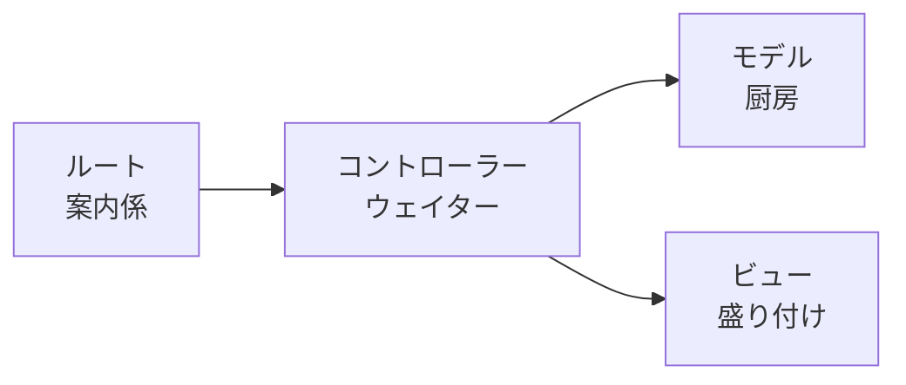

# Laravel入門 — MVCのしくみ

## 今日のゴール
- MVC（モデル・ビュー・コントローラー）の役割がわかる
- Laravelで、リクエストが「ルート → コントローラー → モデル → ビュー」と流れることがわかる
- ORMを使うと、SQLを書かなくてもデータを出し入れできることがわかる

---

## 1. 前期のtodo.phpをふりかえる

前期に作った `todo.php` は、**1つのファイルに全部** 書いてありました。
一覧を表示する部分だけを取り出すと、こうなっています。

```php
<?php
// ① データベースにつなぐ
$pdo = new PDO('mysql:host=127.0.0.1;dbname=school_db;charset=utf8mb4', 'root', '');

// ② SQLでTodoを取ってくる
$stmt = $pdo->query("SELECT * FROM todos ORDER BY created_at DESC");
$todos = $stmt->fetchAll(PDO::FETCH_ASSOC);
?>
<!-- ③ HTMLで画面を作る -->
<ul>
<?php foreach ($todos as $todo): ?>
    <li><?= htmlspecialchars($todo['title']) ?></li>
<?php endforeach; ?>
</ul>
```

小さいアプリならこれで動きます。
でも、アプリが大きくなると、こんなことが起きます。

```
Aさん：「画面の見た目だけ直したいのに、SQLが混ざっていて読みにくい…」
Bさん：「同じSELECTを、いろんなファイルにコピーしてしまった」
Cさん：「どこを直せばいいのかわからない」
```

そこで、**役割ごとにファイルを分ける** 考え方が **MVC** です。



---

## 2. MVCとは

MVCは、アプリを3つの役割に分ける考え方です。レストランにたとえて覚えましょう。

| 名前 | 役割 | レストランでいうと |
|------|------|------------------|
| **M**odel（モデル） | データベースのデータを出し入れする | 厨房（材料を出してくる） |
| **V**iew（ビュー） | 画面（HTML）を作る | 盛り付け（お皿にのせて見せる） |
| **C**ontroller（コントローラー） | 注文を受けて、モデルとビューに指示を出す | ウェイター（厨房と盛り付けをつなぐ） |

Laravelでは、これに **ルート**（どのURLを、どのコントローラーが担当するか）が加わります。
ルートは、お店の **入口の案内係** です。



ポイントは、**コントローラーが真ん中にいて、みんなに指示を出す** ことです。
ビューは、自分でモデルにデータを取りに行きません。データは、コントローラーからわたしてもらいます。

### 前期のtodo.phpは、どこに行く？

さっきの `todo.php` の①〜③は、MVCでは次のように分かれます。



| todo.phpの部分 | 行き先 | 置き場所 |
|---------------|-------|---------|
| ① データベースにつなぐ | Laravelが自動でやってくれる | `.env`（設定ファイル） |
| ② SQLでTodoを取ってくる | **モデル** | `app/Models/Todo.php` |
| ③ HTMLで画面を作る | **ビュー** | `resources/views/todos/index.blade.php` |
| ②の結果を③にわたす | **コントローラー** | `app/Http/Controllers/TodoController.php` |
| どのURLでこの処理を動かすか | **ルート** | `routes/web.php` |

---

## 3. リクエストの流れ

ブラウザで `http://localhost:8000/todos` を開いたとき、Laravelの中では次の順番で処理が進みます。



レストランでいうと、こんな流れです。

1. お客さんが来店する（ブラウザで `/todos` を開く）
2. 案内係が、担当のウェイターに案内する（ルート → コントローラー）
3. ウェイターが厨房に材料をたのむ（コントローラー → モデル）
4. 厨房が倉庫から材料を出してくる（モデル → MySQL）
5. ウェイターが材料を盛り付け係にわたす（コントローラー → ビュー）
6. 料理がお客さんに出される（HTMLがブラウザに返る）

---

## 4. ORMのしくみ

### ORMとは

前期は、`SELECT * FROM todos` のように **SQL文を自分で書いて** いました。
Laravelでは、モデルを使って `Todo::all()` と書くだけでデータを取ってこられます。

これは **ORM**（Object-Relational Mapping）という仕組みのおかげです。
ORMは、**PHPのコードをSQLに自動で翻訳** して、MySQLに送ってくれます。
LaravelのORMは **Eloquent**（エロクエント）という名前です。



レストランでいうと、厨房（モデル）には **翻訳係（ORM）** がいて、ウェイターの「Todoを全部ちょうだい」という注文を、倉庫（MySQL）が読める言葉（SQL）に直してくれるイメージです。

### 前期のSQLと見比べる

| やりたいこと | 前期（SQLを書く） | Laravel（Eloquent） |
|------------|-----------------|-------------------|
| 全部取ってくる | `SELECT * FROM todos` | `Todo::all()` |
| idが1のものを取ってくる | `SELECT * FROM todos WHERE id = 1` | `Todo::find(1)` |
| 未完了だけ取ってくる | `SELECT * FROM todos WHERE is_done = 0` | `Todo::where('is_done', 0)->get()` |

今日は「SQLを書かなくても、こう書けるんだ」とわかればOKです。

### SQLの勉強はムダになるの？

**なりません。** ORMは、裏側でSQLを作ってMySQLに送っています。
うまく動かないときや、複雑なデータを取りたいときは、前期に学んだSQLの知識が役に立ちます。

---

## 5. まとめ



| 役割 | ひとことで |
|------|-----------|
| **ルート** | どのURLを、どのコントローラーが担当するか決める |
| **コントローラー** | モデルからデータをもらって、ビューにわたす |
| **モデル** | データベースのデータを出し入れする（ORMがSQLに翻訳してくれる） |
| **ビュー** | 画面（HTML）を作る |

役割ごとにファイルが分かれているので、「画面を直したいならビュー」「データの取り方を直したいならモデル」と、**直す場所がすぐわかる** ようになります。

次は、実際にMVCに分けてTodoの一覧ページを作ります → [Todo一覧を作ってみよう](./20261015_資料_2.md)
