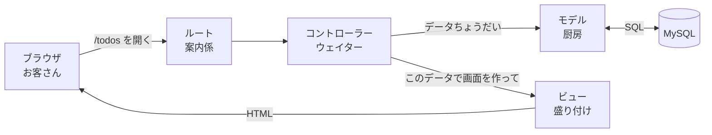
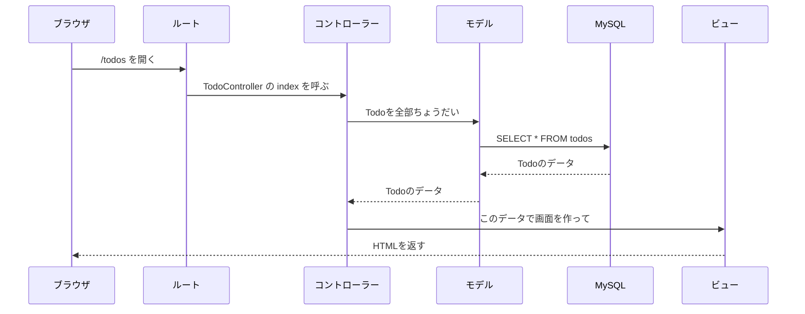
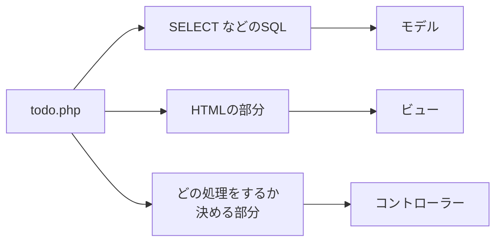
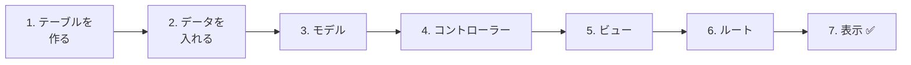
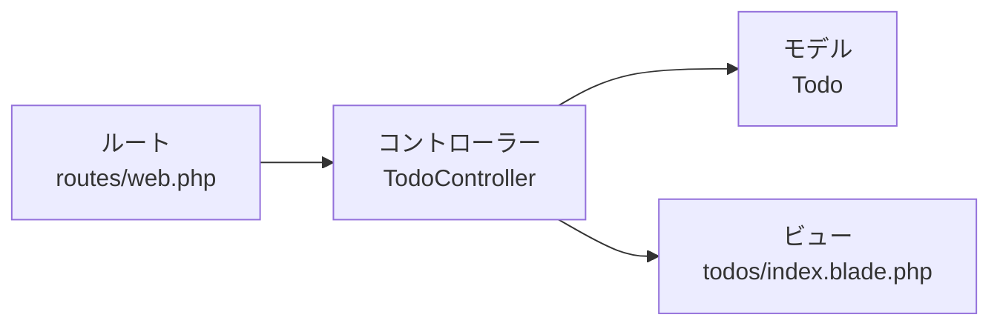

# Laravel入門 — MVCのしくみ

## 今日のゴール
- MVC（モデル・ビュー・コントローラー）の役割がわかる
- Laravelで、リクエストが「ルート → コントローラー → モデル → ビュー」と流れることがわかる
- Todoの一覧ページを、MVCに分けて作れる

> 練習環境（`php-study\practice`）の mysql と laravel を起動してから始めます。
> 起動のしかたは `practice` フォルダの `README.md` を見ましょう。

---

## 1. 前期のtodo.phpをふりかえる

前期に作った `todo.php` は、**1つのファイルに全部** 書いてありました。

```
todo.php
  ├─ データベースにつなぐ（PDO）
  ├─ フォームの処理（追加・更新・削除）
  ├─ SQLでTodoを取ってくる（SELECT）
  └─ HTMLで画面を作る
```

小さいアプリならこれで動きます。
でも、アプリが大きくなると、こんなことが起きます。

```
Aさん：「画面の見た目だけ直したいのに、SQLが混ざっていて読みにくい…」
Bさん：「同じSELECTを、いろんなファイルにコピーしてしまった」
Cさん：「どこを直せばいいのかわからない」
```

そこで、**役割ごとにファイルを分ける** 考え方が **MVC** です。

---

## 2. MVCとは

MVCは、アプリを3つの役割に分ける考え方です。レストランにたとえて覚えましょう。

| 名前 | 役割 | レストランでいうと |
|------|------|------------------|
| **M**odel（モデル） | データベースのデータを出し入れする | 厨房（材料を出してくる） |
| **V**iew（ビュー） | 画面（HTML）を作る | 盛り付け（お皿にのせて見せる） |
| **C**ontroller（コントローラー） | 注文を受けて、モデルとビューに指示を出す | ウェイター（注文を受けて、厨房と盛り付けをつなぐ） |

Laravelでは、これに **ルート**（どのURLを、どのコントローラーが担当するか）が加わります。
ルートは、お店の **入口の案内係** です。



---

## 3. リクエストの流れ

ブラウザで `http://localhost:8000/todos` を開いたとき、Laravelの中では次の順番で処理が進みます。



---

## 4. Laravelのどこに書く？

それぞれの役割は、決まったフォルダに書きます。
場所は `php-study\practice\laravel\src` の中です。

| 役割 | 置き場所 | 今日作るファイル |
|------|---------|----------------|
| ルート | `routes/web.php` | （書き足す） |
| コントローラー | `app/Http/Controllers/` | `TodoController.php` |
| モデル | `app/Models/` | `Todo.php` |
| ビュー | `resources/views/` | `todos/index.blade.php` |
| テーブルの設計図 | `database/migrations/` | `xxxx_create_todos_table.php` |

前期の `todo.php` の中身は、次のように分かれます。



---

## 5. Todo一覧を作ってみよう

前期と同じ `todos` テーブルを使って、Todoの一覧ページを作ります。
コマンドは、PowerShellで **laravel フォルダ** に移動してから実行します。

```powershell
cd C:\Users\<ユーザー名>\Desktop\php-study\practice\laravel
```



### 1. テーブルを作る（マイグレーション）

**マイグレーション** は、テーブルの設計図をPHPで書いたファイルです。
前期はSQLの `CREATE TABLE` でテーブルを作りましたが、Laravelではこのファイルから作ります。

次のコマンドで、マイグレーションファイルを作ります。

```powershell
docker compose exec laravel php artisan make:migration create_todos_table
```

名前を `create_〇〇_table` にすると、Laravelがテーブル名 `todos` を読み取って、ひな形を作ってくれます。

`database/migrations/` に `xxxx_create_todos_table.php` ができるので、開いて `up()` の中を次のようにします。

```php
public function up(): void
{
    Schema::create('todos', function (Blueprint $table) {
        $table->id();                                // id INT AUTO_INCREMENT PRIMARY KEY
        $table->string('title');                     // title VARCHAR(255)
        $table->boolean('is_done')->default(false);  // is_done 完了なら1、未完了なら0
        $table->timestamps();                        // created_at と updated_at
    });
}
```

前期の `CREATE TABLE` と見比べてみましょう。同じことを、PHPで書いています。

保存したら、マイグレーションを実行してテーブルを作ります。

```powershell
docker compose exec laravel php artisan migrate
```

✅ phpMyAdmin（http://localhost:8080）の `laravel` データベースに、`todos` テーブルができていればOKです。

### 2. データを入れる

phpMyAdminで `todos` テーブルを開き、`挿入` から2〜3件のTodoを入れておきます。

| title | is_done |
|-------|---------|
| 牛乳を買う | 0 |
| レポートを出す | 1 |

### 3. モデルを作る（M）

テーブルができたので、そのテーブルのデータを出し入れする **モデル** を作ります。

```powershell
docker compose exec laravel php artisan make:model Todo
```

`app/Models/Todo.php` ができます。開いてみると、ほとんど何も書いてありません。

```php
class Todo extends Model
{
    //
}
```

Laravelは、モデル名 `Todo` から **テーブル名 `todos`** を自動で決めてくれるので、これだけでデータを出し入れできます。

| モデル名（単数・大文字はじまり） | テーブル名（複数・小文字） |
|------------------|------------------|
| `Todo` | `todos` |
| `User` | `users` |

モデルを使うと、**SQL文を自分で書かなくても** データを出し入れできます。
これは **ORM** という仕組みのおかげです → [ORMについて](./20261015_資料_2.md)

> **`-m` をつけると、まとめて作れる**
> `php artisan make:model Todo -m` とすると、モデルとマイグレーションを1回で作れます。
> 今日は役割を分けて理解するために、別々に作りました。

### 4. コントローラーを作る（C）

```powershell
docker compose exec laravel php artisan make:controller TodoController
```

`app/Http/Controllers/TodoController.php` ができるので、次のように書きます。

```php
<?php

namespace App\Http\Controllers;

use App\Models\Todo;

class TodoController extends Controller
{
    public function index()
    {
        // モデルに「Todoを全部ちょうだい」とお願いする
        $todos = Todo::all();

        // ビューに「このデータで画面を作って」とお願いする
        return view('todos.index', ['todos' => $todos]);
    }
}
```

| コード | 意味 |
|--------|------|
| `Todo::all()` | `SELECT * FROM todos` と同じ。SQLを書かなくていい |
| `view('todos.index', ...)` | `resources/views/todos/index.blade.php` を使って画面を作る |
| `['todos' => $todos]` | ビューの中で `$todos` という名前で使えるようにする |

### 5. ビューを作る（V）

`resources/views` の中に `todos` フォルダを作り、`index.blade.php` というファイルを作ります。

```html
<!DOCTYPE html>
<html lang="ja">
<head>
    <meta charset="UTF-8">
    <title>TODOアプリ</title>
</head>
<body>
    <h1>TODOアプリ</h1>

    <ul>
        @foreach ($todos as $todo)
            <li>
                {{ $todo->title }}
                @if ($todo->is_done)
                    ✅
                @endif
            </li>
        @endforeach
    </ul>
</body>
</html>
```

**Blade**（ブレード）は、LaravelのHTMLの書き方です。PHPより短く書けます。

| Blade | 前期のPHPで書くと |
|-------|-----------------|
| `{{ $todo->title }}` | `<?php echo htmlspecialchars($todo['title']); ?>` |
| `@foreach (...)` 〜 `@endforeach` | `<?php foreach (...): ?>` 〜 `<?php endforeach; ?>` |
| `@if (...)` 〜 `@endif` | `<?php if (...): ?>` 〜 `<?php endif; ?>` |

`{{ }}` は、自動で `htmlspecialchars` をしてくれるので安全です。

### 6. ルートを書く

`routes/web.php` を開いて、最後に次の2行を書き足します（`use` の行はファイルの上の方に）。

```php
use App\Http\Controllers\TodoController;

Route::get('/todos', [TodoController::class, 'index']);
```

「`/todos` を開いたら、`TodoController` の `index` を動かしてね」という意味です。

### 7. 表示する ✅

ブラウザで http://localhost:8000/todos を開きます。
phpMyAdminで入れたTodoが一覧で表示されれば成功です。

---

## 6. うまくいかないとき

| 症状 | 対処 |
|------|------|
| `404 Not Found` | `routes/web.php` にルートを書いたか、URLが `/todos` になっているか確認 |
| `Target class [TodoController] does not exist` | `web.php` の上に `use App\Http\Controllers\TodoController;` があるか確認 |
| `View [todos.index] not found` | ビューの場所が `resources/views/todos/index.blade.php` になっているか確認（`.blade.php` まで必要） |
| `Table 'laravel.todos' doesn't exist` | `php artisan migrate` を実行したか確認 |
| 一覧に何も出ない | phpMyAdminで `todos` テーブルにデータが入っているか確認 |

---

## 7. まとめ



- **モデル**：データベースのデータを出し入れする（`Todo::all()`）
- **ビュー**：画面を作る（Bladeで書く）
- **コントローラー**：モデルからデータをもらって、ビューにわたす
- **ルート**：どのURLを、どのコントローラーが担当するか決める

役割ごとにファイルが分かれているので、「画面を直したいならビュー」「データの取り方を直したいならモデル」と、**直す場所がすぐわかる** ようになります。
