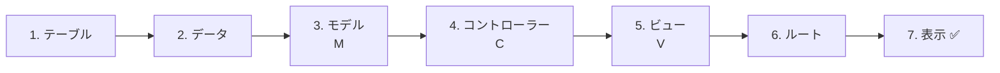
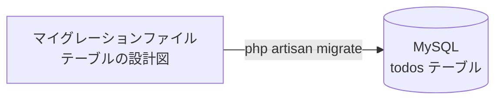
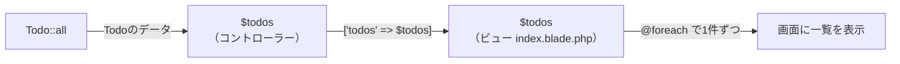
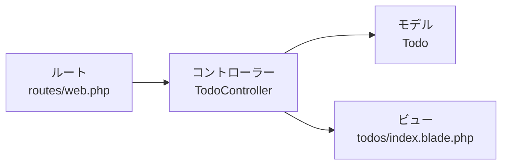

# Laravel入門 — Todo一覧を作ってみよう

[MVCのしくみ](./20261015_資料_1.md) で学んだことを使って、Todoの一覧ページを作ります。

## 今日のゴール
- Todoの一覧ページを、MVCに分けて作れる
- マイグレーション・モデル・コントローラー・ビュー・ルートを、それぞれどこに書くかわかる

> 練習環境（`php-study\practice`）の mysql と laravel を起動してから始めます。
> 起動のしかたは `practice` フォルダの `README.md` を見ましょう。

前期と同じ `todos` テーブルを使って、Todoの一覧ページを作ります。
ファイルは `php-study\practice\laravel\src` の中に作られます。

---

## 1. 作る順番

**動く順番**（ルート → コントローラー → モデル → ビュー）とは逆に、**データの側から** 作っていきます。
材料（テーブルとデータ）がないと、料理（画面）は作れないからです。



---

## 2. コマンドの読み方

今日は、次のようなコマンドを何回か使います。
コマンドは、PowerShellで **laravel フォルダ** に移動してから実行します。

```powershell
cd C:\Users\<ユーザー名>\Desktop\php-study\practice\laravel
```

```powershell
docker compose exec laravel php artisan make:model Todo
```

長く見えますが、2つに分かれています。

| 部分 | 意味 |
|------|------|
| `docker compose exec laravel` | 「laravel コンテナの中で、次のコマンドを動かして」 |
| `php artisan make:model Todo` | 「Todoという名前のモデルを作って」 |

**artisan**（アーティザン）は、Laravelについている **お手伝いコマンド** です。
`make:〇〇` で、ファイルのひな形を自動で作ってくれます。

---

## 3. 作ってみよう

今日作る・書きかえるファイルは、次の5つです（`src` の中）。

```
src/
├─ routes/
│   └─ web.php ······························ 6. ルート（書き足す）
├─ app/
│   ├─ Http/Controllers/
│   │   └─ TodoController.php ··············· 4. コントローラー
│   └─ Models/
│       └─ Todo.php ························· 3. モデル
├─ resources/views/
│   └─ todos/
│       └─ index.blade.php ·················· 5. ビュー
└─ database/migrations/
    └─ 2026_10_15_xxxxxx_create_todos_table.php ··· 1. テーブル
```

### 1. テーブルを作る（マイグレーション）

> いまここ：**🟢 1. テーブル** → 2. データ → 3. モデル → 4. コントローラー → 5. ビュー → 6. ルート → 7. 表示

**マイグレーション** は、テーブルの設計図をPHPで書いたファイルです。
前期はSQLの `CREATE TABLE` でテーブルを作りましたが、Laravelではこのファイルから作ります。

次のコマンドで、マイグレーションファイルを作ります。

```powershell
docker compose exec laravel php artisan make:migration create_todos_table
```

名前を `create_〇〇_table` にすると、Laravelがテーブル名 `todos` を読み取って、ひな形を作ってくれます。

`database/migrations/` に、`2026_10_15_123456_create_todos_table.php` のような **日付つきのファイル** ができます。
開いて、`up()` の中を次のようにします。

```php
public function up(): void
{
    Schema::create('todos', function (Blueprint $table) {
        $table->id();
        $table->string('title');
        $table->boolean('is_done')->default(false);
        $table->timestamps();
    });
}
```

前期の `CREATE TABLE` と見比べてみましょう。同じことを、PHPで書いています。

| 前期のSQL | マイグレーション |
|----------|----------------|
| `id INT AUTO_INCREMENT PRIMARY KEY` | `$table->id();`（正確には、INTより大きな数まで入る `BIGINT UNSIGNED` になる） |
| `title VARCHAR(255) NOT NULL` | `$table->string('title');` |
| `is_done TINYINT(1) NOT NULL DEFAULT 0` | `$table->boolean('is_done')->default(false);` |
| `created_at TIMESTAMP ...` | `$table->timestamps();`（`created_at` と `updated_at` の2つができる。値はLaravelが自動で入れる） |

保存したら、マイグレーションを実行してテーブルを作ります。



```powershell
docker compose exec laravel php artisan migrate
```

✅ **確認**：phpMyAdmin（http://localhost:8080）の `laravel` データベースに、`todos` テーブルができていればOKです。

---

### 2. データを入れる

> いまここ：1. テーブル → **🟢 2. データ** → 3. モデル → 4. コントローラー → 5. ビュー → 6. ルート → 7. 表示

phpMyAdminで `todos` テーブルを開き、`挿入` から2〜3件のTodoを入れておきます。
`id`・`created_at`・`updated_at` は空のままでOKです。

| title | is_done |
|-------|---------|
| 牛乳を買う | 0 |
| レポートを出す | 1 |

✅ **確認**：`表示` タブで、入れたデータが見えればOKです。

---

### 3. モデルを作る（M）

> いまここ：1. テーブル → 2. データ → **🟢 3. モデル** → 4. コントローラー → 5. ビュー → 6. ルート → 7. 表示

テーブルができたので、そのテーブルのデータを出し入れする **モデル**（厨房）を作ります。

```powershell
docker compose exec laravel php artisan make:model Todo
```

`app/Models/Todo.php` ができます。開いてみると、ほとんど何も書いてありません。

```php
class Todo extends Model
{
    //
}
```

**これで完成です。何も書き足さなくてOK。**
Laravelは、モデル名 `Todo` から **テーブル名 `todos`** を自動で決めてくれるので、これだけでデータを出し入れできます。

| モデル名（単数・大文字はじまり） | テーブル名（複数・小文字） |
|------------------|------------------|
| `Todo` | `todos` |
| `User` | `users` |

モデルを使うと、**SQL文を自分で書かなくても** データを出し入れできます。
これは **ORM** という仕組みのおかげです → [ORMのしくみ](./20261015_資料_1.md#4-ormのしくみ)

> **`-m` をつけると、まとめて作れる**
> `php artisan make:model Todo -m` とすると、モデルとマイグレーションを1回で作れます。
> 今日は役割を分けて理解するために、別々に作りました。

---

### 4. コントローラーを作る（C）

> いまここ：1. テーブル → 2. データ → 3. モデル → **🟢 4. コントローラー** → 5. ビュー → 6. ルート → 7. 表示

モデル（厨房）とビュー（盛り付け）をつなぐ **コントローラー**（ウェイター）を作ります。

```powershell
docker compose exec laravel php artisan make:controller TodoController
```

`app/Http/Controllers/TodoController.php` ができるので、中身を次のように書きかえます。

```php
<?php

namespace App\Http\Controllers;

use App\Models\Todo;  // ← Todoモデルを使うための1行

class TodoController extends Controller
{
    public function index()
    {
        // ① モデルに「Todoを全部ちょうだい」とお願いする
        $todos = Todo::all();

        // ② ビューに「このデータで画面を作って」とお願いする
        return view('todos.index', ['todos' => $todos]);
    }
}
```

| コード | 意味 |
|--------|------|
| `Todo::all()` | `SELECT * FROM todos` と同じ。SQLを書かなくていい |
| `view('todos.index', ...)` | `resources/views/todos/index.blade.php` を使って画面を作る（`.` はフォルダの区切り） |
| `['todos' => $todos]` | ビューの中で `$todos` という名前で使えるようにする |

データは、次のようにコントローラーからビューへわたされます。



前期の `todo.php` と見比べると、②の2行が `Todo::all()` の1行になっています。

```php
// 前期
$stmt = $pdo->query("SELECT * FROM todos");
$todos = $stmt->fetchAll(PDO::FETCH_ASSOC);

// Laravel
$todos = Todo::all();
```

---

### 5. ビューを作る（V）

> いまここ：1. テーブル → 2. データ → 3. モデル → 4. コントローラー → **🟢 5. ビュー** → 6. ルート → 7. 表示

画面を作る **ビュー**（盛り付け）を作ります。ビューはコマンドではなく、自分でファイルを作ります。

1. `resources/views` の中に `todos` フォルダを作る
2. `todos` フォルダの中に `index.blade.php` というファイルを作る

```
resources/views/
  └─ todos/
       └─ index.blade.php   ← ここに書く
```

```html
<!DOCTYPE html>
<html lang="ja">
<head>
    <meta charset="UTF-8">
    <title>TODOアプリ</title>
</head>
<body>
    <h1>TODOアプリ</h1>

    <ul>
        @foreach ($todos as $todo)
            <li>
                {{ $todo->title }}
                @if ($todo->is_done)
                    ✅
                @endif
            </li>
        @endforeach
    </ul>
</body>
</html>
```

**Blade**（ブレード）は、LaravelのHTMLの書き方です。前期のPHPより短く書けます。

| Blade | 前期のPHPで書くと |
|-------|-----------------|
| `{{ $todo->title }}` | `<?= htmlspecialchars($todo['title']) ?>` |
| `@foreach (...)` 〜 `@endforeach` | `<?php foreach (...): ?>` 〜 `<?php endforeach; ?>` |
| `@if (...)` 〜 `@endif` | `<?php if (...): ?>` 〜 `<?php endif; ?>` |

- `{{ }}` は、自動で `htmlspecialchars` をしてくれるので安全です
- 前期は `$todo['title']` でしたが、モデルのデータは **`$todo->title`**（矢印）で取り出します

---

### 6. ルートを書く

> いまここ：1. テーブル → 2. データ → 3. モデル → 4. コントローラー → 5. ビュー → **🟢 6. ルート** → 7. 表示

最後に、「`/todos` を開いたら、どのコントローラーを動かすか」を **ルート**（案内係）に教えます。

`routes/web.php` を開いて、★の2行を書き足します。

```php
<?php

use Illuminate\Support\Facades\Route;
use App\Http\Controllers\TodoController;  // ★ 追加（上の方に書く）

Route::get('/', function () {
    return view('welcome');
});

Route::get('/todos', [TodoController::class, 'index']);  // ★ 追加（一番下に書く）
```

`Route::get('/todos', [TodoController::class, 'index']);` は、次の意味です。

```
Route::get( '/todos' ,  [TodoController::class, 'index'] );
             ~~~~~~~     ~~~~~~~~~~~~~~~~~~~~~  ~~~~~~~
             このURLを   TodoControllerの       index で担当してね
             開いたら
```

---

### 7. 表示する ✅

> いまここ：1. テーブル → 2. データ → 3. モデル → 4. コントローラー → 5. ビュー → 6. ルート → **🟢 7. 表示**

ブラウザで http://localhost:8000/todos を開きます。
phpMyAdminで入れたTodoが一覧で表示されれば成功です。

```
TODOアプリ

・牛乳を買う
・レポートを出す ✅
```

✅ **確認**：phpMyAdminでTodoを1件追加して、ブラウザを再読み込みしてみましょう。追加したTodoが出てくれば、データベースからちゃんと取ってこられています。

---

## 4. うまくいかないとき

エラー画面の一番上に出ている英語を読むと、どこが悪いかわかります。

| 症状 | 原因の場所 | 対処 |
|------|----------|------|
| `404 Not Found` | ルート | `routes/web.php` にルートを書いたか、URLが `/todos` になっているか確認 |
| `Target class [TodoController] does not exist` | ルート | `web.php` の上に `use App\Http\Controllers\TodoController;` があるか確認 |
| `Class "App\Http\Controllers\Todo" not found` | コントローラー | `TodoController.php` の上に `use App\Models\Todo;` があるか確認 |
| `View [todos.index] not found` | ビュー | ファイルの場所が `resources/views/todos/index.blade.php` になっているか確認（`.blade.php` まで必要） |
| `Table 'laravel.todos' doesn't exist` | テーブル | `php artisan migrate` を実行したか確認 |
| 一覧に何も出ない | データ | phpMyAdminで `todos` テーブルにデータが入っているか確認 |

---

## 5. まとめ



| 役割 | 今日書いたもの | ひとことで |
|------|--------------|-----------|
| **ルート** | `Route::get('/todos', ...)` | どのURLを、どのコントローラーが担当するか決める |
| **コントローラー** | `TodoController` の `index()` | モデルからデータをもらって、ビューにわたす |
| **モデル** | `Todo`（`Todo::all()`） | データベースのデータを出し入れする |
| **ビュー** | `todos/index.blade.php` | 画面を作る（Bladeで書く） |

役割ごとにファイルが分かれているので、**直す場所がすぐわかる** ようになります。

