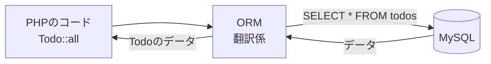

# ORMについて

[Laravel入門 — MVCのしくみに戻る](./20261015_資料_1.md)

---

## ORMとは

前期は、`SELECT * FROM todos` のように **SQL文を自分で書いて** いました。
Laravelでは、`Todo::all()` と書くだけでデータを取ってこられます。

これは **ORM**（Object-Relational Mapping）という仕組みのおかげです。
ORMは、**PHPのコードをSQLに自動で翻訳** して、MySQLに送ってくれます。
LaravelのORMは **Eloquent**（エロクエント）という名前です。

---

## 前期のSQLと見比べる

| やりたいこと | 前期（SQLを書く） | Laravel（Eloquent） |
|------------|-----------------|-------------------|
| 全部取ってくる | `SELECT * FROM todos` | `Todo::all()` |
| idが1のものを取ってくる | `SELECT * FROM todos WHERE id = 1` | `Todo::find(1)` |
| 未完了だけ取ってくる | `SELECT * FROM todos WHERE is_done = 0` | `Todo::where('is_done', 0)->get()` |

今日は「SQLを書かなくても、こう書けるんだ」とわかればOKです。

---

## SQLの勉強はムダになるの？

**なりません。** ORMは、裏側でSQLを作ってMySQLに送っています。
うまく動かないときや、複雑なデータを取りたいときは、前期に学んだSQLの知識が役に立ちます。
