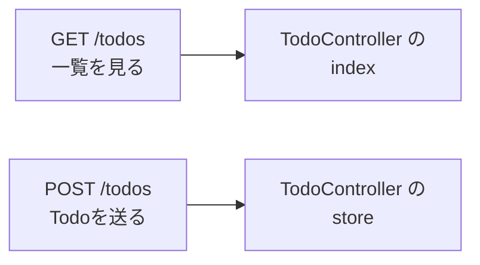
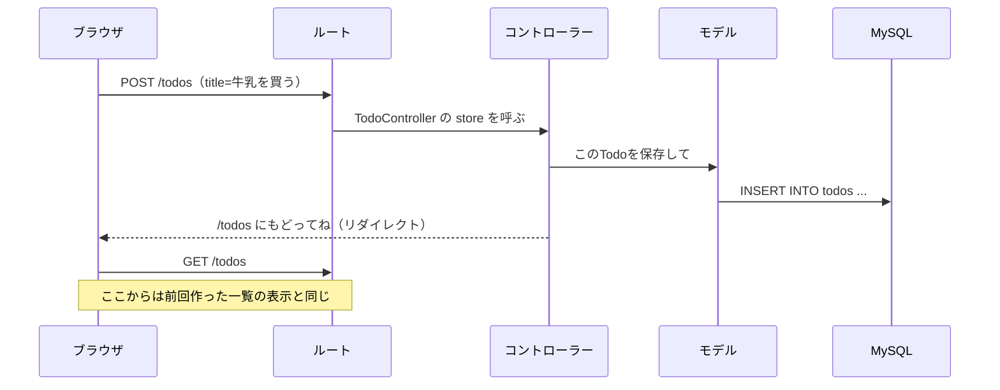
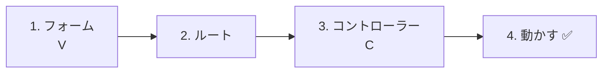
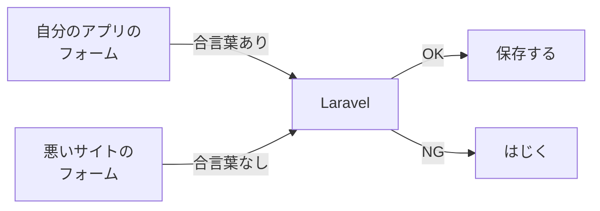
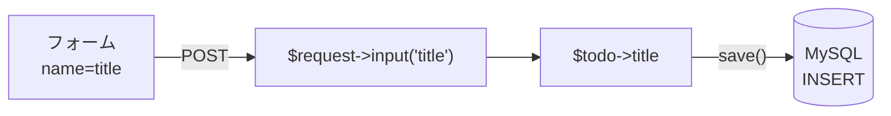
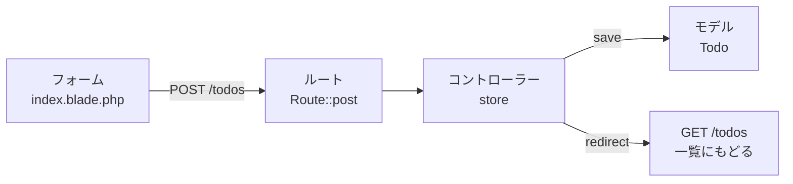

# Laravel入門 — Todoを追加しよう（CREATE）

[前回](../20261015/20261015_資料_2.md) 作ったTodo一覧に、**フォームからTodoを追加する機能** を足します。

## 今日のゴール
- GET と POST のちがいがわかる
- フォームから送ったデータを、コントローラーで受け取ってデータベースに保存できる
- 保存したあと、一覧ページにもどす（リダイレクトする）ことができる

> 練習環境（`php-study\practice`）の mysql と laravel を起動してから始めます。
> 前回作った `/todos` の一覧ページが表示できる状態から始めます。

---

## 1. GETとPOST

ブラウザからサーバーへのお願い（リクエスト）には、種類があります。今日使うのは次の2つです。

| 種類 | 使う場面 | たとえると |
|------|---------|-----------|
| **GET** | ページを **見る** とき（URLを開く・リンクをクリック） | メニューを見せてもらう |
| **POST** | データを **送る** とき（フォームの送信ボタン） | 注文票をわたす |

前回作ったのは「Todoを見る」ページなので **GET** でした。
今日作るのは「Todoを送って保存する」機能なので **POST** を使います。

Laravelでは、**同じURLでも、GETとPOSTで別の処理** を担当させられます。



> **前期のtodo.phpでは？**
> 前期は1つのファイルで、`<input type="hidden" name="action" value="create">` を使って「どの操作か」を見分けていました。
> Laravelでは、**URLとGET/POSTの組み合わせ** で、どのメソッドが動くかを決めます。

---

## 2. 今日の流れ

フォームの送信ボタンを押すと、次の順番で処理が進みます。



ポイントは最後の **リダイレクト** です。
保存が終わったら、コントローラーは画面を作らずに「一覧ページ（`/todos`）を開き直してね」とブラウザに返します。
ブラウザが一覧を開き直すので、追加したTodoが一覧に出てきます。

> **前期のtodo.phpでもやっていた**
> 前期は `header('Location: index.php');` で同じことをしていました（PRGパターン）。
> 再読み込みしても、同じTodoが二重に登録されないようにするためです。

---

## 3. 作ってみよう

今回はテーブルもモデルもできているので、**動く順番**（ビュー → ルート → コントローラー）に作っていきます。



さわるファイルは次の3つです（`src` の中）。モデル `Todo.php` は、今日は書きかえません。

```
src/
├─ resources/views/todos/
│   └─ index.blade.php ················ 1. フォームを書き足す
├─ routes/
│   └─ web.php ························ 2. POSTのルートを書き足す
└─ app/Http/Controllers/
    └─ TodoController.php ············· 3. store メソッドを書き足す
```

---

### 1. フォームを作る（V）

> いまここ：**🟢 1. フォーム** → 2. ルート → 3. コントローラー → 4. 動かす

`resources/views/todos/index.blade.php` を開いて、`<h1>` のすぐ下に ★ のフォームを書き足します。

```html
<!DOCTYPE html>
<html lang="ja">
<head>
    <meta charset="UTF-8">
    <title>TODOアプリ</title>
</head>
<body>
    <h1>TODOアプリ</h1>

    {{-- ★ ここから追加 --}}
    <form method="POST" action="/todos">
        @csrf
        <input type="text" name="title" placeholder="新しいTODOを入力" required>
        <button type="submit">追加</button>
    </form>
    {{-- ★ ここまで --}}

    <ul>
        @foreach ($todos as $todo)
            <li>
                <input type="checkbox" @checked($todo->is_done)>
                {{ $todo->title }}
            </li>
        @endforeach
    </ul>
</body>
</html>
```

| コード | 意味 |
|--------|------|
| `method="POST"` | POSTで送る |
| `action="/todos"` | `/todos` に送る |
| `name="title"` | `title` という名前で送る。コントローラーでこの名前を使って受け取る |
| `required` | 空のままだと送信できないようにする |
| `@csrf` | 下で説明する「合言葉」を入れる |
| `{{-- --}}` | Bladeのコメント。画面には出ない |

#### `@csrf` ってなに？

`@csrf` は、フォームに **合言葉（CSRFトークン）** をこっそり入れる書き方です。
ブラウザで「ページのソースを表示」すると、次のような1行に変わっているのがわかります。

```html
<input type="hidden" name="_token" value="ランダムな文字列">
```

Laravelは、POSTが届いたときに合言葉をチェックします。
これで、**悪いサイトが勝手にあなたのアプリへフォームを送りつける攻撃（CSRF）** を防げます。



**POSTのフォームには、必ず `@csrf` を書く** と覚えましょう。

> **`@csrf` を忘れても動いてしまうことがある**
> Laravel 13 は、合言葉のほかに「同じサイトから送られたか」もブラウザに確かめます。
> そのため、練習環境（`localhost`）では `@csrf` を忘れても動いてしまうことがあります。
> でも、公開するサーバーの環境によっては合言葉だけで判断するので、**動いても必ず書きます**。

---

### 2. ルートを書く

> いまここ：1. フォーム → **🟢 2. ルート** → 3. コントローラー → 4. 動かす

`routes/web.php` を開いて、★ の1行を書き足します。

```php
<?php

use Illuminate\Support\Facades\Route;
use App\Http\Controllers\TodoController;

Route::get('/', function () {
    return view('welcome');
});

Route::get('/todos', [TodoController::class, 'index']);
Route::post('/todos', [TodoController::class, 'store']);  // ★ 追加
```

```
Route::post( '/todos' ,  [TodoController::class, 'store'] );
~~~~~~~~~~~   ~~~~~~~     ~~~~~~~~~~~~~~~~~~~~~  ~~~~~~~
POSTで        このURLに   TodoControllerの       store で担当してね
              送られたら
```

`get` と `post` で、同じ `/todos` でも担当するメソッドが変わります。

| ルート | 担当 | すること |
|--------|------|---------|
| `Route::get('/todos', ...)` | `index` | 一覧を見せる（前回） |
| `Route::post('/todos', ...)` | `store` | Todoを保存する（今日） |

`store`（ストア）は「しまう・保存する」という意味です。Laravelでは、保存するメソッドに `store` という名前をよく使います。

---

### 3. コントローラーを書く（C）

> いまここ：1. フォーム → 2. ルート → **🟢 3. コントローラー** → 4. 動かす

`app/Http/Controllers/TodoController.php` を開いて、★ の部分を書き足します。

```php
<?php

namespace App\Http\Controllers;

use App\Models\Todo;
use Illuminate\Http\Request;  // ★ 追加（フォームのデータを受け取るため）

class TodoController extends Controller
{
    public function index()
    {
        $todos = Todo::all();

        return view('todos.index', ['todos' => $todos]);
    }

    // ★ ここから追加
    public function store(Request $request)
    {
        // ① 新しいTodoを1つ用意する
        $todo = new Todo();

        // ② フォームで入力されたタイトルを入れる
        $todo->title = $request->input('title');

        // ③ データベースに保存する
        $todo->save();

        // ④ 一覧ページにもどる
        return redirect('/todos');
    }
    // ★ ここまで
}
```

| コード | 意味 |
|--------|------|
| `Request $request` | フォームから送られたデータが入った箱。Laravelが自動でわたしてくれる |
| `$request->input('title')` | フォームの `name="title"` の値を取り出す。前期の `$_POST['title']` と同じ |
| `new Todo()` | 新しいTodoを1つ用意する（まだ保存はされていない） |
| `$todo->save()` | データベースに保存する。`INSERT INTO todos ...` と同じ |
| `redirect('/todos')` | 「`/todos` を開き直してね」とブラウザに返す |

前期の `todo.php` と見比べてみましょう。

```php
// 前期
$title = trim($_POST['title'] ?? '');
$stmt = $pdo->prepare("INSERT INTO todos (title) VALUES (:title)");
$stmt->execute(['title' => $title]);
header('Location: index.php');
exit;

// Laravel
$todo = new Todo();
$todo->title = $request->input('title');
$todo->save();
return redirect('/todos');
```

SQLを書かなくても、モデルの `save()` が `INSERT` 文を作ってくれます（ORM）。
プリペアドステートメントも、Laravelが中でやってくれるので安全です。
また、前期の `trim()`（前後の空白を消す）も、Laravelが自動でやってくれます。



---

### 4. 動かす ✅

> いまここ：1. フォーム → 2. ルート → 3. コントローラー → **🟢 4. 動かす**

1. ブラウザで http://localhost:8000/todos を開く
2. 入力欄に「宿題をする」と入れて、`追加` を押す
3. 一覧の一番下に「宿題をする」が出てくれば成功です

```
TODOアプリ

[ 新しいTODOを入力 ] [追加]

☐ 牛乳を買う
☑ レポートを出す
☐ 宿題をする        ← 追加された！
```

✅ **確認1**：phpMyAdmin（http://localhost:8080）で `todos` テーブルを開いてみましょう。
追加したTodoの `created_at` と `updated_at` に、日時が入っているはずです。`save()` のときに、Laravelが自動で入れてくれました。
時刻が9時間前になっているのは、LaravelがUTC（世界標準時）で記録するためです。
（前回phpMyAdminで手入力したTodoは、空（NULL）のままです）

✅ **確認2**：追加したあとにブラウザで再読み込み（F5）をしてみましょう。
リダイレクトしているので、同じTodoが二重に追加されることはありません。

---

## 4. うまくいかないとき

> **🔥 動かないなら、ログを出せ！**
> エラーの原因がわからないときは、ログを出して「どこまで動いたか」を確かめましょう → [【重要】ログの出し方](./【重要】ログの出し方.md)

| 症状 | 原因の場所 | 対処 |
|------|----------|------|
| `The POST method is not supported for route todos.` | ルート | `routes/web.php` に `Route::post('/todos', ...)` を書いたか確認 |
| `Call to undefined method App\Http\Controllers\TodoController::store()` | コントローラー | `TodoController.php` に `store` メソッドを書いたか、名前のつづりを確認 |
| `Class "App\Http\Controllers\Request" does not exist` | コントローラー | `TodoController.php` の上に `use Illuminate\Http\Request;` があるか確認 |
| `Column 'title' cannot be null` | フォーム | `<input>` の `name="title"` のつづりを確認（コントローラーの `input('title')` と同じ名前にする） |
| `419 Page Expired` | フォーム | フォームの中に `@csrf` があるか確認（練習環境では、`@csrf` がなくても出ないことがあります） |
| 追加しても一覧に出ない | コントローラー | `$todo->save();` を書いたか確認。phpMyAdminでデータが入っているかも確認 |

---

## 5. まとめ



| 今日書いたもの | ひとことで |
|--------------|-----------|
| `<form method="POST">` と `@csrf` | Todoを送るフォーム。POSTのフォームには必ず `@csrf` |
| `Route::post('/todos', ...)` | POSTで送られたら `store` が担当する |
| `$request->input('title')` | フォームから送られた値を受け取る |
| `new Todo()` → `save()` | 新しいTodoを作って保存する（INSERT） |
| `redirect('/todos')` | 保存したら一覧にもどる |

---

## 6. もっとやってみよう（時間があまった人）

新しく追加したTodoが **一番上** に来るようにしてみましょう。
`index` メソッドの `Todo::all()` を、次のように書きかえます。

```php
$todos = Todo::orderBy('id', 'desc')->get();
```

`ORDER BY id DESC`（idの大きい順 ＝ 新しい順）と同じ意味です。

> **`Todo::create()` という書き方もある**
> ネットで調べると、`new Todo()` → `save()` のかわりに、次の書き方もよく出てきます。
> ```php
> Todo::create(['title' => $request->input('title')]);
> ```
> 1行で書けて便利ですが、これを使うにはモデルに「どのカラムに入れてよいか」を書く設定（`Fillable`）が必要です。
> 書かないと `Add [title] to fillable property ...` というエラーになります。
> 今日は、しくみがわかりやすい `new Todo()` → `save()` を使いました。
