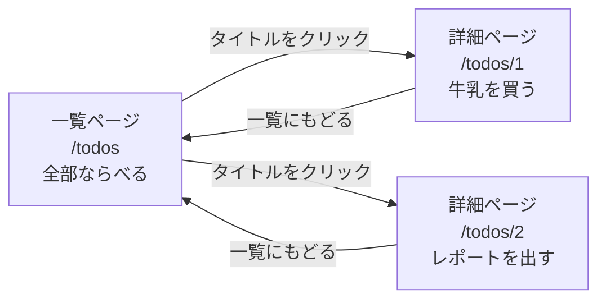
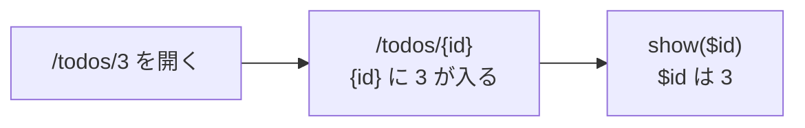
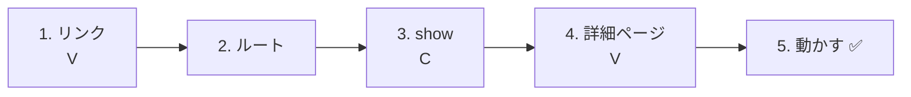
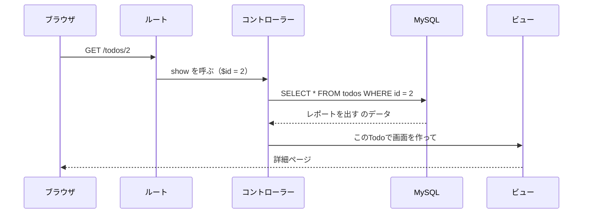
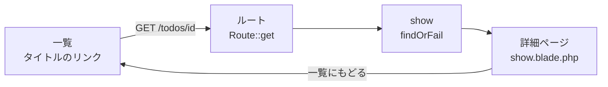

# Laravel入門 — Todoの詳細ページを作ろう（SHOW）

[資料1](./20261022_資料_1.md) でTodoを追加できるようになりました。次は、**1つのTodoをくわしく見るページ（詳細ページ）** を作ります。

## 今日のゴール
- URLの中に `id` を入れて、どのTodoを見るか決められる（ルートパラメータ）
- `id` を使って、Todoを1つだけ取ってこられる
- 1つのTodoの情報を、詳細ページに表示できる

> 資料1の「Todoを追加する」ができている状態から始めます。

---

## 1. 一覧ページと詳細ページ

一覧ページは「Todoを全部ならべて見せる」ページでした。
詳細ページは「**1つのTodoだけ** を、くわしく見せる」ページです。



| | URL | 担当 | 見せるもの |
|---|---|---|---|
| 一覧ページ | `/todos` | `index` | すべてのTodo |
| 詳細ページ | `/todos/1`、`/todos/2` … | `show` | **URLの数字と同じ `id` の** Todo 1つ |

URLの最後の数字は、**見たいTodoの `id`** です。
`/todos/1` なら `id` が1のTodo、`/todos/2` なら `id` が2のTodoの詳細ページになります。

> **ネットのお店でも同じ**
> 通販サイトでも、商品の一覧から1つクリックすると、その商品だけのくわしいページが開きます。
> URLを見ると、`/items/12345` のように **番号が入っている** ことが多いです。

---

## 2. 新しく出てくること

### ルートパラメータ `{id}`

`/todos/1`・`/todos/2`・`/todos/3`… とTodoの数だけルートを書くのは大変です。
そこで、ルートに `{id}` と書くと、**URLのその部分に何が来てもOK** になり、その値をコントローラーで受け取れます。

```php
Route::get('/todos/{id}', [TodoController::class, 'show']);
```



### `findOrFail()` で1つだけ取ってくる

一覧では `Todo::all()` で **全部** 取ってきました。
詳細ページでは、`id` を使って **1つだけ** 取ってきます。

| 書き方 | 取ってくるもの | SQLでいうと |
|--------|--------------|------------|
| `Todo::all()` | 全部 | `SELECT * FROM todos` |
| `Todo::findOrFail($id)` | `id` が一致する1つ | `SELECT * FROM todos WHERE id = ?` |

---

## 3. 作ってみよう



さわるファイルは次の4つです（`src` の中）。

```
src/
├─ resources/views/todos/
│   ├─ index.blade.php ················ 1. タイトルをリンクにする
│   └─ show.blade.php ················· 4. 詳細ページ（新しく作る）
├─ routes/
│   └─ web.php ························ 2. ルートを書き足す
└─ app/Http/Controllers/
    └─ TodoController.php ············· 3. show メソッドを書き足す
```

---

### 1. 一覧のタイトルをリンクにする（V）

> いまここ：**🟢 1. リンク** → 2. ルート → 3. show → 4. 詳細ページ → 5. 動かす

`resources/views/todos/index.blade.php` を開いて、`{{ $todo->title }}` を ★ のようにリンクで囲みます。

```html
    <ul>
        @foreach ($todos as $todo)
            <li>
                <input type="checkbox" disabled @checked($todo->is_done)>
                <a href="/todos/{{ $todo->id }}">{{ $todo->title }}</a>  {{-- ★ リンクにする --}}
            </li>
        @endforeach
    </ul>
```

`{{ $todo->id }}` には、そのTodoの `id` が入ります。
ブラウザで一覧を開き、タイトルにマウスをのせると、左下に `…/todos/1`・`…/todos/2` のように、行ごとにちがうURLが表示されます。

（この時点でタイトルを押すと `404 Not Found` になります。まだルートがないからです）

---

### 2. ルートを書く

> いまここ：1. リンク → **🟢 2. ルート** → 3. show → 4. 詳細ページ → 5. 動かす

`routes/web.php` に、★ の1行を書き足します。

```php
Route::get('/todos', [TodoController::class, 'index']);
Route::post('/todos', [TodoController::class, 'store']);
Route::get('/todos/{id}', [TodoController::class, 'show']);  // ★ 追加
```

```
Route::get( '/todos/{id}' ,  [TodoController::class, 'show'] );
~~~~~~~~~~   ~~~~~~~~~~~     ~~~~~~~~~~~~~~~~~~~~~  ~~~~~~
GETで        このURLを       TodoControllerの       show で担当してね
             開いたら
             （{id} は何でもOK）
```

ここまでで、ルートは3つになりました。

| ルート | 担当 | すること |
|--------|------|---------|
| `GET /todos` | `index` | 一覧を見せる |
| `POST /todos` | `store` | 新しく追加する |
| `GET /todos/{id}` | `show` | 1つのTodoをくわしく見せる |

`show`（ショー）は「見せる」という意味です。Laravelでは、1つのデータを見せるメソッドに `show` という名前をよく使います。

---

### 3. show メソッドを書く（C）

> いまここ：1. リンク → 2. ルート → **🟢 3. show** → 4. 詳細ページ → 5. 動かす

`app/Http/Controllers/TodoController.php` に、★ の `show` メソッドを書き足します。

```php
    // （index と store は省略）

    // ★ ここから追加
    public function show($id)
    {
        // ① id で、見たいTodoを1つ取ってくる
        $todo = Todo::findOrFail($id);

        // ② 詳細ページを表示する
        return view('todos.show', ['todo' => $todo]);
    }
    // ★ ここまで
```

| コード | 意味 |
|--------|------|
| `show($id)` | URLの `{id}` の部分が `$id` に入る |
| `Todo::findOrFail($id)` | `id` が一致するTodoを1つ取ってくる |
| `view('todos.show', ...)` | `resources/views/todos/show.blade.php` を使って画面を作る |
| `['todo' => $todo]` | ビューの中で `$todo` という名前で使えるようにする |

`index` と見比べてみましょう。形はほとんど同じです。

| | `index`（一覧） | `show`（詳細） |
|---|---|---|
| 取ってくる | `Todo::all()`（全部） | `Todo::findOrFail($id)`（1つ） |
| 変数 | `$todos`（複数形） | `$todo`（単数形） |
| ビュー | `todos.index` | `todos.show` |

> **`findOrFail` の「OrFail」ってなに？**
> 「見つからなかったら失敗（Fail）にする」という意味です。
> `/todos/999` のように、ないTodoを開こうとすると、自動で `404 Not Found` のページを出してくれます。
> 似た `Todo::find($id)` は、見つからないと `null`（からっぽ）になり、そのあとのビューでエラーになります。

---

### 4. 詳細ページを作る（V）

> いまここ：1. リンク → 2. ルート → 3. show → **🟢 4. 詳細ページ** → 5. 動かす

`resources/views/todos` の中に、`show.blade.php` というファイルを新しく作ります。

```
resources/views/todos/
  ├─ index.blade.php
  └─ show.blade.php   ← 新しく作る
```

```html
<!DOCTYPE html>
<html lang="ja">
<head>
    <meta charset="UTF-8">
    <title>TODOの詳細</title>
</head>
<body>
    <h1>{{ $todo->title }}</h1>

    <p>番号：{{ $todo->id }}</p>

    <p>
        状態：
        @if ($todo->is_done)
            完了 ✅
        @else
            未完了
        @endif
    </p>

    <a href="/todos">一覧にもどる</a>
</body>
</html>
```

| コード | 意味 |
|--------|------|
| `{{ $todo->title }}` | Todoのタイトル |
| `{{ $todo->id }}` | Todoの番号（`id`） |
| `@if` 〜 `@else` 〜 `@endif` | 完了なら「完了 ✅」、そうでなければ「未完了」と表示する |

一覧のビューでは `@foreach` で1つずつ取り出していましたが、詳細ページの `$todo` は **最初から1つだけ** なので、`@foreach` はいりません。

---

### 5. 動かす ✅

> いまここ：1. リンク → 2. ルート → 3. show → 4. 詳細ページ → **🟢 5. 動かす**

1. http://localhost:8000/todos を開く
2. 「レポートを出す」をクリックする
3. 次のような詳細ページが出れば成功です

```
レポートを出す

番号：2

状態：完了 ✅

一覧にもどる
```



✅ **確認1**：ほかのTodoもクリックして、それぞれのタイトルと状態が出るか確かめましょう。

✅ **確認2**：ブラウザのURLを、直接 http://localhost:8000/todos/999 に書きかえて開いてみましょう。
`id` が999のTodoはないので、`404 Not Found` のページが出ます。`findOrFail` が働いているしるしです。

---

## 4. うまくいかないとき

> **🔥 動かないなら、ログを出せ！**
> エラーの原因がわからないときは、`show` の中で `Log::info()` を使って、`$id` の値を確かめましょう → [【重要】ログの出し方](./【重要】ログの出し方.md)

| 症状 | 原因の場所 | 対処 |
|------|----------|------|
| タイトルを押すと `404 Not Found` | ルート | `routes/web.php` に `Route::get('/todos/{id}', ...)` を書いたか確認 |
| `Call to undefined method App\Http\Controllers\TodoController::show()` | コントローラー | `TodoController.php` に `show` メソッドを書いたか、名前のつづりを確認 |
| `View [todos.show] not found.` | ビュー | `resources/views/todos/show.blade.php` を作ったか、ファイル名を確認 |
| `Undefined variable $todo` | コントローラー | `view('todos.show', ['todo' => $todo])` の `'todo'` のつづりを確認（`'todos'` になっていないか） |
| どのTodoを押しても、同じTodoが出る | ビュー | 一覧のリンクが `href="/todos/{{ $todo->id }}"` になっているか確認 |

---

## 5. まとめ



| 今日書いたもの | ひとことで |
|--------------|-----------|
| `href="/todos/{{ $todo->id }}"` | Todoごとに、`id` 入りのリンクを作る |
| `Route::get('/todos/{id}', ...)` | URLの中の `id` を、コントローラーで `$id` として受け取る |
| `Todo::findOrFail($id)` | `id` でTodoを1つ取ってくる。なければ404 |
| `show.blade.php` | 1つのTodoをくわしく見せるページ |

ここで覚えた **`{id}` と `findOrFail()`** は、このあと作る「編集」や「削除」でも使います。

---

## 6. もっとやってみよう（時間があまった人）

詳細ページに、**作った日時**（`created_at`）も表示してみましょう。

<details>
<summary>ヒント</summary>

`show.blade.php` に、次の1行を書き足します。

```html
<p>作った日時：{{ $todo->created_at }}</p>
```

- 資料1のフォームで追加したTodoは、日時が表示されます（UTCなので、日本時間より9時間前です）
- 前回phpMyAdminで手入力したTodoは、`created_at` が空（NULL）なので、何も表示されません

</details>
