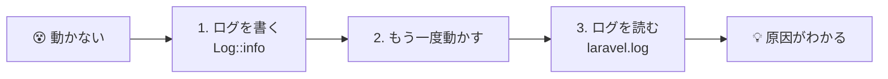
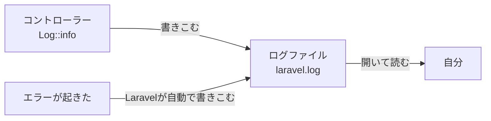
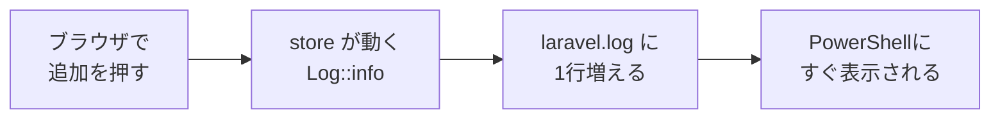
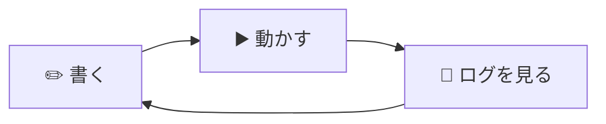

# 【重要】動かないなら、ログを出せ！

[Todoを追加しよう（CREATE）に戻る](./20261022_資料_1.md)

> ## 🔥 動かないなら、ログを出せ！
> プログラムがうまく動かないとき、**なんとなくコードを書きかえても、まず直りません。**
> 先に **ログを出して、中で何が起きているかを見る**。これが、原因を見つけるいちばんの近道です。
> このページは、これからの授業や自由制作でもずっと使います。困ったら何度でも見に来ましょう。
>
> ## 👀 ログを見る癖をつけよう！
> 動かないときだけでなく、**ふだんからログを見る** ようにしましょう。
> 「動いたつもり」のまちがいにも、早く気づけるようになります。



## このページのゴール
- ログが何のためにあるかわかる
- `Log::info()` で、自分でログを書き出せる
- ログファイルを開いて、中身を読める
- ふだんからログを見る癖をつける

---

## 1. ログとは

フォームの `追加` を押しても、うまく保存されないことがあります。
でも、コントローラーの中で何が起きているかは、画面からは見えません。

- フォームの値は、ちゃんとコントローラーに届いている？
- `store` メソッドは、そもそも動いている？

そこで使うのが **ログ** です。
ログは、アプリが「いつ・何をしたか」を書きこんでいく **日記** のようなものです。



ログファイルの場所は、`src` の中のここです。

```
src/
└─ storage/
    └─ logs/
        └─ laravel.log   ← ここに書きこまれる
```

> **エラーも自動で書きこまれる**
> 自分で何もしなくても、プログラムのエラーが起きるとLaravelが `laravel.log` に書きこんでくれます。
> エラー画面を閉じてしまっても、あとからログで確認できます。
>
> ただし、`404 Not Found`（ページが見つからない）・`405`（`The POST method is not supported ...`）・`419 Page Expired` のような
> **「URLや送り方がちがう」エラーは、ログに書きこまれません**。これらは、ルートやフォームを確認しましょう。

---

## 2. ログを書き出してみよう

前回の `store` メソッドに、ログを書き出す行を足してみます。
`app/Http/Controllers/TodoController.php` を開いて、★ の部分を書き足します。

```php
<?php

namespace App\Http\Controllers;

use App\Models\Todo;
use Illuminate\Http\Request;
use Illuminate\Support\Facades\Log;  // ★ 追加（ログを使うため）

class TodoController extends Controller
{
    // （index は省略）

    public function store(Request $request)
    {
        // ★ フォームから届いた値をログに書く
        Log::info('Todoを追加します', ['title' => $request->input('title')]);

        $todo = new Todo();
        $todo->title = $request->input('title');
        $todo->save();

        // ★ 保存できたことをログに書く
        Log::info('Todoを保存しました', ['id' => $todo->id]);

        return redirect('/todos');
    }
}
```

| コード | 意味 |
|--------|------|
| `use Illuminate\Support\Facades\Log;` | ログを使うための1行 |
| `Log::info('メッセージ')` | ログに「お知らせ」として書く |
| `['title' => ...]` | メッセージといっしょに、値も書き出す（なくてもOK） |
| `$todo->id` | `save()` したあとは、自動でついた `id` がわかる |

---

## 3. ログを見てみよう

ブラウザで http://localhost:8000/todos を開き、「宿題をする」と入れて `追加` を押します。
それから、ログを見てみましょう。見かたは2つあります。

### 見かた1：エディタで開く

`src/storage/logs/laravel.log` を、VS Codeなどのエディタで開きます。
一番下までスクロールすると、次のような行が増えています。

```
[2026-10-22 01:15:30] local.INFO: Todoを追加します {"title":"宿題をする"}
[2026-10-22 01:15:30] local.INFO: Todoを保存しました {"id":3}
```

| 部分 | 意味 |
|------|------|
| `[2026-10-22 01:15:30]` | 書きこまれた日時 |
| `local` | 動かしている環境（練習環境は `local`） |
| `INFO` | ログの種類（お知らせ） |
| `Todoを追加します` | 自分で書いたメッセージ |
| `{"title":"宿題をする"}` | いっしょに書き出した値 |

> **時刻が9時間ずれている？**
> Laravelは、時刻を **UTC（世界標準時）** で記録します。日本時間は、UTCに9時間を足した時刻です。
> 上の例の `01:15:30` は、日本時間では `10:15:30` です。

### 見かた2：PowerShellで、リアルタイムに見る

laravel フォルダで、次のコマンドを実行します。

```powershell
docker compose exec laravel tail -f storage/logs/laravel.log
```

ログが書きこまれるたびに、その場で表示されます。
ブラウザで `追加` を押すと、新しい行が増えるのがわかります。
見るのをやめるときは `Ctrl + C` を押します。

> `tail: cannot open ... No such file or directory` と出たときは、まだログファイルができていません。
> ログは、最初に1行書きこまれたときにファイルが作られます。一度ブラウザで `追加` を押してから、もう一度実行しましょう。



> **`php artisan pail` は使えない**
> ネットで調べると、ログを見るコマンドとして `php artisan pail` が出てきます。
> 練習環境には、pail が動くのに必要なPHPの機能（pcntl）が入っていないので使えません。
> かわりに `tail -f` を使います。

---

## 4. ログの種類

ログには、大事さに合わせて種類があります。よく使うのは次の4つです。

| 書き方 | 種類 | 使う場面 |
|--------|------|---------|
| `Log::debug('...')` | デバッグ | 開発中に、値を確かめたいとき |
| `Log::info('...')` | お知らせ | 「Todoを保存した」など、ふつうのできごと |
| `Log::warning('...')` | 注意 | エラーではないが、気をつけたいこと |
| `Log::error('...')` | エラー | 失敗したとき |

ログファイルには、`local.DEBUG`・`local.INFO`・`local.WARNING`・`local.ERROR` のように種類が書かれます。
エラーを探すときは、ファイルの中で `ERROR` を検索すると見つけやすくなります。

---

## 5. 動かないときは、ログで原因を探す

### ログを出さないと…

```
「たぶんここが悪いのかな…」→ 書きかえる → まだ動かない
「じゃあこっちかな…」     → 書きかえる → まだ動かない
「最初はどうなってたっけ…」→ 元に戻せない 😱
```

あてずっぽうで書きかえると、時間がかかるうえに、**動いていた部分までこわしてしまう** ことがあります。

| | なんとなく直す | ログを出す |
|---|---|---|
| やること | 思いついた所を書きかえる | 書きかえる前に、まずログで中を見る |
| わかること | 何もわからない | どこまで動いたか・値が何だったか |
| 結果 | 直るかどうかは運しだい | 原因の場所をしぼりこめる |

### ログで原因をしぼりこむ

ログは、「どこまで動いたか」を確かめるのに使えます。

たとえば、フォームの `name` を `name="titel"`（つづりまちがい）にしてしまったとします。
`追加` を押すと、エラーになりました。ログを見ると、こう書かれています。

```
[2026-10-22 01:20:05] local.INFO: Todoを追加します {"title":null}
[2026-10-22 01:20:05] local.ERROR: SQLSTATE[23000]: Integrity constraint violation: 1048 Column 'title' cannot be null ...
```


1行目から、**`store` までは動いているけれど、`title` の値が届いていない** ことがわかります。
だから、値を送っている側（フォームの `name`）をあやしいと考えられます。

このように、**あやしい場所の前後にログを書いて、どこまで正しく動いているかを確かめる** のが、原因を探すコツです。

> **先生や友だちに質問するときも、ログを見せよう**
> 「動きません」だけだと、聞かれた人も原因がわかりません。
> 「`store` の最初で出したログでは `title` が `null` でした」のように、**ログといっしょに質問** すると、すぐに解決できます。

---

## 6. ログと `dd()` のちがい

値を確かめる方法には、`dd()` もあります。

```php
dd($request->input('title'));
```

`dd()` を書くと、**そこで処理が止まり**、値がブラウザに表示されます。

| | `Log::info()` | `dd()` |
|---|---|---|
| どこに出る？ | ログファイル | ブラウザの画面 |
| 処理は？ | 止まらずに最後まで動く | そこで止まる |
| 向いている場面 | 流れ全体を追いたいとき・あとから見返したいとき | 1つの値を、その場でサッと見たいとき |
| あとで消す？ | 残しておいてもよい | **必ず消す**（消さないと、ずっとそこで止まる） |

---

## 7. ログを見る癖をつけよう！

ログは、動かないときだけ見るものではありません。**ふだんから見る癖** をつけると、まちがいに早く気づけます。

### 開発中は、ログを開きっぱなしにする

プログラムを書いているあいだは、PowerShellで `tail -f` を動かしたままにしておきます。
画面を3つ並べて、**書く → 動かす → ログを見る** をくり返すのがおすすめです。

```
┌──────────────┬──────────────┐
│              │              │
│  エディタ    │  ブラウザ    │
│  （書く）    │  （動かす）  │
│              │              │
├──────────────┴──────────────┤
│  PowerShell（ログを見る）   │
│  tail -f storage/logs/...   │
└─────────────────────────────┘
```



### 「動いた」ときも、ログを見る

画面では動いているように見えても、**中ではちがう値が入っている** ことがあります。
たとえば、入力したタイトルがそのまま届いているか、1回の `追加` で2件保存されていないか、などです。
ログで「思ったとおりの値か」まで確かめて、はじめて「動いた」と言えます。

### エラー画面が出たら、まずログ

エラー画面が出たら、あわてずに `laravel.log` の **一番下** を見ます。
`ERROR` と書かれた行に、何が起きたかが書いてあります。
（`404`・`405`・`419` はログに書きこまれないので、画面のメッセージを読んで、ルートやフォームを確認します）

### ログを見る癖チェックリスト

- [ ] 開発を始めるとき、`tail -f` でログを開いた
- [ ] ボタンを押したり、ページを開いたりしたら、ログを見た
- [ ] 「動いた」ときも、思ったとおりの値かログで確かめた
- [ ] エラーが出たら、まず `laravel.log` の一番下を見た
- [ ] 質問するときに、ログもいっしょに見せた

---

## 8. まとめ

> ## 🔥 動かないなら、ログを出せ！
> ## 👀 ログを見る癖をつけよう！

- ログは、アプリが「いつ・何をしたか」を書きこむ日記
- `use Illuminate\Support\Facades\Log;` を書いて、`Log::info('メッセージ', [値])` で書き出す
- ログは `src/storage/logs/laravel.log` に書きこまれる。エラーも自動で書きこまれる
- `docker compose exec laravel tail -f storage/logs/laravel.log` で、リアルタイムに見られる
- 時刻はUTC（日本時間より9時間前）
- うまくいかないときは、あやしい場所の前後にログを書いて「どこまで動いたか」を確かめる
- 開発中は `tail -f` を開きっぱなしにして、**書く → 動かす → ログを見る** をくり返す
