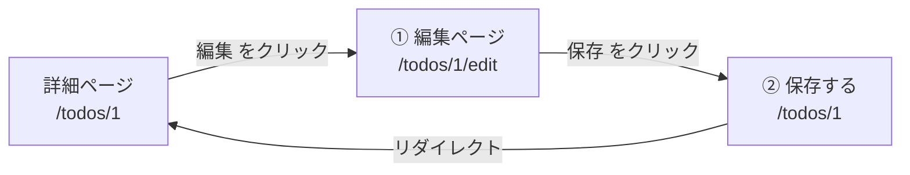
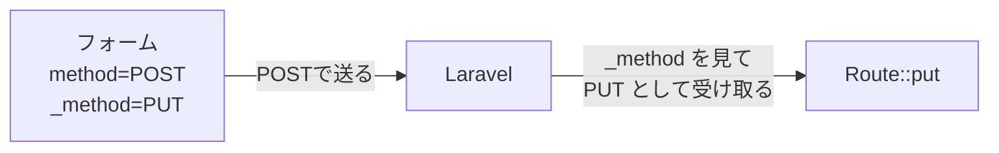
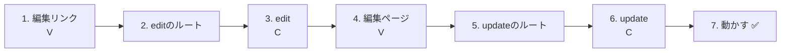
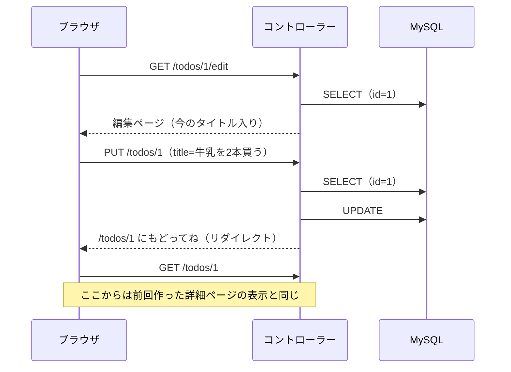
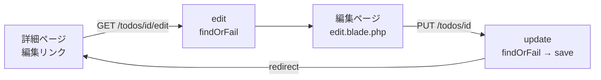
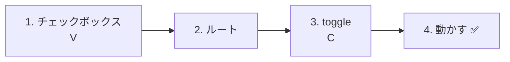
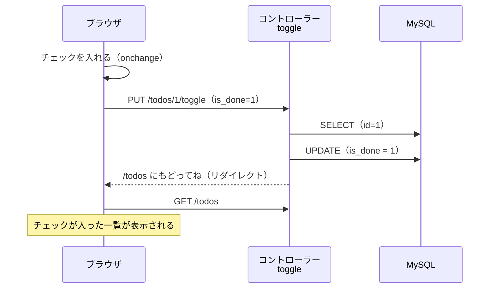

# Laravel入門 — Todoを編集しよう（UPDATE）

[前回](../20261022/20261022_資料_2.md) 作った詳細ページに「編集」ボタンをつけて、**登録したTodoのタイトルを書きかえる（編集する）機能** を作ります。
後半では、一覧のチェックボックスで **完了・未完了を切り替える機能** も作ります。

## 今日のゴール
- 編集ページを作って、今のタイトルを入力欄に表示できる
- PUT と `@method('PUT')` を使って、書きかえた内容を送れる
- 書きかえたタイトルを、データベースに保存（UPDATE）できる
- チェックボックスで、完了・未完了を切り替えられる

> 練習環境（`php-study\practice`）の mysql と laravel を起動してから始めます。
> 前回の「詳細ページ（`/todos/1` など）」が表示できる状態から始めます。

---

## 1. 編集は「2つのページ」でできている

追加は「フォームを送る」1回で終わりました。
編集は、**① 編集ページを開く** → **② 書きかえて送る** の2回に分かれます。



| | URL | 種類 | 担当 | すること |
|---|---|---|---|---|
| ① | `/todos/1/edit` | GET | `edit` | 編集ページを見せる（今のタイトルを入力欄に入れておく） |
| ② | `/todos/1` | PUT | `update` | 書きかえたタイトルを保存する |

どちらも、URLの中の `1` が **編集したいTodoの `id`** です。
前回の詳細ページと同じく、**ルートパラメータ `{id}`** と **`findOrFail()`** を使います。

> **前期のtodo.phpでは？**
> 前期は `index.php?edit=3` のように、`?edit=` で編集するTodoを決めていました。
> Laravelでは、`/todos/3/edit` のように **URLの中に `id` を入れます**。

---

## 2. 新しく出てくること：PUT と `@method('PUT')`

「すでにあるデータを書きかえる」ときは、**PUT** という種類を使うのがLaravelの決まりです。

| 種類 | 使う場面 | これまでに作ったもの |
|------|---------|-------------------|
| GET | 見る | 一覧（`/todos`）・詳細（`/todos/1`） |
| POST | 新しく追加する | 追加（`/todos`） |
| **PUT** | 書きかえる | **今日の編集** |

ただし、HTMLのフォームは **GET と POST しか送れません**。
そこで、フォームは POST で送り、`@method('PUT')` で「本当は PUT です」とLaravelに伝えます。

```html
<form method="POST" action="/todos/1">
    @csrf
    @method('PUT')
    ...
</form>
```

`@method('PUT')` は、`<input type="hidden" name="_method" value="PUT">` という1行に変わります。
Laravelは、この `_method` を見て「PUT が来た」と考えます。



---

## 3. 作ってみよう



さわるファイルは次の4つです（`src` の中）。

```
src/
├─ resources/views/todos/
│   ├─ show.blade.php ················· 1. 編集リンクを書き足す
│   └─ edit.blade.php ················· 4. 編集ページ（新しく作る）
├─ routes/
│   └─ web.php ························ 2・5. ルートを書き足す
└─ app/Http/Controllers/
    └─ TodoController.php ············· 3・6. edit と update を書き足す
```

---

### 1. 詳細ページに「編集」リンクをつける（V）

> いまここ：**🟢 1. 編集リンク** → 2. editのルート → 3. edit → 4. 編集ページ → 5. updateのルート → 6. update → 7. 動かす

前回作った `resources/views/todos/show.blade.php` を開いて、★ の1行を書き足します。

```html
<body>
    <h1>{{ $todo->title }}</h1>

    <p>番号：{{ $todo->id }}</p>

    <p>
        状態：
        @if ($todo->is_done)
            完了 ✅
        @else
            未完了
        @endif
    </p>

    <a href="/todos/{{ $todo->id }}/edit">編集</a>  {{-- ★ 追加 --}}
    <a href="/todos">一覧にもどる</a>
</body>
```

`/todos/{{ $todo->id }}/edit` は、`id` が1のTodoなら `/todos/1/edit` になります。

（この時点で「編集」を押すと `404 Not Found` になります。まだルートがないからです）

---

### 2. 編集ページのルートを書く

> いまここ：1. 編集リンク → **🟢 2. editのルート** → 3. edit → 4. 編集ページ → 5. updateのルート → 6. update → 7. 動かす

`routes/web.php` に、★ の1行を書き足します。

```php
Route::get('/todos', [TodoController::class, 'index']);
Route::post('/todos', [TodoController::class, 'store']);
Route::get('/todos/{id}', [TodoController::class, 'show']);
Route::get('/todos/{id}/edit', [TodoController::class, 'edit']);  // ★ 追加
```

```
Route::get( '/todos/{id}/edit' ,  [TodoController::class, 'edit'] );
~~~~~~~~~~   ~~~~~~~~~~~~~~~~     ~~~~~~~~~~~~~~~~~~~~~  ~~~~~~
GETで        このURLを開いたら    TodoControllerの       edit で担当してね
```

`edit`（エディット）は「編集する」という意味です。Laravelでは、編集ページを見せるメソッドに `edit` という名前をよく使います。

---

### 3. edit メソッドを書く（C）

> いまここ：1. 編集リンク → 2. editのルート → **🟢 3. edit** → 4. 編集ページ → 5. updateのルート → 6. update → 7. 動かす

`app/Http/Controllers/TodoController.php` に、★ の `edit` メソッドを書き足します。

```php
    // （index・store・show は省略）

    // ★ ここから追加
    public function edit($id)
    {
        // ① id で、編集したいTodoを1つ取ってくる
        $todo = Todo::findOrFail($id);

        // ② 編集ページを表示する
        return view('todos.edit', ['todo' => $todo]);
    }
    // ★ ここまで
```

前回の `show` と見比べてみましょう。**ちがうのは、使うビューだけ** です。

| | `show`（詳細） | `edit`（編集） |
|---|---|---|
| 取ってくる | `Todo::findOrFail($id)` | `Todo::findOrFail($id)` |
| ビュー | `todos.show` | **`todos.edit`** |

---

### 4. 編集ページを作る（V）

> いまここ：1. 編集リンク → 2. editのルート → 3. edit → **🟢 4. 編集ページ** → 5. updateのルート → 6. update → 7. 動かす

`resources/views/todos` の中に、`edit.blade.php` というファイルを新しく作ります。

```
resources/views/todos/
  ├─ index.blade.php
  ├─ show.blade.php
  └─ edit.blade.php   ← 新しく作る
```

```html
<!DOCTYPE html>
<html lang="ja">
<head>
    <meta charset="UTF-8">
    <title>TODOの編集</title>
</head>
<body>
    <h1>TODOの編集</h1>

    <form method="POST" action="/todos/{{ $todo->id }}">
        @csrf
        @method('PUT')
        <input type="text" name="title" value="{{ $todo->title }}" required>
        <button type="submit">保存</button>
    </form>

    <a href="/todos/{{ $todo->id }}">もどる</a>
</body>
</html>
```

| コード | 意味 |
|--------|------|
| `action="/todos/{{ $todo->id }}"` | `/todos/1` のように、編集しているTodoの `id` 付きのURLに送る |
| `@csrf` | 合言葉（前回の追加のフォームと同じ） |
| `@method('PUT')` | 「本当は PUT です」とLaravelに伝える |
| `value="{{ $todo->title }}"` | 入力欄に、**今のタイトルを最初から入れておく** |

追加のフォームとのちがいは、次の3つです。

| | 追加のフォーム | 編集のフォーム |
|---|---|---|
| 送り先 | `/todos` | `/todos/{{ $todo->id }}` |
| `@method('PUT')` | なし | **あり** |
| 入力欄 | からっぽ | **今のタイトルが入っている**（`value`） |

✅ **確認**：詳細ページで「編集」を押して、入力欄に今のタイトルが入った編集ページが出ればOKです。
（まだ「保存」は押さないでください。押すとエラーになります）

---

### 5. 保存のルートを書く

> いまここ：1. 編集リンク → 2. editのルート → 3. edit → 4. 編集ページ → **🟢 5. updateのルート** → 6. update → 7. 動かす

`routes/web.php` に、★ の1行を書き足します。

```php
Route::get('/todos', [TodoController::class, 'index']);
Route::post('/todos', [TodoController::class, 'store']);
Route::get('/todos/{id}', [TodoController::class, 'show']);
Route::get('/todos/{id}/edit', [TodoController::class, 'edit']);
Route::put('/todos/{id}', [TodoController::class, 'update']);  // ★ 追加
```

ここまでで、ルートは5つになりました。

| ルート | 担当 | すること |
|--------|------|---------|
| `GET /todos` | `index` | 一覧を見せる |
| `POST /todos` | `store` | 新しく追加する |
| `GET /todos/{id}` | `show` | 1つのTodoをくわしく見せる |
| `GET /todos/{id}/edit` | `edit` | 編集ページを見せる |
| `PUT /todos/{id}` | `update` | 書きかえて保存する |

`/todos/{id}` は、**GET なら `show`、PUT なら `update`** が担当します。
`/todos` のときの「GET なら `index`、POST なら `store`」と同じしくみです。

---

### 6. update メソッドを書く（C）

> いまここ：1. 編集リンク → 2. editのルート → 3. edit → 4. 編集ページ → 5. updateのルート → **🟢 6. update** → 7. 動かす

`TodoController.php` に、★ の `update` メソッドを書き足します。

```php
    // ★ ここから追加
    public function update(Request $request, $id)
    {
        // ① id で、書きかえたいTodoを1つ取ってくる
        $todo = Todo::findOrFail($id);

        // ② 入力されたタイトルで書きかえる
        $todo->title = $request->input('title');

        // ③ データベースに保存する
        $todo->save();

        // ④ 詳細ページにもどる
        return redirect('/todos/' . $todo->id);
    }
    // ★ ここまで
```

| コード | 意味 |
|--------|------|
| `update(Request $request, $id)` | フォームの値（`$request`）と、URLの `{id}`（`$id`）の両方を受け取る |
| `'/todos/' . $todo->id` | 文字をつなげて `/todos/1` のようなURLにする（`.` は前期に習った文字列の連結） |

前回作った追加の `store` と、ほとんど同じ形です。ちがうのは **①と④** です。

| | `store`（追加） | `update`（編集） |
|---|---|---|
| ① | `new Todo()`（新しく作る） | `Todo::findOrFail($id)`（今あるものを取ってくる） |
| ② | `$todo->title = ...` | `$todo->title = ...` |
| ③ | `save()` → `INSERT` | `save()` → **`UPDATE`** |
| ④ | 一覧（`/todos`）にもどる | 詳細ページ（`/todos/1` など）にもどる |

同じ `save()` でも、**新しく作ったTodoなら `INSERT`、取ってきたTodoなら `UPDATE`** を、Laravelが自動で使い分けてくれます。

前期の `todo.php` と見比べてみましょう。

```php
// 前期
$id = (int)($_POST['id'] ?? 0);
$title = trim($_POST['title'] ?? '');
$stmt = $pdo->prepare("UPDATE todos SET title = :title WHERE id = :id");
$stmt->execute(['title' => $title, 'id' => $id]);
header('Location: index.php');
exit;

// Laravel
$todo = Todo::findOrFail($id);
$todo->title = $request->input('title');
$todo->save();
return redirect('/todos/' . $todo->id);
```

---

### 7. 動かす ✅

> いまここ：1. 編集リンク → 2. editのルート → 3. edit → 4. 編集ページ → 5. updateのルート → 6. update → **🟢 7. 動かす**

1. http://localhost:8000/todos を開く
2. 「牛乳を買う」をクリックして、詳細ページを開く
3. 「編集」を押す
4. 入力欄を「牛乳を2本買う」に書きかえて、`保存` を押す
5. 詳細ページにもどって、タイトルが「牛乳を2本買う」に変わっていれば成功です



✅ **確認1**：一覧ページにもどって、一覧のタイトルも変わっているか確かめましょう。

✅ **確認2**：phpMyAdminで `todos` テーブルを開いてみましょう。
書きかえたTodoの `updated_at` が、保存した時刻に変わっています（UTCなので、日本時間より9時間前です）。
`save()` のときに、Laravelが「更新した時刻」を自動で入れてくれました。`created_at` はそのままです。

> **タイトルを変えずに「保存」したら？**
> 何も変わっていないときは、Laravelは `UPDATE` をしません。そのため `updated_at` も変わりません。

---

## 4. うまくいかないとき

> **🔥 動かないなら、ログを出せ！**
> エラーの原因がわからないときは、`update` の中で `Log::info()` を使って、`$id` や `title` の値を確かめましょう → [【重要】ログの出し方](../20261022/【重要】ログの出し方.md)

| 症状 | 原因の場所 | 対処 |
|------|----------|------|
| 「編集」を押すと `404 Not Found` | ルート | `routes/web.php` に `Route::get('/todos/{id}/edit', ...)` を書いたか確認 |
| `Call to undefined method App\Http\Controllers\TodoController::edit()` | コントローラー | `TodoController.php` に `edit` メソッドを書いたか、名前のつづりを確認（`update` も同じ） |
| `View [todos.edit] not found.` | ビュー | `resources/views/todos/edit.blade.php` を作ったか、ファイル名を確認 |
| 編集ページの入力欄が空 | ビュー | `<input>` に `value="{{ $todo->title }}"` があるか確認 |
| 「保存」を押すと `The POST method is not supported for route todos/1.` | ビュー | 編集ページのフォームに `@method('PUT')` があるか確認 |
| 「保存」を押すと `The PUT method is not supported for route todos/1.` | ルート | `routes/web.php` に `Route::put('/todos/{id}', ...)` を書いたか確認 |
| 保存しても、タイトルが変わらない | コントローラー | `update` の中に `$todo->save();` があるか確認 |
| ちがうTodoが書きかわった | ビュー | 編集ページの `action="/todos/{{ $todo->id }}"` を確認 |

> `404`・`The ... method is not supported` のエラーは、ログには書きこまれません。画面のメッセージを読んで、ルートやフォームを確認しましょう。

---

## 5. まとめ



| 今日書いたもの | ひとことで |
|--------------|-----------|
| `Route::get('/todos/{id}/edit', ...)` と `edit` | 編集ページを見せる。`show` とほぼ同じ |
| `value="{{ $todo->title }}"` | 入力欄に、今のタイトルを入れておく |
| `@method('PUT')` | フォームは POST で送り、「本当は PUT」と伝える |
| `Route::put('/todos/{id}', ...)` と `update` | 書きかえて保存する |
| 取ってきたTodoを `save()` | `UPDATE` になる（新しく作ったTodoなら `INSERT`） |

---

## 6. 完了・未完了を切り替えよう（チェックボックス）

一覧には10/15からチェックボックスがありますが、`disabled` がついていて **押せません**。
今のアプリには、`is_done`（完了なら1、未完了なら0）を変える方法がないからです。
ここでは、このチェックボックスを **押したらすぐ「完了 ⇄ 未完了」が切り替わる** ようにします。

```
TODOアプリ

☐ 牛乳を買う         ← チェックを入れると「完了」になる
☑ レポートを出す     ← チェックを外すと「未完了」にもどる
```

中身は、さっき作った `update` と同じ **UPDATE** です。書きかえるのが `title` ではなく `is_done` になるだけです。

| URL | 種類 | 担当 | すること |
|-----|------|------|---------|
| `/todos/1/toggle` | PUT | `toggle` | `is_done` を書きかえる |

`toggle`（トグル）は「オン・オフを切り替える」という意味です。



> **前期のtodo.phpでもやっていた**
> 前期は `action=toggle` を送って、`isset($_POST['is_done']) ? 1 : 0` で完了・未完了を決めていました。
> Laravelでも、同じ考え方で作ります。

---

### 1. 一覧のチェックボックスを押せるようにする（V）

> いまここ：**🟢 1. チェックボックス** → 2. ルート → 3. toggle → 4. 動かす

`resources/views/todos/index.blade.php` の `<li>` の中を、次のように書きかえます。
今あるチェックボックスを **フォームで囲み**、`disabled` を消して、`name`・`value`・`onchange` を足します。

```html
    <ul>
        @foreach ($todos as $todo)
            <li>
                {{-- ★ ここから書きかえ --}}
                <form method="POST" action="/todos/{{ $todo->id }}/toggle" style="display: inline;">
                    @csrf
                    @method('PUT')
                    <input type="checkbox" name="is_done" value="1" onchange="this.form.submit()" @checked($todo->is_done)>
                </form>
                {{-- ★ ここまで --}}
                <a href="/todos/{{ $todo->id }}">{{ $todo->title }}</a>
            </li>
        @endforeach
    </ul>
```

| | 10/15〜（見せるだけ） | 今日から（押せる） |
|---|---|---|
| フォーム | なし | `<form ...>` で囲む |
| `disabled` | あり（押せない） | **消す** |
| `name="is_done" value="1"` | なし | あり |
| `onchange` | なし | あり |
| `@checked(...)` | あり | あり（そのまま） |

| コード | 意味 |
|--------|------|
| `action="/todos/{{ $todo->id }}/toggle"` | `/todos/1/toggle` のように、そのTodoの `id` 付きのURLに送る |
| `@method('PUT')` | 「本当は PUT です」とLaravelに伝える（編集と同じ） |
| `name="is_done" value="1"` | チェックが **入っているときだけ**、`is_done=1` が送られる |
| `onchange="this.form.submit()"` | チェックを変えた瞬間に、フォームを送る（送信ボタンがいらない） |
| `@checked($todo->is_done)` | 完了のTodoなら、最初からチェックを入れておく（10/15と同じ） |
| `style="display: inline;"` | フォームのうしろで改行せず、タイトルと横にならべる |

#### チェックボックスの大事なしくみ

チェックボックスは、**チェックが入っているときだけ** 値が送られます。
チェックを外したときは、`is_done` そのものが **送られません**。

| チェックボックス | 送られるもの |
|----------------|------------|
| ☑ 入っている | `is_done=1` |
| ☐ 入っていない | （`is_done` が、なにも送られない） |

なので、コントローラーでは「`is_done` が **送られてきたかどうか**」で、完了・未完了を決めます。

---

### 2. ルートを書く

> いまここ：1. チェックボックス → **🟢 2. ルート** → 3. toggle → 4. 動かす

`routes/web.php` に、★ の1行を書き足します。

```php
Route::get('/todos', [TodoController::class, 'index']);
Route::post('/todos', [TodoController::class, 'store']);
Route::get('/todos/{id}', [TodoController::class, 'show']);
Route::get('/todos/{id}/edit', [TodoController::class, 'edit']);
Route::put('/todos/{id}', [TodoController::class, 'update']);
Route::put('/todos/{id}/toggle', [TodoController::class, 'toggle']);  // ★ 追加
```

`/todos/{id}`（タイトルの編集）と `/todos/{id}/toggle`（完了・未完了の切り替え）は、URLがちがうので別の担当になります。

---

### 3. toggle メソッドを書く（C）

> いまここ：1. チェックボックス → 2. ルート → **🟢 3. toggle** → 4. 動かす

`TodoController.php` に、★ の `toggle` メソッドを書き足します。

```php
    // ★ ここから追加
    public function toggle(Request $request, $id)
    {
        // ① id で、切り替えたいTodoを1つ取ってくる
        $todo = Todo::findOrFail($id);

        // ② is_done が送られてきたら完了（true）、なければ未完了（false）
        $todo->is_done = $request->has('is_done');

        // ③ データベースに保存する
        $todo->save();

        // ④ 一覧ページにもどる
        return redirect('/todos');
    }
    // ★ ここまで
```

| コード | 意味 |
|--------|------|
| `$request->has('is_done')` | `is_done` が送られてきたら `true`、なければ `false`。前期の `isset($_POST['is_done'])` と同じ |

`update` と見比べてみましょう。ちがうのは **②と④** だけです。

| | `update`（タイトルの編集） | `toggle`（完了・未完了） |
|---|---|---|
| ① | `Todo::findOrFail($id)` | `Todo::findOrFail($id)` |
| ② | `$todo->title = $request->input('title')` | `$todo->is_done = $request->has('is_done')` |
| ③ | `save()` → `UPDATE` | `save()` → `UPDATE` |
| ④ | 詳細ページにもどる | 一覧ページにもどる |

前期の `todo.php` と見比べてみましょう。

```php
// 前期
$id = (int)($_POST['id'] ?? 0);
$isDone = isset($_POST['is_done']) ? 1 : 0;
$stmt = $pdo->prepare("UPDATE todos SET is_done = :is_done WHERE id = :id");
$stmt->execute(['is_done' => $isDone, 'id' => $id]);
header('Location: index.php');
exit;

// Laravel
$todo = Todo::findOrFail($id);
$todo->is_done = $request->has('is_done');
$todo->save();
return redirect('/todos');
```

---

### 4. 動かす ✅

> いまここ：1. チェックボックス → 2. ルート → 3. toggle → **🟢 4. 動かす**

1. http://localhost:8000/todos を開く
2. 「牛乳を買う」のチェックボックスにチェックを入れる
3. ページが読みこみ直されて、チェックが入ったままなら成功です
4. もう一度チェックを外して、外れたままになるかも確かめましょう



✅ **確認1**：チェックを入れたTodoの詳細ページを開いて、「完了 ✅」になっているか確かめましょう。

✅ **確認2**：phpMyAdminで `todos` テーブルを開いて、`is_done` が `1`（完了）・`0`（未完了）に変わっているか確かめましょう。

### うまくいかないとき（完了・未完了）

| 症状 | 原因の場所 | 対処 |
|------|----------|------|
| チェックしても、何も起きない | ビュー | `<input>` に `onchange="this.form.submit()"` があるか確認 |
| チェックすると `404 Not Found` | ルート | `routes/web.php` に `Route::put('/todos/{id}/toggle', ...)` を書いたか確認 |
| チェックすると `The POST method is not supported for route todos/1/toggle.` | ビュー | チェックボックスのフォームに `@method('PUT')` があるか確認 |
| チェックを入れても、外れてもどってくる | ビュー・コントローラー | `name="is_done"` と `$request->has('is_done')` のつづりが同じか確認 |
| 完了のTodoなのに、チェックが入っていない | ビュー | `<input>` に `@checked($todo->is_done)` があるか確認 |

---

## 7. もっとやってみよう（時間があまった人）

編集ページの見出しを、「TODOの編集」ではなく「『牛乳を買う』の編集」のように、**編集しているTodoのタイトル入り** にしてみましょう。

<details>
<summary>ヒント</summary>

`edit.blade.php` の `<h1>` の中で、`{{ $todo->title }}` を使います。

```html
<h1>『{{ $todo->title }}』の編集</h1>
```

</details>

---

次は、Todoを削除する機能を作ります → [Todoを削除しよう（DELETE）](./20261029_資料_2.md)
