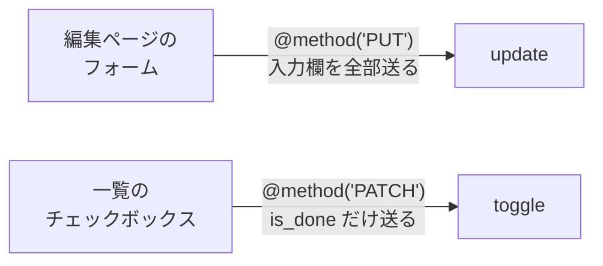
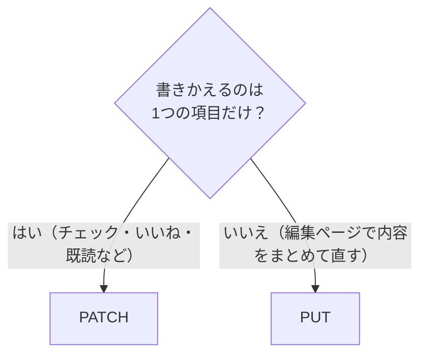
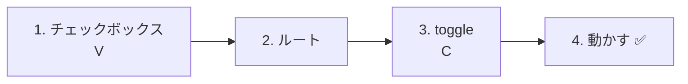
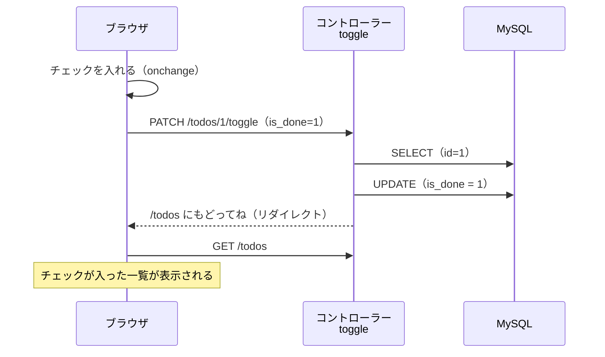
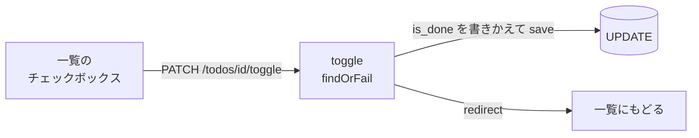

# Laravel入門 — 完了・未完了を切り替えよう（PATCH）

[資料1](./20261029_資料_1.md) でTodoのタイトルを編集できるようになりました。次は、一覧のチェックボックスで **完了・未完了を切り替える機能** を作ります。

## 今日のゴール
- PUT と PATCH のちがいがわかる
- PATCH と `@method('PATCH')` を使って、一部分だけ書きかえる命令を送れる
- チェックボックスで、完了・未完了を切り替えられる

> 資料1の「Todoを編集する」ができている状態から始めます。

---

## 1. 完了・未完了の切り替えとは

一覧には10/15からチェックボックスがありますが、押しても **データベースには保存されません**（ページを読みこみ直すと元にもどります）。
今のアプリには、`is_done`（完了なら1、未完了なら0）を変える方法がないからです。
ここでは、このチェックボックスを **押したらすぐ「完了 ⇄ 未完了」が切り替わる** ようにします。

```
TODOアプリ

☐ 牛乳を買う         ← チェックを入れると「完了」になる
☑ レポートを出す     ← チェックを外すと「未完了」にもどる
```

中身は、資料1で作った `update` と同じ **UPDATE** です。書きかえるのが `title` ではなく `is_done` になるだけです。

| URL | 種類 | 担当 | すること |
|-----|------|------|---------|
| `/todos/1/toggle` | **PATCH** | `toggle` | `is_done` を書きかえる |

`toggle`（トグル）は「オン・オフを切り替える」という意味です。

---

## 2. 新しく出てくること：PATCH

書きかえるときの種類には、**PUT** のほかに **PATCH**（パッチ）があります。
どちらも「書きかえる」ですが、**どれだけ書きかえるか** がちがいます。

| 種類 | 意味 | たとえると |
|------|------|-----------|
| PUT | データを **まるごと** 書きかえる | 書類を新しく書き直して、**丸ごと差しかえる** |
| **PATCH** | データの **一部分だけ** 書きかえる | 書類の **1か所だけ** に、修正テープをはる |

`patch` は英語で「つぎあて（服の穴に、布を1枚あてて直すこと）」という意味です。

### 住所カードでくらべてみよう

たとえば、こんな「住所カード」があるとします。

```
名前：山田 花子
住所：東京都〇〇区…
電話：090-xxxx-xxxx
```

引っこしをして、**住所だけ** が変わりました。

```
【PUT】新しいカードを1枚書いて、丸ごと差しかえる

  ┌──────────────────────┐
  │ 名前：山田 花子      │ ← 変わっていないけど、書く
  │ 住所：大阪府…（新） │ ← 変わったところ
  │ 電話：090-xxxx-xxxx  │ ← 変わっていないけど、書く
  └──────────────────────┘

【PATCH】今のカードの、住所のところだけ修正テープをはる

  ┌──────────────────────┐
  │ 住所：大阪府…（新） │ ← 変わったところだけ
  └──────────────────────┘
```

| | PUT | PATCH |
|---|---|---|
| 送るもの | **名前・住所・電話の全部**（変わっていない名前や電話も書く） | **住所だけ** |
| 書かなかった項目は？ | 「空にする」という意味になる | 「そのまま」という意味になる |

PUT は「これが新しいカードです」と **全部** をわたすので、書き忘れた項目は空っぽになってしまいます。
PATCH は「ここだけ直して」とわたすので、書かなかった項目はそのまま残ります。

### Todoアプリでは

Todoアプリにあてはめると、こうなります。

| | 編集（`update`） | 完了・未完了の切り替え（`toggle`） |
|---|---|---|
| どんな操作？ | 編集ページで、**Todoの内容を書き直して** 保存する | 一覧で、**チェックだけ** を切り替える |
| 送るもの | 編集ページの入力欄の **全部**（今は `title`） | **`is_done` だけ** |
| 種類 | **PUT** | **PATCH** |
| 書き方 | `@method('PUT')` ／ `Route::put(...)` | `@method('PATCH')` ／ `Route::patch(...)` |



> **編集ページは `title` しか送っていないのに、PUT なの？**
> 編集ページは「Todoの内容を書き直す画面」なので、**画面にある入力欄を全部** 送り直します。
> 今は入力欄が `title` だけですが、もし「メモ」や「しめきり」の入力欄を足したら、それも全部いっしょに送ります。
> 「画面の項目をまとめて送り直す」のが PUT、「1つの項目だけをピンポイントで変える」のが PATCH です。

### 迷ったときは



身のまわりのアプリだと、たとえばこんな使い分けです。

| 操作 | 種類 | 理由 |
|------|------|------|
| プロフィール編集ページで「保存」 | PUT | 名前・自己紹介などを、まとめて送り直す |
| 投稿に「いいね」をつける | PATCH | 「いいね」の1か所だけを変える |
| メッセージを「既読」にする | PATCH | 「既読かどうか」の1か所だけを変える |
| Todoのチェックを入れる | PATCH | `is_done` の1か所だけを変える |

### PUT と PATCH、どちらでも動く？

Laravelは、どちらを使っても `save()` で同じように保存できます。**プログラムの動きは変わりません**。
（住所カードの話は「PUT と PATCH の **意味**」です。Laravelでは、PUT で送らなかった項目が自動で空になることはありません）
それでも使い分けるのは、ルートを見ただけで **「何をする処理か」がわかる** ようにするためです。

```php
Route::put('/todos/{id}', ...);           // 「Todoを丸ごと書き直すんだな」
Route::patch('/todos/{id}/toggle', ...);  // 「Todoの一部分を変えるんだな」
```

> 実際の開発では、編集ページにも PATCH を使うチームもあります。大事なのは、**チームの中でルールをそろえること** です。
> この授業では、「編集ページは PUT、1つの項目だけを変えるときは PATCH」で統一します。

HTMLのフォームは PATCH も送れないので、PUT と同じく `@method('PATCH')` を使います。

> **前期のtodo.phpでもやっていた**
> 前期は `action=toggle` を送って、`isset($_POST['is_done']) ? 1 : 0` で完了・未完了を決めていました。
> Laravelでも、同じ考え方で作ります。

---

## 3. 作ってみよう



さわるファイルは次の3つです（`src` の中）。

```
src/
├─ resources/views/todos/
│   └─ index.blade.php ················ 1. チェックボックスをフォームで囲む
├─ routes/
│   └─ web.php ························ 2. ルートを書き足す
└─ app/Http/Controllers/
    └─ TodoController.php ············· 3. toggle メソッドを書き足す
```

---

### 1. 一覧のチェックボックスで保存できるようにする（V）

> いまここ：**🟢 1. チェックボックス** → 2. ルート → 3. toggle → 4. 動かす

`resources/views/todos/index.blade.php` の `<li>` の中を、次のように書きかえます。
今あるチェックボックスを **フォームで囲み**、`name`・`value`・`onchange` を足します。

```html
    <ul>
        @foreach ($todos as $todo)
            <li>
                {{-- ★ ここから書きかえ --}}
                <form method="POST" action="/todos/{{ $todo->id }}/toggle" style="display: inline;">
                    @csrf
                    @method('PATCH')
                    <input type="checkbox" name="is_done" value="1" onchange="this.form.submit()" @checked($todo->is_done)>
                </form>
                {{-- ★ ここまで --}}
                <a href="/todos/{{ $todo->id }}">{{ $todo->title }}</a>
            </li>
        @endforeach
    </ul>
```

| | 10/15〜（押しても保存されない） | 今日から（押すと保存される） |
|---|---|---|
| フォーム | なし | `<form ...>` で囲む |
| `name="is_done" value="1"` | なし | あり |
| `onchange` | なし | あり |
| `@checked(...)` | あり | あり（そのまま） |

| コード | 意味 |
|--------|------|
| `action="/todos/{{ $todo->id }}/toggle"` | `/todos/1/toggle` のように、そのTodoの `id` 付きのURLに送る |
| `@method('PATCH')` | 「本当は PATCH です」とLaravelに伝える（一部分だけ書きかえるため） |
| `name="is_done" value="1"` | チェックが **入っているときだけ**、`is_done=1` が送られる |
| `onchange="this.form.submit()"` | チェックを変えた瞬間に、フォームを送る（送信ボタンがいらない） |
| `@checked($todo->is_done)` | 完了のTodoなら、最初からチェックを入れておく（10/15と同じ） |
| `style="display: inline;"` | フォームのうしろで改行せず、タイトルと横にならべる |

#### チェックボックスの大事なしくみ

チェックボックスは、**チェックが入っているときだけ** 値が送られます。
チェックを外したときは、`is_done` そのものが **送られません**。

| チェックボックス | 送られるもの |
|----------------|------------|
| ☑ 入っている | `is_done=1` |
| ☐ 入っていない | （`is_done` が、なにも送られない） |

なので、コントローラーでは「`is_done` が **送られてきたかどうか**」で、完了・未完了を決めます。

---

### 2. ルートを書く

> いまここ：1. チェックボックス → **🟢 2. ルート** → 3. toggle → 4. 動かす

`routes/web.php` に、★ の1行を書き足します。

```php
Route::get('/todos', [TodoController::class, 'index']);
Route::post('/todos', [TodoController::class, 'store']);
Route::get('/todos/{id}', [TodoController::class, 'show']);
Route::get('/todos/{id}/edit', [TodoController::class, 'edit']);
Route::put('/todos/{id}', [TodoController::class, 'update']);
Route::patch('/todos/{id}/toggle', [TodoController::class, 'toggle']);  // ★ 追加
```

`/todos/{id}`（タイトルの編集）と `/todos/{id}/toggle`（完了・未完了の切り替え）は、URLがちがうので別の担当になります。

---

### 3. toggle メソッドを書く（C）

> いまここ：1. チェックボックス → 2. ルート → **🟢 3. toggle** → 4. 動かす

`TodoController.php` に、★ の `toggle` メソッドを書き足します。

```php
    // ★ ここから追加
    public function toggle(Request $request, $id)
    {
        // ① id で、切り替えたいTodoを1つ取ってくる
        $todo = Todo::findOrFail($id);

        // ② is_done が送られてきたら完了（true）、なければ未完了（false）
        $todo->is_done = $request->has('is_done');

        // ③ データベースに保存する
        $todo->save();

        // ④ 一覧ページにもどる
        return redirect('/todos');
    }
    // ★ ここまで
```

| コード | 意味 |
|--------|------|
| `$request->has('is_done')` | `is_done` が送られてきたら `true`、なければ `false`。前期の `isset($_POST['is_done'])` と同じ |

`update` と見比べてみましょう。ちがうのは **②と④** だけです。

| | `update`（タイトルの編集） | `toggle`（完了・未完了） |
|---|---|---|
| ① | `Todo::findOrFail($id)` | `Todo::findOrFail($id)` |
| ② | `$todo->title = $request->input('title')` | `$todo->is_done = $request->has('is_done')` |
| ③ | `save()` → `UPDATE` | `save()` → `UPDATE` |
| ④ | 詳細ページにもどる | 一覧ページにもどる |

前期の `todo.php` と見比べてみましょう。

```php
// 前期
$id = (int)($_POST['id'] ?? 0);
$isDone = isset($_POST['is_done']) ? 1 : 0;
$stmt = $pdo->prepare("UPDATE todos SET is_done = :is_done WHERE id = :id");
$stmt->execute(['is_done' => $isDone, 'id' => $id]);
header('Location: index.php');
exit;

// Laravel
$todo = Todo::findOrFail($id);
$todo->is_done = $request->has('is_done');
$todo->save();
return redirect('/todos');
```

---

### 4. 動かす ✅

> いまここ：1. チェックボックス → 2. ルート → 3. toggle → **🟢 4. 動かす**

1. http://localhost:8000/todos を開く
2. 「牛乳を買う」のチェックボックスにチェックを入れる
3. ページが読みこみ直されて、チェックが入ったままなら成功です
4. もう一度チェックを外して、外れたままになるかも確かめましょう



✅ **確認1**：チェックを入れたTodoの詳細ページを開いて、「完了 ✅」になっているか確かめましょう。

✅ **確認2**：phpMyAdminで `todos` テーブルを開いて、`is_done` が `1`（完了）・`0`（未完了）に変わっているか確かめましょう。

---

## 4. うまくいかないとき

> **🔥 動かないなら、ログを出せ！**
> エラーの原因がわからないときは、`toggle` の中で `Log::info()` を使って、`is_done` が送られてきているか確かめましょう → [【重要】ログの出し方](../20261022/【重要】ログの出し方.md)

| 症状 | 原因の場所 | 対処 |
|------|----------|------|
| チェックしても、何も起きない | ビュー | `<input>` に `onchange="this.form.submit()"` があるか確認 |
| チェックすると `404 Not Found` | ルート | `routes/web.php` に `Route::patch('/todos/{id}/toggle', ...)` を書いたか確認 |
| チェックすると `The POST method is not supported for route todos/1/toggle.` | ビュー | チェックボックスのフォームに `@method('PATCH')` があるか確認 |
| チェックすると `The PATCH method is not supported for route todos/1/toggle.` | ルート | `routes/web.php` が `Route::put(...)` になっていないか確認（`Route::patch(...)` にする） |
| チェックを入れても、外れてもどってくる | ビュー・コントローラー | `name="is_done"` と `$request->has('is_done')` のつづりが同じか確認 |
| 完了のTodoなのに、チェックが入っていない | ビュー | `<input>` に `@checked($todo->is_done)` があるか確認 |

---

## 5. まとめ



| 今日書いたもの | ひとことで |
|--------------|-----------|
| PATCH と `@method('PATCH')` | 一部分だけ書きかえるときに使う（まるごとなら PUT） |
| `onchange="this.form.submit()"` | チェックを変えた瞬間に、フォームを送る |
| `name="is_done" value="1"` | チェックが入っているときだけ、`is_done=1` が送られる |
| `Route::patch('/todos/{id}/toggle', ...)` | PATCH で送られたら `toggle` が担当する |
| `$request->has('is_done')` | `is_done` が送られてきたかどうかで、完了・未完了を決める |

---

次は、Todoを削除する機能を作ります → [Todoを削除しよう（DELETE）](./20261029_資料_3.md)
