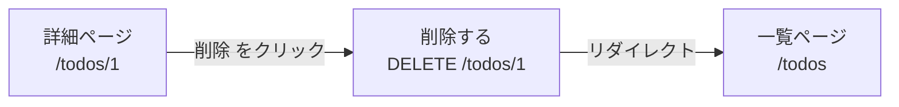
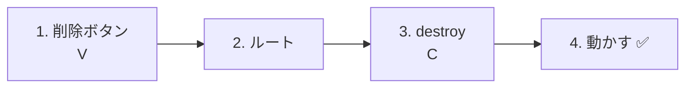
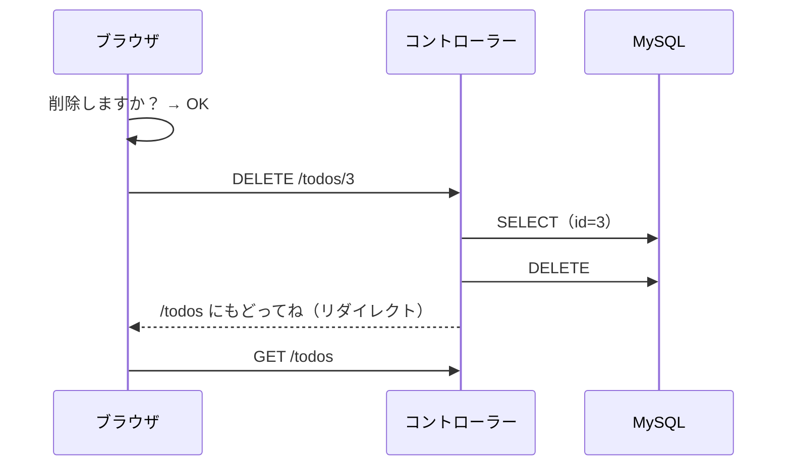
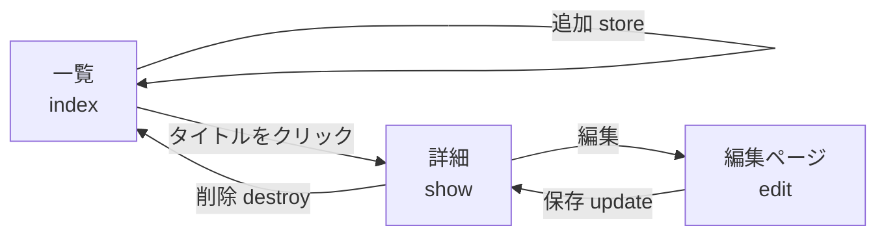

# Laravel入門 — Todoを削除しよう（DELETE）

[資料1](./20261029_資料_1.md) でTodoを編集できるようになりました。次は、**Todoを消す（削除する）機能** を作ります。

## 今日のゴール
- DELETE と `@method('DELETE')` を使って、削除の命令を送れる
- `delete()` で、Todoをデータベースから削除できる
- 追加・表示・編集・削除（CRUD）の全体がわかる

> 資料1の「Todoを編集する」ができている状態から始めます。

---

## 1. 削除のしくみ

編集とちがって、削除は **ページを開かずに、ボタン1つで終わり** です。



| URL | 種類 | 担当 | すること |
|-----|------|------|---------|
| `/todos/1` | **DELETE** | `destroy` | Todoを削除する |

### DELETE と `@method('DELETE')`

「データを消す」ときは、**DELETE** という種類を使うのがLaravelの決まりです。
PUT と同じく、HTMLのフォームは DELETE を送れないので、`@method('DELETE')` を使います。

| 種類 | 使う場面 | 書き方 |
|------|---------|--------|
| PUT | 書きかえる | フォームに `@method('PUT')` |
| **DELETE** | 消す | フォームに `@method('DELETE')` |

> **なぜリンク（`<a>`）ではなく、フォームのボタンなの？**
> リンクは GET で開きます。GET は「見るだけ」の決まりなので、データを消す処理には使いません。
> もしリンクで削除できると、URLを開いただけでTodoが消えてしまいます。
> データを変える（追加・編集・削除）ときは、**フォームのボタンで送る** と覚えましょう。

---

## 2. 作ってみよう



さわるファイルは次の3つです（`src` の中）。

```
src/
├─ resources/views/todos/
│   └─ show.blade.php ················· 1. 削除ボタンを書き足す
├─ routes/
│   └─ web.php ························ 2. ルートを書き足す
└─ app/Http/Controllers/
    └─ TodoController.php ············· 3. destroy メソッドを書き足す
```

---

### 1. 詳細ページに「削除」ボタンをつける（V）

> いまここ：**🟢 1. 削除ボタン** → 2. ルート → 3. destroy → 4. 動かす

`resources/views/todos/show.blade.php` に、★ のフォームを書き足します。

```html
    <a href="/todos/{{ $todo->id }}/edit">編集</a>

    {{-- ★ ここから追加 --}}
    <form method="POST" action="/todos/{{ $todo->id }}" onsubmit="return confirm('削除しますか？');">
        @csrf
        @method('DELETE')
        <button type="submit">削除</button>
    </form>
    {{-- ★ ここまで --}}

    <a href="/todos">一覧にもどる</a>
```

| コード | 意味 |
|--------|------|
| `action="/todos/{{ $todo->id }}"` | `/todos/1` のように、消したいTodoの `id` 付きのURLに送る |
| `@method('DELETE')` | 「本当は DELETE です」とLaravelに伝える |
| `onsubmit="return confirm('削除しますか？');"` | 送る前に確認のダイアログを出す。「キャンセル」なら送らない |

入力欄はありません。**どのTodoを消すかは、URLの `id` だけでわかる** からです。

> **前期のtodo.phpでもやっていた**
> `confirm()` で確認してから削除するのは、前期の `todo.php` と同じです。
> 削除は元にもどせないので、確認を出しておくと安心です。

---

### 2. ルートを書く

> いまここ：1. 削除ボタン → **🟢 2. ルート** → 3. destroy → 4. 動かす

`routes/web.php` に、★ の1行を書き足します。

```php
Route::get('/todos', [TodoController::class, 'index']);
Route::post('/todos', [TodoController::class, 'store']);
Route::get('/todos/{id}', [TodoController::class, 'show']);
Route::get('/todos/{id}/edit', [TodoController::class, 'edit']);
Route::put('/todos/{id}', [TodoController::class, 'update']);
Route::delete('/todos/{id}', [TodoController::class, 'destroy']);  // ★ 追加
```

`destroy`（デストロイ）は「こわす・消す」という意味です。Laravelでは、削除するメソッドに `destroy` という名前をよく使います。

これで `/todos/{id}` は、**GET なら `show`、PUT なら `update`、DELETE なら `destroy`** が担当します。

---

### 3. destroy メソッドを書く（C）

> いまここ：1. 削除ボタン → 2. ルート → **🟢 3. destroy** → 4. 動かす

`TodoController.php` に、★ の `destroy` メソッドを書き足します。

```php
    // ★ ここから追加
    public function destroy($id)
    {
        // ① id で、消したいTodoを1つ取ってくる
        $todo = Todo::findOrFail($id);

        // ② データベースから削除する
        $todo->delete();

        // ③ 一覧ページにもどる
        return redirect('/todos');
    }
    // ★ ここまで
```

| コード | 意味 |
|--------|------|
| `$todo->delete()` | データベースから削除する。`DELETE FROM todos WHERE id = ?` と同じ |
| `redirect('/todos')` | 一覧ページにもどる（消したTodoの詳細ページは、もうないため） |

前期の `todo.php` と見比べてみましょう。

```php
// 前期
$id = (int)($_POST['id'] ?? 0);
$stmt = $pdo->prepare("DELETE FROM todos WHERE id = :id");
$stmt->execute(['id' => $id]);
header('Location: index.php');
exit;

// Laravel
$todo = Todo::findOrFail($id);
$todo->delete();
return redirect('/todos');
```

---

### 4. 動かす ✅

> いまここ：1. 削除ボタン → 2. ルート → 3. destroy → **🟢 4. 動かす**

1. http://localhost:8000/todos を開く
2. 消してもいいTodo（たとえば「宿題をする」）をクリックして、詳細ページを開く
3. 「削除」を押す
4. 「削除しますか？」と出たら `OK` を押す
5. 一覧ページにもどって、そのTodoがなくなっていれば成功です



✅ **確認1**：phpMyAdminで `todos` テーブルを開いて、消したTodoの行がなくなっているか確かめましょう。

✅ **確認2**：消したTodoの詳細ページのURL（たとえば http://localhost:8000/todos/3 ）を直接開いてみましょう。
もうないので、`404 Not Found` が出ます。`findOrFail` が働いています。

✅ **確認3**：「削除」を押して、確認のダイアログで `キャンセル` を押すと、何も消えないことも確かめましょう。

---

## 3. うまくいかないとき

> **🔥 動かないなら、ログを出せ！**
> エラーの原因がわからないときは、`destroy` の中で `Log::info()` を使って、`$id` の値を確かめましょう → [【重要】ログの出し方](../20261022/【重要】ログの出し方.md)

| 症状 | 原因の場所 | 対処 |
|------|----------|------|
| 「削除」を押すと `The POST method is not supported for route todos/1.` | ビュー | 削除のフォームに `@method('DELETE')` があるか確認 |
| 「削除」を押すと `The DELETE method is not supported for route todos/1.` | ルート | `routes/web.php` に `Route::delete('/todos/{id}', ...)` を書いたか確認 |
| `Call to undefined method App\Http\Controllers\TodoController::destroy()` | コントローラー | `TodoController.php` に `destroy` メソッドを書いたか、名前のつづりを確認 |
| 削除したのに、一覧に残っている | コントローラー | `destroy` の中に `$todo->delete();` があるか確認 |
| 確認のダイアログが出ない | ビュー | `<form>` に `onsubmit="return confirm('削除しますか？');"` があるか確認 |

---

## 4. CRUDがそろった！

これで、Todoの **追加・表示・編集・削除** がすべてできるようになりました。
この4つをまとめて **CRUD**（クラッド）と呼びます。ほとんどのWebアプリは、このCRUDの組み合わせでできています。

| | 意味 | SQL | 今回のTodoアプリ | 作った回 |
|---|---|---|---|---|
| **C**reate | 追加 | `INSERT` | `store` | 10/22 |
| **R**ead | 表示 | `SELECT` | `index`・`show` | 10/15・10/22 |
| **U**pdate | 編集 | `UPDATE` | `edit`・`update` | 今日 |
| **D**elete | 削除 | `DELETE` | `destroy` | 今日 |

ルートは、全部で6つになりました。

| ルート | 担当 | すること |
|--------|------|---------|
| `GET /todos` | `index` | 一覧を見せる |
| `POST /todos` | `store` | 新しく追加する |
| `GET /todos/{id}` | `show` | 1つのTodoをくわしく見せる |
| `GET /todos/{id}/edit` | `edit` | 編集ページを見せる |
| `PUT /todos/{id}` | `update` | 書きかえて保存する |
| `DELETE /todos/{id}` | `destroy` | 削除する |


