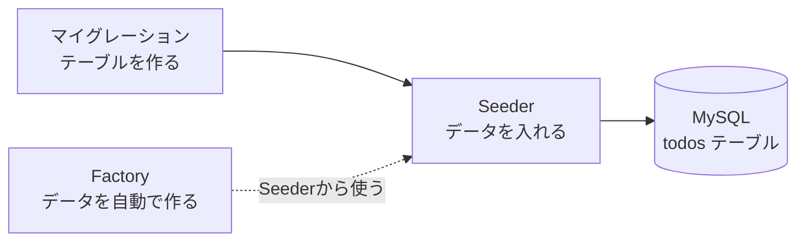
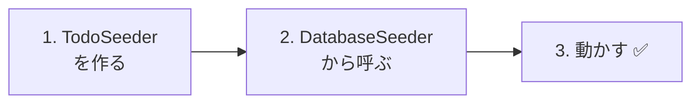
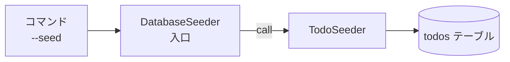
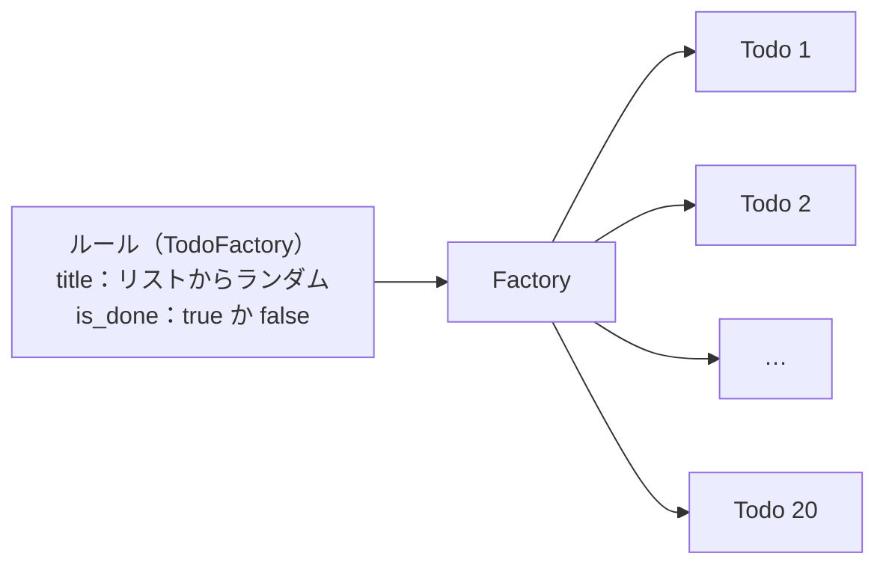
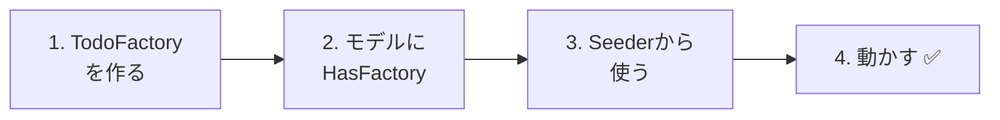
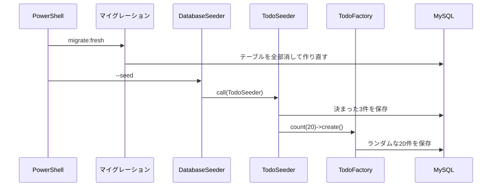
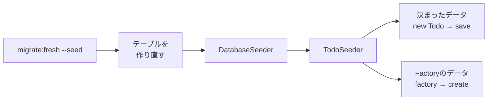

# Laravel入門 — テストデータを入れよう（Seeder・Factory）

これまでTodoのデータは、phpMyAdminで1件ずつ手入力したり、フォームから追加したりしていました。
今日は、**コマンド1つでテストデータを入れる方法** を学びます。

## 今日のゴール
- Seeder（シーダー）で、決まったテストデータを入れられる
- Factory（ファクトリー）で、たくさんのテストデータを自動で作れる
- `migrate:fresh --seed` で、データベースをいつでも最初の状態にもどせる

> 練習環境（`php-study\practice`）の mysql と laravel を起動してから始めます。
> コマンドは、PowerShellで **laravel フォルダ** に移動してから実行します。

---

## 1. なぜテストデータを入れるしくみが必要？

これまで、こんなことはありませんでしたか？

```
Aさん：「削除の練習をしたら、Todoがなくなっちゃった。また手で入れるの…？」
Bさん：「一覧ページの見た目を確かめたいけど、Todoが3件しかない」
Cさん：「友だちのPCと、入っているデータがちがう」
```

テストデータを **プログラムで入れる** ようにしておくと、こうなります。

| | phpMyAdminで手入力 | プログラムで入れる |
|---|---|---|
| 入れる手間 | 1件ずつ入力 | コマンド1つ |
| 消えてしまったら | また手入力 | コマンド1つで元どおり |
| 100件ほしい | とても大変 | 数字を変えるだけ |
| みんなのPCで | バラバラ | 同じデータになる |

Laravelでは、これを **Seeder** と **Factory** で行います。

---

## 2. Seeder と Factory

**Seeder**（シーダー）は「種（seed）をまくもの」という意味です。
空っぽのテーブルに、最初のデータという「種」をまきます。

| 名前 | 役割 | たとえると |
|------|------|-----------|
| **マイグレーション** | テーブルを作る（10/15に学習） | 畑を作る |
| **Seeder** | テーブルにデータを入れる | 種をまく |
| **Factory** | データを自動でたくさん作る | 種を大量に作る機械 |



今日は、次の2つの順番で作ります。

1. **Seeder** で、決まった3件のTodoを入れる
2. **Factory** で、自動で20件のTodoを作って入れる

ファイルの場所は、`src` の中のここです。

```
src/
└─ database/
    ├─ migrations/ ··········· テーブルの設計図（10/15に作った）
    ├─ seeders/
    │   ├─ DatabaseSeeder.php ··· 最初からある。ここから全部のSeederを動かす
    │   └─ TodoSeeder.php ······· 今日作る
    └─ factories/
        └─ TodoFactory.php ······ 今日作る
```

---

## 3. Seederで、決まったデータを入れよう



### 1. TodoSeeder を作る

> いまここ：**🟢 1. TodoSeeder** → 2. DatabaseSeeder → 3. 動かす

次のコマンドで、Seederのファイルを作ります。

```powershell
docker compose exec laravel php artisan make:seeder TodoSeeder
```

`database/seeders/TodoSeeder.php` ができるので、中身を次のように書きかえます。

```php
<?php

namespace Database\Seeders;

use App\Models\Todo;  // ← Todoモデルを使うための1行
use Illuminate\Database\Seeder;

class TodoSeeder extends Seeder
{
    public function run(): void
    {
        // 入れたいデータを、配列で用意する
        $todos = [
            ['title' => '牛乳を買う',     'is_done' => false],
            ['title' => 'レポートを出す', 'is_done' => true],
            ['title' => '宿題をする',     'is_done' => false],
        ];

        // 1件ずつ、Todoを作って保存する
        foreach ($todos as $data) {
            $todo = new Todo();
            $todo->title = $data['title'];
            $todo->is_done = $data['is_done'];
            $todo->save();
        }
    }
}
```

| コード | 意味 |
|--------|------|
| `run()` | Seederを動かしたときに、実行されるメソッド |
| `$todos = [ ... ]` | 入れたいデータの配列（前期に学んだ連想配列） |
| `foreach` | 配列から1件ずつ取り出してくり返す |
| `new Todo()` 〜 `save()` | 10/22の `store` と同じ書き方で、Todoを1件保存する |

`store` ではフォームから受け取った値を入れましたが、Seederでは **配列の値** を入れています。ちがいはそこだけです。

---

### 2. DatabaseSeeder から呼ぶ

> いまここ：1. TodoSeeder → **🟢 2. DatabaseSeeder** → 3. 動かす

`database/seeders/DatabaseSeeder.php` は、**Seederの入口** です。
Seederを動かすコマンドを打つと、まずこのファイルが動きます。

開くと、最初から「テスト用のユーザーを1人作る」コードが書いてあります。
今はユーザーを使わないので、中身を次のように書きかえます。

```php
<?php

namespace Database\Seeders;

use Illuminate\Database\Seeder;

class DatabaseSeeder extends Seeder
{
    public function run(): void
    {
        // TodoSeeder を動かす
        $this->call(TodoSeeder::class);
    }
}
```

`$this->call(TodoSeeder::class)` は、「`TodoSeeder` を動かしてね」という意味です。
Seederが増えたら、ここに `$this->call(...)` を書き足していきます。



---

### 3. 動かす ✅

> いまここ：1. TodoSeeder → 2. DatabaseSeeder → **🟢 3. 動かす**

次のコマンドを実行します。

```powershell
docker compose exec laravel php artisan migrate:fresh --seed
```

| 部分 | 意味 |
|------|------|
| `migrate:fresh` | **テーブルを全部消して**、マイグレーションで作り直す |
| `--seed` | 作り直したあとに、Seederでデータを入れる |

> ⚠️ **`migrate:fresh` は、データを全部消します**
> phpMyAdminやフォームで入れたTodoも、すべて消えます。
> 練習用のデータベースなので問題ありませんが、**本番のデータベースでは絶対に使いません**。

✅ **確認1**：http://localhost:8000/todos を開いて、3件のTodoが表示されればOKです。

✅ **確認2**：phpMyAdminで `todos` テーブルを開いてみましょう。
`save()` で入れたので、`created_at` と `updated_at` にも日時が入っています（手入力のときは空でした）。

✅ **確認3**：Todoをいくつか削除してから、もう一度 `migrate:fresh --seed` を実行してみましょう。
**最初の3件にもどります。** これで、いつでも練習をやり直せます。

---

## 4. Factoryで、たくさんのデータを作ろう

3件なら手で書けますが、20件・100件となると大変です。
**Factory** を使うと、「こんな感じのデータを作って」というルールを1つ書くだけで、何件でも自動で作れます。





### 1. TodoFactory を作る

> いまここ：**🟢 1. TodoFactory** → 2. HasFactory → 3. Seederから使う → 4. 動かす

```powershell
docker compose exec laravel php artisan make:factory TodoFactory
```

`database/factories/TodoFactory.php` ができるので、`definition()` の中を次のように書きかえます。

```php
    public function definition(): array
    {
        return [
            'title' => fake()->randomElement([
                '牛乳を買う',
                'レポートを出す',
                '宿題をする',
                '部屋のそうじ',
                '本を返す',
                'ゴミを出す',
            ]),
            'is_done' => fake()->boolean(),
        ];
    }
```

| コード | 意味 |
|--------|------|
| `definition()` | 「1件のTodoを、どんな値で作るか」のルールを書く場所 |
| `fake()` | テストデータ用の、ランダムな値を作る道具（Faker） |
| `fake()->randomElement([...])` | 配列の中から、ランダムに1つ選ぶ |
| `fake()->boolean()` | `true` か `false` を、ランダムに選ぶ |

`id`・`created_at`・`updated_at` は、これまでどおり自動で入るので書きません。

---

### 2. モデルに HasFactory を書く

> いまここ：1. TodoFactory → **🟢 2. HasFactory** → 3. Seederから使う → 4. 動かす

Factoryを使うには、モデルに「Factoryを使えるようにする」1行が必要です。
`app/Models/Todo.php` を開いて、★ の2行を書き足します。

```php
<?php

namespace App\Models;

use Illuminate\Database\Eloquent\Factories\HasFactory;  // ★ 追加
use Illuminate\Database\Eloquent\Model;

class Todo extends Model
{
    use HasFactory;  // ★ 追加
}
```

これで、`Todo::factory()` と書くと、`TodoFactory` が使えるようになります。
（Laravelは、モデル名 `Todo` から `TodoFactory` を自動で探してくれます）

---

### 3. Seederから Factory を使う

> いまここ：1. TodoFactory → 2. HasFactory → **🟢 3. Seederから使う** → 4. 動かす

`database/seeders/TodoSeeder.php` の `run()` の最後に、★ の1行を書き足します。

```php
    public function run(): void
    {
        $todos = [
            ['title' => '牛乳を買う',     'is_done' => false],
            ['title' => 'レポートを出す', 'is_done' => true],
            ['title' => '宿題をする',     'is_done' => false],
        ];

        foreach ($todos as $data) {
            $todo = new Todo();
            $todo->title = $data['title'];
            $todo->is_done = $data['is_done'];
            $todo->save();
        }

        // ★ Factoryで、Todoを20件作って保存する
        Todo::factory()->count(20)->create();
    }
```

```
Todo::factory() -> count(20) -> create();
~~~~~~~~~~~~~~~    ~~~~~~~~~    ~~~~~~~~
TodoFactoryで      20件         作って保存する
```

---

### 4. 動かす ✅

> いまここ：1. TodoFactory → 2. HasFactory → 3. Seederから使う → **🟢 4. 動かす**

```powershell
docker compose exec laravel php artisan migrate:fresh --seed
```

✅ **確認1**：http://localhost:8000/todos を開いて、**23件**（決まった3件 ＋ Factoryの20件）のTodoが表示されればOKです。

✅ **確認2**：もう一度 `migrate:fresh --seed` を実行してみましょう。
最初の3件は同じですが、Factoryで作った20件は、**実行するたびにタイトルや完了・未完了が変わります**。ランダムに作っているからです。



---

## 5. コマンドのまとめ

| コマンド | すること |
|---------|---------|
| `php artisan make:seeder TodoSeeder` | Seederのファイルを作る |
| `php artisan make:factory TodoFactory` | Factoryのファイルを作る |
| `php artisan migrate:fresh --seed` | テーブルを全部作り直して、Seederでデータを入れる |
| `php artisan db:seed` | テーブルはそのままで、Seederでデータを **足す** |

> **`db:seed` だけを打つと、データが増えていく**
> `db:seed` は、今あるデータを消さずに **足します**。2回打つと、Todoも2倍になります。
> 「最初の状態にもどしたい」ときは、`migrate:fresh --seed` を使いましょう。

（どのコマンドも、前に `docker compose exec laravel` をつけて実行します）

---

## 6. うまくいかないとき

> **🔥 動かないなら、ログを出せ！**
> Seederの中でも `Log::info()` が使えます → [【重要】ログの出し方](../20261022/【重要】ログの出し方.md)

| 症状 | 原因の場所 | 対処 |
|------|----------|------|
| `Class "Database\Seeders\Todo" not found` | Seeder | `TodoSeeder.php` の上に `use App\Models\Todo;` があるか確認 |
| `Call to undefined method App\Models\Todo::factory()` | モデル | `Todo.php` に `use HasFactory;` を書いたか確認（上の `use Illuminate\...\HasFactory;` も必要） |
| `Class "Database\Factories\TodoFactory" not found` | Factory | `database/factories/TodoFactory.php` があるか、ファイル名とクラス名を確認 |
| `Duplicate entry 'test@example.com'` | DatabaseSeeder | テスト用ユーザーを作るコードが残ったまま `db:seed` を2回打った。`DatabaseSeeder.php` を書きかえるか、`migrate:fresh --seed` を使う |
| Todoが2倍・3倍に増えた | コマンド | `db:seed` を何回も打った。`migrate:fresh --seed` でやり直す |
| 実行しても、Todoが入らない | DatabaseSeeder | `DatabaseSeeder.php` に `$this->call(TodoSeeder::class);` があるか確認 |

---

## 7. まとめ



| 今日書いたもの | ひとことで |
|--------------|-----------|
| `TodoSeeder` | 決まったテストデータを入れる |
| `DatabaseSeeder` の `$this->call(...)` | Seederの入口。ここから各Seederを動かす |
| `TodoFactory` の `definition()` | 1件のデータを、どんな値で作るかのルール |
| モデルの `use HasFactory;` | `Todo::factory()` を使えるようにする |
| `Todo::factory()->count(20)->create()` | ルールにしたがって、20件作って保存する |
| `migrate:fresh --seed` | データベースを、いつでも最初の状態にもどす |

---

## 8. もっとやってみよう（時間があまった人）

1. Factoryで作る件数を **100件** にして、一覧ページがどうなるか見てみましょう。
2. Factoryの `randomElement` のリストに、自分で考えたTodoを5つ足してみましょう。

<details>
<summary>ヒント</summary>

1. `TodoSeeder.php` の `count(20)` を `count(100)` に変えて、`migrate:fresh --seed` を実行します。
2. `TodoFactory.php` の `randomElement([...])` の配列に、`'買い物に行く',` のように書き足します。

</details>
