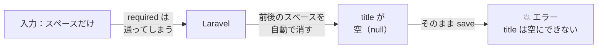
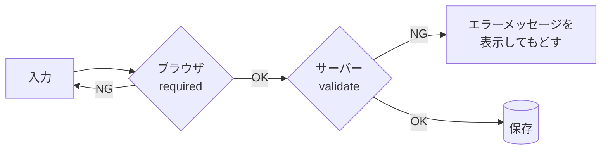
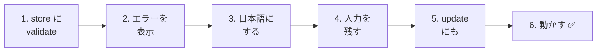
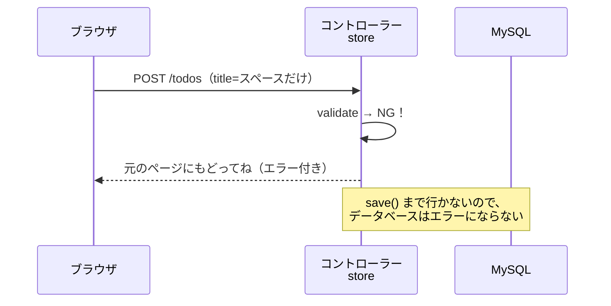
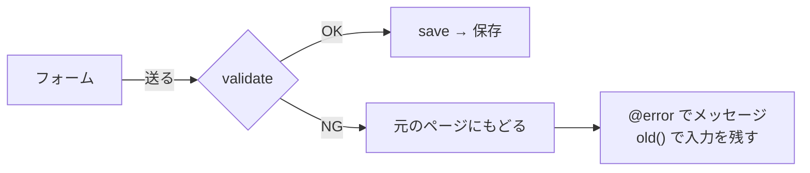

# Laravel入門 — 入力をチェックしよう（バリデーション）

Todoの追加・編集はできるようになりましたが、じつは **まちがった入力をすると、エラー画面になってしまう** 問題があります。
今日は、入力された値をサーバー側でチェックする **バリデーション** を学びます。

## 今日のゴール
- ブラウザのチェック（`required`）だけでは足りない理由がわかる
- `$request->validate()` で、入力をチェックできる
- エラーメッセージを画面に表示して、入力した値を残しておける

> 10/29の「Todoを編集する」までができている状態から始めます。

---

## 1. やってみよう：スペースだけで追加すると…？

http://localhost:8000/todos を開いて、入力欄に **半角スペースだけ** を入れて `追加` を押してみましょう。

```
SQLSTATE[23000]: Integrity constraint violation: 1048 Column 'title' cannot be null
```

エラー画面になってしまいました。何が起きたのでしょうか。



1. HTMLの `required` は、「何か入力されているか」だけを見ます。スペースも「入力あり」なので、通ってしまいます
2. Laravelは、送られてきた値の **前後のスペースを自動で消します**（10/22で学びました）。その結果、タイトルが空（`null`）になります
3. `todos` テーブルの `title` は空にできないので、保存のときにエラーになります

ほかにも、ブラウザの開発者ツール（F12）を使えば、`required` を消して送ることもできてしまいます。

---

## 2. バリデーションとは

**バリデーション**（validation）は、「入力された値が正しいか、**保存する前に** チェックすること」です。

チェックは、ブラウザとサーバーの2か所でできます。

| | ブラウザでチェック | サーバーでチェック（バリデーション） |
|---|---|---|
| 書く場所 | HTML（`required` など） | コントローラー（`$request->validate()`） |
| いいところ | 送る前にすぐ教えてくれる | **すり抜けられない** |
| 弱いところ | 開発者ツールで消せる・スペースだけで通る | 一度サーバーに送る必要がある |



ブラウザのチェックは「使う人のための親切」、サーバーのチェックは「アプリを守るためのカギ」です。
**サーバーのチェックは必ず書く** と覚えましょう。

---

## 3. 作ってみよう



さわるファイルは次の3つです（`src` の中）。

```
src/
├─ app/Http/Controllers/
│   └─ TodoController.php ············· 1・3・5. validate を書き足す
└─ resources/views/todos/
    ├─ index.blade.php ················ 2・4. エラー表示と old() を書き足す
    └─ edit.blade.php ················· 5. エラー表示と old() を書き足す
```

---

### 1. store に validate を書く（C）

> いまここ：**🟢 1. validate** → 2. エラー表示 → 3. 日本語 → 4. 入力を残す → 5. update にも → 6. 動かす

`app/Http/Controllers/TodoController.php` の `store` メソッドの **一番最初** に、★ の部分を書き足します。

```php
    public function store(Request $request)
    {
        // ★ 入力をチェックする
        $request->validate([
            'title' => 'required|max:255',
        ]);

        $todo = new Todo();
        $todo->title = $request->input('title');
        $todo->save();

        return redirect('/todos');
    }
```

| コード | 意味 |
|--------|------|
| `$request->validate([...])` | 送られてきた値をチェックする |
| `'title' => ...` | フォームの `name="title"` の値をチェックする |
| `required` | 空ではダメ（スペースだけも、Laravelが消すので空になる） |
| `max:255` | 255文字まで（`title` の列は `VARCHAR(255)` だから） |
| `\|` | ルールの区切り。「`required` かつ `max:255`」という意味 |

**チェックにひっかかると、そこで止まって、入力ページに自動でもどされます。** その下の `save()` は実行されません。



✅ **確認**：もう一度、スペースだけで `追加` を押してみましょう。
エラー画面にはならず、一覧ページにもどります。Todoも増えていません。
……でも、**なぜもどされたのか、画面からはわかりません**。次で、エラーメッセージを表示します。

---

### 2. エラーメッセージを表示する（V）

> いまここ：1. validate → **🟢 2. エラー表示** → 3. 日本語 → 4. 入力を残す → 5. update にも → 6. 動かす

`resources/views/todos/index.blade.php` のフォームに、★ の部分を書き足します。

```html
    <form method="POST" action="/todos">
        @csrf
        <input type="text" name="title" placeholder="新しいTODOを入力" required>
        <button type="submit">追加</button>

        {{-- ★ ここから追加 --}}
        @error('title')
            <p style="color: red;">{{ $message }}</p>
        @enderror
        {{-- ★ ここまで --}}
    </form>
```

| コード | 意味 |
|--------|------|
| `@error('title')` 〜 `@enderror` | `title` のチェックにひっかかったときだけ、中を表示する |
| `{{ $message }}` | エラーメッセージ |

✅ **確認**：スペースだけで `追加` を押すと、赤い文字でこう表示されます。

```
The title field is required.
```

英語で出てきました。次で、日本語にします。

---

### 3. エラーメッセージを日本語にする（C）

> いまここ：1. validate → 2. エラー表示 → **🟢 3. 日本語** → 4. 入力を残す → 5. update にも → 6. 動かす

`validate` の2つ目に、**メッセージの配列** を書き足します。

```php
        $request->validate([
            'title' => 'required|max:255',
        ], [
            'title.required' => 'タイトルを入力してください。',        // ★ 追加
            'title.max' => 'タイトルは255文字以内で入力してください。',  // ★ 追加
        ]);
```

| コード | 意味 |
|--------|------|
| `'title.required' => '...'` | `title` が `required` にひっかかったときのメッセージ |
| `'title.max' => '...'` | `title` が `max` にひっかかったときのメッセージ |

`'列の名前.ルール'` の形で、ルールごとにメッセージを決められます。

✅ **確認**：スペースだけで `追加` を押すと、「タイトルを入力してください。」と表示されればOKです。

---

### 4. 入力した値を残す（V）

> いまここ：1. validate → 2. エラー表示 → 3. 日本語 → **🟢 4. 入力を残す** → 5. update にも → 6. 動かす

エラーでもどされると、入力欄が空っぽになってしまいます。
長い文章を入力していたら、また最初から打ち直しです。

`index.blade.php` の `<input>` に、★ の `value` を書き足します。

```html
        <input type="text" name="title" value="{{ old('title') }}" placeholder="新しいTODOを入力" required>
        {{--                            ~~~~~~~~~~~~~~~~~~~~~~~~~ ★ 追加 --}}
```

`old('title')` は、「**さっき送った `title` の値**」です。
エラーでもどされたとき、入力欄にさっきの値を入れておけます。

---

### 5. update にもバリデーションを入れる

> いまここ：1. validate → 2. エラー表示 → 3. 日本語 → 4. 入力を残す → **🟢 5. update にも** → 6. 動かす

編集でも、スペースだけで保存すると同じエラーになります。
`TodoController.php` の `update` にも、`store` と同じ `validate` を書き足します。

```php
    public function update(Request $request, $id)
    {
        // ★ store と同じチェック
        $request->validate([
            'title' => 'required|max:255',
        ], [
            'title.required' => 'タイトルを入力してください。',
            'title.max' => 'タイトルは255文字以内で入力してください。',
        ]);

        $todo = Todo::findOrFail($id);
        $todo->title = $request->input('title');
        $todo->is_done = $request->has('is_done');
        $todo->save();

        return redirect('/todos/' . $todo->id);
    }
```

`resources/views/todos/edit.blade.php` のフォームも、★ のように書きかえます。

```html
    <form method="POST" action="/todos/{{ $todo->id }}">
        @csrf
        @method('PUT')
        <input type="text" name="title" value="{{ old('title', $todo->title) }}" required>  {{-- ★ old を使う --}}
        <label>
            <input type="checkbox" name="is_done" value="1" @checked($todo->is_done)>
            完了
        </label>
        <button type="submit">保存</button>

        {{-- ★ ここから追加 --}}
        @error('title')
            <p style="color: red;">{{ $message }}</p>
        @enderror
        {{-- ★ ここまで --}}
    </form>
```

`old('title', $todo->title)` は、「さっき送った値があればそれ、**なければ今のタイトル**」という意味です。

| 場面 | 入力欄に入るもの |
|------|----------------|
| 編集ページを初めて開いたとき | 今のタイトル（`$todo->title`） |
| エラーでもどってきたとき | さっき送った値（`old('title')`） |

---

### 6. 動かす ✅

> いまここ：1. validate → 2. エラー表示 → 3. 日本語 → 4. 入力を残す → 5. update にも → **🟢 6. 動かす**

次の4つを試してみましょう。

| | やること | こうなればOK |
|---|---|---|
| ① | 追加で、スペースだけを入れて `追加` | 「タイトルを入力してください。」と出る。Todoは増えない |
| ② | 追加で、ふつうにTodoを入れて `追加` | これまでどおり追加される |
| ③ | 編集で、タイトルをスペースだけにして `保存` | 編集ページにもどり、「タイトルを入力してください。」と出る |
| ④ | 開発者ツール（F12）で `<input>` の `required` を消し、空のまま `追加` | ブラウザのチェックがなくても、サーバーのチェックで止まる |

> **④ のやりかた**
> 1. 入力欄を右クリック →「検証」（または「調べる」）
> 2. 開発者ツールで `<input ... required>` の `required` をダブルクリックして消す
> 3. 入力欄を空のまま `追加` を押す

✅ ④ で「タイトルを入力してください。」と出れば、**ブラウザのチェックをすり抜けても、アプリが守られている** ことが確かめられます。

---

## 4. うまくいかないとき

> **🔥 動かないなら、ログを出せ！** → [【重要】ログの出し方](../20261022/【重要】ログの出し方.md)
> ただし、バリデーションにひっかかったことは、ログには書きこまれません（ふつうの動きなので、エラーではないためです）。

| 症状 | 原因の場所 | 対処 |
|------|----------|------|
| スペースだけで送ると、まだ `Column 'title' cannot be null` | コントローラー | `validate` を、`save()` より **前** に書いたか確認 |
| もどされるのに、メッセージが出ない | ビュー | `@error('title')` 〜 `@enderror` を書いたか、`'title'` のつづりを確認 |
| メッセージが英語のまま | コントローラー | `'title.required'` のつづりを確認（`.` でつなぐ） |
| もどってきたとき、入力欄が空 | ビュー | `value="{{ old('title') }}"` を書いたか確認 |
| 編集ページを開くと、入力欄が空 | ビュー | `old('title', $todo->title)` の2つ目（`$todo->title`）を書いたか確認 |
| 編集でスペースだけにすると、エラー画面 | コントローラー | `update` にも `validate` を書いたか確認 |

---

## 5. まとめ



| 今日書いたもの | ひとことで |
|--------------|-----------|
| `$request->validate([...])` | 保存する前に、サーバーで入力をチェックする |
| `'required\|max:255'` | 空はダメ・255文字まで |
| `'title.required' => '...'` | エラーメッセージを日本語にする |
| `@error('title')` 〜 `@enderror` | エラーメッセージを表示する |
| `old('title')` | エラーでもどったとき、さっきの入力を残す |

**ブラウザのチェックは親切、サーバーのチェックはカギ。サーバーのチェックは必ず書く。**

---

## 6. もっとやってみよう（時間があまった人）

タイトルを **20文字まで** にしてみましょう。21文字以上のTodoを追加しようとしたら、「タイトルは20文字以内で入力してください。」と表示されるようにします。

<details>
<summary>ヒント</summary>

`store` と `update` の両方で、`max:255` を `max:20` に、メッセージも「20文字以内」に変えます。

```php
        $request->validate([
            'title' => 'required|max:20',
        ], [
            'title.required' => 'タイトルを入力してください。',
            'title.max' => 'タイトルは20文字以内で入力してください。',
        ]);
```

</details>
