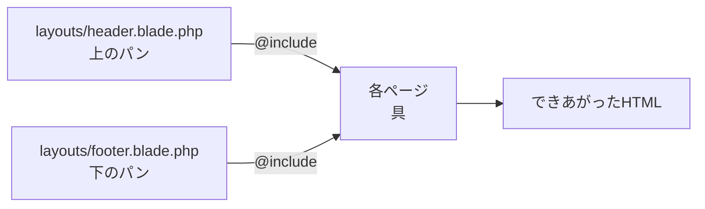
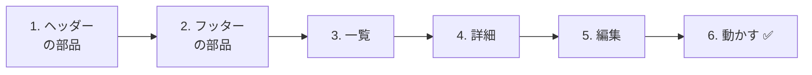
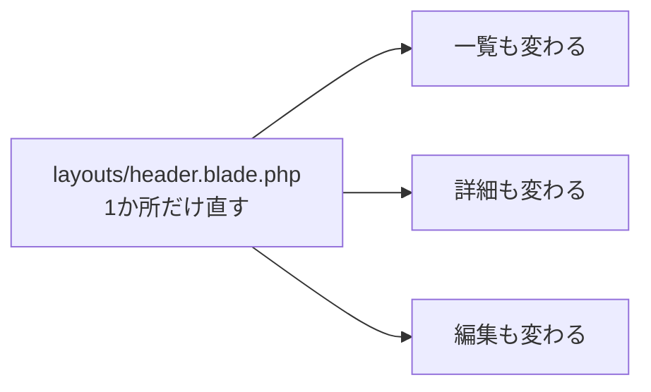
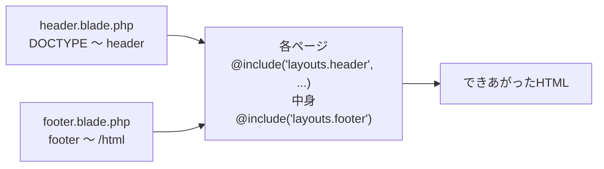

# Laravel入門 — 共通部分を部品にしよう（@include）

一覧・詳細・編集と、ページが3つになりました。
でも、どのファイルにも **同じHTML** を何度も書いています。今日は、その共通部分を **部品のファイル** に分けて、読みこむ方法を学びます。

## 今日のゴール
- 共通部分を部品にすると何がうれしいかわかる
- ヘッダー・フッターを部品のファイルに分けて、`@include` で読みこめる
- `@include` に値をわたして、ページごとにタイトルを変えられる
- 部品を1か所直すと、全部のページが変わることを確かめられる

> 11/5の「バリデーション」までができている状態から始めます。

---

## 1. 同じHTMLを、何回も書いている

今の3つのビューを見くらべてみましょう。

```
index.blade.php（一覧）        show.blade.php（詳細）         edit.blade.php（編集）
┌─────────────────────────┐   ┌─────────────────────────┐   ┌─────────────────────────┐
│ <!DOCTYPE html>         │   │ <!DOCTYPE html>         │   │ <!DOCTYPE html>         │
│ <html lang="ja">        │   │ <html lang="ja">        │   │ <html lang="ja">        │
│ <head>                  │   │ <head>                  │   │ <head>                  │
│   <meta charset=...>    │   │   <meta charset=...>    │   │   <meta charset=...>    │
│   <title>TODOアプリ     │   │   <title>TODOの詳細     │   │   <title>TODOの編集     │
│ </head>                 │   │ </head>                 │   │ </head>                 │
│ <body>                  │   │ <body>                  │   │ <body>                  │
│ ┌─────────────────────┐ │   │ ┌─────────────────────┐ │   │ ┌─────────────────────┐ │
│ │ 一覧の中身          │ │   │ │ 詳細の中身          │ │   │ │ 編集の中身          │ │
│ └─────────────────────┘ │   │ └─────────────────────┘ │   │ └─────────────────────┘ │
│ </body>                 │   │ </body>                 │   │ </body>                 │
│ </html>                 │   │ </html>                 │   │ </html>                 │
└─────────────────────────┘   └─────────────────────────┘   └─────────────────────────┘
```

ページごとにちがうのは **`<title>` と、`<body>` の中身だけ** です。それ以外は、3つとも同じです。

同じものを何回も書いていると、こんなことが起きます。

```
Aさん：「全部のページの上に『TODOアプリ』へのリンクをつけたい。3つのファイルを全部直すの…？」
Bさん：「全部のページの下にフッターをつけたら、詳細ページだけ付け忘れた」
Cさん：「ページが10個に増えたら、10か所直すことになる」
```

---

## 2. 共通部分を「部品」にする

そこで、共通部分を **上半分** と **下半分** の2つの部品ファイルに分けます。
各ページは、最初に上半分、最後に下半分を **読みこむ** だけにします。

```
layouts/header.blade.php（上半分の部品）
┌─────────────────────────┐
│ <!DOCTYPE html>         │
│ <html> <head> … </head> │
│ <body>                  │
│ <header>…</header>      │ ← 画面の上に出る部分
└─────────────────────────┘
            ＋
todos/index.blade.php（各ページ）
┌─────────────────────────┐
│ 一覧の中身だけ          │
└─────────────────────────┘
            ＋
layouts/footer.blade.php（下半分の部品）
┌─────────────────────────┐
│ <footer>…</footer>      │ ← 画面の下に出る部分
│ </body>                 │
│ </html>                 │
└─────────────────────────┘
```

たとえると、**サンドイッチ** です。
上のパン（ヘッダー）と下のパン（フッター）はいつも同じで、間にはさむ具（各ページの中身）だけがちがいます。

部品を読みこむには、Bladeの **`@include`** を使います。

| 書き方 | 意味 |
|--------|------|
| `@include('layouts.header')` | `resources/views/layouts/header.blade.php` の中身を、**ここにそのまま入れる** |
| `@include('layouts.header', ['title' => '一覧'])` | 部品を入れるときに、`$title` という名前で「一覧」をわたす |



> **`<head>` と `<header>` はちがうもの**
> 名前が似ていますが、役割がちがいます。
>
> | タグ | 役割 | 画面に見える？ |
> |------|------|-------------|
> | `<head>` | ページの情報（文字コード・タブのタイトルなど）。ブラウザのためのもの | 見えない |
> | `<header>` | ページの上に出る部分（アプリ名・メニューなど） | 見える |
>
> 今日の `header.blade.php` には、この **両方** が入ります。

---

## 3. 作ってみよう



さわるファイルは次の5つです（`src` の中）。

```
src/
└─ resources/views/
    ├─ layouts/
    │   ├─ header.blade.php ········· 1. ヘッダーの部品（新しく作る）
    │   └─ footer.blade.php ········· 2. フッターの部品（新しく作る）
    └─ todos/
        ├─ index.blade.php ·········· 3. 部品を読みこむように書きかえる
        ├─ show.blade.php ··········· 4. 部品を読みこむように書きかえる
        └─ edit.blade.php ··········· 5. 部品を読みこむように書きかえる
```

---

### 1. ヘッダーの部品を作る

> いまここ：**🟢 1. ヘッダー** → 2. フッター → 3. 一覧 → 4. 詳細 → 5. 編集 → 6. 動かす

`resources/views` の中に `layouts` フォルダを作り、`header.blade.php` というファイルを作ります。

```html
<!DOCTYPE html>
<html lang="ja">
<head>
    <meta charset="UTF-8">
    <title>{{ $title }} | TODOアプリ</title>
</head>
<body>
    <header>
        <a href="/todos">TODOアプリ</a>
    </header>
```

| コード | 意味 |
|--------|------|
| `{{ $title }}` | 各ページからわたされたタイトルが入る。ブラウザのタブに表示される |
| `<header>` 〜 `</header>` | 全部のページの上に出る部分 |

`</body>` と `</html>` は、ここには書きません。**フッターの部品** に書きます。

---

### 2. フッターの部品を作る

> いまここ：1. ヘッダー → **🟢 2. フッター** → 3. 一覧 → 4. 詳細 → 5. 編集 → 6. 動かす

同じく `resources/views/layouts` の中に、`footer.blade.php` を作ります。

```html
    <footer>
        <p>© 2026 TODOアプリ</p>
    </footer>
</body>
</html>
```

ヘッダーで開いた `<body>` と `<html>` を、ここで閉じます。

---

### 3. 一覧ページを書きかえる

> いまここ：1. ヘッダー → 2. フッター → **🟢 3. 一覧** → 4. 詳細 → 5. 編集 → 6. 動かす

`resources/views/todos/index.blade.php` を、次のように書きかえます。

```html
@include('layouts.header', ['title' => '一覧'])

    <h1>TODOアプリ</h1>

    <form method="POST" action="/todos">
        @csrf
        <input type="text" name="title" value="{{ old('title') }}" placeholder="新しいTODOを入力" required>
        <button type="submit">追加</button>

        @error('title')
            <p style="color: red;">{{ $message }}</p>
        @enderror
    </form>

    <ul>
        @foreach ($todos as $todo)
            <li>
                <form method="POST" action="/todos/{{ $todo->id }}/toggle" style="display: inline;">
                    @csrf
                    @method('PATCH')
                    <input type="checkbox" name="is_done" value="1" onchange="this.form.submit()" @checked($todo->is_done)>
                </form>
                <a href="/todos/{{ $todo->id }}">{{ $todo->title }}</a>
            </li>
        @endforeach
    </ul>

@include('layouts.footer')
```

書きかえ前とくらべると、こうなっています。

| | 書きかえ前 | 書きかえ後 |
|---|---|---|
| `<!DOCTYPE html>` 〜 `<body>` | 書いてある | `@include('layouts.header', ['title' => '一覧'])` の1行にする |
| `<body>` の中身 | そのまま | そのまま |
| `</body>` `</html>` | 書いてある | `@include('layouts.footer')` の1行にする |

`['title' => '一覧']` は、コントローラーで `view('todos.index', ['todos' => $todos])` と書いたのと同じ形です。
部品の中では、`$title` という名前で「一覧」が使えます。

✅ **確認**：http://localhost:8000/todos を開いて、一覧の上に「TODOアプリ」のリンク、下に「© 2026 TODOアプリ」が出ればOKです。
ブラウザのタブに「一覧 | TODOアプリ」と出ていることも確かめましょう。

---

### 4. 詳細ページを書きかえる

> いまここ：1. ヘッダー → 2. フッター → 3. 一覧 → **🟢 4. 詳細** → 5. 編集 → 6. 動かす

`resources/views/todos/show.blade.php` を、次のように書きかえます。

```html
@include('layouts.header', ['title' => $todo->title])

    <h1>{{ $todo->title }}</h1>

    <p>番号：{{ $todo->id }}</p>

    <p>
        状態：
        @if ($todo->is_done)
            完了 ✅
        @else
            未完了
        @endif
    </p>

    <a href="/todos/{{ $todo->id }}/edit">編集</a>

    <form method="POST" action="/todos/{{ $todo->id }}" onsubmit="return confirm('削除しますか？');">
        @csrf
        @method('DELETE')
        <button type="submit">削除</button>
    </form>

    <a href="/todos">一覧にもどる</a>

@include('layouts.footer')
```

`['title' => $todo->title]` のように、**変数** もわたせます。
「牛乳を買う」の詳細ページなら、タブには「牛乳を買う | TODOアプリ」と表示されます。

✅ **確認**：一覧からTodoをクリックして、詳細ページにもヘッダーとフッターが出ればOKです。

---

### 5. 編集ページを書きかえる

> いまここ：1. ヘッダー → 2. フッター → 3. 一覧 → 4. 詳細 → **🟢 5. 編集** → 6. 動かす

`resources/views/todos/edit.blade.php` を、次のように書きかえます。

```html
@include('layouts.header', ['title' => '編集'])

    <h1>TODOの編集</h1>

    <form method="POST" action="/todos/{{ $todo->id }}">
        @csrf
        @method('PUT')
        <input type="text" name="title" value="{{ old('title', $todo->title) }}" required>
        <label>
            <input type="checkbox" name="is_done" value="1" @checked($todo->is_done)>
            完了
        </label>
        <button type="submit">保存</button>

        @error('title')
            <p style="color: red;">{{ $message }}</p>
        @enderror
    </form>

    <a href="/todos/{{ $todo->id }}">もどる</a>

@include('layouts.footer')
```

✅ **確認**：詳細ページから「編集」を押して、編集ページにもヘッダーとフッターが出ればOKです。

---

### 6. 動かす ✅：部品を1か所直すと…？

> いまここ：1. ヘッダー → 2. フッター → 3. 一覧 → 4. 詳細 → 5. 編集 → **🟢 6. 動かす**

ここからが、部品にしたいちばんうれしいところです。
`layouts/header.blade.php` **だけ** を開いて、「TODOアプリ」を「わたしのTODO」に書きかえてみましょう。

```html
    <header>
        <a href="/todos">わたしのTODO</a>  {{-- ★ 書きかえ --}}
    </header>
```

✅ **確認**：一覧・詳細・編集の **3つのページを全部** 開き直してみましょう。
**どのページも**、ヘッダーが「わたしのTODO」に変わっていれば成功です。



部品にしていなければ、3つのファイルを全部直す必要がありました。
**直すのは1か所、変わるのは全部のページ**。これが部品にする力です。

---

## 4. うまくいかないとき

> **🔥 動かないなら、ログを出せ！** → [【重要】ログの出し方](../20261022/【重要】ログの出し方.md)

| 症状 | 原因の場所 | 対処 |
|------|----------|------|
| `View [layouts.header] not found.` | 部品 | `resources/views/layouts/header.blade.php` の場所とファイル名を確認（`layouts` に `s` がつく。`footer` も同じ） |
| `Undefined variable $title` | 各ページ | `@include('layouts.header', ['title' => ...])` の、`['title' => ...]` を書き忘れていないか確認 |
| タブのタイトルがおかしい | 各ページ | `['title' => ...]` の `'title'` と、部品の `{{ $title }}` の名前が同じか確認 |
| フッターが出ない | 各ページ | ページの最後に `@include('layouts.footer')` を書いたか確認 |
| `<!DOCTYPE html>` が2回出てくる | 各ページ | 各ページに `<!DOCTYPE html>` 〜 `<body>` が残っていないか確認（ヘッダーの部品にあるので消す） |

> **`@include` は、最初と最後の2か所**
> 各ページには、`@include('layouts.header', ...)` と `@include('layouts.footer')` の **2か所** を必ず書きます。
> フッターを書き忘れると、`</body>` と `</html>` がないHTMLになってしまいます（ブラウザは表示してくれますが、正しいHTMLではありません）。

---

## 5. まとめ



| 今日書いたもの | ひとことで |
|--------------|-----------|
| `layouts/header.blade.php` | 全部のページの上半分（`<!DOCTYPE html>` 〜 `<header>`） |
| `layouts/footer.blade.php` | 全部のページの下半分（`<footer>` 〜 `</html>`） |
| `@include('layouts.header', ['title' => ...])` | 上半分の部品を読みこみ、タイトルをわたす |
| `@include('layouts.footer')` | 下半分の部品を読みこむ |

**共通部分は部品に。直すのは1か所、変わるのは全部のページ。**

> **ほかの書き方もある**
> Laravelには、ページ全体の「わく」を1つのファイルにする `@extends`・`@section`・`@yield` や、`<x-layout>` のように書く **コンポーネント** という作り方もあります。
> ネットで見かけたら、「同じことを別の書き方でしているんだな」と思ってください。
