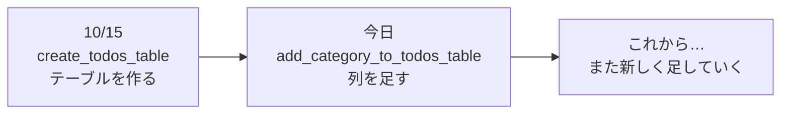
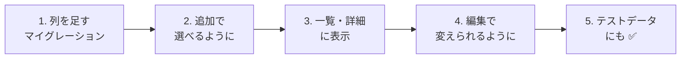
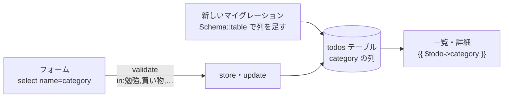

# Laravel入門 — Todoにカテゴリをつけよう（列を足すマイグレーション）

Todoが増えてくると、「これは勉強のこと」「これは買い物」と **分類** したくなります。
今日は、Todoに **カテゴリ** をつけられるようにします。

## 今日のゴール
- すでにあるテーブルに、**マイグレーションで列を足す** ことができる
- セレクトボックスで、決まった選択肢からカテゴリを選べる
- 選べるカテゴリ以外が送られてこないように、バリデーション（`in`）でチェックできる

> [資料1](./20261112_資料_1.md) の「共通部分を部品にしよう」までができている状態から始めます。

---

## 1. 今日つくるもの

カテゴリは、次の **4つから選ぶ** ことにします。

| カテゴリ |
|---------|
| 勉強 |
| 買い物 |
| 家のこと |
| その他 |

```
TODOアプリ

[ 新しいTODOを入力 ] [ 勉強 ▼ ] [追加]

☐ [勉強] レポートを書く
☑ [買い物] 牛乳を買う
☐ [家のこと] 部屋のそうじ
```

`todos` テーブルに、`category`（カテゴリ）の列を1つ足します。

| id | title | **category** | is_done | created_at | updated_at |
|----|-------|-------------|---------|-----------|-----------|
| 1 | レポートを書く | **勉強** | 0 | … | … |
| 2 | 牛乳を買う | **買い物** | 1 | … | … |

---

## 2. 新しく出てくること：列を足すマイグレーション

10/15に、マイグレーションで `todos` テーブルを **作り** ました。
今日は、すでにある `todos` テーブルに **列を足し** ます。

ここで大事な決まりがあります。

> **一度実行したマイグレーションは、書きかえない。新しいマイグレーションを足す。**



10/15のマイグレーション（`create_todos_table`）に `category` を書き足しても、**もう実行済みなので、`migrate` しても動きません**。
マイグレーションは、テーブルの **変更の記録（日記）** です。前の日記は書きかえずに、新しいページに「今日は列を足した」と書き足していきます。

| | テーブルを作る（10/15） | 列を足す（今日） |
|---|---|---|
| ファイル名 | `create_todos_table` | `add_category_to_todos_table` |
| 中身 | `Schema::create('todos', ...)` | `Schema::table('todos', ...)` |
| 意味 | 新しくテーブルを作る | すでにあるテーブルを変える |

---

## 3. 作ってみよう



さわるファイルは次のとおりです（`src` の中）。

```
src/
├─ database/
│   ├─ migrations/
│   │   └─ xxxx_add_category_to_todos_table.php ··· 1. 新しく作る
│   ├─ seeders/TodoSeeder.php ····················· 5. カテゴリを足す
│   └─ factories/TodoFactory.php ·················· 5. カテゴリを足す
├─ resources/views/todos/
│   ├─ index.blade.php ···························· 2・3. セレクトボックスと表示
│   ├─ show.blade.php ····························· 3. 表示
│   └─ edit.blade.php ····························· 4. セレクトボックス
└─ app/Http/Controllers/
    └─ TodoController.php ························· 2・4. store と update
```

---

### 1. 列を足すマイグレーションを作る

> いまここ：**🟢 1. マイグレーション** → 2. 追加 → 3. 表示 → 4. 編集 → 5. テストデータ

次のコマンドで、マイグレーションファイルを作ります。

```powershell
docker compose exec laravel php artisan make:migration add_category_to_todos_table
```

名前を `add_〇〇_to_△△_table` にすると、Laravelが「`△△` テーブルを変えるんだな」と読み取って、ひな形を作ってくれます。

`database/migrations/` に `2026_11_12_xxxxxx_add_category_to_todos_table.php` ができるので、`up()` と `down()` の中を次のようにします。

```php
    public function up(): void
    {
        Schema::table('todos', function (Blueprint $table) {
            $table->string('category')->default('その他')->after('title');
        });
    }

    public function down(): void
    {
        Schema::table('todos', function (Blueprint $table) {
            $table->dropColumn('category');
        });
    }
```

| コード | 意味 |
|--------|------|
| `Schema::table('todos', ...)` | すでにある `todos` テーブルを変える（作るときは `Schema::create`） |
| `$table->string('category')` | `category` という文字の列を足す |
| `->default('その他')` | 何も入れなかったときは「その他」にする |
| `->after('title')` | `title` の列のうしろに足す（phpMyAdminで見やすくするため） |
| `up()` | `migrate` したときにすること（列を足す） |
| `down()` | 元にもどすときにすること（列を消す） |

> **なぜ `default('その他')` をつけるの？**
> `todos` テーブルには、もうTodoが何件か入っています。
> 列を足すと、今あるTodoの `category` には何を入れればいいでしょう？ `default` があれば、今あるTodoは全部「その他」になります。

保存したら、マイグレーションを実行します。

```powershell
docker compose exec laravel php artisan migrate
```

✅ **確認**：phpMyAdminで `todos` テーブルを開いてみましょう。
`title` のうしろに `category` の列ができていて、今あるTodoは全部「その他」になっていればOKです。
**今あるTodoは消えていません**。`migrate` は、まだ実行していないマイグレーション（今日の1つ）だけを実行するからです。

| コマンド | すること | 今あるデータ |
|---------|---------|------------|
| `migrate` | まだ実行していないマイグレーションだけを実行する | **残る** |
| `migrate:fresh` | テーブルを全部消して、全部のマイグレーションを最初から実行する | 消える |

---

### 2. 追加でカテゴリを選べるようにする

> いまここ：1. マイグレーション → **🟢 2. 追加** → 3. 表示 → 4. 編集 → 5. テストデータ

#### ① 追加フォームにセレクトボックスを足す（V）

`resources/views/todos/index.blade.php` の追加フォームに、★ のセレクトボックスを書き足します。

```html
    <form method="POST" action="/todos">
        @csrf
        <input type="text" name="title" value="{{ old('title') }}" placeholder="新しいTODOを入力" required>

        {{-- ★ ここから追加 --}}
        <select name="category">
            <option value="勉強">勉強</option>
            <option value="買い物">買い物</option>
            <option value="家のこと">家のこと</option>
            <option value="その他">その他</option>
        </select>
        {{-- ★ ここまで --}}

        <button type="submit">追加</button>

        @error('title')
            <p style="color: red;">{{ $message }}</p>
        @enderror
    </form>
```

| コード | 意味 |
|--------|------|
| `<select name="category">` | `category` という名前で、選んだものを送る |
| `<option value="勉強">勉強</option>` | 選択肢。`value` の値が送られる |

#### ② store でカテゴリも保存する（C）

`app/Http/Controllers/TodoController.php` の `store` に、★ の部分を書き足します。

```php
    public function store(Request $request)
    {
        $request->validate([
            'title' => 'required|max:255',
            'category' => 'required|in:勉強,買い物,家のこと,その他',  // ★ 追加
        ], [
            'title.required' => 'タイトルを入力してください。',
            'title.max' => 'タイトルは255文字以内で入力してください。',
            'category.required' => 'カテゴリを選んでください。',           // ★ 追加
            'category.in' => 'カテゴリは、リストの中から選んでください。',  // ★ 追加
        ]);

        $todo = new Todo();
        $todo->title = $request->input('title');
        $todo->category = $request->input('category');  // ★ 追加
        $todo->save();

        return redirect('/todos');
    }
```

| コード | 意味 |
|--------|------|
| `'category' => 'required\|in:勉強,買い物,家のこと,その他'` | `category` は、この4つの **どれか** でなければダメ |
| `$todo->category = $request->input('category')` | 選ばれたカテゴリを入れる |

> **セレクトボックスなのに、なぜ `in` でチェックするの？**
> セレクトボックスには4つしか選択肢がありませんが、11/5に学んだとおり、**ブラウザのチェックはすり抜けられます**。
> 開発者ツールで `<option value="勉強">` を `<option value="ゲーム">` に書きかえて送ることもできてしまいます。
> サーバー側の `in` で、決まった4つ以外ははじきます。

---

### 3. 一覧と詳細にカテゴリを表示する

> いまここ：1. マイグレーション → 2. 追加 → **🟢 3. 表示** → 4. 編集 → 5. テストデータ

#### ① 一覧（V）

`index.blade.php` の `<li>` の中に、★ の部分を書き足します。

```html
            <li>
                <form method="POST" action="/todos/{{ $todo->id }}/toggle" style="display: inline;">
                    @csrf
                    @method('PATCH')
                    <input type="checkbox" name="is_done" value="1" onchange="this.form.submit()" @checked($todo->is_done)>
                </form>
                [{{ $todo->category }}]  {{-- ★ 追加 --}}
                <a href="/todos/{{ $todo->id }}">{{ $todo->title }}</a>
            </li>
```

#### ② 詳細（V）

`show.blade.php` の「番号」の下に、★ の1行を書き足します。

```html
    <p>番号：{{ $todo->id }}</p>

    <p>カテゴリ：{{ $todo->category }}</p>  {{-- ★ 追加 --}}
```

✅ **確認**：一覧でカテゴリを選んでTodoを追加してみましょう。
一覧に `[勉強] レポートを書く` のように表示され、詳細ページにも「カテゴリ：勉強」と出ればOKです。

---

### 4. 編集でカテゴリを変えられるようにする

> いまここ：1. マイグレーション → 2. 追加 → 3. 表示 → **🟢 4. 編集** → 5. テストデータ

#### ① 編集フォームにセレクトボックスを足す（V）

`edit.blade.php` のフォームに、★ のセレクトボックスを書き足します。

```html
    <form method="POST" action="/todos/{{ $todo->id }}">
        @csrf
        @method('PUT')
        <input type="text" name="title" value="{{ old('title', $todo->title) }}" required>

        {{-- ★ ここから追加 --}}
        <select name="category">
            <option value="勉強" @selected($todo->category === '勉強')>勉強</option>
            <option value="買い物" @selected($todo->category === '買い物')>買い物</option>
            <option value="家のこと" @selected($todo->category === '家のこと')>家のこと</option>
            <option value="その他" @selected($todo->category === 'その他')>その他</option>
        </select>
        {{-- ★ ここまで --}}

        <label>
            <input type="checkbox" name="is_done" value="1" @checked($todo->is_done)>
            完了
        </label>
        <button type="submit">保存</button>

        @error('title')
            <p style="color: red;">{{ $message }}</p>
        @enderror
    </form>
```

| コード | 意味 |
|--------|------|
| `@selected($todo->category === '勉強')` | 今のカテゴリが「勉強」なら、最初からこの選択肢を選んでおく |

`@selected` は、チェックボックスの `@checked` のセレクトボックス版です。
`( )` の中が `true` のときだけ、`<option>` に `selected` をつけます。

#### ② update でカテゴリも保存する（C）

`TodoController.php` の `update` に、`store` と同じように ★ の部分を書き足します。

```php
    public function update(Request $request, $id)
    {
        $request->validate([
            'title' => 'required|max:255',
            'category' => 'required|in:勉強,買い物,家のこと,その他',  // ★ 追加
        ], [
            'title.required' => 'タイトルを入力してください。',
            'title.max' => 'タイトルは255文字以内で入力してください。',
            'category.required' => 'カテゴリを選んでください。',           // ★ 追加
            'category.in' => 'カテゴリは、リストの中から選んでください。',  // ★ 追加
        ]);

        $todo = Todo::findOrFail($id);
        $todo->title = $request->input('title');
        $todo->category = $request->input('category');  // ★ 追加
        $todo->is_done = $request->has('is_done');
        $todo->save();

        return redirect('/todos/' . $todo->id);
    }
```

✅ **確認**：編集ページを開くと、今のカテゴリが最初から選ばれているか確かめましょう。
カテゴリを変えて `保存` し、詳細ページのカテゴリが変わればOKです。

---

### 5. テストデータにもカテゴリを入れる

> いまここ：1. マイグレーション → 2. 追加 → 3. 表示 → 4. 編集 → **🟢 5. テストデータ**

11/5に作った Seeder と Factory にも、カテゴリを足しておきます。

#### ① TodoSeeder（決まったデータ）

`database/seeders/TodoSeeder.php` の配列と `foreach` に、★ の部分を書き足します。

```php
        $todos = [
            ['title' => '牛乳を買う',     'category' => '買い物', 'is_done' => false],  // ★ category を追加
            ['title' => 'レポートを出す', 'category' => '勉強',   'is_done' => true],   // ★
            ['title' => '宿題をする',     'category' => '勉強',   'is_done' => false],  // ★
        ];

        foreach ($todos as $data) {
            $todo = new Todo();
            $todo->title = $data['title'];
            $todo->category = $data['category'];  // ★ 追加
            $todo->is_done = $data['is_done'];
            $todo->save();
        }
```

#### ② TodoFactory（自動で作るデータ）

`database/factories/TodoFactory.php` の `definition()` に、★ の1行を書き足します。

```php
        return [
            'title' => fake()->randomElement([
                '牛乳を買う',
                'レポートを出す',
                '宿題をする',
                '部屋のそうじ',
                '本を返す',
                'ゴミを出す',
            ]),
            'category' => fake()->randomElement(['勉強', '買い物', '家のこと', 'その他']),  // ★ 追加
            'is_done' => fake()->boolean(),
        ];
```

```powershell
docker compose exec laravel php artisan migrate:fresh --seed
```

✅ **確認**：一覧を開いて、23件のTodoに、それぞれカテゴリがついていればOKです。
`migrate:fresh` は全部のマイグレーションを最初から実行するので、**今日のマイグレーションもいっしょに** 実行されます。

---

## 4. うまくいかないとき

> **🔥 動かないなら、ログを出せ！** → [【重要】ログの出し方](../20261022/【重要】ログの出し方.md)

| 症状 | 原因の場所 | 対処 |
|------|----------|------|
| `Unknown column 'category'` | マイグレーション | `php artisan migrate` を実行したか確認 |
| `migrate` しても、`category` の列ができない | マイグレーション | 10/15のマイグレーションに書き足していないか確認（**新しいマイグレーション** に書く） |
| 「カテゴリは、リストの中から選んでください。」と出る | ビュー・コントローラー | `<option value="...">` と、`in:...` のカテゴリ名が **1文字もちがわず** 同じか確認 |
| 追加したのに、カテゴリが全部「その他」になる | コントローラー | `store` に `$todo->category = $request->input('category');` があるか確認 |
| 編集ページで、今のカテゴリが選ばれていない | ビュー | `@selected($todo->category === '...')` を書いたか、カテゴリ名を確認 |

---

## 5. まとめ



| 今日書いたもの | ひとことで |
|--------------|-----------|
| `make:migration add_category_to_todos_table` | すでにあるテーブルに、列を足すマイグレーションを作る |
| `Schema::table(...)` と `->default(...)` | 列を足す。今あるデータには `default` の値が入る |
| `php artisan migrate` | まだ実行していないマイグレーションだけを実行する（データは残る） |
| `<select>` と `<option>` | 決まった選択肢から選ぶ |
| `@selected(...)` | 今の値を、最初から選んでおく（`@checked` のセレクトボックス版） |
| `'in:勉強,買い物,…'` | 決まった値以外を、サーバー側ではじく |

**一度実行したマイグレーションは書きかえない。変更は、新しいマイグレーションで足していく。**

---

## 6. もっとやってみよう（時間があまった人）

カテゴリに「部活」を足してみましょう。
どのファイルを直せばいいか、自分で考えてみてください。

<details>
<summary>ヒント</summary>

「部活」は、次の **4か所** に足します。

1. `index.blade.php` の追加フォームの `<option>`
2. `edit.blade.php` の編集フォームの `<option>`（`@selected` も）
3. `TodoController.php` の `store` の `in:...`
4. `TodoController.php` の `update` の `in:...`

（Factoryでも「部活」を出したいときは、`TodoFactory.php` の `randomElement` にも足します）

同じカテゴリの一覧を、**4か所に書いている** ことに気づきましたか？
1か所足し忘れると、「選べるのに保存できない」などのバグになります。こういうところも、本当は資料1のように **共通化** したいところです。

</details>
