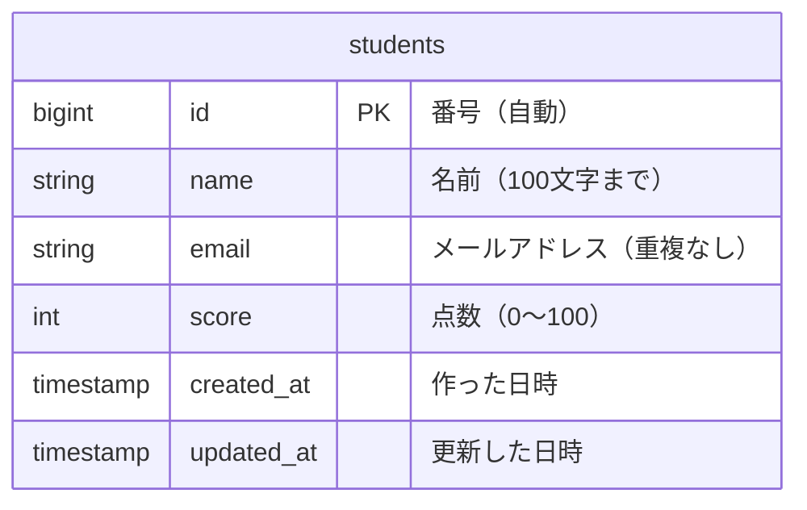
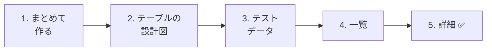

# 生徒管理アプリを作ろう① — 準備と一覧・詳細

今日から、新しく **生徒管理アプリ** を作ります。
Todoアプリで学んだことを使って、今度は **自分の力で** 作っていきましょう。

## 今日のゴール
- `make:model -mf` で、モデル・マイグレーション・Factoryをまとめて作れる
- 生徒のテーブルを作って、テストデータを入れられる
- 生徒の一覧ページと詳細ページを作れる

> 練習環境（`php-study\practice`）の mysql と laravel を起動してから始めます。
> Todoアプリと **同じプロジェクト（`src`）** に、生徒管理アプリを足していきます。

---

## 1. 生徒管理アプリとは

先生が、生徒の **名前・メールアドレス・点数** を管理するアプリです。

```
生徒管理アプリ

[ 生徒を追加 ]

| 名前       | 点数 |
|------------|------|
| 山田 太郎  |  85  |
| 佐藤 花子  |  92  |
| 鈴木 一郎  |  70  |
```

このアプリは、これから3回かけて少しずつ育てていきます。

| 回 | 作るもの |
|----|---------|
| **1回目（今日）** | 生徒の一覧・詳細・追加・編集・削除（CRUD） |
| 2回目 | ログイン（先生だけが使えるようにする） |
| 3回目 | リレーション（どの先生が登録した生徒かを記録する） |

> **2年生につながるアプリ**
> 2年生になると、このアプリを **API**（画面ではなく、データだけを返すしくみ）に作りかえます。
> 今日作るテーブルやURLは、2年生でもそのまま使います。

### Todoアプリとくらべてみよう

作り方は、Todoアプリとほとんど同じです。

| | Todoアプリ | 生徒管理アプリ |
|---|---|---|
| テーブル | `todos` | `students` |
| モデル | `Todo` | `Student` |
| コントローラー | `TodoController` | `StudentController` |
| URL | `/todos` | `/students` |
| ビューのフォルダ | `resources/views/todos/` | `resources/views/students/` |

### 生徒のテーブル



Todoのテーブルと、ここがちがいます。

| 列 | 新しいところ |
|----|------------|
| `email` | **同じメールアドレスの生徒は、2人登録できない**（重複なし） |
| `score` | 文字ではなく **整数**（`integer`）を入れる |

---

## 2. 作ってみよう



### 1. モデル・マイグレーション・Factoryを、まとめて作る

> いまここ：**🟢 1. まとめて作る** → 2. 設計図 → 3. テストデータ → 4. 一覧 → 5. 詳細

Todoのときは、マイグレーション・モデル・Factoryを1つずつ作りました。
今回は、**1つのコマンドでまとめて** 作ります。

```powershell
docker compose exec laravel php artisan make:model Student -mf
```

| 部分 | 意味 |
|------|------|
| `make:model Student` | `Student` モデルを作る |
| `-m` | マイグレーションもいっしょに作る（**m**igration） |
| `-f` | Factoryもいっしょに作る（**f**actory） |

次の3つのファイルができます。

```
src/
├─ app/Models/Student.php ··································· モデル
├─ database/migrations/xxxx_create_students_table.php ······· マイグレーション
└─ database/factories/StudentFactory.php ···················· Factory
```

`-f` をつけたので、モデルには最初から `HasFactory` が入っています（Todoでは手で書き足しました）。

```php
class Student extends Model
{
    /** @use HasFactory<\Database\Factories\StudentFactory> */
    use HasFactory;
}
```

---

### 2. テーブルの設計図を書く（マイグレーション）

> いまここ：1. まとめて作る → **🟢 2. 設計図** → 3. テストデータ → 4. 一覧 → 5. 詳細

`database/migrations/xxxx_create_students_table.php` を開いて、`up()` の中を次のようにします。

```php
    public function up(): void
    {
        Schema::create('students', function (Blueprint $table) {
            $table->id();
            $table->string('name', 100);
            $table->string('email')->unique();
            $table->integer('score')->default(0);
            $table->timestamps();
        });
    }
```

| コード | 意味 |
|--------|------|
| `$table->string('name', 100)` | 名前。100文字まで |
| `$table->string('email')->unique()` | メールアドレス。**同じ値を2回入れられない** |
| `$table->integer('score')->default(0)` | 点数。整数で、何も入れなければ0 |

```powershell
docker compose exec laravel php artisan migrate
```

✅ **確認**：phpMyAdminで、`students` テーブルができていればOKです。

---

### 3. テストデータを入れる（Factory・Seeder）

> いまここ：1. まとめて作る → 2. 設計図 → **🟢 3. テストデータ** → 4. 一覧 → 5. 詳細

#### ① Factory に、生徒の作り方を書く

`database/factories/StudentFactory.php` の `definition()` の中を、次のようにします。

```php
    public function definition(): array
    {
        return [
            'name' => fake('ja_JP')->name(),
            'email' => fake()->unique()->safeEmail(),
            'score' => fake()->numberBetween(0, 100),
        ];
    }
```

| コード | 意味 |
|--------|------|
| `fake('ja_JP')->name()` | **日本語の名前** をランダムに作る（例：山田 太郎） |
| `fake()->unique()->safeEmail()` | メールアドレスをランダムに作る。`unique()` で、同じものが出ないようにする |
| `fake()->numberBetween(0, 100)` | 0〜100の整数をランダムに作る |

> 本物の生徒の名前やメールアドレスは、練習に使いません。Factoryで **架空のデータ** を作ります。

#### ② Seeder を作って、30人入れる

```powershell
docker compose exec laravel php artisan make:seeder StudentSeeder
```

`database/seeders/StudentSeeder.php` の `run()` の中を、次のようにします。

```php
<?php

namespace Database\Seeders;

use App\Models\Student;
use Illuminate\Database\Seeder;

class StudentSeeder extends Seeder
{
    public function run(): void
    {
        Student::factory()->count(30)->create();
    }
}
```

`database/seeders/DatabaseSeeder.php` に、★ の1行を書き足します。

```php
    public function run(): void
    {
        $this->call(TodoSeeder::class);
        $this->call(StudentSeeder::class);  // ★ 追加
    }
```

```powershell
docker compose exec laravel php artisan migrate:fresh --seed
```

✅ **確認**：phpMyAdminで `students` テーブルを開いて、30人の生徒が入っていればOKです。
（`migrate:fresh` なので、Todoのデータも最初の状態にもどります）

---

### 4. 一覧ページを作る

> いまここ：1. まとめて作る → 2. 設計図 → 3. テストデータ → **🟢 4. 一覧** → 5. 詳細

#### ① コントローラーを作る

```powershell
docker compose exec laravel php artisan make:controller StudentController
```

`app/Http/Controllers/StudentController.php` を、次のようにします。

```php
<?php

namespace App\Http\Controllers;

use App\Models\Student;
use Illuminate\Http\Request;

class StudentController extends Controller
{
    public function index()
    {
        $students = Student::all();

        return view('students.index', ['students' => $students]);
    }
}
```

`TodoController` の `index` と、`Todo` が `Student` に変わっただけです。

#### ② ルートを書く

`routes/web.php` に、★ の2行を書き足します。

```php
use App\Http\Controllers\StudentController;  // ★ 追加（上の方に書く）

// （Todo のルートは省略）

Route::get('/students', [StudentController::class, 'index']);  // ★ 追加
```

#### ③ ビューを作る

`resources/views` の中に `students` フォルダを作り、`index.blade.php` を作ります。
11/12に作った **ヘッダー・フッターの部品** を、ここでも使います。

```html
@include('layouts.header', ['title' => '生徒一覧'])

    <h1>生徒一覧</h1>

    <table border="1">
        <tr>
            <th>名前</th>
            <th>点数</th>
        </tr>
        @foreach ($students as $student)
            <tr>
                <td><a href="/students/{{ $student->id }}">{{ $student->name }}</a></td>
                <td>{{ $student->score }}</td>
            </tr>
        @endforeach
    </table>

@include('layouts.footer')
```

| コード | 意味 |
|--------|------|
| `<table>` | 表を作る。`<tr>` が1行、`<th>` が見出し、`<td>` がマス |
| `border="1"` | 表にわくの線をつける |

#### ④ ヘッダーに「生徒管理」へのリンクを足す

`resources/views/layouts/header.blade.php` に、★ のリンクを書き足します。

```html
    <header>
        <a href="/todos">TODOアプリ</a>
        <a href="/students">生徒管理</a>  {{-- ★ 追加 --}}
    </header>
```

**部品を1か所直しただけで、Todoのページにも生徒のページにも、リンクが出ます**（11/12で学んだ共通化の力です）。

✅ **確認**：http://localhost:8000/students を開いて、30人の生徒が表で表示されればOKです。

---

### 5. 詳細ページを作る

> いまここ：1. まとめて作る → 2. 設計図 → 3. テストデータ → 4. 一覧 → **🟢 5. 詳細**

#### ① コントローラーに show を書き足す

`StudentController.php` に、★ の `show` を書き足します。

```php
    // ★ ここから追加
    public function show($id)
    {
        $student = Student::findOrFail($id);

        return view('students.show', ['student' => $student]);
    }
    // ★ ここまで
```

#### ② ルートを書き足す

```php
Route::get('/students', [StudentController::class, 'index']);
Route::get('/students/{id}', [StudentController::class, 'show']);  // ★ 追加
```

#### ③ ビューを作る

`resources/views/students/show.blade.php` を作ります。

```html
@include('layouts.header', ['title' => $student->name])

    <h1>{{ $student->name }}</h1>

    <p>番号：{{ $student->id }}</p>
    <p>メールアドレス：{{ $student->email }}</p>
    <p>点数：{{ $student->score }}点</p>

    <a href="/students">一覧にもどる</a>

@include('layouts.footer')
```

✅ **確認**：一覧で生徒の名前をクリックして、詳細ページが出ればOKです。
http://localhost:8000/students/999 のように、いない生徒のURLを開くと `404 Not Found` になることも確かめましょう。

---

## 3. うまくいかないとき

> **🔥 動かないなら、ログを出せ！** → [【重要】ログの出し方](../20261022/【重要】ログの出し方.md)

| 症状 | 原因の場所 | 対処 |
|------|----------|------|
| `Table 'laravel.students' doesn't exist` | マイグレーション | `php artisan migrate`（または `migrate:fresh --seed`）を実行したか確認 |
| `Call to undefined method App\Models\Student::factory()` | モデル | `make:model` に `-f` をつけ忘れた。`Student.php` に `use HasFactory;` を書き足す |
| 名前が英語（例：John Smith）になる | Factory | `fake('ja_JP')->name()` の `'ja_JP'` を書いたか確認 |
| `Target class [StudentController] does not exist.` | ルート | `web.php` の上に `use App\Http\Controllers\StudentController;` があるか確認 |
| `View [students.index] not found.` | ビュー | `resources/views/students/index.blade.php` の場所を確認（`students` に `s` がつく） |
| `Undefined variable $title` | ビュー | `@include('layouts.header', ['title' => ...])` の `['title' => ...]` を書き忘れていないか確認 |

---

## 4. まとめ

| 今日書いたもの | ひとことで |
|--------------|-----------|
| `make:model Student -mf` | モデル・マイグレーション・Factoryを、まとめて作る |
| `->unique()`（マイグレーション） | 同じ値を2回入れられない列にする |
| `$table->integer(...)` | 整数の列 |
| `fake('ja_JP')->name()` | 日本語の名前を、ランダムに作る |
| `index` と `show` | Todoと同じ形で、一覧と詳細を作る |
| `<table>` | 一覧を、表で見せる |

**作り方はTodoと同じ。名前を `Todo` から `Student` に変えて考えれば、自分で作れます。**

次は、生徒を追加・編集・削除できるようにします → [生徒管理アプリを作ろう② — 追加・編集・削除](./20261119_資料_2.md)
