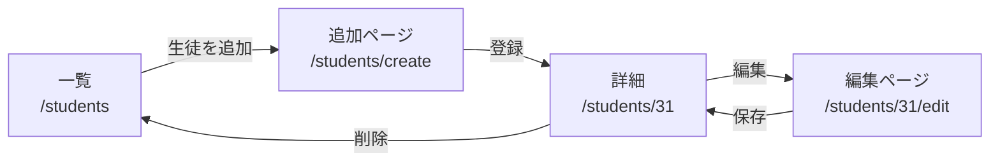
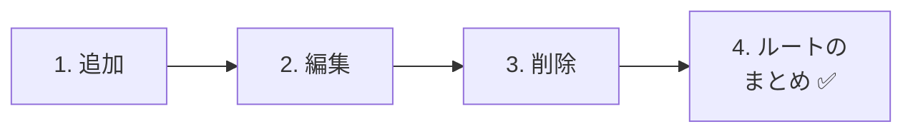
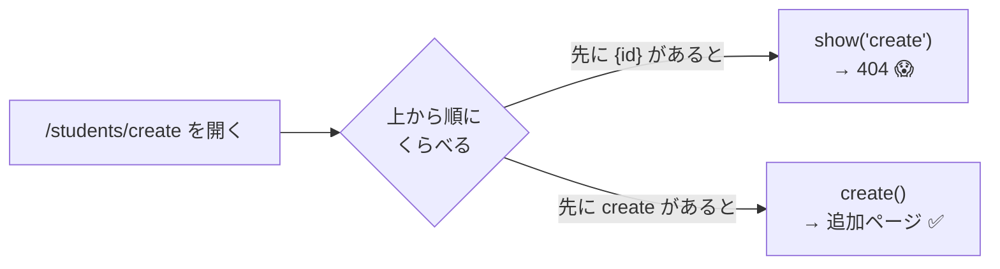
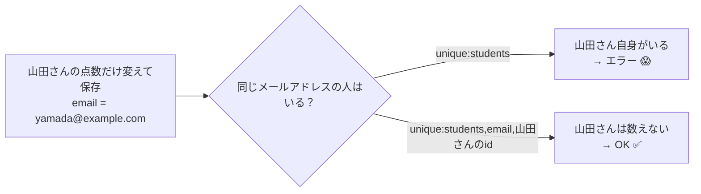

# 生徒管理アプリを作ろう② — 追加・編集・削除

[資料1](./20261119_資料_1.md) で、生徒の一覧と詳細ができました。
次は、生徒を **追加・編集・削除** できるようにします。

## 今日のゴール
- 入力欄が多いフォームを、追加用のページとして作れる
- メールアドレスの重複（`unique`）や、点数の範囲（`integer`・`min`・`max`）をチェックできる
- 編集のときに、**自分のメールアドレスは重複チェックから外す** ことができる

> 資料1の「一覧・詳細」ができている状態から始めます。

---

## 1. Todoとのちがい

作り方はTodoとほとんど同じですが、ちがうところが2つあります。

| | Todoアプリ | 生徒管理アプリ |
|---|---|---|
| 追加フォームの場所 | 一覧ページの上 | **追加用のページ**（`/students/create`）を作る |
| 入力欄 | タイトルだけ | 名前・メールアドレス・点数の **3つ** |

入力欄が多いので、一覧の上に置くと見づらくなります。そこで、**追加用のページ** を別に作ります。



---

## 2. 作ってみよう



### 1. 追加できるようにする

> いまここ：**🟢 1. 追加** → 2. 編集 → 3. 削除 → 4. ルートのまとめ

#### ① 追加ページを見せる（create）

`StudentController.php` に、★ の `create` を書き足します。

```php
    // ★ ここから追加
    public function create()
    {
        return view('students.create');
    }
    // ★ ここまで
```

`create` は、**追加用のフォームを見せるだけ** のメソッドです。データベースは使いません。

#### ② 追加ページのビューを作る

`resources/views/students/create.blade.php` を作ります。

```html
@include('layouts.header', ['title' => '生徒の追加'])

    <h1>生徒の追加</h1>

    <form method="POST" action="/students">
        @csrf

        <p>
            名前：
            <input type="text" name="name" value="{{ old('name') }}" required>
            @error('name') <span style="color: red;">{{ $message }}</span> @enderror
        </p>

        <p>
            メールアドレス：
            <input type="email" name="email" value="{{ old('email') }}" required>
            @error('email') <span style="color: red;">{{ $message }}</span> @enderror
        </p>

        <p>
            点数：
            <input type="number" name="score" value="{{ old('score') }}" min="0" max="100" required>
            @error('score') <span style="color: red;">{{ $message }}</span> @enderror
        </p>

        <button type="submit">登録</button>
    </form>

    <a href="/students">一覧にもどる</a>

@include('layouts.footer')
```

| コード | 意味 |
|--------|------|
| `type="email"` | メールアドレス用の入力欄。ブラウザが、メールアドレスの形かチェックしてくれる |
| `type="number" min="0" max="100"` | 数字用の入力欄。0〜100しか入れられないようにする |
| `@error('name')` 〜 `@enderror` | 入力欄ごとに、エラーメッセージを出す（11/5と同じ） |
| `old('name')` | エラーでもどったとき、入力した値を残す（11/5と同じ） |

一覧ページ（`students/index.blade.php`）の `<h1>` の下に、追加ページへのリンクも足しておきます。

```html
    <h1>生徒一覧</h1>

    <a href="/students/create">生徒を追加</a>  {{-- ★ 追加 --}}
```

#### ③ 保存する（store）

`StudentController.php` に、★ の `store` を書き足します。

```php
    // ★ ここから追加
    public function store(Request $request)
    {
        $request->validate([
            'name' => 'required|max:100',
            'email' => 'required|email|unique:students',
            'score' => 'required|integer|min:0|max:100',
        ], [
            'name.required' => '名前を入力してください。',
            'name.max' => '名前は100文字以内で入力してください。',
            'email.required' => 'メールアドレスを入力してください。',
            'email.email' => 'メールアドレスの形で入力してください。',
            'email.unique' => 'そのメールアドレスは、すでに登録されています。',
            'score.required' => '点数を入力してください。',
            'score.integer' => '点数は整数で入力してください。',
            'score.min' => '点数は0以上で入力してください。',
            'score.max' => '点数は100以下で入力してください。',
        ]);

        $student = new Student();
        $student->name = $request->input('name');
        $student->email = $request->input('email');
        $student->score = $request->input('score');
        $student->save();

        return redirect('/students/' . $student->id);
    }
    // ★ ここまで
```

新しく出てくるバリデーションのルールです。

| ルール | 意味 |
|--------|------|
| `email` | メールアドレスの形か（`@` があるか など） |
| `unique:students` | `students` テーブルに、**同じ値がまだないか** |
| `integer` | 整数か |
| `min:0`・`max:100` | 0以上・100以下か（`integer` といっしょに使うと、**数の大きさ** でチェックする） |

> **`max:100` は、2か所で意味がちがう**
> `name` の `max:100` は「**100文字** まで」、`score` の `max:100` は「**100以下**」です。
> `integer` があると数の大きさ、ないと文字の数でチェックします。

保存したら、追加した生徒の詳細ページにもどります。

#### ④ ルートを書き足す

`routes/web.php` に、★ の2行を書き足します。**書く順番に注意** してください。

```php
Route::get('/students', [StudentController::class, 'index']);
Route::get('/students/create', [StudentController::class, 'create']);  // ★ 追加（{id} より上に！）
Route::post('/students', [StudentController::class, 'store']);         // ★ 追加
Route::get('/students/{id}', [StudentController::class, 'show']);
```

> ⚠️ **`/students/create` は、`/students/{id}` より上に書く**
> ルートは、**上から順番に** くらべられます。
> `/students/{id}` を先に書くと、`/students/create` の `create` が `{id}` だと思われてしまいます。
> すると、`show('create')` が動いて、`id` が `create` の生徒をさがし、`404 Not Found` になります。



✅ **確認**：一覧の「生徒を追加」から、生徒を1人登録してみましょう。次の3つも試します。

| やること | こうなればOK |
|---------|------------|
| ふつうに登録する | 詳細ページが出る |
| 一覧にいる生徒と **同じメールアドレス** で登録する | 「そのメールアドレスは、すでに登録されています。」と出る |
| 開発者ツールで点数の `max="100"` を消して、`150` で登録する | 「点数は100以下で入力してください。」と出る |

---

### 2. 編集できるようにする

> いまここ：1. 追加 → **🟢 2. 編集** → 3. 削除 → 4. ルートのまとめ

#### ① 編集ページを見せる（edit）

`StudentController.php` に、★ の `edit` を書き足します。

```php
    // ★ ここから追加
    public function edit($id)
    {
        $student = Student::findOrFail($id);

        return view('students.edit', ['student' => $student]);
    }
    // ★ ここまで
```

#### ② 編集ページのビューを作る

`resources/views/students/edit.blade.php` を作ります。追加ページとのちがいに ★ をつけています。

```html
@include('layouts.header', ['title' => '生徒の編集'])

    <h1>生徒の編集</h1>

    <form method="POST" action="/students/{{ $student->id }}">  {{-- ★ 送り先 --}}
        @csrf
        @method('PUT')  {{-- ★ PUT --}}

        <p>
            名前：
            <input type="text" name="name" value="{{ old('name', $student->name) }}" required>  {{-- ★ 今の値 --}}
            @error('name') <span style="color: red;">{{ $message }}</span> @enderror
        </p>

        <p>
            メールアドレス：
            <input type="email" name="email" value="{{ old('email', $student->email) }}" required>  {{-- ★ 今の値 --}}
            @error('email') <span style="color: red;">{{ $message }}</span> @enderror
        </p>

        <p>
            点数：
            <input type="number" name="score" value="{{ old('score', $student->score) }}" min="0" max="100" required>  {{-- ★ 今の値 --}}
            @error('score') <span style="color: red;">{{ $message }}</span> @enderror
        </p>

        <button type="submit">保存</button>
    </form>

    <a href="/students/{{ $student->id }}">もどる</a>

@include('layouts.footer')
```

詳細ページ（`students/show.blade.php`）にも、編集ページへのリンクを足しておきます。

```html
    <p>点数：{{ $student->score }}点</p>

    <a href="/students/{{ $student->id }}/edit">編集</a>  {{-- ★ 追加 --}}
```

#### ③ 保存する（update）

`StudentController.php` に、★ の `update` を書き足します。

```php
    // ★ ここから追加
    public function update(Request $request, $id)
    {
        // ① 先に、編集する生徒を取ってくる
        $student = Student::findOrFail($id);

        // ② チェックする（email は、この生徒自身を重複チェックから外す）
        $request->validate([
            'name' => 'required|max:100',
            'email' => 'required|email|unique:students,email,' . $student->id,
            'score' => 'required|integer|min:0|max:100',
        ], [
            'name.required' => '名前を入力してください。',
            'name.max' => '名前は100文字以内で入力してください。',
            'email.required' => 'メールアドレスを入力してください。',
            'email.email' => 'メールアドレスの形で入力してください。',
            'email.unique' => 'そのメールアドレスは、すでに登録されています。',
            'score.required' => '点数を入力してください。',
            'score.integer' => '点数は整数で入力してください。',
            'score.min' => '点数は0以上で入力してください。',
            'score.max' => '点数は100以下で入力してください。',
        ]);

        // ③ 書きかえて保存する
        $student->name = $request->input('name');
        $student->email = $request->input('email');
        $student->score = $request->input('score');
        $student->save();

        return redirect('/students/' . $student->id);
    }
    // ★ ここまで
```

##### `unique:students,email,` のうしろに `$student->id` をつける理由

編集ページで、**点数だけ** を変えて保存したとします。
メールアドレスは変えていないので、`students` テーブルにはすでに **自分のメールアドレス** があります。
`store` と同じ `unique:students` のままだと、「すでに登録されています」と言われてしまいます。



| 書き方 | 意味 |
|--------|------|
| `unique:students` | `students` テーブルに、同じ値がないか |
| `unique:students,email,` . `$student->id` | `students` テーブルの `email` 列に、同じ値がないか。**ただし、この生徒（`$student->id`）は数えない** |

> **なぜ `$id` ではなく `$student->id` を使うの？**
> `$id` は、URLから来た値です。URLは、使う人がいくらでも書きかえられます。
> 一度 `findOrFail` で取ってきた `$student->id` は、**データベースから来た、たしかな値** です。
> Laravelの公式ドキュメントでも、重複チェックから外すIDには「使う人が送ってきた値を使わないこと」と注意しています。
> だから、**先に `findOrFail` で取ってくる** 順番にしています。

#### ④ ルートを書き足す

```php
Route::get('/students/{id}', [StudentController::class, 'show']);
Route::get('/students/{id}/edit', [StudentController::class, 'edit']);  // ★ 追加
Route::put('/students/{id}', [StudentController::class, 'update']);     // ★ 追加
```

✅ **確認**：次の3つを試しましょう。

| やること | こうなればOK |
|---------|------------|
| 点数だけ変えて保存する | エラーにならず、詳細ページの点数が変わる |
| 名前を変えて保存する | 詳細ページの名前が変わる |
| メールアドレスを、**ほかの生徒** と同じにして保存する | 「そのメールアドレスは、すでに登録されています。」と出る |

---

### 3. 削除できるようにする

> いまここ：1. 追加 → 2. 編集 → **🟢 3. 削除** → 4. ルートのまとめ

#### ① destroy を書く

`StudentController.php` に、★ の `destroy` を書き足します。

```php
    // ★ ここから追加
    public function destroy($id)
    {
        $student = Student::findOrFail($id);
        $student->delete();

        return redirect('/students');
    }
    // ★ ここまで
```

#### ② 詳細ページに削除ボタンを足す

`students/show.blade.php` の編集リンクの下に、★ のフォームを書き足します。

```html
    <a href="/students/{{ $student->id }}/edit">編集</a>

    {{-- ★ ここから追加 --}}
    <form method="POST" action="/students/{{ $student->id }}" onsubmit="return confirm('削除しますか？');">
        @csrf
        @method('DELETE')
        <button type="submit">削除</button>
    </form>
    {{-- ★ ここまで --}}
```

#### ③ ルートを書き足す

```php
Route::delete('/students/{id}', [StudentController::class, 'destroy']);  // ★ 追加
```

✅ **確認**：詳細ページで「削除」を押して、一覧からその生徒がいなくなればOKです。

---

### 4. ルートのまとめ ✅

> いまここ：1. 追加 → 2. 編集 → 3. 削除 → **🟢 4. ルートのまとめ**

生徒管理アプリのルートは、全部で **7つ** になりました。`routes/web.php` は、次のようになっています。

```php
Route::get('/students', [StudentController::class, 'index']);
Route::get('/students/create', [StudentController::class, 'create']);
Route::post('/students', [StudentController::class, 'store']);
Route::get('/students/{id}', [StudentController::class, 'show']);
Route::get('/students/{id}/edit', [StudentController::class, 'edit']);
Route::put('/students/{id}', [StudentController::class, 'update']);
Route::delete('/students/{id}', [StudentController::class, 'destroy']);
```

| ルート | 担当 | すること | 画面 |
|--------|------|---------|------|
| `GET /students` | `index` | 一覧を見せる | あり |
| `GET /students/create` | `create` | 追加ページを見せる | あり |
| `POST /students` | `store` | 追加して保存する | なし（詳細へ） |
| `GET /students/{id}` | `show` | 詳細を見せる | あり |
| `GET /students/{id}/edit` | `edit` | 編集ページを見せる | あり |
| `PUT /students/{id}` | `update` | 書きかえて保存する | なし（詳細へ） |
| `DELETE /students/{id}` | `destroy` | 削除する | なし（一覧へ） |

> **この7つは、Laravelの決まった形**
> 一覧・追加・詳細・編集・削除をそろえると、ほとんどのアプリでこの7つのルートになります。
> そのため Laravel には、この7つを **1行で書ける** `Route::resource('students', StudentController::class);` という書き方もあります。
> 今日は、1つずつ意味がわかるように7行で書きました。
>
> **2年生では**、このうち **画面を見せるだけの `create`・`edit` を使わない5つ** を、APIとして作りかえます。

---

## 3. うまくいかないとき

> **🔥 動かないなら、ログを出せ！** → [【重要】ログの出し方](../20261022/【重要】ログの出し方.md)

| 症状 | 原因の場所 | 対処 |
|------|----------|------|
| 「生徒を追加」を押すと `404 Not Found` | ルート | `/students/create` のルートが、`/students/{id}` より **上** にあるか確認 |
| 点数だけ変えて保存すると「すでに登録されています」 | コントローラー | `update` の `unique:students,email,` のうしろに `. $student->id` があるか確認 |
| ほかの生徒と同じメールアドレスで登録できてしまう | コントローラー | `store` に `unique:students` があるか確認 |
| `SQLSTATE[23000]: ... Duplicate entry` | コントローラー | バリデーションの `unique` を書き忘れていないか確認（データベース側の `unique` で止まっている） |
| 点数に `150` を入れても登録できてしまう | コントローラー | `score` に `integer` があるか確認（ないと、数の大きさではなく **文字の数**（3文字）でチェックしてしまう） |
| エラーでもどると、入力欄が空になる | ビュー | `value="{{ old('...') }}"` を書いたか確認 |

---

## 4. まとめ

| 今日書いたもの | ひとことで |
|--------------|-----------|
| `create` と `create.blade.php` | 追加用のフォームを見せるだけのページ |
| `email`・`unique:students` | メールアドレスの形か・重複していないか |
| `integer`・`min:0`・`max:100` | 0〜100の整数か |
| `unique:students,email,` . `$student->id` | 編集のとき、自分自身は重複チェックから外す |
| `/students/create` を `{id}` より上に | ルートは上から順にくらべられる |
| 7つのルート | 一覧・追加・詳細・編集・削除の、Laravelの決まった形 |

**Todoで学んだことだけで、新しいアプリが作れました。** 次回は、このアプリに **ログイン** をつけて、先生だけが使えるようにします。
