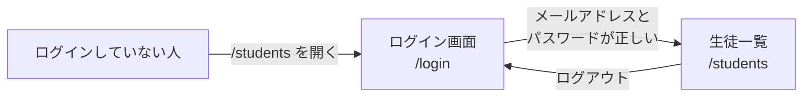
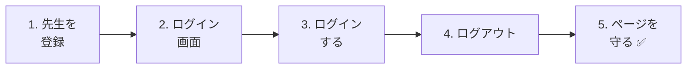
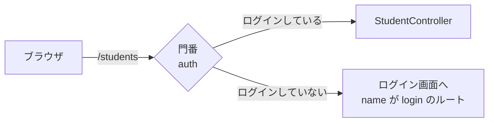
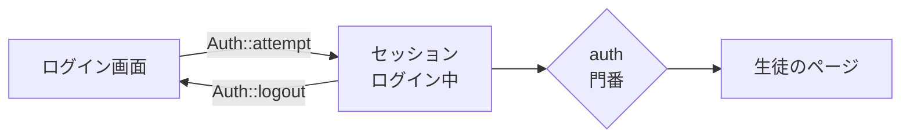

# 生徒管理アプリを作ろう③ — ログイン

生徒の名前やメールアドレスは、**だれでも見られてはいけない情報** です。
今日は、生徒管理アプリに **ログイン** をつけて、先生だけが使えるようにします。

## 今日のゴール
- ログインのしくみ（パスワードのハッシュ化・セッション）がわかる
- ログイン画面とログアウトを作れる
- ログインしていない人は、生徒のページを見られないようにできる（`auth`）

> 11/19の「生徒管理アプリ（追加・編集・削除）」ができている状態から始めます。

---

## 1. ログインのしくみ

### 今日つくるもの



- ログインしていない人が `/students` を開くと、**ログイン画面に飛ばされる**
- 正しいメールアドレスとパスワードを入れると、生徒のページが使える
- Todoアプリのページは、今までどおりだれでも使える

### 先生は `users` テーブルに入れる

ログインする先生は、Laravelに **最初からある `users` テーブル** に入れます。
（練習環境を最初に起動したときから、じつはずっとありました）

| 列 | 意味 |
|----|------|
| `name` | 先生の名前 |
| `email` | ログインに使うメールアドレス |
| `password` | パスワード（**ハッシュ化** して入れる） |

### パスワードの「ハッシュ化」

パスワードは、**そのままデータベースに入れてはいけません**。
もしデータベースの中身がもれたら、全員のパスワードがわかってしまうからです。

そこで、パスワードを **ハッシュ化**（元にもどせない、ぐちゃぐちゃな文字に変換）してから入れます。

```
入力したパスワード         データベースに入るもの
password          ─→     $2y$12$Kx8f3...（60文字くらいの、ぐちゃぐちゃな文字）
```

| | ふつうの暗号 | ハッシュ化 |
|---|---|---|
| 元にもどせる？ | もどせる（カギがあれば） | **もどせない** |
| ログインのときは？ | — | 入力されたパスワードも同じようにハッシュ化して、**くらべる** |

ハッシュ化は、Laravelが自動でやってくれます。

### セッション：「ログイン中」をおぼえておくしくみ

一度ログインしたら、ページを移動するたびにパスワードを入れ直すのは大変です。
Laravelは **セッション** というしくみで、「この人はログイン中」をおぼえておいてくれます。

> たとえると、**遊園地の入場リストバンド** です。
> 入口（ログイン画面）でチケット（パスワード）を見せると、リストバンドをもらえます。
> そのあとは、リストバンドを見せるだけで、どのアトラクション（ページ）にも入れます。

---

## 2. 作ってみよう



さわるファイルは次のとおりです（`src` の中）。

```
src/
├─ database/seeders/
│   ├─ UserSeeder.php ·················· 1. 先生を登録する（新しく作る）
│   └─ DatabaseSeeder.php ·············· 1. UserSeeder を呼ぶ
├─ app/Http/Controllers/
│   └─ LoginController.php ············· 2・3・4. ログイン・ログアウト（新しく作る）
├─ resources/views/
│   ├─ login.blade.php ················· 2. ログイン画面（新しく作る）
│   └─ layouts/header.blade.php ········ 4. 先生の名前とログアウトボタン
└─ routes/web.php ······················ 2・3・4・5. ルート
```

---

### 1. 先生を登録する（Seeder）

> いまここ：**🟢 1. 先生を登録** → 2. ログイン画面 → 3. ログイン → 4. ログアウト → 5. ページを守る

```powershell
docker compose exec laravel php artisan make:seeder UserSeeder
```

`database/seeders/UserSeeder.php` を、次のようにします。

```php
<?php

namespace Database\Seeders;

use App\Models\User;
use Illuminate\Database\Seeder;

class UserSeeder extends Seeder
{
    public function run(): void
    {
        $user = new User();
        $user->name = '山田先生';
        $user->email = 'teacher@example.com';
        $user->password = 'password';  // 保存するときに、自動でハッシュ化される
        $user->save();
    }
}
```

`database/seeders/DatabaseSeeder.php` の **一番上** に、★ の1行を書き足します。

```php
    public function run(): void
    {
        $this->call(UserSeeder::class);  // ★ 追加
        $this->call(TodoSeeder::class);
        $this->call(StudentSeeder::class);
    }
```

```powershell
docker compose exec laravel php artisan migrate:fresh --seed
```

✅ **確認**：phpMyAdminで `users` テーブルを開いてみましょう。
山田先生の `password` が、`password` ではなく **`$2y$12$...` のようなぐちゃぐちゃな文字** になっていればOKです。

> **なぜ自動でハッシュ化されるの？**
> `app/Models/User.php` を開くと、`'password' => 'hashed'` という1行があります。
> これは「`password` に値を入れたら、自動でハッシュ化してね」という設定です。Laravelが最初から書いてくれています。

> ⚠️ **phpMyAdminで、先生を直接追加しない**
> phpMyAdminで `password` に `password` と入れると、ハッシュ化されずにそのまま入ってしまい、ログインできません。
> 先生は、Seeder（または、このあと作るような画面）から登録します。

---

### 2. ログイン画面を作る

> いまここ：1. 先生を登録 → **🟢 2. ログイン画面** → 3. ログイン → 4. ログアウト → 5. ページを守る

#### ① コントローラーを作る

```powershell
docker compose exec laravel php artisan make:controller LoginController
```

`app/Http/Controllers/LoginController.php` を、次のようにします。

```php
<?php

namespace App\Http\Controllers;

use Illuminate\Http\Request;
use Illuminate\Support\Facades\Auth;

class LoginController extends Controller
{
    // ログイン画面を見せる
    public function showForm()
    {
        return view('login');
    }
}
```

#### ② ビューを作る

`resources/views/login.blade.php` を作ります。

```html
@include('layouts.header', ['title' => 'ログイン'])

    <h1>ログイン</h1>

    <form method="POST" action="/login">
        @csrf

        <p>
            メールアドレス：
            <input type="email" name="email" value="{{ old('email') }}" required>
        </p>

        <p>
            パスワード：
            <input type="password" name="password" required>
        </p>

        @error('email')
            <p style="color: red;">{{ $message }}</p>
        @enderror

        <button type="submit">ログイン</button>
    </form>

@include('layouts.footer')
```

| コード | 意味 |
|--------|------|
| `type="password"` | 入力した文字が `●●●` で表示される入力欄 |
| パスワードに `old()` がない | 安全のため、パスワードはエラーでもどっても残さない |

#### ③ ルートを書く

`routes/web.php` に、★ の部分を書き足します。

```php
use App\Http\Controllers\LoginController;  // ★ 追加（上の方に書く）

Route::get('/login', [LoginController::class, 'showForm'])->name('login');  // ★ 追加
```

| コード | 意味 |
|--------|------|
| `->name('login')` | このルートに `login` という **名前** をつける |

> **なぜ名前をつけるの？**
> このあと「5. ページを守る」で、ログインしていない人を **ログイン画面に飛ばす** しくみを使います。
> Laravelは、そのとき `login` という名前のルートをさがして、そこに飛ばします。名前がないと、飛ばす先がわかりません。

✅ **確認**：http://localhost:8000/login を開いて、ログイン画面が出ればOKです。

---

### 3. ログインできるようにする

> いまここ：1. 先生を登録 → 2. ログイン画面 → **🟢 3. ログイン** → 4. ログアウト → 5. ページを守る

#### ① login メソッドを書く

`LoginController.php` に、★ の `login` を書き足します。

```php
    // ★ ここから追加
    public function login(Request $request)
    {
        // ① 入力をチェックする
        $credentials = $request->validate([
            'email' => 'required|email',
            'password' => 'required',
        ]);

        // ② メールアドレスとパスワードが正しいか、たしかめる
        if (Auth::attempt($credentials)) {
            // ③ 正しければ、セッションを作り直して、生徒一覧へ
            $request->session()->regenerate();

            return redirect()->intended('/students');
        }

        // ④ まちがっていたら、ログイン画面にもどす
        return back()->withErrors([
            'email' => 'メールアドレスかパスワードがちがいます。',
        ])->onlyInput('email');
    }
    // ★ ここまで
```

| コード | 意味 |
|--------|------|
| `$credentials = $request->validate([...])` | チェックしたうえで、`email` と `password` を取り出す |
| `Auth::attempt($credentials)` | `users` テーブルから、そのメールアドレスの先生をさがし、パスワードをハッシュ化してくらべる。合っていれば **ログインさせて** `true` |
| `$request->session()->regenerate()` | セッション（リストバンド）を新しく作り直す。ほかの人のリストバンドを使われないようにするため |
| `redirect()->intended('/students')` | ログイン前に開こうとしていたページへもどる。なければ `/students` へ |
| `back()->withErrors([...])` | 前のページ（ログイン画面）にもどして、エラーメッセージを出す |
| `->onlyInput('email')` | もどったとき、メールアドレスだけ残す（パスワードは残さない） |

> **「メールアドレスかパスワードがちがいます」と、まとめて言う理由**
> 「このメールアドレスは登録されていません」と教えてしまうと、悪い人に「このメールアドレスは登録されている」とわかってしまいます。
> どちらがまちがっているかは、わざと教えません。

#### ② ルートを書き足す

```php
Route::get('/login', [LoginController::class, 'showForm'])->name('login');
Route::post('/login', [LoginController::class, 'login']);  // ★ 追加
```

✅ **確認**：ログイン画面で、次の2つを試しましょう。

| 入力 | こうなればOK |
|------|------------|
| `teacher@example.com` ／ `password` | 生徒一覧に移動する |
| `teacher@example.com` ／ `abc` | 「メールアドレスかパスワードがちがいます。」と出る |

---

### 4. ログアウトと、ログイン中の表示

> いまここ：1. 先生を登録 → 2. ログイン画面 → 3. ログイン → **🟢 4. ログアウト** → 5. ページを守る

#### ① logout メソッドを書く

`LoginController.php` に、★ の `logout` を書き足します。

```php
    // ★ ここから追加
    public function logout(Request $request)
    {
        Auth::logout();

        $request->session()->invalidate();
        $request->session()->regenerateToken();

        return redirect('/login');
    }
    // ★ ここまで
```

| コード | 意味 |
|--------|------|
| `Auth::logout()` | ログアウトする |
| `$request->session()->invalidate()` | セッション（リストバンド）を使えなくする |
| `$request->session()->regenerateToken()` | `@csrf` の合言葉も作り直す |

#### ② ルートを書き足す

```php
Route::post('/logout', [LoginController::class, 'logout']);  // ★ 追加
```

> **ログアウトも POST**
> ログアウトは「ログイン中」という **状態を変える** 処理なので、リンク（GET）ではなく、フォームのボタン（POST）で送ります。
> （10/29の「データを変えるときは、フォームのボタンで送る」と同じ考え方です）

#### ③ ヘッダーに、先生の名前とログアウトボタンを出す

`resources/views/layouts/header.blade.php` に、★ の部分を書き足します。

```html
    <header>
        <a href="/todos">TODOアプリ</a>
        <a href="/students">生徒管理</a>

        {{-- ★ ここから追加 --}}
        @auth
            {{ Auth::user()->name }} さん
            <form method="POST" action="/logout" style="display: inline;">
                @csrf
                <button type="submit">ログアウト</button>
            </form>
        @endauth

        @guest
            <a href="/login">ログイン</a>
        @endguest
        {{-- ★ ここまで --}}
    </header>
```

| コード | 意味 |
|--------|------|
| `@auth` 〜 `@endauth` | **ログインしているとき** だけ表示する |
| `@guest` 〜 `@endguest` | **ログインしていないとき** だけ表示する |
| `Auth::user()->name` | ログインしている先生の名前 |

✅ **確認**：ログインすると、ヘッダーに「山田先生 さん」と「ログアウト」ボタンが出ます。
「ログアウト」を押すと、ログイン画面にもどり、ヘッダーが「ログイン」のリンクに変わればOKです。
（ヘッダーは部品なので、Todoのページにも同じように出ます）

---

### 5. ログインしていない人から、ページを守る

> いまここ：1. 先生を登録 → 2. ログイン画面 → 3. ログイン → 4. ログアウト → **🟢 5. ページを守る**

ここまでだと、ログインしていなくても `/students` を開けてしまいます。
`routes/web.php` の生徒のルートを、★ のように **`auth` のグループ** で囲みます。

```php
// ★ ここから：ログインしている人だけが使えるルート
Route::middleware('auth')->group(function () {
    Route::get('/students', [StudentController::class, 'index']);
    Route::get('/students/create', [StudentController::class, 'create']);
    Route::post('/students', [StudentController::class, 'store']);
    Route::get('/students/{id}', [StudentController::class, 'show']);
    Route::get('/students/{id}/edit', [StudentController::class, 'edit']);
    Route::put('/students/{id}', [StudentController::class, 'update']);
    Route::delete('/students/{id}', [StudentController::class, 'destroy']);
});
// ★ ここまで
```

| コード | 意味 |
|--------|------|
| `Route::middleware('auth')` | 「ログインしているか」を、ルートの **前に** チェックする |
| `->group(function () { ... })` | `{ }` の中のルート **全部** に、そのチェックをつける |

**ミドルウェア** は、コントローラーの **前に立つ門番** のようなものです。



✅ **確認**：次の順番で試しましょう。

1. ログアウトしてから、http://localhost:8000/students を開く → **ログイン画面に飛ばされる**
2. そのままログインする → **生徒一覧にもどる**（`intended` のおかげ）
3. ログアウトして、http://localhost:8000/todos を開く → **Todoはログインなしで使える**

---

## 3. ルートのまとめ

`routes/web.php` の、ログインと生徒のルートは次のようになりました。

```php
// ログイン・ログアウト
Route::get('/login', [LoginController::class, 'showForm'])->name('login');
Route::post('/login', [LoginController::class, 'login']);
Route::post('/logout', [LoginController::class, 'logout']);

// ログインしている人だけ
Route::middleware('auth')->group(function () {
    Route::get('/students', [StudentController::class, 'index']);
    // …（生徒の7つのルート）
});
```

---

## 4. うまくいかないとき

> **🔥 動かないなら、ログを出せ！** → [【重要】ログの出し方](../20261022/【重要】ログの出し方.md)

| 症状 | 原因の場所 | 対処 |
|------|----------|------|
| `Route [login] not defined.` | ルート | `/login` のルートに `->name('login')` をつけたか確認 |
| 正しいはずなのにログインできない | データ | phpMyAdminで、先生の `password` が `$2y$...` になっているか確認。そのままの文字なら、`migrate:fresh --seed` でSeederから入れ直す |
| `Class "App\Http\Controllers\Auth" not found` | コントローラー | `LoginController.php` の上に `use Illuminate\Support\Facades\Auth;` があるか確認 |
| ログアウトを押すと `419 Page Expired` | ビュー | ログアウトのフォームに `@csrf` があるか確認（練習環境では、`@csrf` がなくても出ないことがあります） |
| ログアウトのリンクを押すと `The GET method is not supported` | ビュー | ログアウトは `<a>` ではなく、`<form method="POST">` のボタンにする |
| ログインしていないのに、生徒のページが見られる | ルート | 生徒のルートが `Route::middleware('auth')->group(...)` の `{ }` の **中** にあるか確認 |

---

## 5. まとめ



| 今日書いたもの | ひとことで |
|--------------|-----------|
| `'password' => 'hashed'`（User モデル） | パスワードを自動でハッシュ化する（最初から書いてある） |
| `Auth::attempt($credentials)` | メールアドレスとパスワードが正しければ、ログインさせる |
| `$request->session()->regenerate()` | ログインしたら、セッションを作り直す |
| `Auth::logout()` | ログアウトする |
| `@auth`・`@guest` | ログインしているとき・していないときだけ表示する |
| `Auth::user()` | ログインしている先生 |
| `Route::middleware('auth')->group(...)` | ログインしている人だけが使えるルートにする |
| `->name('login')` | ログインしていない人を飛ばす先 |

**パスワードはハッシュ化。ログイン中はセッション。ページを守るのはミドルウェア。**

> **2年生では**、このセッションのかわりに **トークン**（Sanctum）でログインを確かめるしくみに作りかえます。
> 画面がないAPIでは、「リストバンド」のかわりに「合言葉の文字列」を毎回いっしょに送るからです。

次回は、生徒を **どの先生が登録したか** を記録できるようにします（リレーション）。
