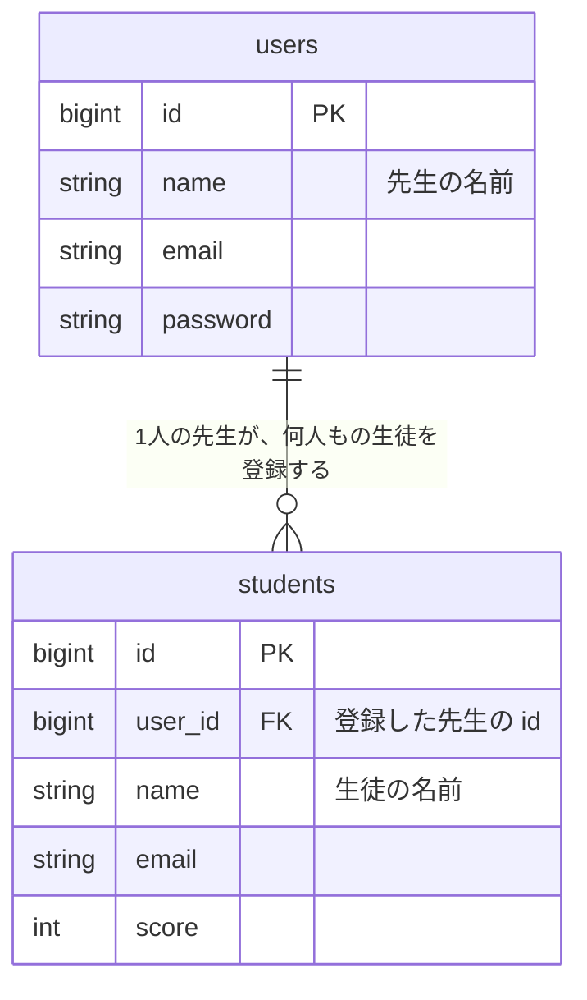
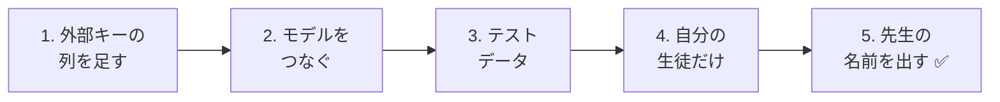
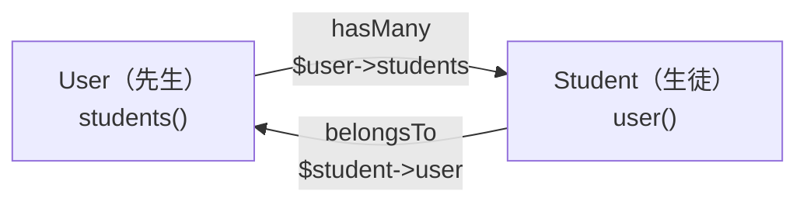
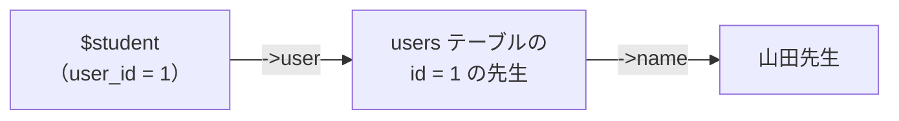
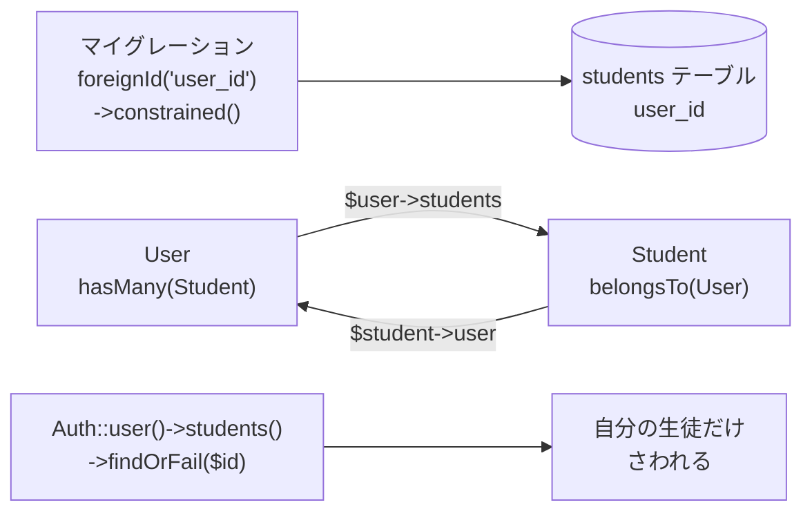

# 生徒管理アプリを作ろう④ — リレーション（先生と生徒をつなぐ）

前回、先生がログインできるようになりました。
でも今は、**どの先生がログインしても、全員の生徒が見えて** しまいます。
今日は、生徒を **どの先生が登録したか** を記録して、**自分の生徒だけ** を管理できるようにします。

## 今日のゴール
- 1対多の関係を、ER図とテーブル（外部キー）で表せる
- `hasMany`・`belongsTo` で、モデル同士をつなげられる
- ログインしている先生の生徒だけを、一覧・詳細・編集・削除できる

> 11/26の「ログイン」ができている状態から始めます。

---

## 1. 先生と生徒の関係

### 1人の先生が、何人もの生徒を担当する



| 先生（users） | 生徒（students） |
|--------------|-----------------|
| 山田先生（id: 1） | 山田先生の生徒が 15人 |
| 佐藤先生（id: 2） | 佐藤先生の生徒が 15人 |

このような関係を **1対多**（いちたいた）といいます。

- 先生から見ると、生徒は **たくさん**（多）
- 生徒から見ると、先生は **1人**（1）

### 外部キー：生徒に「先生の番号」を持たせる

生徒のテーブルに、**登録した先生の `id`** を入れる列（`user_id`）を足します。

| id | **user_id** | name | email | score |
|----|------------|------|-------|-------|
| 1 | **1** | 田中 一郎 | … | 85 |
| 2 | **1** | 鈴木 花子 | … | 92 |
| 3 | **2** | 高橋 次郎 | … | 70 |

`user_id` が `1` の生徒は山田先生の生徒、`2` の生徒は佐藤先生の生徒です。

このように、**ほかのテーブルの `id` を入れる列** を **外部キー** といいます。

> **なぜ先生の「名前」ではなく「id」を入れるの？**
> 名前を入れると、先生が名前を変えたときに、生徒の行を全部直す必要があります。
> `id` なら、先生の名前が変わっても、生徒の行は直さなくてすみます。

---

## 2. 作ってみよう



さわるファイルは次のとおりです（`src` の中）。

```
src/
├─ database/
│   ├─ migrations/xxxx_add_user_id_to_students_table.php ··· 1. 新しく作る
│   ├─ factories/StudentFactory.php ························· 3. user_id を足す
│   └─ seeders/
│       ├─ UserSeeder.php ··································· 3. 先生を2人にする
│       └─ StudentSeeder.php ································ 3. 先生ごとに生徒を作る
├─ app/Models/
│   ├─ User.php ············································· 2. students() を足す
│   └─ Student.php ·········································· 2. user() を足す
├─ app/Http/Controllers/StudentController.php ··············· 4. 自分の生徒だけにする
└─ resources/views/students/show.blade.php ·················· 5. 先生の名前を出す
```

---

### 1. 外部キーの列を足す（マイグレーション）

> いまここ：**🟢 1. 外部キー** → 2. モデル → 3. テストデータ → 4. 自分の生徒だけ → 5. 先生の名前

11/12に学んだ「**列を足すマイグレーション**」を作ります。

```powershell
docker compose exec laravel php artisan make:migration add_user_id_to_students_table
```

`up()` と `down()` の中を、次のようにします。

```php
    public function up(): void
    {
        Schema::table('students', function (Blueprint $table) {
            $table->foreignId('user_id')
                ->after('id')
                ->constrained()
                ->cascadeOnDelete();
        });
    }

    public function down(): void
    {
        Schema::table('students', function (Blueprint $table) {
            $table->dropForeign(['user_id']);
            $table->dropColumn('user_id');
        });
    }
```

| コード | 意味 |
|--------|------|
| `foreignId('user_id')` | 外部キー用の列 `user_id` を足す（`id` と同じ、大きな整数の列） |
| `->after('id')` | `id` の列のうしろに足す（見やすくするため） |
| `->constrained()` | `user_id` には、**`users` テーブルにある `id` しか入れられない** ようにする（外部キー制約） |
| `->cascadeOnDelete()` | 先生が削除されたら、その先生の生徒もいっしょに削除する |
| `dropForeign` → `dropColumn` | 元にもどすときは、先に制約を外してから列を消す |

> **`constrained()` が「`users` テーブル」とわかるのは？**
> 列の名前が `user_id` だからです。Laravelは「`user_id` なら `users` テーブルの `id` だな」と考えてくれます。

**まだ `migrate` はしません。** 理由は「3. テストデータ」で説明します。

---

### 2. モデルをつなぐ（hasMany・belongsTo）

> いまここ：1. 外部キー → **🟢 2. モデル** → 3. テストデータ → 4. 自分の生徒だけ → 5. 先生の名前

テーブルをつないだだけでは、PHPのコードから「この先生の生徒」を取り出せません。
**モデルにも、関係を書きます。**

#### ① 先生（User）に「生徒がたくさん」を書く

`app/Models/User.php` に、★ の部分を書き足します。

```php
use Illuminate\Database\Eloquent\Relations\HasMany;  // ★ 追加（上の方の use の列に）

class User extends Authenticatable
{
    // （最初からあるコードは、そのまま）

    // ★ ここから追加：この先生が登録した生徒たち
    public function students(): HasMany
    {
        return $this->hasMany(Student::class);
    }
    // ★ ここまで
}
```

#### ② 生徒（Student）に「先生は1人」を書く

`app/Models/Student.php` に、★ の部分を書き足します。

```php
<?php

namespace App\Models;

use Illuminate\Database\Eloquent\Factories\HasFactory;
use Illuminate\Database\Eloquent\Model;
use Illuminate\Database\Eloquent\Relations\BelongsTo;  // ★ 追加

class Student extends Model
{
    /** @use HasFactory<\Database\Factories\StudentFactory> */
    use HasFactory;

    // ★ ここから追加：この生徒を登録した先生
    public function user(): BelongsTo
    {
        return $this->belongsTo(User::class);
    }
    // ★ ここまで
}
```

| モデル | 書いたもの | 意味 | 使い方 |
|--------|----------|------|-------|
| `User` | `hasMany(Student::class)` | 先生は、生徒を **たくさん持っている**（has many） | `$user->students` で、その先生の生徒 **全員** |
| `Student` | `belongsTo(User::class)` | 生徒は、1人の先生に **属している**（belongs to） | `$student->user` で、その生徒の先生 **1人** |



> **名前の決まり**
> 「たくさん」のほうは **複数形**（`students`）、「1人」のほうは **単数形**（`user`）にします。
> 英語で読むと、`$user->students`（先生の生徒たち）・`$student->user`（生徒の先生）と自然に読めます。

---

### 3. テストデータを作り直す

> いまここ：1. 外部キー → 2. モデル → **🟢 3. テストデータ** → 4. 自分の生徒だけ → 5. 先生の名前

#### なぜ `migrate` ではなく `migrate:fresh` なの？

今の `students` テーブルには、30人の生徒が入っています。
ここに `user_id` の列を足すと、**今いる30人の `user_id` には何を入れればいいでしょう？**
`constrained()` があるので、`users` テーブルにない番号は入れられません。

そこで今回は、`migrate:fresh --seed` で **テーブルを作り直して、先生つきの生徒を入れ直し** ます。
そのために、先に Seeder と Factory を直しておきます。

#### ① 先生を2人にする（UserSeeder）

`database/seeders/UserSeeder.php` の `run()` に、★ の2人目を書き足します。

```php
    public function run(): void
    {
        $user = new User();
        $user->name = '山田先生';
        $user->email = 'teacher@example.com';
        $user->password = 'password';
        $user->save();

        // ★ ここから追加
        $user = new User();
        $user->name = '佐藤先生';
        $user->email = 'teacher2@example.com';
        $user->password = 'password';
        $user->save();
        // ★ ここまで
    }
```

#### ② 先生ごとに、生徒を15人ずつ作る（StudentSeeder）

`database/seeders/StudentSeeder.php` の `run()` を、次のように書きかえます。

```php
<?php

namespace Database\Seeders;

use App\Models\Student;
use App\Models\User;  // ★ 追加
use Illuminate\Database\Seeder;

class StudentSeeder extends Seeder
{
    public function run(): void
    {
        // 先生1人ずつに、生徒を15人ずつ作る
        foreach (User::all() as $user) {
            Student::factory()->count(15)->for($user)->create();
        }
    }
}
```

| コード | 意味 |
|--------|------|
| `User::all()` | 先生を全員取ってくる |
| `->for($user)` | 「この先生の生徒として作ってね」。`user_id` に `$user->id` が入る |

#### ③ Factory にも user_id を足す（StudentFactory）

`database/factories/StudentFactory.php` の `definition()` に、★ の1行を書き足します。

```php
use App\Models\User;  // ★ 追加（上の方に書く）

    public function definition(): array
    {
        return [
            'user_id' => User::factory(),  // ★ 追加
            'name' => fake('ja_JP')->name(),
            'email' => fake()->unique()->safeEmail(),
            'score' => fake()->numberBetween(0, 100),
        ];
    }
```

`User::factory()` は「先生が指定されていなければ、先生も1人作ってね」という意味です。
今日のSeederでは `->for($user)` で先生を指定しているので、新しい先生は作られません。

#### ④ 作り直す

```powershell
docker compose exec laravel php artisan migrate:fresh --seed
```

✅ **確認**：phpMyAdminで、次の2つを確かめましょう。

- `users` テーブルに、山田先生と佐藤先生の2人がいる
- `students` テーブルに `user_id` の列があり、`1` の生徒が15人、`2` の生徒が15人いる

---

### 4. 自分の生徒だけを見られるようにする

> いまここ：1. 外部キー → 2. モデル → 3. テストデータ → **🟢 4. 自分の生徒だけ** → 5. 先生の名前

`app/Http/Controllers/StudentController.php` を書きかえます。
上の方に `use Illuminate\Support\Facades\Auth;` を書き足してから、★ のところを変えます。

```php
use Illuminate\Support\Facades\Auth;  // ★ 追加
```

#### ① 一覧（index）：自分の生徒だけ

```php
    public function index()
    {
        $students = Auth::user()->students;  // ★ Student::all() から変える

        return view('students.index', ['students' => $students]);
    }
```

`Auth::user()` は、ログインしている先生です。
`->students` で、**その先生の生徒だけ** が取れます。2で書いた `hasMany` のおかげです。

#### ② 追加（store）：登録した先生を記録する

```php
        $student = new Student();
        $student->user_id = Auth::id();  // ★ 追加：ログインしている先生の id
        $student->name = $request->input('name');
        $student->email = $request->input('email');
        $student->score = $request->input('score');
        $student->save();
```

| コード | 意味 |
|--------|------|
| `Auth::id()` | ログインしている先生の `id` |

#### ③ 詳細・編集・削除：自分の生徒しかさわれないようにする

`show`・`edit`・`update`・`destroy` の4つにある `Student::findOrFail($id)` を、**全部** 次のように変えます。

```php
        // 書きかえ前
        $student = Student::findOrFail($id);

        // 書きかえ後
        $student = Auth::user()->students()->findOrFail($id);
```

`Auth::user()->students()` で「ログインしている先生の生徒の中から」、`findOrFail($id)` で「`id` が一致する生徒をさがす」という意味になります。
**ほかの先生の生徒の `id` を開こうとしても、見つからないので `404 Not Found`** になります。

> **`students` と `students()` のちがい**
>
> | 書き方 | 意味 | 使う場面 |
> |-------|------|---------|
> | `Auth::user()->students` | その先生の生徒を **全員取ってくる** | 一覧（全員ほしい） |
> | `Auth::user()->students()` | 「その先生の生徒の中から」と **条件だけ** つける。このあとに `->findOrFail($id)` などを続けて書ける | 詳細・編集・削除（1人さがしたい） |

✅ **確認**：次の順番で試しましょう。

| やること | こうなればOK |
|---------|------------|
| 山田先生（`teacher@example.com`）でログインして一覧を開く | 生徒が15人だけ表示される |
| 生徒を1人追加する | phpMyAdminで、追加した生徒の `user_id` が `1` になっている |
| 一覧で、生徒の詳細ページを開き、URLの番号をメモする（例：`/students/3`） | — |
| ログアウトして、佐藤先生（`teacher2@example.com`）でログインする | 一覧に、山田先生とはちがう15人が表示される |
| メモした山田先生の生徒のURLを、直接開く | **`404 Not Found`** になる（ほかの先生の生徒は見られない） |

---

### 5. 詳細ページに、登録した先生の名前を出す

> いまここ：1. 外部キー → 2. モデル → 3. テストデータ → 4. 自分の生徒だけ → **🟢 5. 先生の名前**

`resources/views/students/show.blade.php` に、★ の1行を書き足します。

```html
    <p>番号：{{ $student->id }}</p>
    <p>メールアドレス：{{ $student->email }}</p>
    <p>点数：{{ $student->score }}点</p>
    <p>登録した先生：{{ $student->user->name }}</p>  {{-- ★ 追加 --}}
```

`$student->user` で、その生徒の先生（`belongsTo`）、`->name` でその先生の名前が取れます。
SQLの `JOIN` を書かなくても、Laravelが `users` テーブルから取ってきてくれます。

✅ **確認**：詳細ページに「登録した先生：山田先生」のように表示されればOKです。



---

## 3. うまくいかないとき

> **🔥 動かないなら、ログを出せ！** → [【重要】ログの出し方](../20261022/【重要】ログの出し方.md)

| 症状 | 原因の場所 | 対処 |
|------|----------|------|
| `migrate` で `Cannot add or update a child row: a foreign key constraint fails` | マイグレーション | 今いる生徒に入れる先生がいない。`migrate:fresh --seed` で作り直す |
| `Call to undefined method App\Models\User::students()` | モデル | `User.php` に `students()` メソッドを書いたか確認 |
| `Return value must be of type App\Models\HasMany` | モデル | `User.php` の上に `use Illuminate\Database\Eloquent\Relations\HasMany;` があるか確認（`Student.php` の `BelongsTo` も同じ） |
| 一覧に全員（30人）が出る | コントローラー | `index` が `Auth::user()->students` になっているか確認 |
| ほかの先生の生徒の詳細ページが見られる | コントローラー | `show`・`edit`・`update`・`destroy` の **4つとも** `Auth::user()->students()->findOrFail($id)` に変えたか確認 |
| 生徒を追加すると `Field 'user_id' doesn't have a default value` | コントローラー | `store` に `$student->user_id = Auth::id();` があるか確認 |
| 先生の名前のところで `Attempt to read property "name" on null` | モデル・データ | `Student.php` の `user()` を書いたか、その生徒の `user_id` の先生がいるか確認 |

---

## 4. まとめ



| 今日書いたもの | ひとことで |
|--------------|-----------|
| `foreignId('user_id')->constrained()` | 外部キーの列を足し、`users` にある `id` しか入れられないようにする |
| `hasMany(Student::class)` | 先生は、生徒をたくさん持っている（`$user->students`） |
| `belongsTo(User::class)` | 生徒は、1人の先生に属している（`$student->user`） |
| `->for($user)`（Factory） | この先生の生徒として、テストデータを作る |
| `Auth::id()` | ログインしている先生の `id` |
| `Auth::user()->students` | ログインしている先生の生徒全員 |
| `Auth::user()->students()->findOrFail($id)` | 自分の生徒の中から1人さがす。ほかの先生の生徒なら404 |

**テーブルは外部キーでつなぐ。モデルは hasMany・belongsTo でつなぐ。**

これで、生徒管理アプリの完成です 🎉
一覧・追加・詳細・編集・削除（CRUD）、ログイン、リレーションと、Webアプリの大事なしくみがそろいました。

> **2年生では**、このアプリを **API** に作りかえます。
> テーブル（`users`・`students`）やリレーション（`hasMany`・`belongsTo`）は、**そのまま** 使います。
> 変わるのは、「HTMLの画面を返す」ところが「JSONのデータを返す」になることと、ログインがセッションからトークンになることです。
