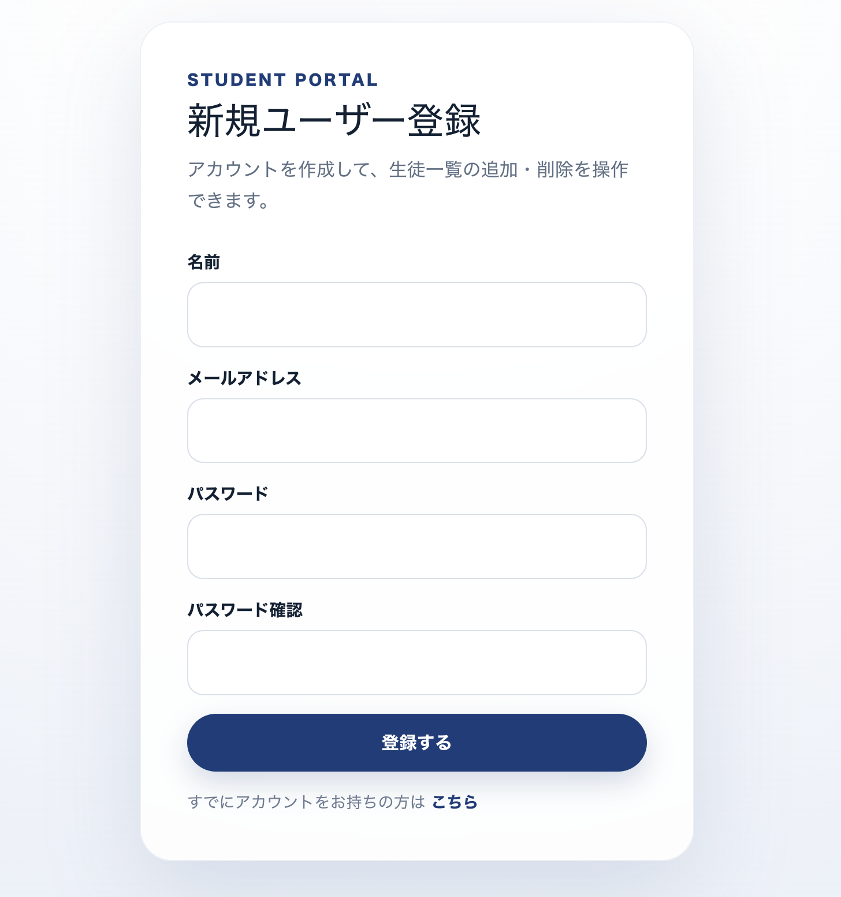
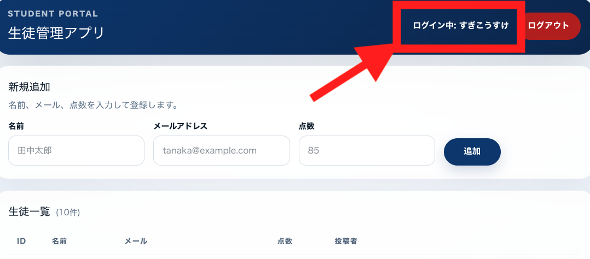

# コマ２３｜新規ユーザ登録機能追加と、これまでの復習

---

# ここまでできた人は次は新規ユーザー登録画面を作成してほしい

今の状態だと、ログイン画面しかないので、新しく生徒を追加したい人が画面に入れない

## 何を作るか

下の画像のような「新規ユーザー登録」画面を作ります。アカウントを新しく作れるようにすることで、初めての人でも自分でアカウントを作ってログインできるようになります。



新規登録したユーザで、ログインできればOK！！！



## 画面に必要な要素

- **名前**の入力欄
- **メールアドレス**の入力欄
- **パスワード**の入力欄
- **パスワード確認**の入力欄(打ち間違い防止のため、同じパスワードをもう一度入力させる)
- **登録するボタン**
- 「すでにアカウントをお持ちの方はこちら」というログイン画面へのリンク

## 実装のヒント(これまで学んだことと繋がっています)

- この画面がやろうとしているのは、CRUDでいう**Create(新しいユーザーを作る)**にあたります。Laravel側では`store()`にあたる処理です
- Next.jsの**フォーム**でユーザーが入力した名前・メール・パスワードを、Laravel APIに向けて送信(POST)します
- Laravel側の**Controller**が受け取った内容をバリデーション(パスワードとパスワード確認が一致しているか、メールが重複していないかなど)したうえで、**Model**を通してデータベースに保存します
- 登録が成功したら、そのままログイン画面に飛ばす(または続けてログインさせて**トークン**を発行する)、という流れにすると自然です

---

# これまでの復習（板書で説明します！）

## 1. トークンの仕組みについて

アプリのサーバーは、たくさんの人からリクエスト(お願い)を受け取ります。そのとき「これは本当にログインした本人からのお願いなのか？」を確認しないといけません。この確認のために使う「合言葉カード」のようなものが**トークン**です。

### 遊園地のリストバンドで考えてみる

遊園地に入るとき、チケットを見せると「リストバンド」をもらいますよね。そのあとは、アトラクションに乗るたびにチケットを見せ直さなくても、**リストバンドを見せるだけ**で「この人は入場済みのお客さんだ」と分かってもらえます。

トークンはこれと同じ役割です。

```
   [チケット売り場で申込み]
          ↓
   スタッフ「OKです、リストバンドどうぞ」
          ↓
   ★ リストバンドを腕につける ★
          ↓
   以降、アトラクションに乗るたびに
   リストバンドを見せるだけでOK！
```

### アプリの世界でも同じ流れ

1. **ログイン**：メールアドレスとパスワードを送って「私です」と伝える
2. **トークンをもらう**：サーバーが「本人だ」と確認できたら、合言葉カード(トークン)を発行してくれる
3. **カードを持っておく**：もらったトークンをアプリ側で保管しておく
4. **カードを見せる**：何か操作するたびに、そのトークンを一緒に送る
5. **サーバーが確認**：「このトークン、確かにログイン済みの人のものだ」と照合してOKを出す

```
[アプリ] --「これがメールとパスワードです」--> [サーバー]
[アプリ] <---------「はい、これがトークンです」---- [サーバー]

[アプリ] --「トークン見せます、これやりたいです」--> [サーバー]
                                            ↓
                                サーバーが台帳と照合
                                            ↓
                                  「本人だ、OK！」
```

### おぼえておきたいこと

- トークンは合言葉と同じ。**他人に見せたり盗まれたりすると、その人になりすまされてしまう**ので大事に扱う
- 「ログアウトする」＝サーバー側の台帳から「このトークンはもう無効です」と記録すること
- 毎回この確認作業を人間がやるのは大変なので、Laravelでは`auth:sanctum`という仕組みが自動でチェックしてくれる

### トークンは開発者ツールで確認できる

実は、自分のアプリが今どんなトークンを持っているか、**ブラウザの開発者ツール(DevTools)を開けば見ることができます**。

- **Application タブ(Chromeの場合)** → `Local Storage` を見ると、保存されているトークンの文字列が確認できる
- **Network タブ** → APIにリクエストを送ったときの通信を見ると、`Authorization: Bearer ○○○` というヘッダーに実際のトークンが載っているのが確認できる

「ちゃんとトークンがもらえているか」「リクエストに正しく付けられているか」が分からないときは、まず開発者ツールで確認する癖をつけると、バグの原因を見つけやすくなります。

### 実際のJavaScriptコード

以下のコードは、**Laravel側ではなくNext.js側(フロントエンド)に書くコード**です。ウェイター(Controller)にお願いする側、つまり「お客さん」のコードだとイメージしてください。

#### 1. ログインしてトークンをもらう・保存する

```javascript
async function login(email, password) {
  const response = await fetch('http://localhost:8000/api/login', {
    method: 'POST',
    headers: {
      'Content-Type': 'application/json',
    },
    body: JSON.stringify({ email, password }),
  });

  const data = await response.json();

  // サーバーから届いたトークンをブラウザに保存しておく
  localStorage.setItem('token', data.token);
}
```

#### 2. 保存したトークンを付けてAPIを呼ぶ

```javascript
async function fetchMyProfile() {
  // さっき保存しておいたトークンを取り出す
  const token = localStorage.getItem('token');

  const response = await fetch('http://localhost:8000/api/user', {
    method: 'GET',
    headers: {
      // ここに「合言葉カード」を見せる形でトークンを付ける
      Authorization: `Bearer ${token}`,
    },
  });

  const data = await response.json();
  console.log(data);
}
```

#### 3. ログアウトする(トークンを無効にする)

```javascript
async function logout() {
  const token = localStorage.getItem('token');

  await fetch('http://localhost:8000/api/logout', {
    method: 'POST',
    headers: {
      Authorization: `Bearer ${token}`,
    },
  });

  // ブラウザ側に残っているトークンも消しておく
  localStorage.removeItem('token');
}
```

`Authorization: Bearer ${token}` の部分が、まさに「リストバンドを見せる」動作にあたります。この形でヘッダーを付けないと、サーバー側は「誰からのリクエストか分からない」ので、401エラー(認証エラー)が返ってきます。

## 2. CRUDについて

CRUDとは、アプリがデータに対して行う**4つの基本の動作**の頭文字をとったものです。ノートを思い浮かべると分かりやすいです。

| 頭文字 | 動作 | ノートで例えると |
|------|------|------------------|
| **C**reate(作る) | 新しいデータを追加する | ノートに新しいページを書く |
| **R**ead(読む) | データを見る | 書いたページを読み返す |
| **U**pdate(更新する) | データを書き換える | 書いた内容を消してまた書く |
| **D**elete(消す) | データを削除する | ページを破って捨てる |

```
      ┌─────────── ノート(データベース) ───────────┐
      │                                             │
 Create│ 新しいページを追加 →  [ 1ページ目 ]        │
      │                                             │
  Read │ 読む            →  「うんうん、これね」    │
      │                                             │
Update │ 書き直す         →  [ 1ページ目(修正版) ]  │
      │                                             │
Delete │ 破って捨てる     →  (ページが無くなる)      │
      └─────────────────────────────────────────────┘
```

### なぜ大事なの？

- 掲示板、ネットショップ、SNS、タスク管理アプリ…ほとんどのアプリは「データを作って、見て、直して、消す」の組み合わせでできている
- Laravelには`Route::apiResource`という便利機能があり、この4つ(実際は5つ)の動作をまとめて用意してくれる

```php
Route::apiResource('users', UserController::class);
// この1行だけで「作る・見る・直す・消す」の道が全部つながる
```

CRUDを意識すると、「このボタンは何をするためのものか」がチームの誰にでも伝わりやすくなります。

## 3. LaravelのMVCモデルについて

Laravelのアプリは、**レストラン**に例えるとイメージしやすいです。役割分担がはっきりしているので、大人数で働いても混乱しません。

### お店の役割で考える

- **Controller(コントローラ)＝ウェイター**：お客さん(リクエスト)から注文を受け取り、キッチンに伝えて、できた料理をお客さんに運ぶ人
- **Model(モデル)＝キッチン・冷蔵庫**：材料(データ)を保管したり、実際に料理(データの取得・保存)を作ったりする場所
- **View(ビュー)＝お皿に盛り付けられた料理**：お客さんの目の前に出てくる、最終的な見た目

```
   お客さん(ブラウザ/Next.js)
        │ 「これください！」(リクエスト)
        ▼
   ウェイター(Controller)
        │ 「これ作って」
        ▼
   キッチン(Model・データベース)
        │ 料理(データ)ができる
        ▼
   ウェイター(Controller)
        │ お皿に盛り付けて運ぶ
        ▼
   お客さんの前に料理(View or JSON)が届く
```

### API化すると何が変わる？

ウェイター(Controller)がキッチンから受け取った料理を**お店の中で**盛り付けてお客さんの目の前に出していました(Bladeで画面を作る)。

API化した後は、ウェイター(Controller)は**盛り付けまではせず、材料と作り方(JSONデータ)だけ**をお客さんに渡すようになります。そして、実際に見た目を組み立てる(お皿に盛り付ける)仕事は、Next.js側が担当するようになります。

つまり「注文を受けて、キッチンとやり取りする」というウェイターの基本の仕事は変わらず、**最後の盛り付け(画面の見た目づくり)だけがNext.js側に引っ越した**、とイメージすると分かりやすいです。

