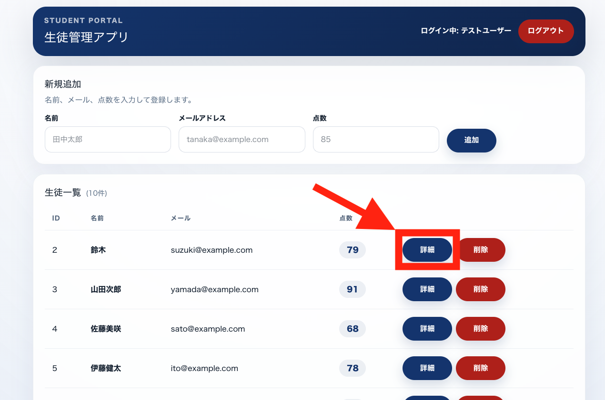
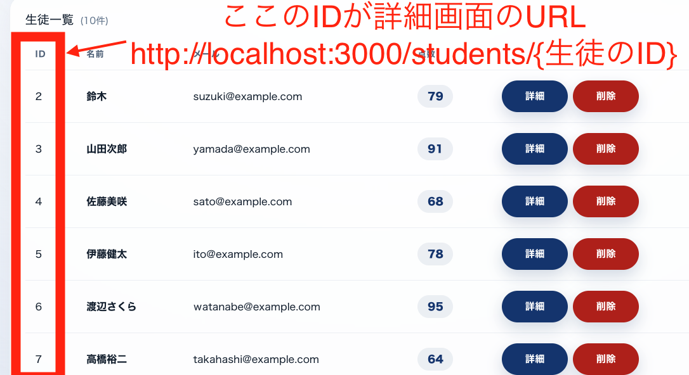
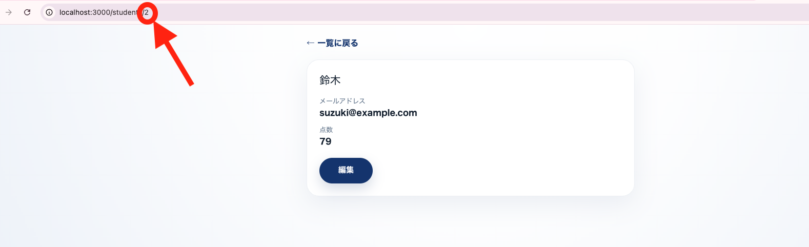
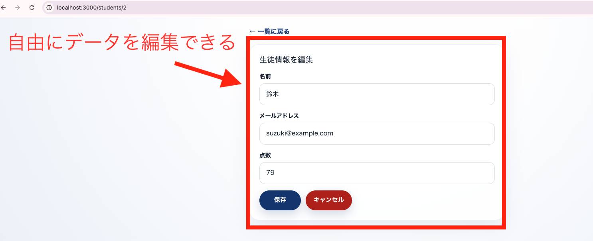

# コマ24｜詳細画面を作る

---

# ここまでできた人は次は詳細画面を作成してほしい

今の状態だと、一覧画面で名前・メール・点数はパッと見えるけど、生徒1人1人の情報を落ち着いて確認したり、そこから編集したりする画面がありません。一覧の「詳細」ボタンを押したときに、その生徒だけの情報を表示する画面を作ります。

## 何を作るか

一覧画面の各行にある「詳細」ボタンを押すと、その生徒の情報だけが表示される画面に移動するようにします。

ポイントは、**一覧のどの行の「詳細」を押したかによって、遷移先のURLが変わる**ことです。生徒のIDがそのままURLの一部になります。

ボタンを押すと、下の画像のように、その生徒の名前・メールアドレス・点数だけが表示された画面に移動できればOKです。

さらに、詳細画面から「編集」ボタンを押すと、その場でフォームに切り替わって内容を書き換えられるようにします（コマ21で作った更新処理と同じ考え方です）。

##　詳細画面とは？

詳細画面は、CRUDでいう**Read（1件だけ見る）**にあたります。一覧画面が「全員分をまとめて見る」画面だったのに対して、詳細画面は「IDで指定した1人分だけを見る」画面です。

- 一覧画面：`GET /api/students` → 全員分のデータが返ってくる
- 詳細画面：`GET /api/students/{id}` → 指定したIDの生徒1人分だけが返ってくる

さらに、詳細画面から編集して保存する部分は、CRUDでいう**Update（更新する）**にあたります。表示（Read）と更新（Update）が同じ画面の中で切り替わる、という作りになります。

## 画面に必要な要素

- 生徒の**名前**の表示
- 生徒の**メールアドレス**の表示
- 生徒の**点数**の表示
- 「**編集**」ボタン（押すとフォームに切り替わる）
- 編集フォームには、名前・メールアドレス・点数の入力欄と「**保存**」「**キャンセル**」ボタン
- 「**一覧に戻る**」リンク

## 実装のヒント（これまで学んだことと繋がっています）

- 一覧画面の「詳細」ボタンは、生徒ごとに`/students/{生徒のID}`というリンクになるようにします（`<Link href={`/students/${student.id}`}>`のように、IDを埋め込んだURLを作ります）
- Next.jsでは、URLの一部（ID）を受け取れる**動的ルーティング**を使います。`app/students/[id]/page.tsx`のようなフォルダ・ファイル構成にすると、URLの`{id}`部分の値をページの中で受け取れます
- ページが表示されたら、受け取ったIDを使って`fetch(`http://localhost:8000/api/students/${id}`)`のようにLaravel APIへリクエストを送り、その生徒1人分のデータだけを取得します
- Laravel側では、`routes/api.php`の`Route::apiResource('students', StudentController::class)`によって、実は`show($id)`（1件取得）と`update($id)`（更新）のルートもすでに用意されています。`StudentController`にこの2つのメソッドが実装されているか確認してください
- 「編集」ボタンを押したら表示を切り替えたいので、`useState`で「今は表示モードか、編集モードか」を持たせておくと、コマ17〜21で作ったフォームの考え方がそのまま使えます
- 保存ボタンを押したときは、`fetch`で`PUT`（または`PATCH`）を使って`http://localhost:8000/api/students/{id}`に送信します。トークンを`Authorization: Bearer ${token}`で付けるのを忘れないようにしましょう
