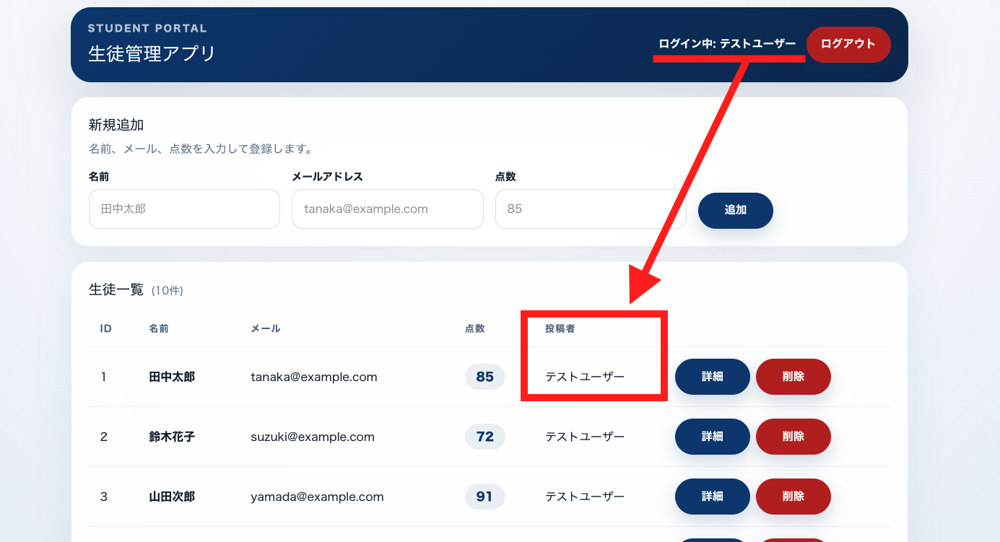

# コマ25｜Users ⇔ Students をリレーションさせる

---

# ここまでできた人は次はUsersテーブルとStudentsテーブルをリレーションさせてほしい

今の状態だと、`students` テーブルには「誰がその生徒データを登録したか」という情報がありません。誰でも同じ一覧を見られるだけで、「このデータは自分（ログイン中のユーザー）が登録したものだ」ということが分からない作りになっています。

`users` テーブルと `students` テーブルをリレーション（関連付け）させて、一覧・詳細画面に「投稿者」として登録したユーザーの名前が表示されるようにします。

## 何を作るか

生徒を新しく登録すると、その生徒データに「今ログインしているユーザー」が自動で紐づくようにします。そして一覧画面・詳細画面の両方に、その生徒を登録したユーザー名（投稿者）を表示します。

ポイントは、**ログイン中のユーザー名（右上）と、一覧の「投稿者」列に表示される名前が一致する**ことです。今回のテストユーザーであれば、どの生徒の行を見ても「投稿者：テストユーザー」と表示されるはずです（今のシードデータはすべて同じユーザーが登録したことになっているため）。

## リレーションとは？

`users` テーブルと `students` テーブルは、今はまったく別々のテーブルとして存在しています。これを「1人のユーザーが複数の生徒を登録できる」という関係でつなぐのが、今回のリレーションです。

- `users` テーブル：1件のレコード＝1人のユーザー（講師）
- `students` テーブル：1件のレコード＝1人の生徒

この2つを、`students` 側に「どのユーザーが登録したか」を表すカラム（**外部キー**）を持たせることでつなぎます。これにより、

- 1人のユーザーは複数の生徒を持てる（**1対多**の関係）
- 1件の生徒データは、必ず1人のユーザーに属する

という関係がデータベース上で表現できます。Laravelでは、この外部キーをもとに `User` モデル・`Student` モデルにリレーションを定義することで、「このユーザーが登録した生徒一覧」や「この生徒を登録したユーザー」を簡単に取得できるようになります。

## 画面に必要な要素

- 生徒一覧画面（`/students`）の各行に、**投稿者**（登録したユーザー名）を表示する列
- 生徒詳細画面（`/students/{id}`）にも、同様に**投稿者**を表示する項目
- 新しく生徒を登録したとき、その生徒データが自動的に「今ログインしているユーザー」に紐づくこと（他のユーザーが登録したことにはならない）

## 実装のヒント（これまで学んだことと繋がっています）

- データベース側では、`students` テーブルに `users` テーブルを参照する外部キーカラム（例：`user_id`）を追加します。すでに動いているテーブルのマイグレーションを直接書き換えるのではなく、カラムを追加する**新しいマイグレーション**を作るのが安全です
- 外部キーを追加すると、「参照先のユーザーが削除されたときにどうするか」も決める必要があります（削除に連動して生徒データも消す、など）
- Laravelでは、`User` モデルに「1人のユーザーは複数の生徒を持つ」というリレーション（`hasMany`）、`Student` モデルに「1件の生徒は1人のユーザーに属する」というリレーション（`belongsTo`）を定義します
- 生徒一覧を返すAPI（`index()`）では、生徒データと一緒に登録したユーザーの情報も取得し、レスポンスに投稿者名を含めるようにします。1件ずつユーザー情報を取りに行くと通信（SQL）が無駄に増えてしまう点にも注意してください（`with()` を使った事前読み込みが役立ちます）
- 生徒を新規登録するAPI（`store()`）では、`$request->user()`（今ログイン中のユーザー）経由でデータを作成することで、外部キーが自動的にそのユーザーのIDになるようにします
- フロントエンド側では、APIレスポンスの型（`type Student`）に投稿者名のフィールドを追加し、一覧のテーブルと詳細画面のそれぞれに表示するJSXを追加します

## 実装の流れ

**1. DB側で外部キーを追加**

`students` テーブルに `user_id` カラムを追加する。既存のマイグレーションは書き換えず、新しいマイグレーションファイルを作って追加するのが安全（本番で動いてるテーブル構造を後から変更するときの定石）。

**↓**

**2. 削除時の挙動を決める**

外部キーを張るときに、参照先の `users` が消えたらどうするか（`onDelete('cascade')` で生徒データも一緒に消す、など）も一緒に設定する必要がある。

**↓**

**3. モデルにリレーションを定義**

- `User` モデル → `hasMany(Student::class)`（1人のユーザーは複数の生徒を持てる）
- `Student` モデル → `belongsTo(User::class)`（1件の生徒は1人のユーザーに属する）

**↓**

**4. 一覧APIを修正（`index()`）**

生徒データを取るときに、投稿者（ユーザー）情報も一緒に取得する。ここで1件ずつクエリを投げると N+1 問題でSQLが無駄に増えるので、`with('user')` のようなEager Loadingを使う。

**↓**

**5. 登録APIを修正（`store()`）**

生徒を新規作成するとき、`$request->user()` から取得した「今ログイン中のユーザー」経由でレコードを作る。こうすると `user_id` が自動でそのユーザーのIDになり、誰でも他人のIDを指定できてしまう、みたいな不正が起きない。

**↓**

**6. フロント側を修正**

`type Student` の型定義に投稿者名フィールドを追加 → 一覧テーブルの行と詳細画面のJSXに「投稿者：〇〇」を表示する部分を足す。
