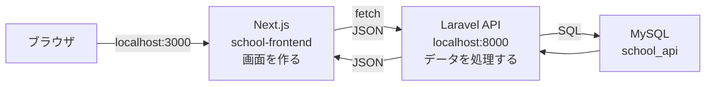
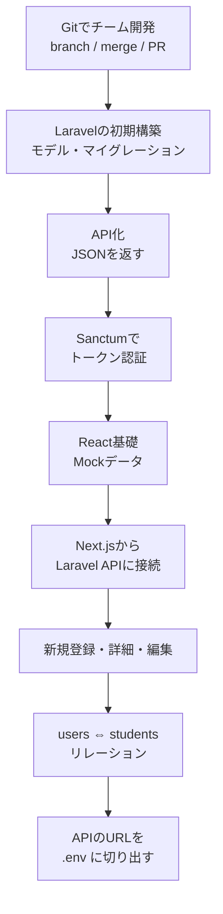
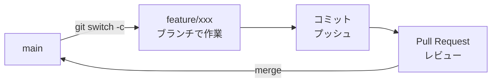
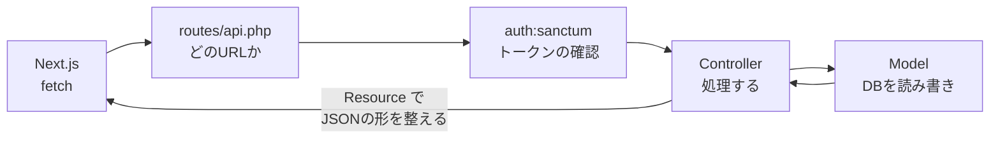
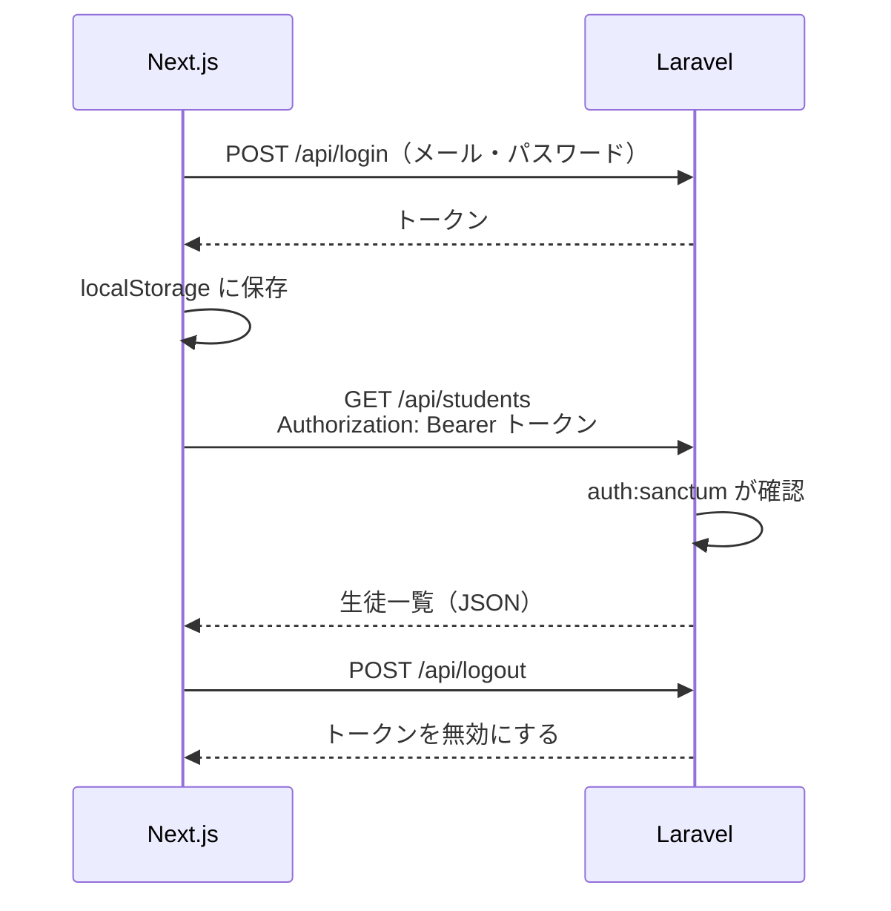
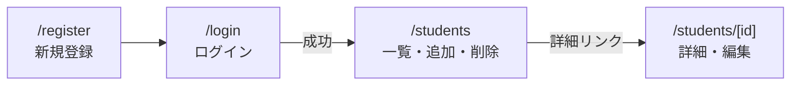
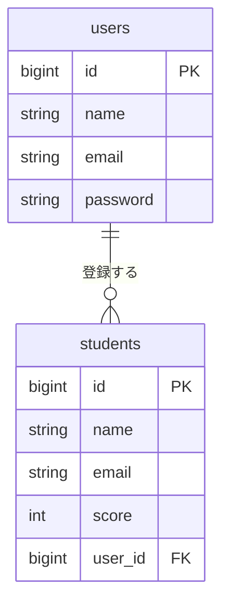
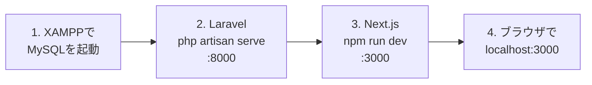

# 前期のふりかえり（復習）

後期に入る前に、前期で作った **生徒管理アプリ** の全体像を思い出しておきましょう。
前期では、画面（フロントエンド）とデータの処理（バックエンド）を **別々のアプリ** として作り、APIでつなぎました。



- **Next.js**：画面を作る係。ボタンが押されたら、Laravel にお願い（リクエスト）を送る
- **Laravel**：お願いを受け取り、データベースを読み書きして、結果を **JSON** で返す係
- **MySQL**：データを保存しておく係

---

## 1. 前期の流れ

前期は、次の順番でアプリを育ててきました。



| 回 | 内容 | 資料 |
|----|------|------|
| 4/30 | Git チーム開発（branch・merge・Pull Request） | [資料](../../前期/2026_04_30/2026_04_30.md) |
| 5/6 | Laravel プロジェクトの初期構築 | [資料](../../前期/2026_05_06/20260506.md) |
| 5/14 | Blade アプリを API 化 | [資料](../../前期/2026_05_14/20260514.md) |
| 5/21 | リソースコントローラ・Sanctum でトークン認証 | [資料](../../前期/2026_05_21/20260521.md) |
| 5/28 | ブラウザでトークン認証を確認する | [資料](../../前期/2026_05_28/20260528.md) |
| 6/11 | React 基礎（コンポーネント・JSX・props・useState） | [資料](../../前期/2026_06_11/2026_06_11.md) |
| 7/2 | Next.js 入門 → Laravel API との接続 | [資料](../../前期/2026_07_02/2026_07_02.md) |
| 7/9 | 新規ユーザー登録 ＋ トークン・CRUD・MVC の復習 | [資料](../../前期/2026_07_09/2026_07_09.md) |
| 7/16 | 詳細画面・編集機能 | [資料](../../前期/2026_07_16/2026_07_16_実装.md) |
| 7/23 | users ⇔ students のリレーション | [資料](../../前期/2026_07_23/2026_07_23_実装%20.md) |
| 7/30 | API の URL を .env に切り出す | [資料](../../前期/2026_07_30/2026_07_30_実装.md) |

---

## 2. Git でチーム開発

チームで同じリポジトリを触るときは、**ブランチ** を切って作業し、**Pull Request（PR）** でレビューしてから main に取り込みました（GitHub Flow）。



- **main は直接いじらない**：いつでも動く状態にしておく
- 2人が同じ行を変えると **コンフリクト** が起きる → ファイルを開いて手で直してからコミットする

---

## 3. Laravel API

### MVC（レストランのたとえ）

| 役割 | ファイルの例 | たとえると |
|------|------------|-----------|
| **Model** | `app/Models/Student.php` | キッチン・冷蔵庫（データを扱う） |
| **Controller** | `app/Http/Controllers/Api/StudentController.php` | ウェイター（注文を受けて運ぶ） |
| **View** | → API化して **Next.js に引っ越し** | 盛り付け（見た目） |

API化したことで、Laravel は画面を作らず、**JSON（データだけ）** を返すようになりました。

### リクエストが通る道



### 作ったAPI

`Route::apiResource('students', ...)` の1行で、CRUD の5つの道がまとめてできました。

| CRUD | メソッド | URL | Controller | 認証 |
|------|---------|-----|-----------|:----:|
| — | POST | `/api/register` | `AuthController@register` | 不要 |
| — | POST | `/api/login` | `AuthController@login` | 不要 |
| — | POST | `/api/logout` | `AuthController@logout` | 🔒 |
| Read | GET | `/api/students` | `index`（一覧） | 🔒 |
| Create | POST | `/api/students` | `store`（追加） | 🔒 |
| Read | GET | `/api/students/{id}` | `show`（詳細） | 🔒 |
| Update | PUT | `/api/students/{id}` | `update`（更新） | 🔒 |
| Delete | DELETE | `/api/students/{id}` | `destroy`（削除） | 🔒 |

🔒 は `auth:sanctum` の中にあり、**トークンがないと 401 エラー** になります。

---

## 4. トークン認証

ログインすると、Laravel が **トークン**（遊園地のリストバンドのようなもの）を発行します。
Next.js はそれを保存しておき、APIを呼ぶたびに見せます。



うまくいかないときは、ブラウザの **開発者ツール** で確認します。

- `Application` タブ → `Local Storage`：トークンが保存されているか
- `Network` タブ：リクエストに `Authorization: Bearer ...` が付いているか

---

## 5. Next.js の画面

`app/` の中のフォルダが、そのまま **URL** になりました。



| URL | ファイル | 使うAPI |
|-----|---------|--------|
| `/login` | `app/login/page.tsx` | `POST /api/login` |
| `/register` | `app/register/page.tsx` | `POST /api/register` |
| `/students` | `app/students/page.tsx` | 一覧・追加・削除・ログアウト |
| `/students/[id]` | `app/students/[id]/page.tsx` ＋ `components/students/StudentDetail.tsx` | 詳細・更新 |

`[id]` のように `[ ]` で囲んだフォルダ名にすると、`/students/1`、`/students/2` … のように **URLの一部を変数として受け取れます**。

React の基本も思い出しておきましょう。

| 名前 | 役割 |
|------|------|
| **コンポーネント** | 画面の部品（`LoginForm`、`StudentList` など） |
| **props** | 親から子の部品にデータを渡す |
| **useState** | 画面の中で変わる値（入力内容・一覧データなど）を持つ |
| **useEffect** | 画面が表示されたときなどに、APIを呼んでデータを取ってくる |

---

## 6. テーブルとリレーション

生徒を「誰が登録したか」がわかるように、`students` に `user_id`（外部キー）を追加しました。



- 1人のユーザーが、たくさんの生徒を登録できる（**1対多**）
- モデルに `hasMany` / `belongsTo` を書くと、`$student->user->name` で投稿者の名前が取れる

---

## 7. 2つの .env

Laravel と Next.js には、それぞれ **別の `.env`** があります。

| ファイル | 書いてあるもの | 例 |
|---------|--------------|----|
| Laravel の `.env` | データベースの接続先 | `DB_DATABASE=school_api` |
| Next.js の `.env` | API の URL | `NEXT_PUBLIC_API_URL=http://127.0.0.1:8000` |

- `.env` は **Git に入れない**（パスワードなどが入ることがあるため）
- 代わりに、値を空にした `.env.example` を共有する
- `.env` を書きかえたら、**開発サーバーを再起動** する

---

## 8. アプリを動かす順番

3つとも動いていないと、アプリは動きません。次の順番で起動します。



ターミナルは **2つ** 開きます。

```bash
# ターミナル① バックエンド
cd Laravel
php artisan serve        # → http://localhost:8000

# ターミナル② フロントエンド
cd school-frontend
npm run dev              # → http://localhost:3000
```

---

## 確認クイズ

説明できるか、チェックしてみましょう。

- [ ] Next.js と Laravel は、それぞれ何を担当している？
- [ ] `GET /api/students` と `POST /api/students` の違いは？
- [ ] トークンを付けずに `/api/students` を呼ぶと、何が返ってくる？
- [ ] `students` テーブルの `user_id` は、何のためにある？
- [ ] `.env` を Git に入れないのはなぜ？ 代わりに何を共有する？
- [ ] アプリを動かすには、何を・どの順番で起動する？
