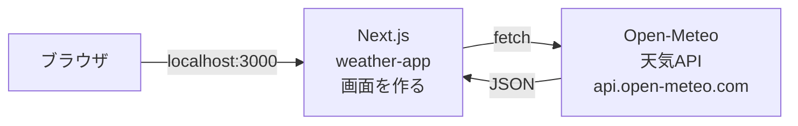
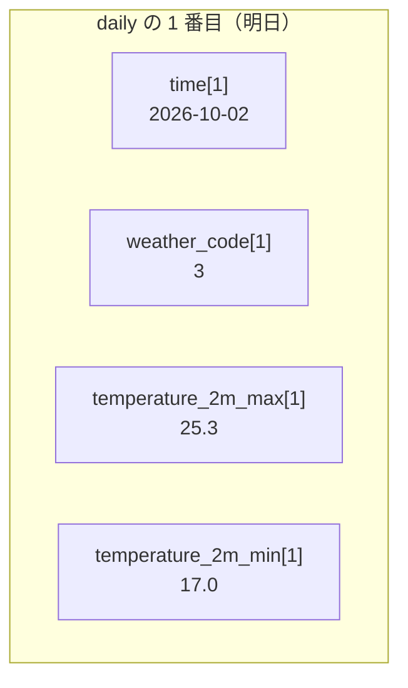
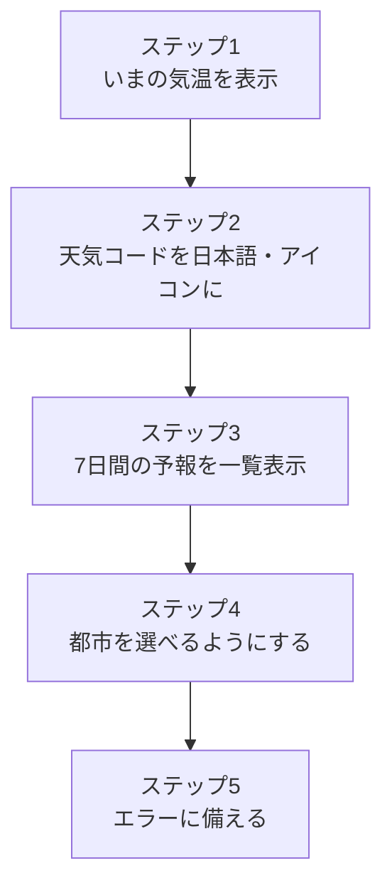
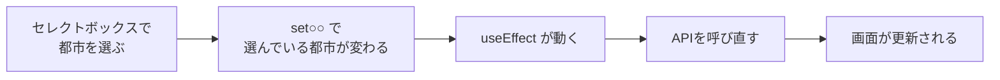

# 発展課題：天気APIで天気予報アプリを作ろう

**生徒管理アプリが完成した人** は、この課題に進みましょう。
前期は「自分で作った Laravel API」から JSON を受け取って画面に出しました。
今回は **インターネット上で公開されている天気API（Open-Meteo）** から JSON を受け取って、**新しい Next.js プロジェクト** で天気予報アプリを作ります。



### 完成イメージ

```
┌─────────────────────────────────────────┐
│ 天気予報（東京）              [ 東京 ▼ ]  │  ← 都市を選べる
├─────────────────────────────────────────┤
│        ☀️                                │
│      晴れ   28℃                          │  ← いまの天気
│      風速 0.7 km/h                       │
├─────────────────────────────────────────┤
│ 10/1(木)  ☀️ 晴れ    29℃ / 18℃  ☔ 0%    │
│ 10/2(金)  ☁️ くもり  25℃ / 17℃  ☔ 20%   │  ← 7日間の予報
│ 10/3(土)  🌧️ 雨      21℃ / 16℃  ☔ 80%   │
│   …                                     │
└─────────────────────────────────────────┘
```

### 今日のゴール

- **Next.js のプロジェクトを一から作成** できる
- 公開されている **外部API** を呼び出して、JSON を画面に表示できる
- JSON の中から **必要な値を取り出す** ことができる
- 選んだ値（都市）が変わったら、**APIを呼び直す** ことができる

> この資料には **答えのコードは載せていません。**
> 前期の生徒管理アプリ（`school-frontend`）のコードを参考にしながら、自分で考えて書いてみましょう。

---

## 1. 使うAPI：Open-Meteo

[Open-Meteo](https://open-meteo.com/) は、無料で使える天気APIです。

- **登録・APIキーが不要**（URLを開くだけで使える）
- 場所は **緯度（latitude）・経度（longitude）** で指定する
- **最大16日分** の予報がもらえる（今回は7日分を使う）

生徒管理アプリとくらべてみましょう。

| | 生徒管理アプリ | 天気予報アプリ |
|---|---|---|
| APIを作ったのは | 自分（Laravel） | Open-Meteo |
| URL | `http://localhost:8000/api/students` | `https://api.open-meteo.com/v1/forecast?...` |
| 認証 | トークンが必要（🔒） | **不要** |
| 使うメソッド | GET / POST / PUT / DELETE | GET だけ（読むだけ） |

> 無料で公開されているAPIです。**ボタン連打やループで何度も呼び出すのはやめましょう。**

---

## 2. まずはブラウザでAPIを見てみる

コードを書く前に、**どんな JSON が返ってくるか** を確認するのが大事です。
次のURLをブラウザのアドレスバーに貼り付けて開いてみましょう（東京の天気です）。

```
https://api.open-meteo.com/v1/forecast?latitude=35.68&longitude=139.77&current=temperature_2m,weather_code,wind_speed_10m&daily=weather_code,temperature_2m_max,temperature_2m_min,precipitation_probability_max&timezone=Asia%2FTokyo
```

> Chrome で「プリティ プリント」にチェックを入れると、JSON が見やすくなります。

### URLの読み方

`?` のうしろは **クエリパラメータ**（APIへの注文内容）です。`&` で区切って並べます。

| パラメータ | 意味 |
|-----------|------|
| `latitude=35.68` | 緯度 |
| `longitude=139.77` | 経度 |
| `current=temperature_2m,weather_code,wind_speed_10m` | **いま** の気温・天気コード・風速がほしい |
| `daily=weather_code,temperature_2m_max,...` | **日ごと** の天気コード・最高気温・最低気温・降水確率がほしい |
| `timezone=Asia%2FTokyo` | 日本時間で返してほしい（`%2F` は `/` のこと） |

> `current=` や `daily=` のうしろを減らしたり増やしたりすると、返ってくる JSON も変わります。試してみましょう。
> どんな項目があるかは [Open-Meteo のドキュメント](https://open-meteo.com/en/docs) で調べられます。

### 返ってくる JSON（一部）

```json
{
  "current": {
    "time": "2026-10-01T17:00",
    "temperature_2m": 28.2,
    "weather_code": 0,
    "wind_speed_10m": 0.7
  },
  "daily": {
    "time": ["2026-10-01", "2026-10-02", "2026-10-03", ...],
    "weather_code": [0, 3, 61, ...],
    "temperature_2m_max": [29.1, 25.3, 21.0, ...],
    "temperature_2m_min": [18.2, 17.0, 16.4, ...],
    "precipitation_probability_max": [0, 20, 80, ...]
  }
}
```

### どこに何が入っている？

| 表示したいもの | JSON のどこ？ |
|--------------|-------------|
| いまの気温 | `current.temperature_2m` |
| いまの天気コード | `current.weather_code` |
| いまの風速 | `current.wind_speed_10m`（km/h） |
| 日付（7日分） | `daily.time` ← **配列** |
| 日ごとの天気コード | `daily.weather_code` ← **配列** |
| 日ごとの最高・最低気温 | `daily.temperature_2m_max`・`daily.temperature_2m_min` ← **配列** |
| 日ごとの降水確率（%） | `daily.precipitation_probability_max` ← **配列** |

ここがポイントです。

- `current` は **1つの値** が入っている
- `daily` は **項目ごとに配列** になっていて、**同じ番号（インデックス）どうしが同じ日** のデータ



### 天気コード（weather_code）

天気は「晴れ」などの文字ではなく、**数字（WMOコード）** で返ってきます。
画面に出すときは、自分で日本語に変換します。

| コード | 天気 | アイコンの例 |
|-------|------|-----------|
| 0 | 晴れ | ☀️ |
| 1, 2 | 晴れ時々くもり | 🌤️ |
| 3 | くもり | ☁️ |
| 45, 48 | 霧 | 🌫️ |
| 51〜57 | 霧雨 | 🌦️ |
| 61〜67 | 雨 | 🌧️ |
| 71〜77 | 雪 | ❄️ |
| 80〜82 | にわか雨 | 🌦️ |
| 85, 86 | にわか雪 | 🌨️ |
| 95〜99 | 雷雨 | ⛈️ |

---

## 3. Next.js のプロジェクトを作成する

生徒管理アプリ（`school-frontend`）とは **別のフォルダ** に作ります。
`school-frontend` の中に作らないように注意しましょう。

```bash
npx create-next-app@latest weather-app
```

質問には、前期と同じように答えます。

```
Would you like to use TypeScript?             → Yes
Would you like to use ESLint?                 → Yes
Would you like to use Tailwind CSS?           → Yes
Would you like your code inside a src/ dir?   → No
Would you like to use App Router?             → Yes
Would you like to use Turbopack?              → No
Would you like to customize the import alias? → No
```

```bash
cd weather-app
npm run dev
```

http://localhost:3000 を開いて、Next.js のサンプル画面が出れば成功です。

### 作成直後にやっておくこと

| ファイル | やること | 参考 |
|---------|---------|------|
| `app/layout.tsx` | `lang="en"` を `lang="ja"` に、`title` を「天気予報アプリ」に変える | `school-frontend/app/layout.tsx` |
| `app/globals.css` | `@import "tailwindcss";` 以外を消し、`body` の背景色・文字色を自分で決める | — |
| `app/page.tsx` | サンプルの中身を全部消して、天気予報の画面を書いていく | — |

> **globals.css を直す理由**
> 最初の `globals.css` は、パソコンがダークモードだと **文字が白** になる設定になっています。
> 白いカードの上に文字を置くと見えなくなるので、自分で色を決めておきましょう。

> 今回は APIキーが不要なので、`.env` を作る必要はありません。
> また、Laravel を使わないので、XAMPP や `php artisan serve` の起動も不要です。

---

## 4. 作っていく順番

一度に全部作ろうとせず、**1ステップずつ動かして確認** しながら進めましょう。



### ステップ1：いまの気温を表示する

**やること**
- `app/page.tsx` で、ページが表示されたときにAPIを呼び、東京の **いまの気温・天気コード・風速** を表示する

**ヒント**
- 1行目に `"use client";` を書く（`useState`・`useEffect` を使うため）
- 生徒管理アプリの `app/students/page.tsx` の **`useEffect` と `loadStudents`** の形がそのまま参考になる
- 今回は **トークン（`Authorization` ヘッダー）は不要**。URL を `fetch` するだけ
- 最初は URL の `current=` だけあればよい（`daily=` はステップ3で足す）
- 受け取る前はデータが空っぽ（`null`）なので、「読み込み中...」を先に表示しておく
- TypeScript で `useState(null)` と書くと、あとで `weather.current` にエラーが出る → `useState<any>(null)` と書く

**✅ チェック**：気温・天気コード（数字）・風速が表示された

### ステップ2：天気コードを日本語とアイコンにする

**やること**
- 天気コードを受け取って、「晴れ」などの日本語と絵文字のアイコンを返す **関数** を作る
- いまの天気を、白いカードの中に **アイコン・天気・気温・風速** で表示する

**ヒント**
- 関数は `export default function ...` の **外側（上）** に作るとよい
- 2. の天気コードの表を見ながら、`if` で小さいコードから順に調べていく
- 日本語とアイコンの2つを返したいときは、`{ label: "晴れ", icon: "☀️" }` のような **オブジェクト** を返す
- 気温は `28.2` のように小数で来る → `Math.round()` で四捨五入すると見やすい

**✅ チェック**：アイコンと「晴れ」などの日本語が表示された

### ステップ3：7日間の予報を一覧で表示する

**やること**
- URL に `daily=...` を追加して、7日間の予報を一覧で表示する
- 1行に「日付・アイコン・天気・最高気温・最低気温・降水確率」を並べる

**ヒント**
- 一覧表示は生徒一覧と同じく `map` を使う。`key` には重ならない値（日付）を使う
- `daily.time` を `map` で回すと、2つめの引数で **番号 `i`** がもらえる → `(date, i) => ...`
- その `i` を使って、`daily.weather_code[i]` のように **同じ番号** で他の配列から取り出す
- 日付 `2026-10-02` を `10/2(金)` の形にしたい人は、`new Date(date)` を作って `getMonth()`（**0始まり** なので +1）・`getDate()`・`getDay()`（0が日曜）を使う

**✅ チェック**：7日分の予報が並んだ

### ステップ4：都市を選べるようにする

**やること**
- セレクトボックスで都市を選ぶと、その都市の天気・予報に切りかわるようにする

都市の緯度・経度は、次の表を使ってください。

| 都市 | 緯度（latitude） | 経度（longitude） |
|-----|---------------|----------------|
| 東京 | 35.68 | 139.77 |
| 大阪 | 34.69 | 135.50 |
| 札幌 | 43.06 | 141.35 |
| 那覇 | 26.21 | 127.68 |

**ヒント**
- 都市の一覧は、`{ name: "東京", latitude: 35.68, longitude: 139.77 }` のようなオブジェクトの **配列** にしておく
- 「選んでいる都市」を `useState` で持つ
- URL の `latitude=` と `longitude=` の部分を、選んでいる都市の値に置きかえる（テンプレート文字列 `` `...${ }...` `` が便利）
- `useEffect` の依存配列を思い出そう



| 依存配列の書き方 | いつ実行される？ |
|----------------|----------------|
| `[]` | ページが表示されたとき **1回だけ**（生徒一覧で使った） |
| `[city]` | 最初の1回 ＋ **city が変わるたび** |

**✅ チェック**：都市を切りかえると、天気と予報が変わった（札幌と那覇で気温を比べてみよう）

### ステップ5：エラーに備える

**やること**
- APIが失敗したときに、画面が真っ白にならず、**エラーメッセージ** が表示されるようにする

**ヒント**
- 生徒管理アプリでも `res.ok` で失敗を判定した
- ネットにつながっていないときは `fetch` 自体が失敗する → `try` / `catch` で受け止める
- 成功しても失敗しても「読み込み中」を終わらせる → `finally`

**✅ チェック**：URL の `latitude=` をわざと `latitude=999` にすると、エラーメッセージが表示された（確認したら元に戻す）

---

## 5. うまくいかないときは

| 症状 | 確認すること |
|------|-------------|
| `useState is not defined` | 1行目に `"use client";`、その下に `import { useState, useEffect } from "react";` があるか |
| `Cannot read properties of null` | データが届く前に表示しようとしている → 「読み込み中」の判定より **下** で使っているか |
| `Cannot read properties of undefined` | JSON の取り出し方がまちがっている／URL に `daily=` を付け忘れていないか → 2. の表と見くらべる |
| 時刻や日付が9時間ずれる | URL に `timezone=Asia%2FTokyo` を付けているか |
| 文字が見えない（白い） | `globals.css` のダークモードの設定を消したか |
| 値がおかしい・表示されない | 開発者ツールの `Network` タブで、APIのレスポンス（JSON）を確認する |

---

## 6. さらに挑戦（できた人から）

- [ ] **部品に分ける**：「いまの天気」と「予報の一覧」を `components/` の中の別ファイルに分けて、`props` でデータを渡す
- [ ] **都市を増やす**：自分の出身地を追加する（緯度・経度は Google マップで場所を右クリックすると出てきます）
- [ ] **都市名で検索**：入力欄に都市名を入れて検索できるようにする（[Geocoding API](https://open-meteo.com/en/docs/geocoding-api) で都市名 → 緯度・経度に変換できる。これもキー不要）
- [ ] **時間ごとの予報**：URL に `hourly=temperature_2m&forecast_days=1` を追加して、今日の1時間ごとの気温を表示する
- [ ] **現在地の天気**：`navigator.geolocation.getCurrentPosition()` で自分の緯度・経度を取り、その場所の天気を表示する
- [ ] **見た目を変える**：天気によって背景色を変える（晴れはオレンジ、雨は青 など）／Tailwind CSS で書いてみる

> さらに余裕がある人は、[資料3](./2026_10_02_資料3.md) で **Gemini でオリジナルの天気アイコンを作る** ・ **Vercel に無料でデプロイする** に挑戦しましょう。

---

## 確認クイズ

- [ ] 生徒管理アプリの API と、Open-Meteo の API の違いは？（作った人・認証）
- [ ] URL の `?` のうしろの `latitude=35.68&longitude=139.77` は何を表している？
- [ ] `daily` の中で、同じ日のデータはどうやって見つける？
- [ ] 天気コード `3` は何の天気？ それを画面に「くもり」と出すにはどうする？
- [ ] `useEffect(() => { ... }, [city])` は、いつ実行される？
- [ ] `try` / `catch` / `finally` の `finally` は、いつ実行される？
