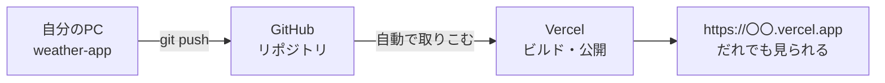

# 発展課題：天気予報アプリをパワーアップしよう

[資料2](./2026_10_02_資料2.md) の天気予報アプリ（`weather-app`）が **完成した人** は、この資料に進みましょう。

| | やること |
|---|---|
| 1. | Gemini でオリジナルの天気アイコンを作り、絵文字の代わりに表示する |
| 2. | Vercel に無料でデプロイして、スマホからも見られるようにする |

---

## 1. Gemini でオリジナルの天気アイコンを作る

Open-Meteo は **アイコン画像を送ってきません**（返ってくるのは天気コードの数字だけ）。
そこで、**Gemini で画像を生成** して `public/` フォルダに入れ、天気コードに合わせて表示してみましょう。


### 1-1. Gemini で画像を作る

[Gemini](https://gemini.google.com/) を開き、天気ごとに画像を作ってもらいます。

| 天気 | ファイル名の例 |
|-----|-------------|
| 晴れ | `sunny.png` |
| 晴れ時々くもり | `partly-cloudy.png` |
| くもり | `cloudy.png` |
| 霧 | `fog.png` |
| 雨（霧雨・にわか雨もふくむ） | `rainy.png` |
| 雪 | `snowy.png` |
| 雷雨 | `thunder.png` |

プロンプト（お願いの文章）の例：

```
天気予報アプリで使う「晴れ」のアイコンを作ってください。
シンプルでかわいいイラスト、正方形、白い背景、文字は入れないでください。
```

> **ポイント**
> - 1つめができたら、「**同じタッチで**『くもり』のアイコンも作ってください」と続けてお願いすると、絵柄がそろいます
> - できた画像はダウンロードして、上の表の名前に変えておきます
> - ファイル名は **半角英数字** にします（日本語のファイル名は避ける）

### 1-2. public フォルダに入れる

```
weather-app/
└── public/
    └── icons/          ← 作る
        ├── sunny.png
        ├── cloudy.png
        └── ...
```

`public/` に入れたファイルは、**`/` から始まるパス** で表示できます。
たとえば `public/icons/sunny.png` は、`` で表示できます。

> ブラウザで http://localhost:3000/icons/sunny.png を開いて、画像が出るか先に確認しましょう。

### 1-3. 天気コードに合わせて表示する

**やること**
- 資料2のステップ2で作った関数を改造して、日本語・絵文字に加えて **画像のパス**（`/icons/sunny.png` など）も返すようにする
- いまの天気と7日間の予報で、絵文字の代わりに `` で画像を表示する

**ヒント**
- 返すオブジェクトに `image: "/icons/sunny.png"` のような項目を足す
- 画像の大きさは `` の `width` や `style` で決める（予報の一覧は小さめに）
- `alt` に「晴れ」などの日本語を入れておくと、画像が読みこめなかったときにも天気がわかる

**✅ チェック**：都市を切りかえると、天気に合ったオリジナルのアイコンが表示された

---

## 2. Vercel に無料でデプロイする

いまのアプリは `localhost:3000` なので、**自分のパソコンでしか見られません。**
[Vercel](https://vercel.com/)（Next.js を作っている会社のサービス）を使うと、無料でインターネットに公開できます。
公開すると `https://weather-app-xxxx.vercel.app` のような URL がもらえて、**スマホや友だちのパソコンからも見られる** ようになります。



> **デプロイ** とは、作ったアプリをサーバーに置いて、インターネットから使えるようにすることです。

### 2-1. 手元でビルドできるか確認する

Vercel でも同じ `npm run build` が実行されます。先に手元で、エラーが出ないか確認しておきましょう。

```bash
# npm run dev は Ctrl + C で止めてから
npm run build
```

- 最後に `✓ Compiled successfully` などが出て、エラーで止まらなければ OK
- **赤いエラー** が出たら、メッセージに書かれたファイル・行を直してから、もう一度 `npm run build`
- 確認できたら、また `npm run dev` で開発を続けられます

### 2-2. GitHub にプッシュする

`create-next-app` で作ったプロジェクトは、**最初から Git のリポジトリ** になっています。

1. GitHub で **新しいリポジトリ** を作る（名前は `weather-app`、**README などは追加しない**）
2. 作ったリポジトリのページに出てくるコマンドを参考に、`git remote add origin ...` でつなぐ
3. `git add` → `git commit` → `git push` で、ここまでのコードをプッシュする

> Git の使い方は、前期 4/30 の資料をふりかえりましょう。
> `public/icons/` の画像も一緒にプッシュされているか、GitHub の画面で確認します。

### 2-3. Vercel で公開する

1. https://vercel.com/ を開き、**Sign Up** → プランは **Hobby（無料）** を選ぶ
2. **Continue with GitHub** で、GitHub のアカウントでログインする
3. **Add New...** → **Project** を選ぶ
4. 一覧から `weather-app` の **Import** を押す（出てこないときは、GitHub へのアクセスを許可する）
5. 設定は **そのままで OK**（Next.js だと自動で判断してくれます）→ **Deploy** を押す
6. 1〜2分待って、お祝いの画面が出たら完成！ 表示された URL を開いてみましょう

> 今回は APIキーを使っていないので、Vercel に環境変数を設定する必要はありません。

### 2-4. 直したら、プッシュするだけで更新される

一度つないでおけば、あとは **GitHub に `git push` するたびに、Vercel が自動でデプロイし直して** くれます。


> **注意**
> - 公開した URL は **だれでも見られます**。名前などの個人情報は画面に入れないようにしましょう
> - Hobby プランは **個人・学習用** です（お金をかせぐサイトには使えません）
> - デプロイに失敗したときは、Vercel の画面の **Build Logs** にエラーが出ています。手元の `npm run build` で同じエラーが出るか確かめましょう

**✅ チェック**：スマホで Vercel の URL を開いて、天気予報が表示された
