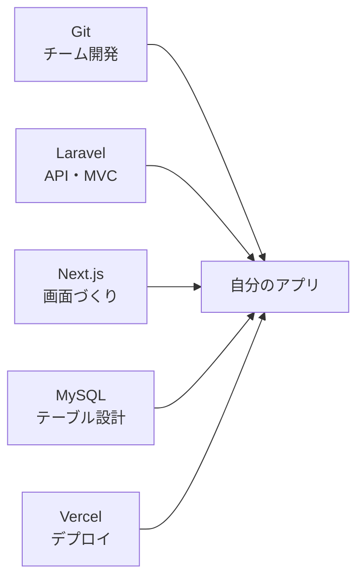
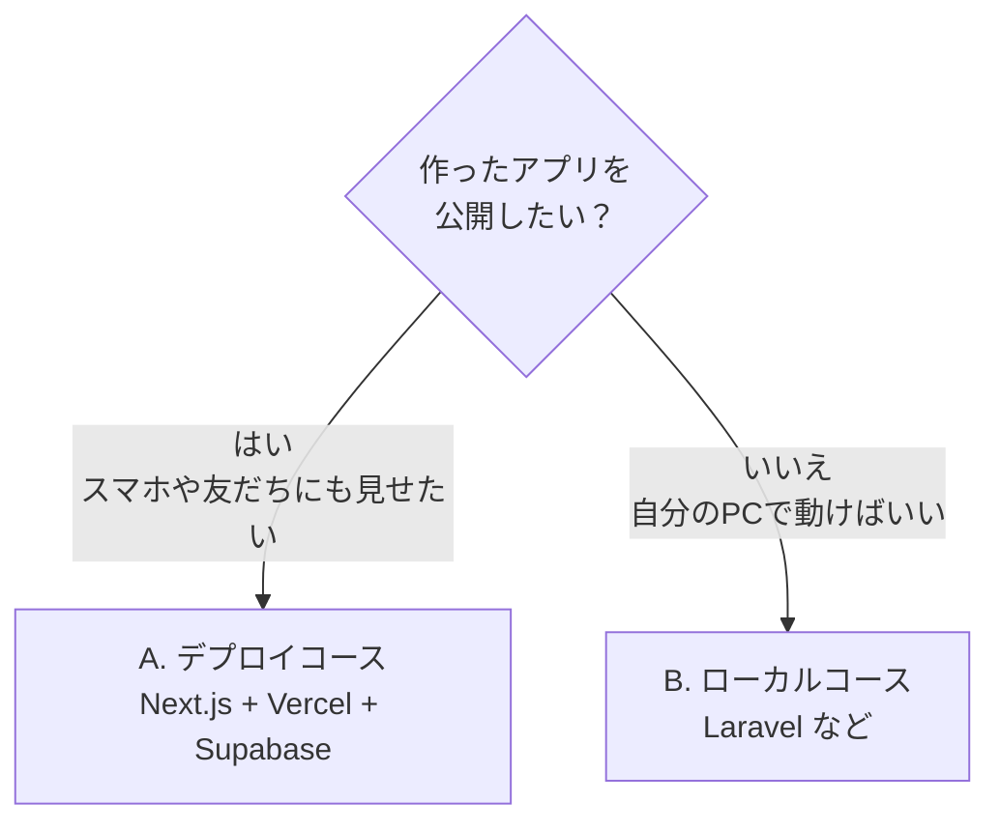
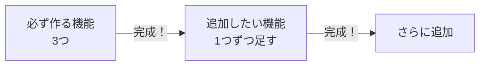
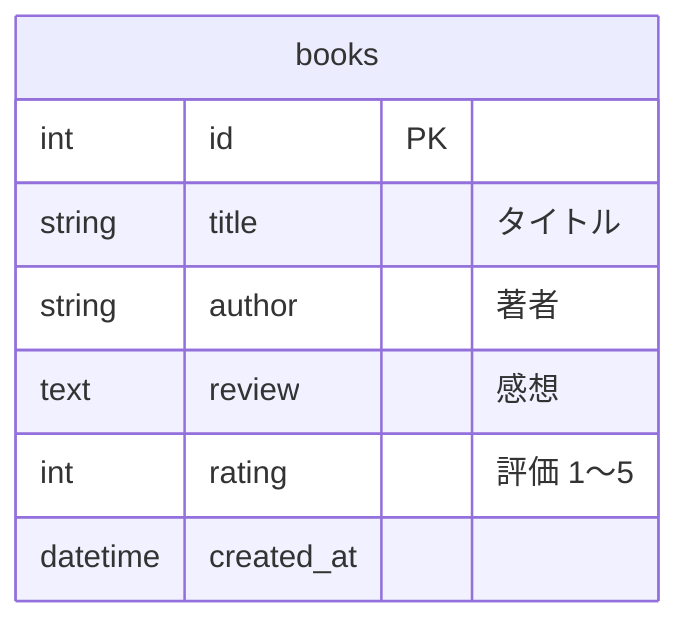
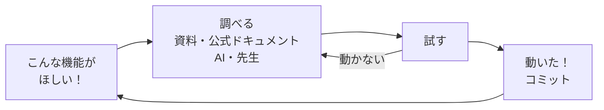
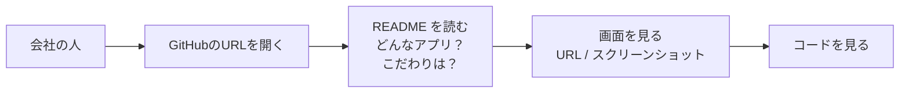
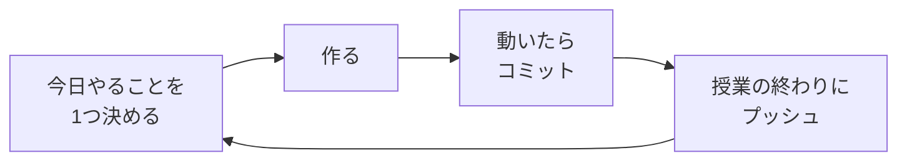

# 自由制作：基本は学んだのでここからは作りたいものを作りながら学んでいく

## 今日のゴール
- 作りたいアプリを決められる
- 完成したアプリを、就職活動で **ポートフォリオとして提出できる** ことを目標にする
- 自分に合ったコース（デプロイする / ローカルだけ）を選べる
- 開発を始める準備（リポジトリ作成・プロジェクト作成）ができる
- 「作りながら学ぶ」「自分のこだわりを大切にする」の2つを意識できる

---

## 1. 自由制作とは

ここまでに学んだことを応用して、**自分の好きなもの** を作ります。
テーマは自由です。趣味・部活・バイト・身の回りの「あったら便利」を形にしましょう。

> 🎯 **目標：就職活動で、ポートフォリオとして会社に提出できるアプリにする**
> どちらのコースを選んでも、完成したアプリは **「自分が開発したもの」として会社に見せられる** ようにします。
> 提出のしかたは [5. ポートフォリオとして提出する](#5-ポートフォリオとして提出する) を見ましょう。



### なぜ自分で作りたいものを作るの？

基本はここまでの授業で学びました。ここからは、その **応用** です。
先生が決めた課題ではなく、**自分で作りたいものを決めて作る** のには、3つの理由があります。

#### ① 自分が作りたいものだと、モチベーションが続きやすい

アプリを完成させるまでには、エラーや「わからない」がたくさん出てきます。
**自分が本当にほしいもの** なら、「完成させたい！」という気持ちで最後までがんばれます。

#### ② AIがコードを書ける時代だから、「何を作るか」が見られる

今は、AIに頼めばコードを書いてもらえる時代です。
だからこそ、**「何を作るか」「何を便利にしようとしているか」「なぜそれを作ったか」** が大切になります。
コードが書けることだけでなく、**自分で課題を見つけて、形にする力** が見られます。

#### ③ ポートフォリオとして、会社に提出できる

完成したアプリは、就職活動で **ポートフォリオとして会社に提出** できます。
ただし、みんなが同じようなものを作っても、会社の人の印象には残りません。
**受ける会社の人が「おっ！」と目を見張るような、自分だけのプロダクト** を作りましょう。

### テーマの例

| ジャンル | 例 |
|---------|-----|
| 記録する | 読書記録、筋トレ記録、家計簿、ゲームの戦績メモ |
| 集める・見せる | 推しの情報まとめ、おすすめ店リスト、作品ギャラリー |
| 役に立つ | 部活の出欠表、課題の締め切り管理、献立ルーレット |
| APIを使う | 天気＋服装アドバイス、ポケモン図鑑、映画検索 |

---

## 2. コースを選ぶ

作ったアプリを **インターネットに公開したいか** で、コースを選びます。



| | A. デプロイコース | B. ローカルコース |
|---|---|---|
| 資料 | [資料2](./2026_10_09_資料2.md) | [資料3](./2026_10_09_資料3.md) |
| 使うもの | Next.js + **Vercel** + **Supabase** | Laravel + MySQL（+ Next.js） |
| 見られる場所 | インターネット（`https://〇〇.vercel.app`） | 自分のPC（`localhost`） |
| データベース | Supabase（ネット上のデータベース） | MySQL（自分のPC） |
| 新しく学ぶこと | Supabase の使い方 | 少ない（前期の応用） |
| こんな人におすすめ | 新しい技術にも挑戦したい | 前期の内容をしっかり固めたい |
| ポートフォリオの提出 | **URL** ＋ GitHub | **GitHub**（README・スクリーンショット） |

> どちらを選んでも評価は変わりません。**どちらのコースでも、ポートフォリオとして提出できます。**
> 迷ったら先生に相談しましょう。

---

## 3. 作り始める前に

### まず小さく作る

最初から機能を詰めこむと、完成しないまま終わってしまいます。
**まず小さく完成させて、あとから足していく** のがコツです。



### テーブルを考える

前期に学んだテーブル設計を使って、必要なテーブルと列を書き出します。



---

## 4. 作りながら学ぶ

ここからは、先生が手順を全部用意するのではなく、**自分の作りたいものを作りながら学習していきます。**



- 必要になったときに、必要なことを調べる。**全部わかってから作り始めなくていい**
- エラーは失敗ではなく、**次に何を調べればいいかのヒント**
- 前期の資料・完成版のコードは、いつでも見返してOK

### ポイント：自分のこだわりを大切にする

自由制作でいちばん大事なのは、**「ここだけはこうしたい」という自分のこだわり** です。

| こだわりの例 |
|------------|
| 推しの色で画面をそろえたい |
| スマホで片手で使いやすくしたい |
| 自分が毎日本当に使うアプリにしたい |
| ボタンを押したときの動きを気持ちよくしたい |

こだわりがあると、

- 「どうしたらできる？」と **自分から調べたくなる**
- 完成したときに **人に見せたくなる**（ポートフォリオになる）
- 面接で **「なぜこれを作ったのか」を自分の言葉で話せる**

機能の数より、**こだわりが伝わること** を大切にしましょう。

---

## 5. ポートフォリオとして提出する

**ポートフォリオ** は、「自分はこんなものを作れます」と会社に見せるための作品です。
就職活動では、エントリーシートや面接のときに、作ったアプリを提出することがあります。

### 会社の人が見るところ

会社の人は、忙しい中で **短い時間** で見ます。「すぐ見られる」「すぐわかる」ことが大切です。



### コースごとの提出のしかた

| | A. デプロイコース | B. ローカルコース |
|---|---|---|
| 提出するもの | **公開URL** ＋ GitHub のURL | GitHub のURL |
| 会社の人が画面を見る方法 | URLを開けば、すぐ使える | README の **スクリーンショット・動画** で見る |

ローカルコースのアプリは、会社の人のPCでは動かせません。
そのため、**README にスクリーンショットや画面の動画（GIF）をのせて、動いている様子が伝わるように** します。

### README に書くこと

どちらのコースでも、GitHub の `README.md` がアプリの **顔** になります。

```markdown
# アプリ名


## どんなアプリ？
読んだ本と感想を記録して、本棚のように見返せるアプリです。

## こだわったところ
- 本の表紙が並んで、本棚みたいに見えるようにしました
- スマホでも見やすいレイアウトにしました

## 使った技術
- Next.js / Supabase / Vercel

## URL（デプロイコースのみ）
https://〇〇.vercel.app
```

- **こだわったところ** は、面接で「なぜこれを作ったの？」と聞かれたときの答えになります
- 開発の途中から少しずつ書いていくと、最後にあわてずにすみます

### 提出する前のチェック

| チェック | ✅ |
|---------|---|
| GitHub のリポジトリが **Public（公開）** になっている | |
| README に、アプリの説明・こだわり・使った技術・画面がある | |
| APIキーやパスワードが GitHub にのっていない | |
| （デプロイコース）公開URLを開いて、ちゃんと動く | |

> ⚠️ **Public にすると、世界中の誰でも見られます**
> 本名・住所・学校の内部の情報などが入っていないか、提出する前に確認しましょう。

---

## 6. 開発の進め方

どちらのコースでも、毎回の授業は次の流れで進めます。



- **GitHub にリポジトリを作る**：自分のアカウントで、アプリ名のリポジトリを作る
- **こまめにコミット**：「ここまで動いた」と思ったらセーブ
- **授業の終わりにプッシュ**：家のPCや別のPCでも続きができる
- **README も少しずつ書く**：ポートフォリオとして提出するときに、そのまま使える
- **困ったら15分ルール**：15分調べてもわからなければ、先生や友だちに聞く

> ⚠️ **APIキーやパスワードは GitHub にのせない**
> `.env` や `.env.local` に書いて、プッシュされていないか GitHub の画面で確認しましょう。

---

## 7. 今日やること

| やること | できたら ✅ |
|---------|-----------|
| 作りたいアプリとコースを決める | |
| テーブルを考える | |
| GitHub にリポジトリを作る | |
| 選んだコースの資料（[資料2](./2026_10_09_資料2.md) / [資料3](./2026_10_09_資料3.md)）で準備をする | |
| 最初のプッシュをする | |
