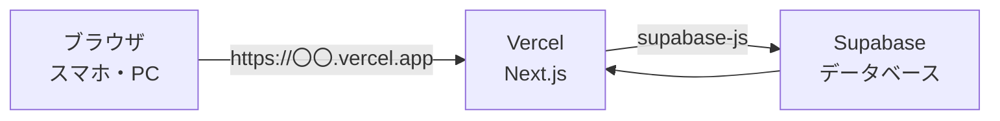
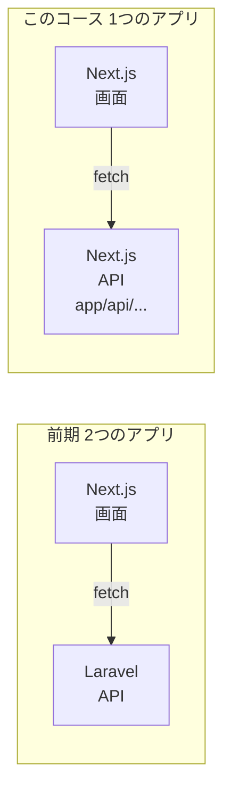
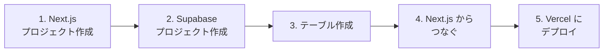
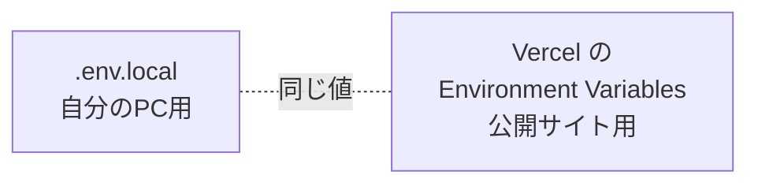

# 自由制作 A. デプロイコース — Next.js + Vercel + Supabase

作ったアプリを **インターネットに公開** して、スマホや友だちのPCからも使えるようにするコースです。

> 💰 **すべて無料で作れます**
> | サービス | 使うプラン |
> |---------|----------|
> | Next.js | 無料（オープンソース） |
> | Vercel | **Hobby**（無料。個人の非商用利用） |
> | Supabase | **Free**（無料） |
>
> クレジットカードの登録は不要です。有料プランへのアップグレードをすすめられても、選ばないようにしましょう。

[自由制作：自分の好きなものを開発しように戻る](./2026_10_09_資料1.md)

---

## 1. しくみ

前期は、データの処理を Laravel、データの保存を MySQL がしていました。
このコースでは、その2つの代わりに **Supabase** を使います。



| 名前 | なにもの？ | 前期でいうと |
|------|-----------|------------|
| **Next.js** | 画面を作る（**バックエンドAPIも作れる**） | school-frontend（＋ Laravel API） |
| **Vercel** | Next.js をインターネットに公開する | （なし） |
| **Supabase** | ネット上のデータベース。APIも自動で用意してくれる | Laravel API ＋ MySQL |

### Next.js はフルスタックフレームワーク

前期は「画面は Next.js、API は Laravel」と、2つのアプリに分けて作りました。
でも Next.js は **フルスタックフレームワーク** なので、**画面（フロントエンド）とAPI（バックエンド）を1つのプロジェクトで作れます。**



`app/api/` の中に `route.ts` を作ると、それがAPIになります（**Route Handler** といいます）。

```ts
// app/api/hello/route.ts
export async function GET() {
  return Response.json({ message: "こんにちは" });
}
```

`npm run dev` で起動して http://localhost:3000/api/hello を開くと、JSON が返ってきます。

| | 前期（Laravel） | Next.js |
|---|---|---|
| URLを決める | `routes/api.php` に書く | `app/api/〇〇/route.ts` の **フォルダの場所** で決まる |
| 処理を書く | コントローラーのメソッド | `GET` / `POST` などの関数 |
| JSONを返す | `return response()->json([...])` | `return Response.json({...})` |

**こんなときに Next.js のAPIを使う**

- 外部のAPI（AIなど）を使うときに、**APIキーをブラウザに見せたくない**
  （APIの中の処理はサーバーで動くので、`NEXT_PUBLIC_` がつかない環境変数を安全に使えます）
- データを保存する前に、サーバー側でチェックしたい

> 簡単なデータの出し入れは、画面から Supabase に直接つなげばOKです。
> 「サーバー側でやりたいこと」が出てきたら、Next.js のAPIを作りましょう。

## 2. 準備の流れ



### 2-1. Next.js のプロジェクトを作る

天気予報アプリと同じように `create-next-app` で作り、GitHub にプッシュしておきます。
→ [天気予報アプリの資料](../2026_10_02/2026_10_02_資料2.md)

### 2-2. Supabase のプロジェクトを作る

1. https://supabase.com/ を開き、`Start your project` → **GitHub でログイン**
2. `New project` を押して、次のように入力する

| 項目 | 入力する内容 |
|------|------------|
| Project name | アプリ名 |
| Database Password | 強いパスワード（`Generate a password` でOK。メモしておく） |
| Region | **Northeast Asia (Tokyo)** |
| プラン | **Free（無料）** |

### 2-3. テーブルを作る

左のメニューの `Table Editor` → `Create a new table` で、企画シートで考えたテーブルを作ります。
`Enable Row Level Security (RLS)` は **オンのまま** にします（下の注意を見ましょう）。

### 2-4. Next.js からつなぐ

Supabase の `Project Settings` → `API Keys` で、**Project URL** と **Publishable key**（または anon key）をコピーします。
Next.js のプロジェクトで、Supabase を使うためのパッケージを入れます。

```bash
npm install @supabase/supabase-js
```

プロジェクト直下に `.env.local` を作って、コピーした値を書きます。

```bash
NEXT_PUBLIC_SUPABASE_URL=https://xxxxxxxx.supabase.co
NEXT_PUBLIC_SUPABASE_KEY=コピーした Publishable key
```

`lib/supabase.ts` を作って、Supabase につなぐ準備をします。

```ts
import { createClient } from "@supabase/supabase-js";

export const supabase = createClient(
  process.env.NEXT_PUBLIC_SUPABASE_URL!,
  process.env.NEXT_PUBLIC_SUPABASE_KEY!
);
```

あとは、データを取ってきたり、追加したりできます。

| やりたいこと | Supabase | 前期の Laravel でいうと |
|------------|---------|----------------------|
| 全部取ってくる | `supabase.from("books").select("*")` | `Book::all()` |
| 追加する | `supabase.from("books").insert({ title: "..." })` | `Book::create([...])` |
| 削除する | `supabase.from("books").delete().eq("id", 1)` | `Book::find(1)->delete()` |

> ⚠️ **RLS（Row Level Security）に注意**
> RLS がオンのテーブルは、**ポリシー（だれが読み書きしていいかのルール）** を作らないと、データが空で返ってきます。
> `Authentication` → `Policies` から、テーブルごとにポリシーを追加しましょう。
> 「データが取れない！」ときは、まずここを確認します。わからなければ先生を呼んでください。

> ⚠️ **`secret` キー（service_role キー）は使わない**
> `NEXT_PUBLIC_` がついた値は、ブラウザから誰でも見られます。
> ここには **Publishable key（anon key）だけ** を入れます。`secret` キーを入れると、データベースを誰でも書きかえられてしまいます。

### 2-5. Vercel にデプロイする

天気予報アプリと同じ手順でデプロイします。→ [Vercel にデプロイする](../2026_10_02/2026_10_02_資料3.md#2-vercel-に無料でデプロイする)

ただし、今回は **環境変数の設定が必要** です。
Vercel のプロジェクトの `Settings` → `Environment Variables` に、`.env.local` と同じ2つを登録してから、デプロイし直します。



> `.env.local` は GitHub にプッシュされません（`.gitignore` に入っています）。
> そのため、Vercel にも別に登録する必要があります。

---

## 3. ここから先は、作りながら学ぶ

準備ができたら、あとは **自分の作りたいものを作りながら** 学んでいきます。
「この機能を作りたい → 調べる → 試す → 動いた！」をくり返すうちに、使える技術が増えていきます。

迷ったときは、**自分のこだわり** に立ち返りましょう。「ここだけはこうしたい」が、次に学ぶことを教えてくれます。

完成したら、**公開URL と GitHub のURL** をポートフォリオとして提出できます。

> ⚠️ **Supabase は、しばらく使わないと一時停止する**
> 無料プランでは、**1週間ほどアクセスがないと、プロジェクトが一時停止** します。
> 止まっている間は、公開URLを開いてもデータが表示されません。
> Supabase のダッシュボードから再開すれば元に戻ります（データは消えません）。
> **提出する前や面接の前には、自分で公開URLを開いて、動くか確認しましょう。**
→ [ポートフォリオとして提出する](./2026_10_09_資料1.md#5-ポートフォリオとして提出する)

[資料1の「作りながら学ぶ」](./2026_10_09_資料1.md#4-作りながら学ぶ) もあわせて読みましょう。
