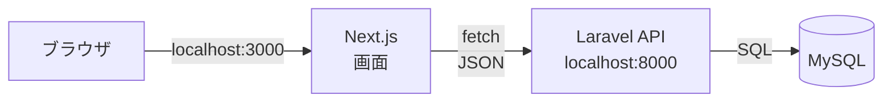
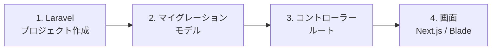

# 自由制作 B. ローカルコース — Laravel など

自分のPC（`localhost`）で動かすコースです。

[自由制作：自分の好きなものを開発しように戻る](./2026_10_09_資料1.md)

---

前期の **生徒管理アプリ** と同じ組み合わせで作ります。新しく覚えることが少ないので、**機能づくりに集中** できます。

---

## 1. 作り方を選ぶ

作り方は2通りあります。

| 作り方 | 内容 | おすすめ |
|-------|------|---------|
| **Laravel API ＋ Next.js** | 前期と同じ。画面は Next.js、データは Laravel | 前期の復習をしながら作りたい人 |
| **Laravel だけ（Blade）** | 画面も Laravel の Blade で作る | 構成をシンプルにしたい人 |

---

## 2. 準備の流れ

前期の資料と、完成版のコードを参考にしましょう。

- 全体の流れ → [開発の流れ：ゼロから API を作るまで](../../前期/開発の流れ_まとめ.md)
- 前期のふりかえり → [前期のふりかえり（復習）](../2026_10_02/2026_10_02_資料1.md)
- 完成版のコード → [portfolio](../../前期/portfolio/)

> **「Laravel など」の「など」**
> 前期に使ったもの以外（Python など）で作りたい人は、先生に相談してください。

---

## 3. ここから先は、作りながら学ぶ

準備ができたら、あとは **自分の作りたいものを作りながら** 学んでいきます。
「この機能を作りたい → 調べる → 試す → 動いた！」をくり返すうちに、使える技術が増えていきます。

迷ったときは、**自分のこだわり** に立ち返りましょう。「ここだけはこうしたい」が、次に学ぶことを教えてくれます。

完成したら、**GitHub のURL** をポートフォリオとして提出できます。README に **スクリーンショットや画面の動画** をのせて、動いている様子が伝わるようにしましょう。
→ [ポートフォリオとして提出する](./2026_10_09_資料1.md#5-ポートフォリオとして提出する)

[資料1の「作りながら学ぶ」](./2026_10_09_資料1.md#4-作りながら学ぶ) もあわせて読みましょう。
