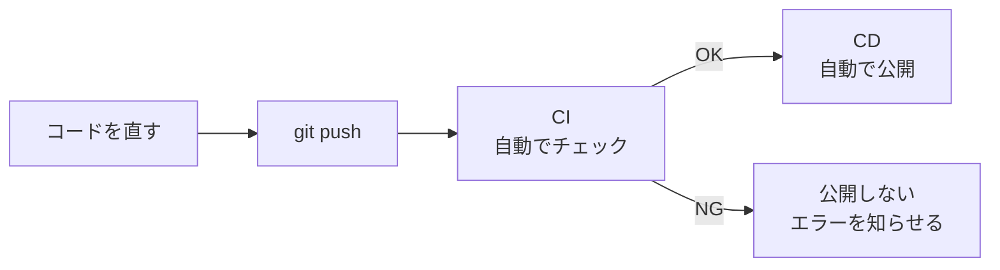
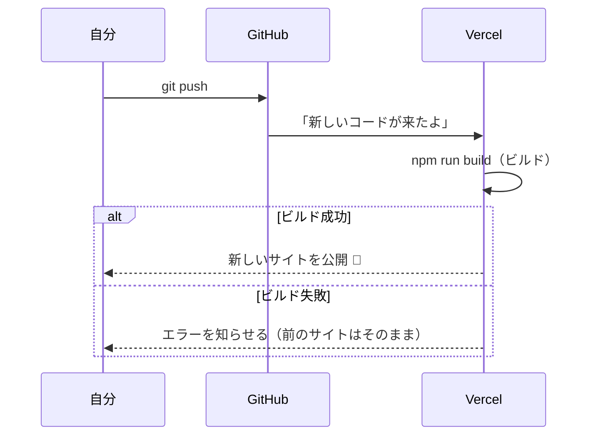

# CI/CDについて

デプロイコースでは、GitHub にプッシュするだけで Vercel のサイトが新しくなりました。
実はこれが **CI/CD（シーアイ・シーディー）** のしくみです。
ここでは、CI/CD とは何かを見ていきます。

[自由制作 A. デプロイコースに戻る](./2026_10_09_資料2.md)

---

## 1. CI/CDとは

**CI/CD** は、「コードを書いたあとの作業を **自動化** する」しくみです。

| 名前 | 正式な名前 | 意味 | ひとことで |
|------|----------|------|-----------|
| **CI** | Continuous Integration（継続的インテグレーション） | プッシュするたびに、**自動でチェック** する | 自動チェック |
| **CD** | Continuous Delivery / Deployment（継続的デリバリー／デプロイ） | チェックが通ったら、**自動で公開** する | 自動公開 |

> 💡 **たとえるなら「レポートの提出」**
> - **CI** ＝ 提出する前に、誤字チェックやページ数のチェックを **自動でしてくれる** 機能
> - **CD** ＝ チェックが通ったら、**自動で先生に提出してくれる** 機能
>
> 人の手でやると「チェックを忘れた」「提出し忘れた」が起きます。自動化すれば、毎回同じようにできます。

> 📝 **CD の2つの意味**
> CD には、**継続的デリバリー**（いつでも公開できる状態にしておき、公開ボタンは人が押す）と、**継続的デプロイ**（公開まで全部自動）の2つの意味があります。
> この資料の Vercel のように、プッシュしたら自動で公開されるのは **継続的デプロイ** です。

---

## 2. CI/CDがないとどうなる？

CI/CD がないと、コードを直すたびに **人の手で** 作業をします。


- 確認を忘れて、**エラーのあるコードを公開** してしまう
- アップロードするファイルを **まちがえる**
- 毎回同じ作業をするので **時間がかかる**

CI/CD があると、こうなります。



**自分がやるのは `git push` だけ** です。

---

## 3. Vercel は CD をやってくれている

Vercel と GitHub をつなぐと、**プッシュするたびに自動でデプロイ** されます。これが **CD** です。



> 📝 **ビルドに失敗しても、サイトは壊れない**
> ビルドに失敗したときは、**前のバージョンのサイトがそのまま** 表示されます。
> Vercel の `Deployments` 画面で、失敗の理由（エラーメッセージ）を確認しましょう。

### ブランチごとに「お試しURL」ができる

Vercel では、ブランチによって公開のされ方が変わります。

| プッシュしたブランチ | どうなる？ | URL |
|------------------|-----------|-----|
| `main` | **本番のサイト** が新しくなる | `https://〇〇.vercel.app` |
| それ以外（`feature/login` など） | **お試し用のサイト（Preview）** が作られる | `https://〇〇-git-feature-login-〇〇.vercel.app` など |


新しい機能は、**ブランチを作って Preview URL で確認してから main にマージ** すると、本番のサイトを壊さずにすみます。
前期のチーム開発で学んだ **ブランチ → プルリクエスト → マージ** の流れと同じです。

---

## 4. CI をやってみる（GitHub Actions）

Vercel がやってくれるのは主に CD です。
**CI（自動チェック）** は、**GitHub Actions** という GitHub の機能で追加できます（公開リポジトリなら無料。非公開リポジトリでも、毎月決まった時間までは無料）。

### 4-1. 設定ファイルを作る

プロジェクトに `.github/workflows/ci.yml` を作ります。

```yaml
# .github/workflows/ci.yml
name: CI

# いつ動かすか：push とプルリクエストのとき
on:
  push:
  pull_request:

jobs:
  check:
    runs-on: ubuntu-latest   # GitHub が用意してくれるPCで動く
    steps:
      - uses: actions/checkout@v6      # コードを取ってくる
      - uses: actions/setup-node@v6    # Node.js を入れる
        with:
          node-version: 24
      - run: npm ci                    # パッケージを入れる
      - run: npm run lint              # コードの書き方をチェック
      - run: npm run build             # ビルドできるかチェック
```

> ⚠️ **`npm run lint` が動かないとき**
> `create-next-app` で **Linter に None を選んだ** プロジェクトには、`lint` のスクリプトがありません。その場合は `npm run lint` の行を消しましょう。
> また、Next.js 16 から `next lint` コマンドはなくなりました。古いプロジェクトで `"lint": "next lint"` になっている場合は、`"lint": "eslint"` に書きかえます。
> `package.json` の `"scripts"` を見て、`lint` があるか確認しましょう。

| 行 | 意味 |
|----|------|
| `on:` | **いつ** 動かすか |
| `runs-on:` | **どこで** 動かすか（GitHub のPCを借りる） |
| `steps:` | **何を** するか（上から順番に実行） |

### 4-2. 結果を見る

ファイルをプッシュすると、GitHub のリポジトリの **`Actions`** タブで結果が見られます。

| 表示 | 意味 |
|------|------|
| ✅ 緑のチェック | チェックが全部通った |
| ❌ 赤のバツ | どこかで失敗した → クリックするとエラーが見られる |

プルリクエストの画面にも結果が表示されるので、**マージする前に問題に気づけます**。

> ⚠️ **GitHub Actions が失敗しても、Vercel はデプロイする**
> GitHub Actions（CI）と Vercel（CD）は、**それぞれ別々に** 動いています。
> そのため、何も設定しないと、CI が ❌ でも Vercel のビルドが成功すれば **本番のサイトは新しくなります**。
> 「CI が ✅ のときだけ本番に出す」ようにしたいときは、Vercel の **Deployment Checks** という機能を使います。
> プロジェクトの `Settings` の `Build and Deployment` にある Deployment Checks で `Add Checks` を押し、GitHub Actions のチェックを選びます（くわしくは [Vercel のドキュメント](https://vercel.com/docs/deployment-checks)）。

> 💡 **README にバッジをはると、ポートフォリオでアピールできる**
> `Actions` タブの workflow を開き、`Filter workflow runs` の横の `⋮` → `Create status badge` → `Copy status badge Markdown` でバッジのコードが作れます。
> README にはると「CI/CD を使って開発している」ことが一目で伝わります。

---

## 5. CI/CDのいいところ

- **ミスに早く気づける**：プッシュしたらすぐチェックされる
- **公開がかんたん**：`git push` だけで本番に反映される
- **毎回同じ手順でできる**：手作業のミスがなくなる
- **チーム開発に強い**：だれのコードも同じルールでチェックされる

実際の開発現場では、CI/CD は **ほぼ必ず** 使われています。
自由制作で使っておくと、就職活動でも話せる経験になります。

---

## 6. まとめ

- **CI** ＝ プッシュしたら **自動でチェック**、**CD** ＝ チェックが通ったら **自動で公開**
- Vercel が自動で確認するのは **ビルドが成功するかどうか** だけ。GitHub Actions の結果で公開を止めたいときは **Deployment Checks** を設定する
- Vercel は GitHub と連携して、**プッシュするたびに自動でデプロイ（CD）** してくれる
- `main` 以外のブランチは **Preview URL** で確認できる
- **GitHub Actions** を使うと、lint やビルドの **自動チェック（CI）** を追加できる
- 自分がやるのは **`git push` だけ**

[自由制作 A. デプロイコースに戻る](./2026_10_09_資料2.md)
