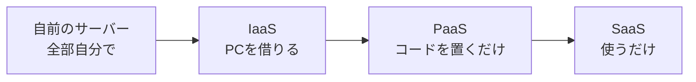
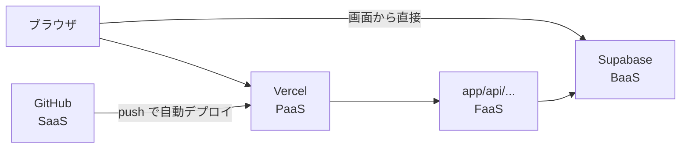

# IaaS・PaaS・SaaS・BaaSについて

クラウドのサービスを調べると、**IaaS（イアース）**・**PaaS（パース）**・**SaaS（サース）**・**BaaS（バース）** といった言葉がよく出てきます。
どれも「〇〇 as a Service（〇〇をサービスとして使う）」の略で、**どこまでをサービスにまかせるか** の違いを表しています。

[自由制作 A. デプロイコースに戻る](./2026_10_09_資料2.md)

---

## 1. ひとことで言うと

| 名前 | 正式な名前 | 借りるもの | ひとことで |
|------|----------|-----------|-----------|
| **IaaS** | Infrastructure as a Service | **サーバー（PC）そのもの** | 空っぽのPCを借りる |
| **PaaS** | Platform as a Service | **アプリを動かす場所** | コードを置けば動く |
| **BaaS** | Backend as a Service | **バックエンドの機能** | データベースやログインが最初からある |
| **FaaS** | Function as a Service | **関数を動かす場所** | 関数だけ書けば動く |
| **SaaS** | Software as a Service | **完成したアプリ** | そのまま使うだけ |

下に行くほど、**自分でやることが少なく** なります。

---

## 2. ピザでたとえると

| | 自分でやること | ピザでいうと |
|---|---|---|
| **自前のサーバー** | 全部 | 小麦粉からピザ生地を作り、オーブンも自分で買う |
| **IaaS** | OS・ソフトの準備、アプリ | キッチンとオーブンを借りて、材料から自分で作る |
| **PaaS** | アプリ（コード）だけ | 生地とオーブンは用意してある。トッピングだけ自分でのせる |
| **SaaS** | 何もしない（使うだけ） | 宅配ピザを注文して食べるだけ |

→ 右に行くほど **かんたん**。左に行くほど **自由にカスタマイズできる**。

---

## 3. だれが何を管理する？

アプリを動かすには、いろいろな「層」が必要です。
**🟦 = 自分で管理する**、**⬜ = サービスが管理してくれる** です。

| 層 | 自前のサーバー | IaaS | PaaS | SaaS |
|----|:---:|:---:|:---:|:---:|
| アプリ（自分のコード） | 🟦 | 🟦 | 🟦 | ⬜ |
| データ | 🟦 | 🟦 | 🟦 | ⬜ |
| PHP・Node.js などの実行環境 | 🟦 | 🟦 | ⬜ | ⬜ |
| OS（Linux など） | 🟦 | 🟦 | ⬜ | ⬜ |
| サーバー（PC本体） | 🟦 | ⬜ | ⬜ | ⬜ |
| ネットワーク・建物・電気 | 🟦 | ⬜ | ⬜ | ⬜ |

---

## 4. それぞれをくわしく

### 4-1. IaaS（イアース）— 空っぽのPCを借りる

インターネットの向こうにある **PCを1台借りる** イメージです。
OS を入れたり、PHP や MySQL をインストールしたりするのは **自分** です。

- **例**：AWS の EC2、Google Cloud の Compute Engine、さくらのクラウド
- **いいところ**：なんでも自由にできる
- **大変なところ**：設定やセキュリティ対策を全部自分でやる必要がある

> 前期の Laravel を IaaS で公開するなら、「Linux を入れる → PHP・MySQL を入れる → コードを置く → 24時間動かす」を全部自分でやります。

### 4-2. PaaS（パース）— コードを置けば動く

**アプリを動かす環境が最初からそろっている** サービスです。
自分は **コードを用意するだけ** で、公開まで面倒を見てくれます。

- **例**：**Vercel**、Render、Heroku、Google App Engine
  （Heroku は2026年に新機能の開発を止めると発表しています。PaaS の昔からの代表例として名前はよく出てきます）
- **いいところ**：サーバーの設定がいらない。`git push` だけで公開できる
- **大変なところ**：サービスが対応している言語・使い方にしばられる

> 🎯 **デプロイコースで使う Vercel は PaaS です。**
> Next.js のコードを GitHub にプッシュするだけで、インターネットに公開できました。

### 4-3. BaaS（バース）— バックエンドが最初からある

**データベース・ログイン機能・ファイル保存など、バックエンドの機能をまとめて提供** してくれるサービスです。
バックエンドのコード（前期でいう Laravel API）を **自分で書かなくても** アプリが作れます。

- **例**：**Supabase**、Firebase
- **いいところ**：フロントエンド（画面）づくりに集中できる
- **大変なところ**：複雑な処理は、別に API を作る必要がある

| やりたいこと | 前期（自分で作る） | Supabase（BaaS） |
|------------|-----------------|-----------------|
| データを保存する | Laravel API ＋ MySQL | 最初からある |
| ログイン機能 | 自分で作る | 最初からある（Authentication） |
| 画像を保存する | 自分で作る | 最初からある（Storage） |

> 🎯 **デプロイコースで使う Supabase は BaaS です。**

### 4-4. FaaS（ファース）— 関数だけ書けば動く

**関数を1つ書けば、呼ばれたときだけ動かしてくれる** サービスです。
「サーバレス」の中心になる考え方です。→ [サーバレスについて](./サーバレスについて.md)

- **例**：**Vercel Functions**（Next.js の `app/api/〇〇/route.ts`）、AWS Lambda、Cloudflare Workers
- **いいところ**：使った分だけお金がかかる。アクセスが増えても自動で対応
- **大変なところ**：長い処理は苦手。関数の中にデータを残しておけない

### 4-5. SaaS（サース）— 完成したアプリを使う

**できあがったアプリを、インターネット経由でそのまま使う** サービスです。
みなさんが毎日使っているものの多くが SaaS です。

- **例**：Gmail、Google ドキュメント、**GitHub**、Slack、Zoom、Notion
- **いいところ**：インストールも管理もいらない。すぐ使える
- **大変なところ**：自分で中身を変えることはできない

> 自由制作で作ったアプリを公開して、みんなに使ってもらえば、それも **SaaS** です。

---

## 5. デプロイコースの構成を当てはめると

| 使っているもの | 種類 |
|--------------|------|
| GitHub | SaaS（コードを管理する完成したサービス） |
| Vercel | PaaS（Next.js を動かす場所） |
| Next.js の API（`app/api/`） | FaaS（Vercel の上で、呼ばれたときだけ動く関数） |
| Supabase | BaaS（データベース・ログインなどのバックエンド） |

> 📝 **きっちり分けられないこともある**
> Vercel は PaaS でもあり FaaS も提供している、のように、1つのサービスがいくつもの顔を持つことがあります。
> 名前を暗記するよりも、**「どこまでをサービスにまかせているか」** で考えられるようになりましょう。

---

## 6. まとめ

- 「〇〇 as a Service」は、**どこまでをサービスにまかせるか** の違い
- **IaaS**：PCを借りる（自由だけど大変）
- **PaaS**：コードを置けば動く（Vercel）
- **BaaS**：バックエンドの機能が最初からある（Supabase）
- **FaaS**：関数だけ書けば動く（Next.js の API on Vercel）
- **SaaS**：完成したアプリを使うだけ（Gmail・GitHub）
- まかせるほど **かんたん**、自分でやるほど **自由**

[自由制作 A. デプロイコースに戻る](./2026_10_09_資料2.md)
