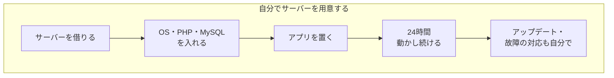
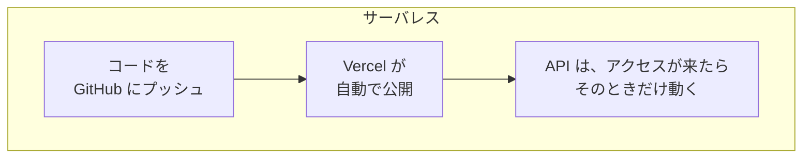
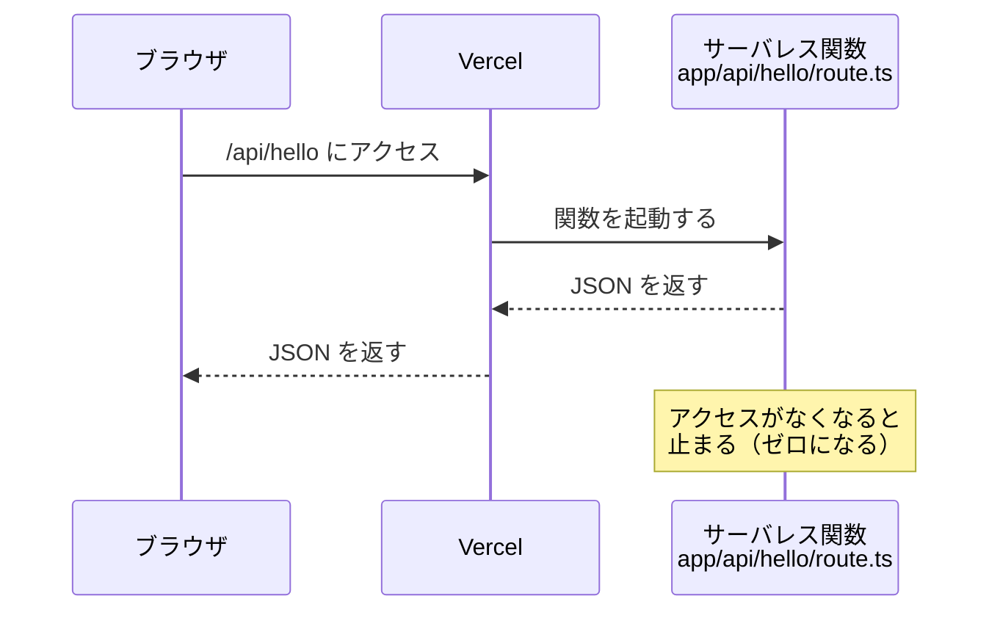

# サーバレスについて

デプロイコースで使う **Vercel** では、Next.js の API が「**サーバレス**」とよばれるしくみで動いています。
ここでは、サーバレスとは何かを、前期の Laravel と比べながら見ていきます。

[自由制作 A. デプロイコースに戻る](./2026_10_09_資料2.md)

---

## 1. サーバレスとは

**サーバレス（Serverless）** は、「サーバーがない」という意味ではありません。
サーバーは **ちゃんとあります**。でも、**サーバーの準備や管理を自分でしなくていい** しくみのことです。

> 💡 **たとえるなら「タクシー」**
> - **自分でサーバーを用意する** ＝ 車を買う。駐車場・車検・ガソリン・故障の修理も全部自分でやる
> - **サーバレス** ＝ タクシーに乗る。行き先を伝えるだけで、車の管理は運転手（会社）がやってくれる
>
> どちらも「車」は使っています。違うのは **管理をだれがするか** です。

---

## 2. 前期のやり方と比べてみよう

前期は、自分のPCで `php artisan serve` を動かして、Laravel のサーバーを起動していました。
もしこれをインターネットに公開するなら、**ずっと動き続けるサーバー** を自分で用意する必要があります。





| | 自分でサーバーを用意する | サーバレス（Vercel など） |
|---|---|---|
| サーバーの準備 | 自分でやる（OS・ソフトを入れる） | **いらない** |
| 動いている時間 | **24時間ずっと** | **アクセスが来たときだけ** |
| アクセスが急に増えたら | 自分でサーバーを増やす | **自動で増える** |
| アップデート・セキュリティ対策 | 自分でやる | サービスがやってくれる |
| お金 | 使っていなくてもかかる | **使った分だけ**（少しなら無料） |

---

## 3. 「アクセスが来たときだけ動く」とは

サーバレスの一番の特ちょうは、**呼ばれたときだけ動く** ことです。

資料2で作った Next.js の API（`app/api/〇〇/route.ts`）は、Vercel にデプロイすると **サーバレス関数（Vercel Functions）** として動きます。



```ts
// app/api/hello/route.ts
export async function GET() {
  return Response.json({ message: "こんにちは" });
}
```

自分で書くのは **この関数だけ** です。
「サーバーを起動する」「ポート番号を決める」といった作業は、Vercel がやってくれます。

---

## 4. Supabase はサーバレス？

Supabase も **サーバーの管理をしなくていい** という点は同じです。前期は MySQL を自分の PC（XAMPP や Homebrew）で動かしていましたが、
Supabase では、**データベースの準備や API づくりを Supabase がやってくれます**。

| やること | 前期（Laravel ＋ MySQL） | Supabase |
|---------|------------------------|----------|
| データベースを動かす | XAMPP などで自分で起動 | Supabase が動かしてくれる |
| テーブルを作る | マイグレーションを書く | Table Editor で作れる |
| データを出し入れするAPI | コントローラー・ルートを自分で書く | **自動で用意される** |

ただし、Supabase のデータベースは **呼ばれたときだけ動くわけではありません**。
プロジェクトごとにデータベース用のサーバーが用意されて、**ずっと動き続けています**（無料プランで1週間ほど使わないと一時停止するのは、このためです）。

| | Vercel の API（サーバレス関数） | Supabase のデータベース |
|---|---|---|
| サーバーの管理 | しなくていい | しなくていい |
| 動いている時間 | **呼ばれたときだけ** | **ずっと動いている** |
| 種類 | サーバレス（FaaS） | **BaaS**（バックエンドをまかせるサービス） |

> ⚠️ **無料プランには自動バックアップがない**
> Supabase が毎日自動でバックアップをとってくれるのは、有料プランだけです。
> 無料プランでは、消えて困るデータは自分で書き出して（エクスポートして）おきましょう。

> 📝 **「サーバレス」という言葉の使われ方**
> 「サーバーの管理をしなくていい」という広い意味で、Supabase のようなサービスも「サーバレス」とよばれることがあります。
> でも、この資料でいう「呼ばれたときだけ動く」サーバレスとは少し違うので、Supabase は **BaaS** として覚えておきましょう。
> → [IaaS・PaaS・SaaS・BaaSについて](./IaaS_PaaS_SaaS_BaaSについて.md)

---

## 5. いいところ・気をつけるところ

### いいところ 👍

- **すぐ公開できる**：GitHub にプッシュするだけでデプロイできる
- **お金がかかりにくい**：使った分だけ。学生の個人アプリなら無料プランで十分
- **アクセスが増えても大丈夫**：自動で処理できる量が増える
- **アプリづくりに集中できる**：サーバーの管理を考えなくていい

### 気をつけるところ ⚠️

| 気をつけること | どういうこと？ |
|---------------|--------------|
| **最初のアクセスが少し遅いことがある** | しばらく使われていないと関数が止まっているため、起動に時間がかかる（**コールドスタート** という）。今の Vercel ではかなり短くなるよう工夫されている |
| **長い処理は苦手** | 1回の処理に時間の上限がある（Vercel の無料プランでは **最大5分**）。重い処理には向かない |
| **データを関数の中に保存できない** | 関数はいつ止まるかわからないので、変数やファイルに保存しても **次に残っているとは限らない** → **データは Supabase に保存** する |
| **無料プランには上限がある** | 使いすぎると止まることがある。有料プランは選ばないように |

> 📝 **「データは関数の中に残らない」はとても大事**
> Laravel のときと同じように、**データはデータベースに保存する** のが基本です。
> サーバレス関数の中の変数は、次のアクセスのときには **消えているかもしれない** と考えましょう。
> 逆に、Vercel では1つの関数が複数のアクセスを同時に処理することもあるので、**別の人のアクセスと変数が共有されてしまう** こともあります。ユーザーごとのデータを関数の外側の変数に入れるのはやめましょう。

---

## 6. もしサーバレスを使わなかったら？（EC2 で動かす場合）

サーバレスのありがたさは、**自分でサーバーを用意したとき** と比べるとよくわかります。
ここでは、AWS の **EC2**（インターネットの向こうにある PC を1台借りるサービス）で動かす場合を見てみます。

EC2 は **空っぽの PC（Linux）** を借りるだけです。Node.js も PHP も入っていません。
→ くわしくは [IaaS・PaaS・SaaS・BaaSについて](./IaaS_PaaS_SaaS_BaaSについて.md) の IaaS を見ましょう。

### 6-1. Next.js を EC2 で動かすなら

| やること | 内容 | Vercel だと |
|---|---|---|
| 1. EC2 を作る | OS（Ubuntu など）を選んで起動する | いらない |
| 2. Node.js を入れる | `nvm` などで Node.js をインストールする | いらない |
| 3. コードを持ってくる | `git clone` する | GitHub をつなぐだけ |
| 4. 環境変数を置く | `.env.local` などを自分で作る | 画面で登録 |
| 5. ビルドして起動する | `npm ci` → `npm run build` → `npm run start` | 自動 |
| 6. ずっと動かし続ける | ターミナルを閉じても止まらないように、**PM2** などのツールを使う | 自動 |
| 7. ポートを開ける | EC2 の **セキュリティグループ** で 80番・443番を開ける | いらない |
| 8. Nginx を置く | Next.js は 3000番で動くので、**Nginx** で 80番・443番から転送する | いらない |
| 9. HTTPS にする | **Let's Encrypt** などで証明書を取り、更新も続ける | 自動 |
| 10. 更新するとき | 毎回ログインして `git pull` → ビルド → 再起動 | `git push` だけ |
| 11. 管理し続ける | OS のアップデート、セキュリティ対策、サーバーが落ちたときの対応 | いらない |

### 6-2. Laravel を EC2 で動かすなら

Laravel の場合は、さらに入れるものが増えます。

| やること | 内容 | 前期（自分の PC）では |
|---|---|---|
| 1. EC2 を作る | OS（Ubuntu など）を選んで起動する | 自分の PC |
| 2. PHP を入れる | PHP 本体と、Laravel が使う拡張機能（`mbstring`・`xml`・`curl`、MySQL につなぐための `pdo_mysql` など） | XAMPP や Homebrew |
| 3. Composer を入れる | PHP のパッケージを管理するツール | 入れた |
| 4. Web サーバーを入れる | **Nginx ＋ PHP-FPM**（PHP を動かすしくみ）を入れ、`public/` フォルダを公開する設定をする | `php artisan serve` |
| 5. MySQL を用意する | EC2 に自分で入れるか、AWS の **RDS**（データベースのサービス）を使う | XAMPP や Homebrew |
| 6. コードを持ってくる | `git clone` → `composer install --no-dev` | 同じ |
| 7. `.env` を作る | `APP_ENV=production`・`APP_DEBUG=false`・DB の接続先などを書き、`php artisan key:generate` | 同じ（本番用の値にする） |
| 8. テーブルを作る | `php artisan migrate --force` | `php artisan migrate` |
| 9. 権限を設定する | `storage/` と `bootstrap/cache/` に、Web サーバーが書きこめるようにする | 気にしなくてよかった |
| 10. ポートを開ける・HTTPS | 80番・443番を開け、Let's Encrypt で証明書を取る | いらなかった |
| 11. 更新するとき | `git pull` → `composer install` → `migrate` → キャッシュの作り直し（`php artisan optimize`） | — |
| 12. 管理し続ける | OS・PHP のアップデート、セキュリティ対策、障害対応 | — |

> ⚠️ **本番で気をつけること**
> - **`php artisan serve` は本番では使いません。** 開発用の簡易サーバーで、たくさんのアクセスをさばく作りになっていないからです。かわりに Nginx ＋ PHP-FPM を使います（そのため、Next.js のときの PM2 はふつういりません）。
> - **`APP_DEBUG=true` のまま公開してはいけません。** エラー画面にパスワードなどの大事な情報が表示されてしまうことがあります。

### 6-3. くらべてみると

```mermaid
graph LR
    subgraph EC2 で動かす
        E1[OS] --> E2[Node.js / PHP] --> E3[Nginx・HTTPS] --> E4[DB] --> E5[アプリ]
    end
    subgraph Vercel ＋ Supabase
        V1[アプリ<br>のコードだけ]
    end
```

前期の生徒管理アプリ（Next.js ＋ Laravel API ＋ MySQL）を EC2 で公開しようとすると、**6-1 と 6-2 の両方** が必要になります。
デプロイコースで **Vercel ＋ Supabase** を使うのは、こうした準備や管理をまかせて、**アプリづくりに集中する** ためです。

> 💡 **EC2 で動かすことにも意味がある**
> 自分で全部やるのは大変ですが、そのぶん **サーバーのしくみがよくわかり**、なんでも自由に設定できます。
> 実際の会社でも EC2 のようなサーバーはよく使われています。興味がある人は、自由制作のあとにチャレンジしてみましょう。

---

## 7. まとめ

- サーバレスは「サーバーがない」ではなく、**サーバーの管理をしなくていい** しくみ
- **アクセスが来たときだけ** 動き、**使った分だけ** お金がかかる
- Vercel にデプロイした Next.js の API は **サーバレス関数** として動く
- Supabase も管理をまかせられるが、データベースは **ずっと動いている**。サーバレスというより **BaaS**
- データは関数の中ではなく、**データベースに保存** する
- EC2 のようなサーバーで動かすと、Node.js・PHP・Nginx・HTTPS・データベースなどを **全部自分で用意・管理** する必要がある

[自由制作 A. デプロイコースに戻る](./2026_10_09_資料2.md)
