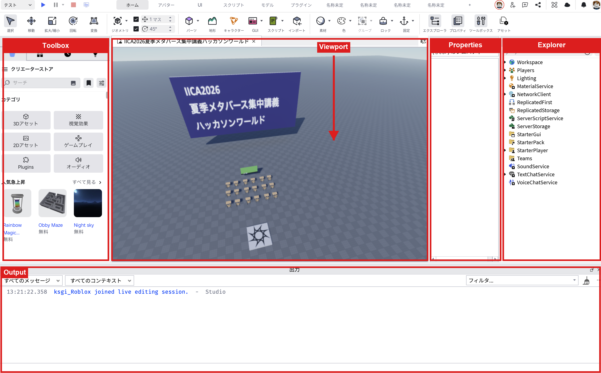
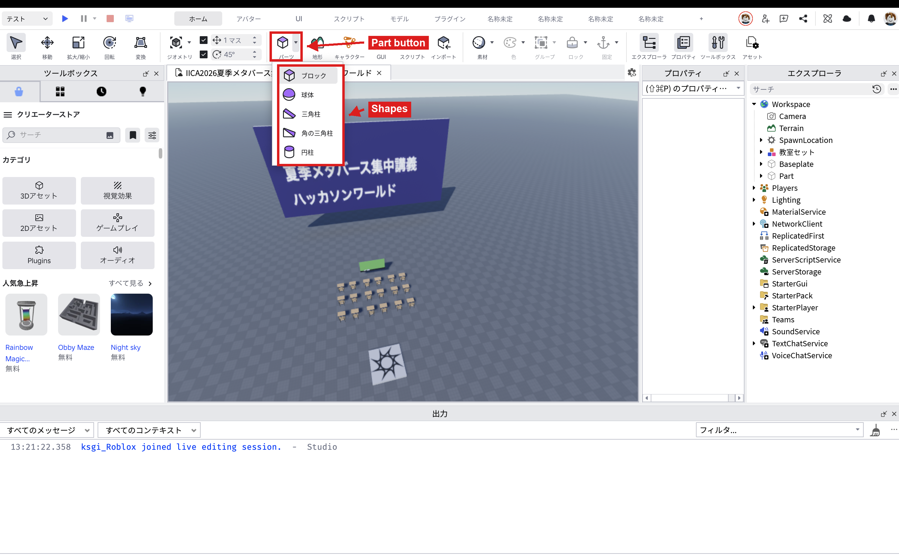
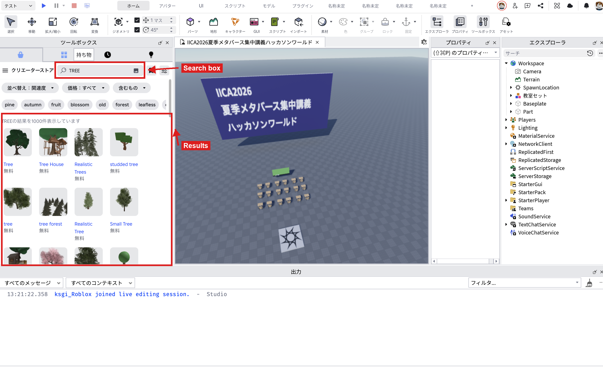
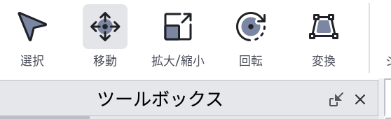
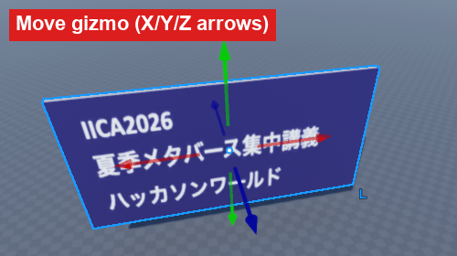
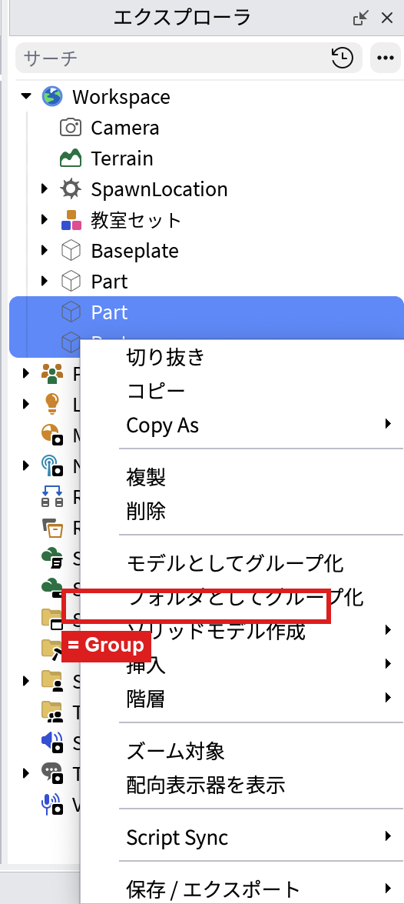
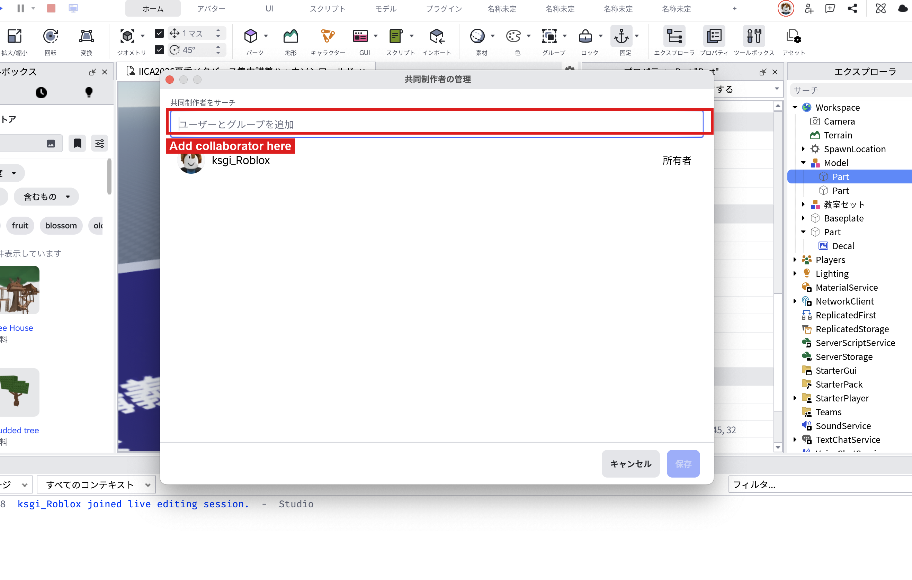
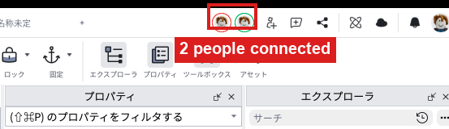

# Roblox Studio 基本操作リファレンス

想定用途：1日目2〜4限で扱うStudio操作の解説資料。**講師の説明を聞かなくても、このページだけを読んで手を動かせば同じ操作ができる**ことを目指して書いている。欠席した場合や、当日の内容を忘れて復習したい場合はこのページから読み直せばよい。進行台本（タイムテーブル・当日の話す内容）は `1日目/2限目.md`〜`4限目.md` を参照。

---

## 1. Studioを開いたときの画面構成

Robloxアカウントでログイン後、Studioを起動すると「新規ファイルテンプレート選択画面」が出る。一覧から「Baseplate（何もない平らな地面だけの空間）」を選んで開くところから始める。

Baseplateを開くと、以下4つの主要パネルが表示される。それぞれの役割を理解しておくと、この後の操作すべてが分かりやすくなる。

| パネル | どこにあるか | 役割 |
|---|---|---|
| Explorer（エクスプローラー） | 画面右側（上段） | シーン内の全オブジェクトがツリー（階層）で表示される場所。「今、空間の中に何が存在しているか」の一覧表。フォルダを開くのと同じ感覚で、クリックすると中身（子オブジェクト）が展開される |
| Properties（プロパティ） | 画面右側（下段） | Explorerで選択中のオブジェクトの詳細設定（位置・サイズ・色など）を編集する場所。**Explorerで「何を選ぶか」→Propertiesで「その中身をどう変えるか」という2段階の操作**になる |
| Toolbox（ツールボックス） | 画面左側 | Roblox上に公開されている既存のモデル・画像・音声などを検索し、自分の空間に配置できる場所 |
| Output（出力） | 画面下部 | エラーメッセージや、スクリプトの`print`命令で出力した文字が表示される場所。Luaスクリプトを書き始める2日目以降によく使う |
| Viewport（ビューポート） | 画面中央 | 実際の3D空間が表示されるメイン画面。ここでパーツを見たり、視点を動かしたりする |

- **Properties／Toolboxが表示されていない場合**：上部メニューの`View`タブを開き、該当パネル名にチェックを入れると再表示される
- 各パネルはドラッグして位置を動かしたり、タブとして重ねたりできる。操作に慣れないうちは、初期配置のまま触ってよい

---

## 2. Viewport（3D空間）の操作

Viewport内をマウスでどう動くかを覚えないと、この後の作業すべてがやりづらくなる。最初にここだけ集中して練習するとよい。

| 操作 | 方法 |
|---|---|
| 視点回転 | マウスの右ボタンを押しながらドラッグ |
| ズームイン・アウト | マウスホイールを回す |
| 視点の平行移動（上下左右） | マウスホイールを押し込みながらドラッグ、または`W`（前進）`A`（左）`S`（後退）`D`（右）＋右ドラッグでの視点操作を組み合わせる（FPSゲームのカメラ操作に近い） |
| 特定のオブジェクトにカメラを寄せる | オブジェクトをExplorerかViewportでクリックして選択し、キーボードの`F`キーを押す |

**ミニ演習**：Baseplateを開いたら、まず何もパーツを置かずに、右ドラッグとホイールだけで空間の中を自由に見て回れるか試してみる。ここで視点操作に慣れておくと、後の作業が格段に楽になる。

---

## 3. オブジェクト（パーツ）を設置する

Robloxでモノを作る＝「パーツ（Part）」と呼ばれる基本図形を配置し、それを組み合わせていく作業になる。パーツの置き方には大きく2種類ある。

### 3-1. 新しいパーツをゼロから配置する

1. 画面上部の「Home」タブを開く
2. 「Part」ボタンをクリックする（ボタンの右下に小さな▼がある場合は、そこから直方体（Block）・球（Ball）・くさび形（Wedge）・円柱（Cylinder）などの形を選べる。特に指定がなければ直方体でよい）
3. クリックすると、Viewportの中央付近（多くの場合Baseplateの上）に灰色のパーツが1つ出現する
4. Explorerの`Workspace`の中に、今置いたパーツが新しい項目として追加されているのを確認する（Workspaceは「実際にプレイヤーが触れる空間」の入れ物だと考えてよい）

別の方法として、Explorer上で`Workspace`を右クリック→「Insert Object」→一覧から`Part`を選ぶことでも同じ結果になる。ボタンから置くかExplorerから置くかは好みでよい。

### 3-2. Toolboxから既存モデルを配置する

自分でゼロから形を作らなくても、Roblox上に公開されている家具・木・建物などのモデルをそのまま使うことができる。

1. 画面左のToolboxで、検索欄にキーワード（例：「tree」「chair」など）を入力する
2. 検索結果の一覧からモデルをクリックすると、Viewport内（多くの場合原点付近）に自動的に配置される
3. 配置後は3-3・4章の操作でパーツと同じように移動・拡大縮小ができる

- 無料で使えるものと、Robuxが必要なものが混在しているので、検索結果の価格表示を確認してから使う
- 講習用途では「Free（無料）」のものだけを使うよう案内する

### 3-3. 配置したオブジェクトを狙った位置に正確に置く

適当に置いただけだと、パーツ同士が浮いていたり、めり込んでいたりする。正確に配置するには2つの方法がある。

**方法A：ドラッグで直感的に動かす（4章のMoveツールを使う）**
大まかな位置決めに向いている。細かい数値までは合わせにくい。

**方法B：Propertiesパネルに数値を直接入力する**
1. 位置を合わせたいパーツをクリックして選択する
2. Propertiesパネルの`Position`という項目を探す（X・Y・Zの3つの数値が並んでいる）
3. 数値を直接書き換えると、その座標にパーツが移動する（`X`＝左右、`Y`＝上下、`Z`＝前後、と覚えるとよい）
4. 同様に`Size`（大きさ）もX・Y・Zの数値で調整できる

「他のパーツにぴったりくっつけたい」ときは、くっつけたい相手のパーツの`Position`と`Size`の数値をProperties上で確認し、その数値をもとに計算して隣に置くパーツの`Position`を決める、という考え方をすると狙った位置に置きやすい。

---

## 4. パーツを編集する（移動・回転・拡大縮小・複製・削除）

配置したパーツを選択した状態で、画面上部の「Home」タブにある各ツールを使う。ツールのアイコンは画面左上、「選択」アイコンのすぐ右に「移動」「拡大/縮小」「回転」「変換」の順で並んでいる。

| 操作 | 方法 | 補足 |
|---|---|---|
| 移動 | Move ツール（矢印アイコン）を選び、パーツに表示される赤・緑・青の矢印をドラッグする | 矢印はそれぞれX・Y・Z軸に対応。矢印をつかんでドラッグすると、その軸方向にだけ動く |
| 回転 | Rotate ツール（曲がった矢印アイコン）を選び、表示される円をドラッグする | 円をつかんでドラッグすると、その軸を中心に回転する |
| 拡大縮小 | Scale ツール（四角いハンドルのアイコン）を選び、パーツの角や面のハンドルをドラッグする | 数値で正確に決めたい場合はPropertiesの`Size`を直接編集する |
| 複製 | パーツを選択した状態で`Ctrl+D` | 元のパーツとまったく同じものがもう1つ生成される。複製後は少しズレた位置に出るので、そのままMoveツールで動かす |
| 削除 | パーツを選択して`Delete`キー | Explorer上で右クリック→「Delete」でも可 |
| 操作の取り消し（Undo） | `Ctrl+Z` | 操作を間違えたら遠慮なく使ってよい。壁や床を組み立てる練習中は特に多用することになる |

**壁や床を組み立てる基本の流れ**：1枚パーツを配置→複製（`Ctrl+D`）→Moveツールで少しずらす、を繰り返すと、同じ形のパーツを並べて壁や床を作れる。

---

## 5. 見た目を変える（色・マテリアル）

1. 色やマテリアルを変えたいパーツを選択する
2. Propertiesパネルから`Color`（色）の項目を探し、クリックしてカラーパレットから好きな色を選ぶ、またはRGB数値を直接入力する
3. Propertiesパネルから`Material`（材質）の項目を探し、プルダウンから「Wood（木）」「Concrete（コンクリート）」「Metal（金属）」などを選ぶと質感が変わる

色を変えるだけでもパーツの印象は大きく変わるので、装飾に時間をかけたい場合はまずここを触るのがおすすめ。

---

## 6. 複数パーツをまとめる（グループ化）

家や台のように複数パーツで1つのものを作った場合、バラバラのままだと後で扱いにくい。まとめて1つの部品として管理できる。

1. まとめたい複数のパーツを、`Ctrl`キーを押しながらクリックして複数選択する（Viewport上でドラッグして範囲選択してもよい）
2. 選択した状態で右クリック→「モデルとしてグループ化」（Group）を選ぶ（Studioのバージョンによっては単に「Group」と表示される場合もある）
3. Explorer上で、選んだパーツたちが`Model`という1つのまとまりの中に入っていることを確認する

グループ化すると、Model自体を選んでMoveツールで動かすだけで、中の全パーツがまとめて移動する。以降のチーム共同制作や講習全体を通してよく使う操作。

---

## 7. 落ちないように固定する（Anchored）

Robloxの世界には重力がある。Playモード（実際にプレイヤーとして動き回るモード）で確認すると、通常のパーツはただ置いただけでは下に落ちてしまう。地面や建物など、動いてほしくないパーツは「Anchored（固定）」にしておく必要がある。

1. 固定したいパーツ（またはグループ化したModel内の全パーツ）を選択する
2. Propertiesパネルから`Anchored`の項目を探し、チェックボックスにチェックを入れる
3. チェックを入れたパーツは、Playモードで再生しても重力の影響を受けず、その場に固定され続ける

**確認方法**：画面上部の「Play」ボタンを押すとPlayモードになり、実際にキャラクターとして空間内を歩き回れる。ここで自分が作ったパーツが落下していないかを確認する。「Stop」ボタンで通常の編集画面に戻る。

---

## 8. キャラクターの初期ステータスを変える（StarterPlayer）

プレイヤーキャラクターには、体力（Health）・移動速度（WalkSpeed）・ジャンプの高さ（JumpHeight）という3つの基本ステータスがある。コードを書かなくても、`StarterPlayer`というオブジェクトのPropertiesパネルから、ゲーム全体の初期値をまとめて変更できる。

1. Explorerで`StarterPlayer`を選択する（`Workspace`と同じ階層にある）
2. Propertiesパネルから以下の項目を探す

| プロパティ名 | 意味 | デフォルト値 |
|---|---|---|
| `CharacterMaxHealth` | 体力の最大値 | 100 |
| `CharacterWalkSpeed` | 移動速度 | 16 |
| `CharacterJumpHeight` | ジャンプの高さ（スタッド単位） | 7.2 |
| `CharacterUseJumpPower`| ジャンプの高さ指定方法を`JumpHeight`ではなく`JumpPower`（速度ベース）にするかどうか | オフ（false） |

3. 数値を書き換えてPlayモードに入り、実際の動き・ジャンプの高さが変わることを確認する

- **どこで使うか**：ゲーム全体の基本バランス（初期状態でどれくらいのスピード・体力にするか）を決めたいとき。特定のパーツに触れたときだけ一時的に変えたい場合は`02_Lua基礎文法リファレンス.md`の8-4〜8-6章（コードで書く方法）を参照
- **よくあるエラー**：`CharacterUseJumpPower`がオフ（デフォルト）の状態で`CharacterJumpPower`だけを書き換えても、ジャンプの高さは変わらない。ジャンプの高さを変えたい場合は`CharacterJumpHeight`の方を書き換える

---

## 9. Team Create（複数人での同時編集）の手順

チームメンバー全員が同じ空間に同時に入り、リアルタイムで一緒に編集できる機能。

1. チームで「Place作成担当（リーダー）」を1名決める
2. リーダーがRobloxの「Create」ページ（[https://create.roblox.com](https://create.roblox.com)）で新規Placeを作成し、チーム名を付ける
3. リーダーが、作成したPlaceの設定画面から「Collaborators（コラボレーター）」の項目を開き、他のメンバーをRobloxのユーザー名で検索して招待する。権限は「編集可能（Can Edit）」にする
4. メンバー側は、Robloxからの招待通知を承認する
5. 全員がStudioからそのPlaceを開くと、画面右上に参加中のメンバーのアイコンが並んで表示される。これがTeam Create接続の成功サイン
6. 誰か1人がパーツを動かすと、他のメンバーの画面にもリアルタイムで反映される

---

## 10. よくあるトラブルと対処

| 症状 | 対処 |
|---|---|
| Studioが起動しない／重い | 学校PCのスペック差が原因の場合が多い。`Robloxセットアップガイド.md`の該当章を参照し、描画設定を下げる |
| Team Createで他メンバーが見えない | Place作成者の権限設定（Collaborators）を再確認する。招待メールやRoblox内通知の見落としが多い |
| Wi-Fiが不安定でPlaceが同期しない | 座席とアクセスポイントの位置関係を確認する。詰まった場合は講師PCのホットスポット等を予備手段として使う |
| パーツが選択できない／消えた | `Ctrl+Z`でUndoできる |
| Propertiesパネルが表示されない | `View`タブから`Properties`にチェックを入れる |
| 同時編集でPCが重くなる | 不要なパーツを都度Deleteして整理する。Team Createは同時接続人数が多いほど負荷が上がりやすい |
| パーツを置いたのに見当たらない | Explorerの`Workspace`内に本当に追加されているか確認する。原点（0,0,0）から離れた位置に飛んでいる場合があるので、Explorerでパーツを選択して`F`キーを押すとカメラがそこに移動する |
| Playモードでパーツが落ちてしまう | Propertiesの`Anchored`にチェックが入っているか確認する（7章参照） |

---

## 11. この先を学ぶための道しるべ

ここまでの操作を組み合わせると、パーツを置く・変形する・色を変える・チームで同時編集する、という1日目の内容が一通りできる状態になる。次に何かを「動かす」「反応させる」段階に進む場合は、`02_Lua基礎文法リファレンス.md`（プログラミングの基礎）に進む。
