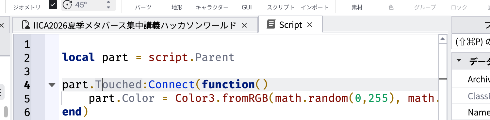
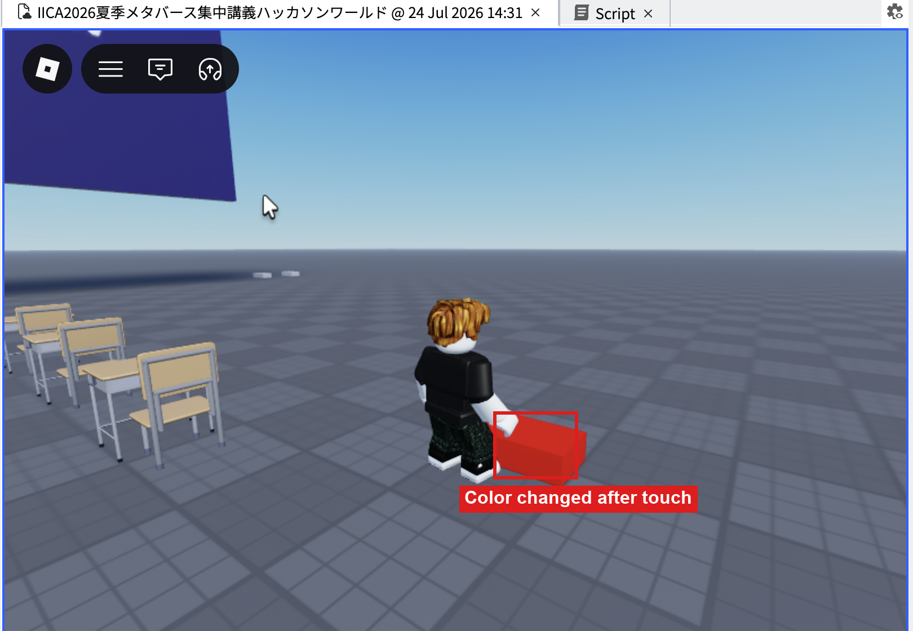
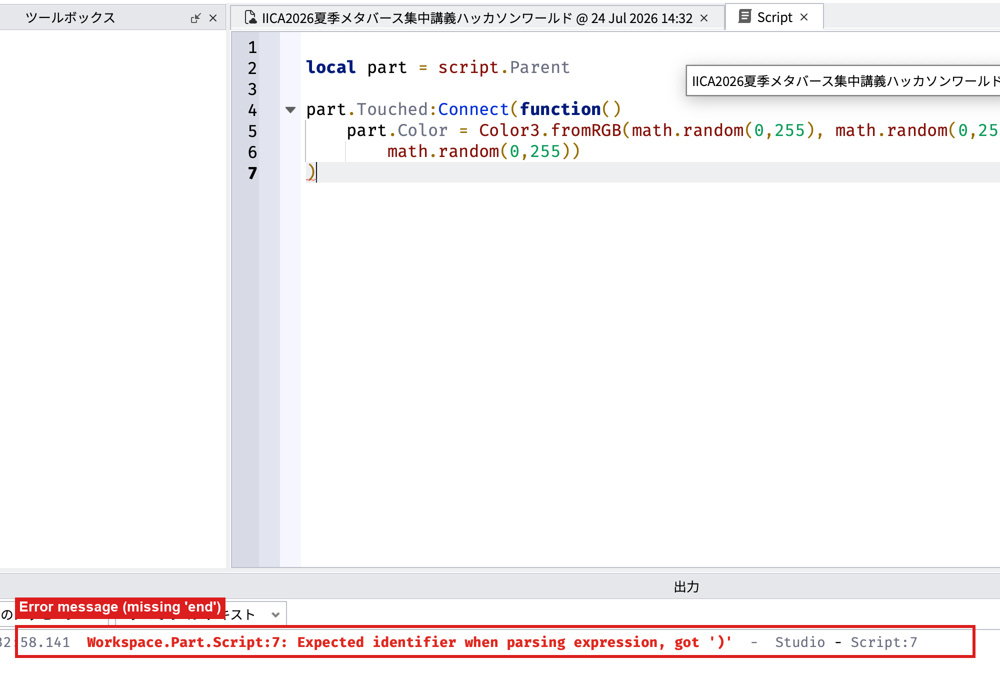

# Lua基礎文法リファレンス

対象：専門学校生（IT・ゲーム・クリエイティブ専攻）
想定用途：1日目4限（初めてのLua体験）〜2日目1限（コイン集めゲーム講義）で扱うLuaの基本文法の解説資料。**講師の説明がなくても、このページだけを読んでコードの意味が理解できる**ことを目指して書いている。プログラミング未経験でも読めるよう、専門用語には都度説明を付けている。PHPなどのサーバーサイド言語の経験がある人向けの対比表も用意しているが、経験がなくても問題なく読める。

---

## 1. そもそも「スクリプトを書く」とはどういうことか

Robloxでは、パーツなどのオブジェクトに`Script`（または`LocalScript`）という特別なオブジェクトを挿入し、その中にLuaという言語でコードを書くことで「動くギミック」を作る。

### スクリプトを挿入する手順

1. Explorerでスクリプトを追加したい対象（例：パーツ）を選択する
2. 右クリック→「Insert Object」を選ぶ
3. 一覧から`Script`（または`LocalScript`）を選ぶ
4. 対象の子オブジェクトとしてスクリプトが追加され、コードエディタが自動的に開く
5. エディタにLuaのコードを入力する
6. 画面上部の「Play」ボタンでPlayモードに入ると、書いたコードが実際に動き出す


### 最初のサンプル：触れたら色が変わるパーツ

```lua
local part = script.Parent

part.Touched:Connect(function()
    part.Color = Color3.fromRGB(math.random(0,255), math.random(0,255), math.random(0,255))
end)
```

1行ずつ意味を分解すると以下の通り。

| コード | 意味 |
|---|---|
| `local part = script.Parent` | `script.Parent`は「このスクリプトが挿入されている親オブジェクト（＝このパーツ自身）」を指す。それを`part`という名前の変数に入れている |
| `part.Touched` | パーツに何か（プレイヤーの体など）が触れたときに発生する「イベント」 |
| `:Connect(function() ... end)` | 「そのイベントが起きたら、`function() ... end`の中の処理を実行する」という登録 |
| `part.Color = Color3.fromRGB(...)` | パーツの色を、指定したRGB値に変更する |
| `math.random(0,255)` | 0〜255のランダムな整数を返す関数。色のRGB値（0〜255の範囲）を毎回変えるために使っている |

**確認方法**：このスクリプトを対象パーツに挿入した状態でPlayモードに入り、そのパーツに自キャラクターで触れると、パーツの色がランダムに変わる。

**エラーが出た場合**：Outputパネルに赤字でエラーメッセージが表示される。学習中にエラーが出るのはごく普通のことなので、過度に心配しなくてよい。エラーメッセージには「何行目に問題があるか」が書かれているので、まずそこを確認する。





---

## 2. Robloxの「オブジェクトの世界」を理解する

Luaの文法に入る前に、Roblox特有の考え方を押さえておくと、この先のコードが読みやすくなる。

- Robloxの空間の中にあるものは、すべて「オブジェクト（Instance）」と呼ばれる箱のようなもの。パーツもスクリプトもGUIも、すべて同じ仕組みのオブジェクトの一種
- オブジェクトはExplorer上で親子関係（階層構造）を持つ。フォルダの中にファイルが入っているのと同じイメージ
- Luaのコードから、あるオブジェクトを指す（参照する）には、Explorer上の階層をそのまま`.`（ドット）でつないで書く

| 書き方 | 意味 |
|---|---|
| `script.Parent` | このスクリプトの親（1つ上の階層）のオブジェクト |
| `workspace.Coin` | `Workspace`の直下にある、名前が`Coin`のオブジェクト |
| `game.Players` | ゲーム全体（`game`）の中の`Players`という機能 |


- 各オブジェクトは「プロパティ（Properties）」という設定値を持っている（パーツで言えば`Color`や`Position`など）。Luaのコードから`パーツ名.プロパティ名 = 値`という形で書き換えられる
- 各オブジェクトは「イベント（Event）」という「何かが起きた瞬間」の合図を持っている（`Touched`＝触れられた瞬間、など）。`:Connect(関数)`で、そのイベントが起きたときに実行する処理を登録する

---

## 3. Lua基本文法

暗記より「知っている概念の言い換え」であることを意識すると理解が早い。プログラミング未経験の場合は、まず「変数」「if文」「for文」「関数」の4つだけ理解すればこの先のコードは読めるようになる。

### 変数：値に名前をつけて覚えておく

```lua
local score = 0
local playerName = "Taro"
```

- `local`は「この変数はここから使えるようにする」という宣言
- 数値（`0`）や文字列（`"Taro"`、ダブルクォートで囲む）など、いろいろな種類の値を入れられる
- 後から`score = score + 1`のように書き換えることもできる（「scoreに、scoreプラス1を入れ直す」という意味）

### if文：条件によって処理を分ける

```lua
if score > 0 then
    print("スコアがあります")
else
    print("スコアはゼロです")
end
```

- `if 条件 then ... end`が基本形。条件が成り立つときだけ、間の処理が実行される
- `else`をつけると「条件が成り立たなかったときの処理」も書ける
- Luaでは、ブロックの終わりに必ず`end`を書く（PHPやJSの`{ }`に相当する役割）

### for文：同じ処理を繰り返す

```lua
for i = 1, 10 do
    print(i)
end
```

- `i`が1から10まで1ずつ増えながら、間の処理が10回繰り返される
- 「配列やリストの中身を1つずつ処理したい」ときにも使う（`for _, obj in ipairs(一覧) do ... end`という形。3-5章のコードスニペット集で実例を扱う）

### 関数：処理をひとまとまりにして名前をつける

```lua
local function greet()
    print("こんにちは")
end

greet()
```

- `local function 名前() ... end`で処理のまとまりを定義する
- 定義しただけでは実行されない。`greet()`のように「呼び出す」ことで初めて中身が実行される
- Robloxでは`function(hit) ... end`のように、名前をつけずにその場で関数を作ることも多い（`:Connect()`の中身などがその例）

### コメント：コードの中のメモ書き

```lua
-- これはコメント。Luaの実行には影響しない
local score = 0 -- スコアの初期値
```

`--`から行末までがコメントになる。

---

## 4. Lua基本文法（PHP対比表）

PHPなどのサーバーサイド言語の経験がある場合は、以下の対比で素早く感覚をつかめる。

| 内容 | Lua | PHP（参考） |
|---|---|---|
| 変数 | `local score = 0` | `$score = 0;` |
| if文 | `if score > 0 then ... end` | `if ($score > 0) { ... }` |
| for文 | `for i = 1, 10 do ... end` | `for ($i = 1; $i <= 10; $i++) { ... }` |
| 関数定義 | `local function foo() ... end` | `function foo() { ... }` |
| コメント | `-- コメント` | `// コメント` |

構文の違いはあるが、考え方（変数に代入する、条件で分岐する、繰り返す、処理をまとめる）はPHPと同じ。

---

## 5. Script と LocalScript の違い

Roblox開発でつまずきやすい最大のポイントがこれ。最初にしっかり理解しておく。

| 種類 | 実行される場所 | PHP/Web開発でのアナロジー | 主な用途 |
|---|---|---|---|
| `Script` | サーバー側（Robloxのサーバー上、全員に共通） | Laravelのコントローラー・処理と同じ立ち位置 | 全プレイヤー共通の処理（スコア計算、アイテム管理など） |
| `LocalScript` | 各プレイヤーの画面側だけ（クライアント） | Bladeで出したHTMLをJSで動かす部分に近い | 画面表示・演出など、その人にしか関係ない処理 |

判断基準：「サーバーで確定させたい処理は`Script`、見た目だけの処理は`LocalScript`」

- `LocalScript`は`StarterGui`や`StarterPlayerScripts`など、クライアント側で実行される場所に置く必要がある。`ServerScriptService`に`LocalScript`を置いても動かない
- 確認方法：複数人が同じPlaceに入った状態で、`Script`内の`print`はサーバーのOutputに、`LocalScript`内の`print`はその人自身の画面のOutputにだけ表示される。この違いを実際に試すと感覚がつかみやすい
- なぜ分かれているのか：オンラインゲームでは「本当に正しい情報（スコアやアイテム所持数など）」をサーバー側だけで管理しないと、悪意のあるプレイヤーが自分の画面の情報を書き換えてズルをできてしまう。だからこそ「確定させたい処理」はサーバー（`Script`）で行う、というのがオンラインゲーム開発共通の考え方になっている


---

## 6. よく出てくるオブジェクト参照の読み方

| 記法 | 意味 |
|---|---|
| `game:GetService("Players")` | Robloxの標準機能（この場合はプレイヤー管理機能）を呼び出す。PHPで言えば必要な機能をimportして使う感覚に近い |
| `game.Players.LocalPlayer` | 今この画面を見ている自分自身のプレイヤーを取得（`LocalScript`内でのみ使える）。Laravelの`Auth::user()`に近い |
| `Instance.new("Folder")` | 新しいオブジェクトを空間内に生成する。`"Folder"`の部分を`"Part"`などに変えれば別の種類のオブジェクトを生成できる |
| `hit.Parent` | パーツに触れた対象（`hit`）の親オブジェクトを取得。プレイヤーキャラクターかどうかを判定する際の起点になる |
| `WaitForChild("名前")` | 指定した名前の子オブジェクトが存在するまで待ってから取得する（`RemoteEvent`などの参照でよく使う） |

---

## 7. よくあるエラーと読み方

| 症状 | 原因・対処 |
|---|---|
| スクリプトが反応しない | `script`を挿入した先が対象オブジェクトの子になっているか、Explorer上で確認する |
| `nil`に関するエラー | 参照しようとしたオブジェクトの名前が間違っている（スペルミス）ことが多い。Explorerで実際の名前を確認する |
| `LocalScript`が動かない | 置き場所が`ServerScriptService`など、サーバー側の場所になっていないか確認する（5章参照） |
| `end`の数が合わないというエラー | `if`・`for`・`function`はそれぞれ対応する`end`が必要。どこか1つ書き忘れていないか確認する |

---

## 8. よく使う簡単な操作

コイン集めゲーム本体に入る前に、応用制作でもよく使う3つの操作を紹介する。いずれも短いコードで動かせるので、`02-01`〜`02-06`の内容を理解していれば読める。

### 8-1. オブジェクトを動かす（移動スクリプト）

動かしたいパーツに`Script`を挿入する（`LocalScript`ではない点に注意。全員に共通して見える動きにするため、必ずサーバー側の`Script`を使う。`LocalScript`は`Workspace`直下のパーツに置いても実行されないので動かない）。

```lua
local part = script.Parent

while true do
    part.Position = part.Position + Vector3.new(0, 0.1, 0)
    task.wait()
end
```

- **コードの意味**：`while true do ... end`は「ずっと繰り返す」という意味の構文（`for`が回数を決めて繰り返すのに対し、`while true`は終わりを指定しない無限ループ）。`Vector3.new(0, 0.1, 0)`は「Y方向（上）に0.1だけ動かす距離」を表す。それを`part.Position`に足し続けることで、パーツが上に向かって一定方向に動き続ける。`task.wait()`は1フレームだけ待つ命令で、これがないと一瞬で動き終わってしまい、動きが見えない
- **どこで使うか**：上に上昇し続けるエレベーター、流れ続けるベルトコンベアなど、一方向に動き続けるギミック全般
- **発展**：往復させたい（上まで行ったら下に戻る等）場合は`Vector3.new`の符号を切り替える処理を追加する。滑らかな動きにしたい場合は`TweenService`という機能を使うと、加速・減速を含めたなめらかなアニメーションを簡単に作れる（このページでは扱わないが、検索すると解説が多く見つかる）

### 8-2. ServerStorageから複製して生成する（Clone）

「最初は空間に置かず、必要になったタイミングでコピーを生成する」という仕組み。敵キャラやアイテムを次々出現させたいときに使う。

1. Explorerで`ServerStorage`を右クリック→「Insert Object」で、生成したいパーツやモデルを作っておく（`ServerStorage`に置いたものはPlayモードでも最初は誰の目にも触れない、いわば「倉庫」）。ここでは`NormalPart`（普通のパーツ）と`DamagePart`（`8-3`のダメージスクリプトを入れたパーツ）の2種類を用意する
2. `ServerScriptService`などに`Script`を挿入し、以下を入力する

```lua
local ServerStorage = game:GetService("ServerStorage")
local normalTemplate = ServerStorage:WaitForChild("NormalPart")
local damageTemplate = ServerStorage:WaitForChild("DamagePart")

while true do
    local templates = {normalTemplate, damageTemplate}
    local chosenTemplate = templates[math.random(1, 2)]

    local clone = chosenTemplate:Clone()
    clone.Parent = workspace
    clone.Position = Vector3.new(-50, 15, math.random(-40, 40))
    task.wait(3)
end
```

- **コードの意味**：`{normalTemplate, damageTemplate}`は「テーブル」と呼ばれる、複数の値をひとまとめにする入れ物（PHPで言う配列に近い）。`templates[1]`が`normalTemplate`、`templates[2]`が`damageTemplate`を指す。`math.random(1, 2)`で1か2をランダムに選び、`templates[選ばれた番号]`とすることで、毎回どちらかのテンプレートをランダムに選んでいる。選んだ方を`template:Clone()`で複製し、`clone.Parent = workspace`で配置する。`Position`は`X = -50`・`Y = 15`で固定し、`Z`だけ`math.random(-40, 40)`にすることで、決まった高さ・決まった壁から、横方向の位置だけランダムにして降ってくるような配置になる。`while true do ... task.wait(3) ... end`で、これを3秒おきに繰り返し続ける
- **どこで使うか**：見た目は同じでもランダムで「安全なパーツ」と「危険なパーツ」が混ざって降ってくる、といった運要素のあるギミック（`04`のObby化などにも応用しやすい）
- **よくあるエラー**：`ServerStorage`に置いたオブジェクトの名前（`"NormalPart"`・`"DamagePart"`）と、コード内の`WaitForChild`で参照している名前が一致しているか確認する

### 8-3. 触れたらダメージを与える

コインを消す代わりに、触れたキャラクターの体力を減らすトラップを作る。`B`（コインのTouched処理）と考え方は同じで、`Destroy()`する代わりに`Humanoid`の体力を減らす。ダメージを与えるパーツには`B`と同様に`Script`を挿入する（`LocalScript`ではない）。

```lua
local part = script.Parent
local damageAmount = 10

part.Touched:Connect(function(hit)
    local character = hit.Parent
    local humanoid = character:FindFirstChild("Humanoid")

    if humanoid then
        humanoid:TakeDamage(damageAmount)
    end
end)
```

- **コードの意味**：`FindFirstChild("Humanoid")`で、触れてきた相手が本当にキャラクター（プレイヤーやNPC）かどうかを確認する。`Humanoid`が見つかった場合だけ`TakeDamage(damageAmount)`で体力を減らす。体力が0になるとそのキャラクターは倒れる
- **どこで使うか**：トゲ・炎・敵の攻撃判定など、触れると痛いギミック全般。`04`のObby化の「落下エリア」（`Health = 0`で即死させる例）は、このダメージ処理を「体力を全部奪う」形にした特殊なケースにあたる
- **注意点**：触れ続けている間は`Touched`が連続で発生するため、`TakeDamage`も連続で呼ばれ、体力がまとめて大きく減ることがある。1回のダメージ量を細かく調整したい場合は、次に触れるまでの間隔を空ける仕組み（デバウンス）を追加するとよいが、まずはこのシンプルな形で動作を確認するのがおすすめ

### 8-4. 触れたら体力を回復する（Health）

8-3とは逆に、触れると体力が回復するギミックを作る。

```lua
local part = script.Parent

part.Touched:Connect(function(hit)
    local character = hit.Parent
    local humanoid = character:FindFirstChild("Humanoid")

    if humanoid then
        humanoid.Health = humanoid.MaxHealth
    end
end)
```

- **コードの意味**：`humanoid.Health`は現在の体力、`humanoid.MaxHealth`は体力の最大値（初期設定は`01`の8章で紹介した`StarterPlayer`の`CharacterMaxHealth`）。現在値に最大値をそのまま代入することで、全回復させている
- **どこで使うか**：回復ポイント、セーブ地点的なギミックなど
- **よくあるエラー**：8-3と同様、パーツの上に乗り続けると`Touched`が連続発生し、その都度全回復し続ける（体力を減らすギミックと組み合わせる場合など、挙動を確認しておく）

### 8-5. 触れたらジャンプの高さを変える（JumpHeight）

```lua
local part = script.Parent

part.Touched:Connect(function(hit)
    local character = hit.Parent
    local humanoid = character:FindFirstChild("Humanoid")

    if humanoid then
        humanoid.JumpHeight = 20
    end
end)
```

- **コードの意味**：`humanoid.JumpHeight`にスタッド単位の高さを直接代入すると、その場からジャンプの高さが変わる
- **よくあるエラー（`JumpPower`を使うと効果が出ない）**：Humanoidには`JumpPower`（速度ベースの古いプロパティ）と`JumpHeight`（スタッド単位の高さで指定する現在の標準プロパティ）の2つがあり、どちらが実際に使われるかは`Humanoid.UseJumpPower`という真偽値で決まる。新しく作ったPlaceではデフォルトで`UseJumpPower`が`false`になっており、この場合`JumpPower`をいくら書き換えてもジャンプの高さは変わらない。**必ず`JumpHeight`の方を書き換える**こと（`01`の8章で紹介した`StarterPlayer`の`CharacterUseJumpPower`と同じ仕組み）

### 8-6. 触れたら移動速度を変える（WalkSpeed）

```lua
local part = script.Parent

part.Touched:Connect(function(hit)
    local character = hit.Parent
    local humanoid = character:FindFirstChild("Humanoid")

    if humanoid then
        humanoid.WalkSpeed = 32
    end
end)
```

- **コードの意味**：`humanoid.WalkSpeed`に数値を代入すると、その場から移動速度が変わる（初期値は`16`）
- **どこで使うか**：8-4〜8-6はいずれも、`04_応用アレンジパターン集.md`のObby化（ジャンプ力アップ台・スピードアップ台）で「一定時間だけ効果を出して元に戻す」という応用に発展させている

---

## 9. この先を学ぶための道しるべ

ここまでの内容で、Robloxのスクリプトが「何を」「どこに」「どういう考え方で」書かれているかが分かる状態になる。実際にコインを集めるゲームを作る具体的な手順は `03_コードスニペット集.md` で扱う。
