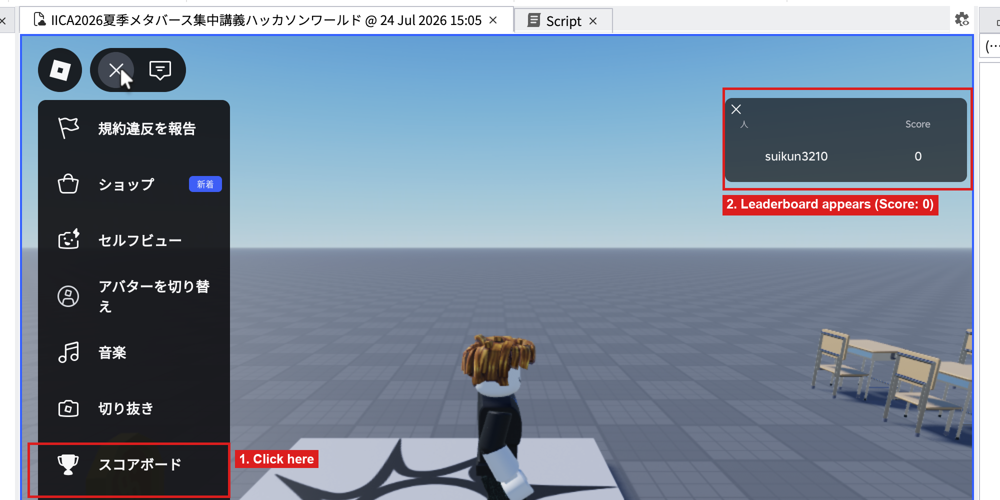
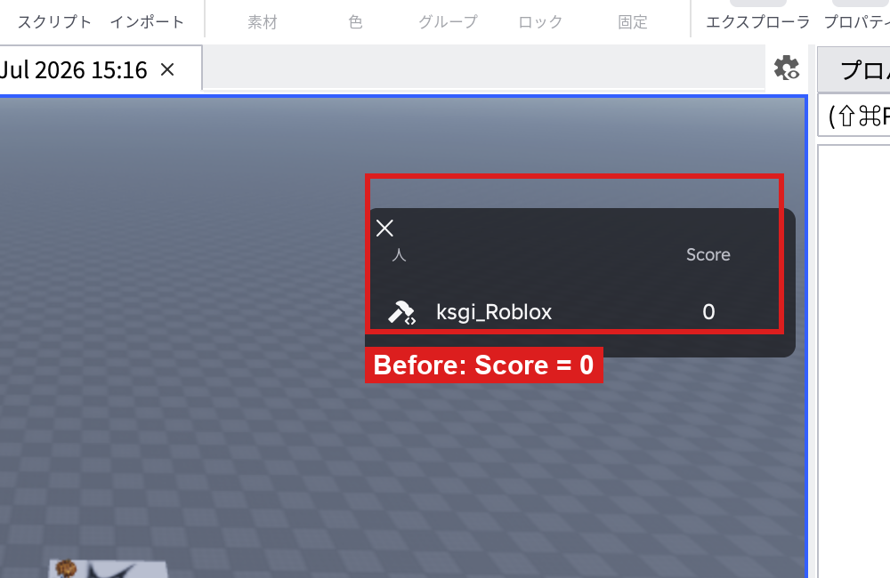
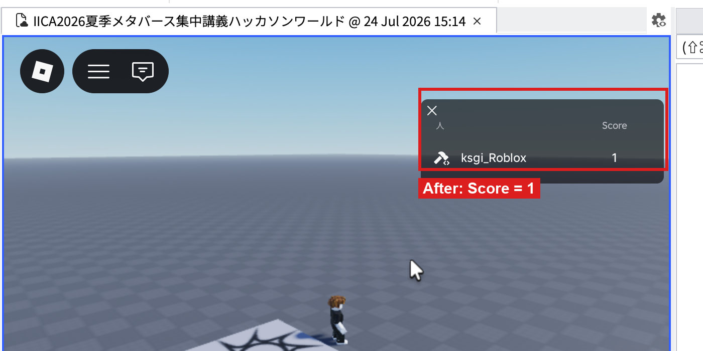
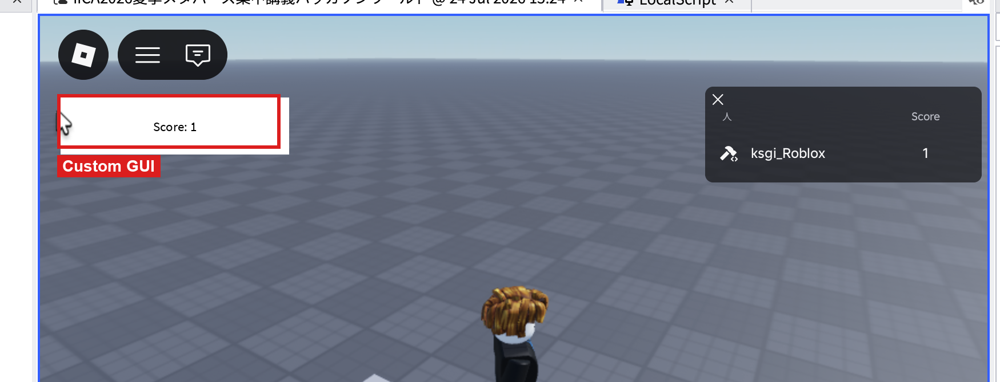

# コイン集めゲーム制作ガイド（コードスニペット集）

対象：専門学校生（IT・ゲーム・クリエイティブ専攻）
想定用途：1日目4限〜2日目2限で作る「コイン集めゲーム」を、**講師の説明がなくてもこのページだけを読みながら最初から最後まで作れる**ように、手順とコードをセットでまとめたガイド。文法そのものの解説は `02_Lua基礎文法リファレンス.md` を参照。Studioの基本操作（パーツの置き方など）は `01_Studio基本操作リファレンス.md` を参照。

このページは上から順番に進めると、1つの完成したコイン集めゲームができあがる構成になっている。

## 全体の完成イメージ

- 黄色いコイン（パーツ）が空間内に置かれている
- プレイヤーがコインに触れると、コインが消えてスコアが1増える
- 画面右上のRoblox標準リーダーボードにスコアが表示される
- 自分たちで作ったオリジナルのGUI（画面表示）にもスコアが表示される
- コインを全部集めると「クリア！」のメッセージが表示される


## 対応表（いつ・どこで登場するか）

| No. | スニペット | 初出タイミング |
|---|---|---|
| A | Touchedで色をランダムに変える（練習用） | 1日目4限 |
| B | コインに触れたら消える（Touched） | 2日目1限 |
| C | プレイヤー参加時にleaderstatsを作成 | 2日目1限 |
| D | コインでスコア加算（B＋leaderstats） | 2日目1限 |
| E | GUIでスコアを表示する（LocalScript） | 2日目2限 |
| F | RemoteEvent：サーバー側からクリア通知を送る | 2日目2限 |
| G | RemoteEvent：クライアント側で通知を受け取る | 2日目2限 |

---

## A. 練習：Touchedで色をランダムに変える

初めてのLua体験用の練習スニペット。ここではまだコイン集めゲーム本体は作らず、「触れたら何かが起きる」という感覚だけをつかむ。

### 手順

1. Viewportに直方体パーツを1つ配置する（`01_Studio基本操作リファレンス.md`の3-1章を参照）
2. Explorerでそのパーツを選択し、右クリック→「Insert Object」→`Script`を選ぶ
3. 開いたエディタに以下のコードを入力する

```lua
local part = script.Parent

part.Touched:Connect(function()
    part.Color = Color3.fromRGB(math.random(0,255), math.random(0,255), math.random(0,255))
end)
```

4. Playモードに入り、そのパーツに自キャラクターで触れてみる。色がランダムに変わることを確認する

- **どこで使うか**：`script`を挿入したパーツ自身（`script.Parent`）に対して処理する、最もシンプルなTouchedイベントの例
- **よくあるエラー**：反応しない場合は対象パーツの`CanCollide`（Propertiesパネルにある）がオフになっていないか確認する（プレイヤーキャラクターがすり抜けている場合が多い）

このスニペットは練習用なので、確認できたらパーツとスクリプトごと削除してよい。

---

## B. コインに触れたら消える（Touched）

ここからコイン集めゲーム本体の制作に入る。

### 手順

1. Viewportに円柱パーツを1つ配置する（`01`の3-1章参照。Partボタンの▼から「Cylinder」を選ぶ）
2. Explorerでそのパーツを選択し、Propertiesパネルの`Name`欄を`Coin`に書き換える（名前は必ずこの通りにする。後の手順で`"Coin"`という文字列を使って参照するため）
3. Propertiesパネルの`Color`を黄色に変更する（`05_見た目を変える`は`01`参照）

- **Toolboxの既製コインモデルを使う場合**：円柱パーツを自作する代わりに、Toolboxで見た目の良いコインモデル（`MeshPart`など）を検索して配置してもよい。その場合も`Name`を`Coin`にすることだけ忘れなければ、この先の手順はすべて同じように進められる（`ClassName`が`Part`ではなく`MeshPart`になる点だけが違い）


4. `Coin`を選択した状態で右クリック→「Insert Object」→`Script`を挿入する
5. エディタに以下を入力する

```lua
local coin = script.Parent

coin.Touched:Connect(function(hit)
    local character = hit.Parent
    local player = game.Players:GetPlayerFromCharacter(character)

    if player then
        print("GET COIN")
        coin:Destroy()
    end
end)
```

6. Playモードに入り、コインに触れると消えることを確認する

- **コードの意味**：`hit`はコインに触れた「体の部位」を表す。`hit.Parent`でその部位を持っているキャラクター全体を取得し、`GetPlayerFromCharacter`で「それが本当にプレイヤーかどうか」を判定している。プレイヤーだった場合だけコインを`Destroy()`（削除）する
- **どこで使うか**：`hit.Parent`から「誰が触れたか」を判定する、Roblox開発で頻出のパターン
- **よくあるエラー**：`player`が`nil`になる場合、プレイヤー以外（他のパーツなど）がコインに触れている。`if player then`のガード節がその対策なので、エラーにはならず単に何も起きない

コインを複数個配置したい場合は、`Coin`パーツを`Ctrl+D`で複製し、位置をずらす（スクリプトも一緒に複製される）。

---

## C. プレイヤー参加時にleaderstatsを作成

コインを消すだけでは「スコア」は増えない。プレイヤーごとにスコアを記録する仕組みを別途用意する必要がある。

### 手順

1. Explorerで`ServerScriptService`を右クリック→「Insert Object」→`Script`を挿入する（名前は何でもよいが、分かりやすく`ScoreSetup`などに変えておくとよい）
2. エディタに以下を入力する

```lua
local Players = game:GetService("Players")

Players.PlayerAdded:Connect(function(player)
    local leaderstats = Instance.new("Folder")
    leaderstats.Name = "leaderstats"
    leaderstats.Parent = player

    local score = Instance.new("IntValue")
    score.Name = "Score"
    score.Value = 0
    score.Parent = leaderstats
end)
```

3. Playモードに入り、画面左上のメニュー（Xアイコン）を開き、「スコアボード」をクリックする
4. 画面右上にリーダーボードが表示され、自分の名前の横に「Score: 0」と出ることを確認する



- **つまずきやすいポイント**：以前のRobloxはリーダーボードが自動的に画面に表示されていたが、現在のUIでは自動表示されず、メニュー→「スコアボード」をクリックしないと出てこない。コード自体は正しくても「表示されない」と勘違いしやすいので、この手順を必ず案内する
- **コードの意味**：`Players.PlayerAdded`は「新しいプレイヤーがゲームに参加した瞬間」に発生するイベント。参加した瞬間に、そのプレイヤー専用の`leaderstats`という名前のフォルダを作り、その中に`Score`という名前の数値（`IntValue`）を0で用意している
- **なぜこの名前でないといけないか**：フォルダの名前を`leaderstats`（すべて小文字）にすると、Robloxが自動的にそれを画面右上のリーダーボードとして表示してくれる仕様になっている
- **よくあるエラー**：`leaderstats`という名前のスペルミスが最多。Explorerで、Playモード中に実際にできたフォルダの名前を確認する

---

## D. コインでスコア加算（B＋leaderstats）

Bのコインのスクリプトに、Cで作ったスコアを増やす処理を追記する。

### 手順

1. `Coin`パーツの中の`Script`をもう一度開く
2. 中身を以下に書き換える（Bとの違いは、`if player then`の中身に1行増えている点）

```lua
local coin = script.Parent

coin.Touched:Connect(function(hit)
    local character = hit.Parent
    local player = game.Players:GetPlayerFromCharacter(character)

    if player then
        player.leaderstats.Score.Value = player.leaderstats.Score.Value + 1
        coin:Destroy()
    end
end)
```

3. Playモードで、コインに触れるたびに右上のリーダーボードのスコアが1ずつ増えることを確認する




- **コードの意味**：`player.leaderstats.Score.Value`で、そのプレイヤーのスコアの現在値を取得し、それに1を足した値を入れ直している
- **どこで使うか**：CでleaderstatsとScoreが用意されていることが前提。Cを先に済ませておく必要がある
- **よくあるエラー**：Cのスクリプトが動いていない状態でこれを実行すると、`player.leaderstats`が存在せずエラーになる。Playモードに入る前に、CのスクリプトがServerScriptService内にきちんと置かれているか確認する

ここまでで、コインを集めるとスコアが増える、というゲームの基本骨格が完成する。

---

## E. GUIでスコアを表示する（LocalScript）

Robloxの標準リーダーボードとは別に、自分たちのオリジナルデザインでスコアを画面に表示する。

### 手順

1. Explorerで`StarterGui`を右クリック→「Insert Object」→`ScreenGui`を挿入する
2. 作成した`ScreenGui`を右クリック→「Insert Object」→`TextLabel`を挿入する
3. `TextLabel`を選択し、Propertiesパネルで`Position`や`Size`を調整して、画面の見やすい位置（例：左上）に配置する

- **`IgnoreGuiInset`について**：`ScreenGui`には`IgnoreGuiInset`というプロパティがある。デフォルト（`false`）では、画面上部のメニューバー（アカウントアイコンや「≡」メニューなどがある帯）の分だけ、GUIの表示位置が自動的に少し下にずらされる。`Position`の数値通りの位置に置きたい場合や、画面の一番上（Y=0）からぴったり配置したい場合は、`ScreenGui`を選択して`IgnoreGuiInset`を`true`にする。逆に「上部メニューバーと重ならないようにしたい」場合は`false`のままでよい（初期状態のまま触らなくてよい）。GUIの位置が「思ったより下にズレている」と感じたときはこのプロパティを疑う
4. `TextLabel`を右クリック→「Insert Object」→`LocalScript`を挿入する（`Script`ではなく`LocalScript`である点に注意）
5. エディタに以下を入力する

```lua
local player = game.Players.LocalPlayer
local label = script.Parent

local function updateScore()
    label.Text = "Score: " .. player.leaderstats.Score.Value
end

player.leaderstats.Score:GetPropertyChangedSignal("Value"):Connect(updateScore)
updateScore()
```

6. Playモードで、コインを集めると自作のGUI表示が更新されることを確認する




- **コードの意味**：`GetPropertyChangedSignal("Value")`は「`Score`の`Value`（数値）が変化した瞬間」に発生するイベント。変化するたびに`updateScore`（テキストを書き換える処理）を実行している。最後の`updateScore()`は、ゲーム開始直後（まだ何も変化していない状態）でも最初の値を表示するための呼び出し
- **なぜLocalScriptなのか**：画面の見た目の表示は「その人にしか関係ない処理」なので`LocalScript`を使う（`02`の5章参照）。`StarterGui`配下に置かれた`LocalScript`は、各プレイヤーの画面でそれぞれ独立して実行される
- **よくあるエラー**：`GetPropertyChangedSignal`の対象プロパティ名（`"Value"`）のスペルミスが多い

---

## F・G. RemoteEvent：クリア通知（サーバー→クライアント）

コインを全部集めたら「クリア！」と表示する仕組み。サーバー側で判定し、その結果をクライアント（画面側）に伝える、という2段階の処理になる。

### 手順

1. Explorerで`ReplicatedStorage`を右クリック→「Insert Object」→`RemoteEvent`を挿入する
2. 作成した`RemoteEvent`のPropertiesパネルで`Name`を`GameCleared`に書き換える


3. `E`で作った`ScreenGui`の中に、`TextLabel`をもう1つ追加し、名前を`ClearedLabel`にする。Propertiesの`Visible`を最初はオフにしておく（最初は非表示にしておき、クリア時だけ表示させるため）
4. `E`のGUI用`LocalScript`と同じ`ScreenGui`の中に、もう1つ`LocalScript`を追加し、以下（G：クライアント側）を入力する

```lua
local ReplicatedStorage = game:GetService("ReplicatedStorage")
local gameClearedEvent = ReplicatedStorage:WaitForChild("GameCleared")

gameClearedEvent.OnClientEvent:Connect(function()
    script.Parent.ClearedLabel.Visible = true
end)
```

5. **`ServerScriptService`に新しいScriptを作るのではなく**、`Coin`パーツの中にある既存の`Script`（Dで作ったもの）を開き、中身を以下（F：サーバー側）に書き換える。`checkClear`はDのTouchedイベントの中から直接呼び出す必要があるため、**FとDは同じ1つのスクリプトにまとめる**のが正しい実装

```lua
local ReplicatedStorage = game:GetService("ReplicatedStorage")
local gameClearedEvent = ReplicatedStorage:WaitForChild("GameCleared")

local coin = script.Parent

local function checkClear(player)
    local coinsLeft = 0
    for _, obj in ipairs(workspace:GetChildren()) do
        if obj.Name == "Coin" then
            coinsLeft += 1
        end
    end
    if coinsLeft == 0 then
        gameClearedEvent:FireClient(player)
    end
end

coin.Touched:Connect(function(hit)
    local character = hit.Parent
    local player = game.Players:GetPlayerFromCharacter(character)

    if player then
        player.leaderstats.Score.Value = player.leaderstats.Score.Value + 1
        coin:Destroy()
        checkClear(player)
    end
end)
```

- **よくある勘違い**：`checkClear`はこのスクリプトの中だけで有効な「ローカル関数」なので、別のスクリプトから呼び出すことはできない。「Fを`ServerScriptService`に単独のScriptとして置き、Dのコインスクリプトとは別々にしておく」という構成にすると、`checkClear`が一度も呼ばれず、クリア通知が永遠に発火しない。**必ずD（コインのTouched処理）とF（クリア判定）を同じ1つのScript内にまとめること**


- **コードの意味（F）**：`workspace:GetChildren()`でWorkspace直下の全オブジェクトを取得し、`for`文で1つずつ確認しながら、名前が`"Coin"`のものだけ数える。残りが0になったら、そのプレイヤーだけに`FireClient`で通知を送る
- **コードの意味（G）**：`OnClientEvent`は「サーバーから`FireClient`で通知が来た瞬間」に発生するイベント。通知が来たら、非表示にしていた`ClearedLabel`を表示状態に切り替える
- **どこで使うか**：サーバー側で判定した結果（コインを全部集めた等）を、特定のクライアントに伝えたいときの基本パターン
- **よくあるエラー**：`ReplicatedStorage`に作成したRemoteEvent名（`GameCleared`）と、Script側・LocalScript側で参照している名前が一致しているか確認する（最頻出ミス）。サーバー→クライアントは`FireClient`、クライアント→サーバーは`FireServer`なので混同しないよう対で覚える。エラーが出ても「サーバー側とクライアント側、両方に書く」という基本構造さえ掴めればOK

---

## 完成後のチェックリスト

- [ ] コインに触れると消える
- [ ] 消えるたびにリーダーボードのスコアが増える
- [ ] 自作GUIにもスコアが表示され、コインを集めるたびに更新される
- [ ] コインを全部集めると「クリア！」の表示が出る

ここまでできれば、2日目3限以降でチームの企画に合わせて改造していく土台が完成している。応用パターン（Obby化・鬼ごっこ化・ショップ化・脱出ゲーム化）は `04_応用アレンジパターン集.md` を参照。
