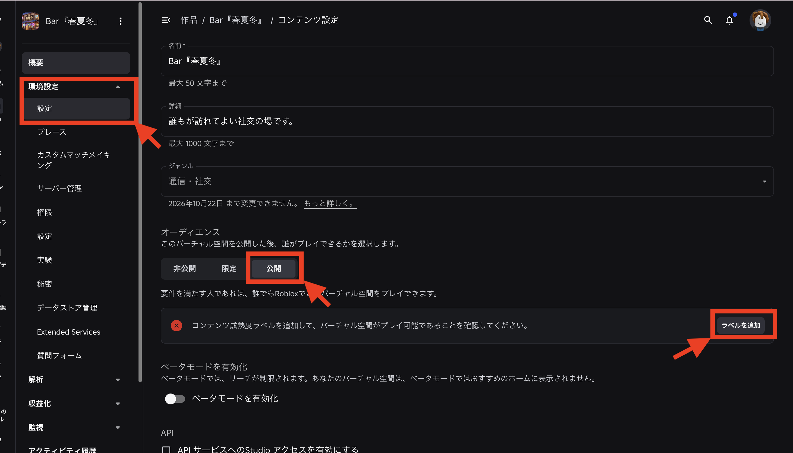
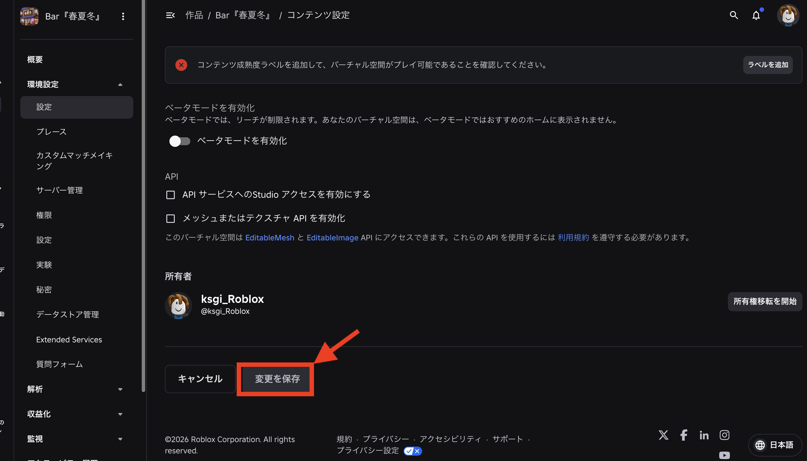

# リリース・公開ガイド

対象：専門学校生（IT・ゲーム・クリエイティブ専攻）
想定用途：発表会（`ハッカソン形式`・`個人制作形式`どちらの4日目にもある）に向けて、自分たちのゲームを実際に遊べる状態で公開する手順。**講師の説明がなくてもこのページだけを読んで公開できる**ことを目指している。

## 全体の流れ

1. Studioから「Publish（公開）」して、作品をRoblox上に作成する
2. Creator Hub（[creator.roblox.com](https://creator.roblox.com)）で名前・説明文などの詳細を設定する
3. コンテンツ成熟度ラベルを追加する（公開には必須）
4. 公開範囲（オーディエンス）を選び、変更を保存する

---

## 1. Studioから公開する（Publish）

1. Studioの画面上部にある「Publish to Roblox」（または単に「Publish」）ボタンをクリックする
2. 初めて公開する場合は、作品の名前を入力するダイアログが出るので入力する
3. 一度Publishした後は、同じボタンを押すたびに「今の編集内容を上書き公開」できる（Team Createで編集中でも、区切りの良いタイミングでこまめにPublishしておくと安心）

- **よくあるエラー**：Publishボタンが押せない・グレーアウトしている場合、Robloxアカウントへのログイン状態を確認する

---

## 2. Creator Hubで詳細設定を開く

1. ブラウザで[creator.roblox.com](https://creator.roblox.com)を開き、Robloxアカウントでログインする
2. 「作品」の一覧から、公開した自分たちの作品を選ぶ
3. 左メニューの「環境設定」→「設定」を開く（この中に、名前・説明文・公開範囲などの設定が1ページにまとまっている）

---

## 3. 名前・詳細・ジャンルを設定する

- **名前**：最大50文字。プレイヤーが検索・一覧で目にする作品名
- **詳細**：最大1000文字。どんなゲームかの説明文
- **ジャンル**：プルダウンから選択。一度選ぶと一定期間変更できない点に注意（画面に「◯月◯日まで変更できません」と表示される）

---

## 4. 公開範囲（オーディエンス）を選ぶ

「このバーチャル空間を公開した後、誰がプレイできるかを選択します」という説明の通り、3段階から選ぶ。

| 選択肢 | 意味 |
|---|---|
| 非公開 | 自分（と招待した人）以外はプレイできない |
| 限定 | 招待した特定のユーザーだけプレイできる |
| 公開 | 条件を満たせば誰でもRobloxでプレイできる |

- **発表会での使い分け**：クラス内の発表会であれば、必ずしも「公開」にする必要はない。「限定」でも、参加者・審査員をあらかじめ招待しておけば発表会は成立する。「公開」にすると世界中の誰でも見つけてプレイできる状態になるため、内容に問題がないか（不適切な表現がないか等）を一度チーム内で確認してから選ぶとよい
- **よくあるエラー**：「公開」を選ぶと、画面のように「コンテンツ成熟度ラベルを追加して、バーチャル空間がプレイ可能であることを確認してください」という警告が出る。これは次の5章で解消する

---

## 5. コンテンツ成熟度ラベルを追加する

1. 「オーディエンス」セクション右側の「ラベルを追加」ボタンをクリックする
2. 表示される質問に沿って、暴力表現・恐怖表現などの有無を回答する
3. 回答内容に応じて自動的に年齢区分のラベルが設定される

- **よくあるエラー**：このラベルを設定しないと「公開」では保存できない（「非公開」「限定」の場合は必須ではない）。正直に回答すればよく、多くの学習用コンテンツ（コイン集め・Obby等）は最も軽い区分になることが多い

---

## 6. 変更を保存する

1. ページを一番下までスクロールする
2. 「所有者」欄で、公開した本人（または権限を持つメンバー）になっていることを確認する
3. 「変更を保存」ボタンをクリックして確定する

- **よくあるエラー**：設定を変えただけで「変更を保存」を押し忘れると、すべての変更が反映されない。編集後は必ずこのボタンまでスクロールして押す

---

## 完成後のチェックリスト

- [ ] Studioから最新の状態をPublishした
- [ ] 名前・詳細（説明文）を入力した
- [ ] 公開範囲（オーディエンス）を発表会の運用に合わせて選んだ
- [ ] 「公開」を選んだ場合、コンテンツ成熟度ラベルを追加した
- [ ] 「変更を保存」を押して確定した
- [ ] 実際にリンク（またはRoblox内検索）から自分たちのゲームを開き、プレイできることを確認した
