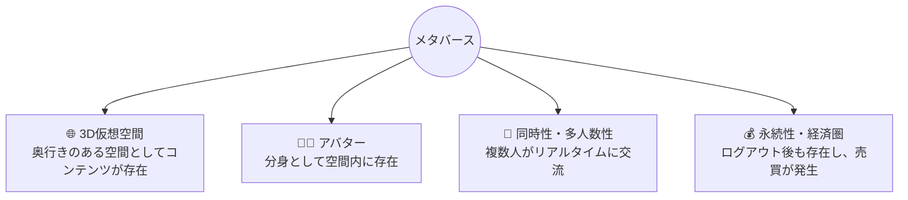
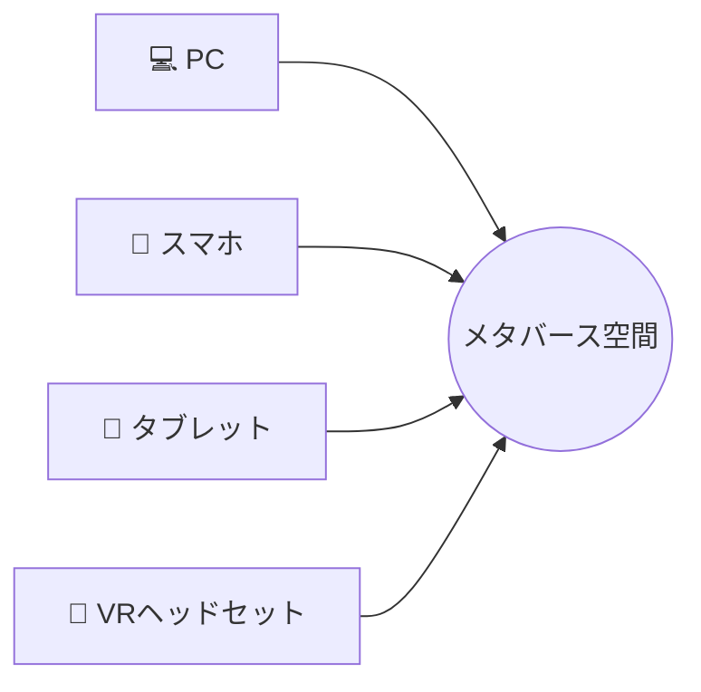
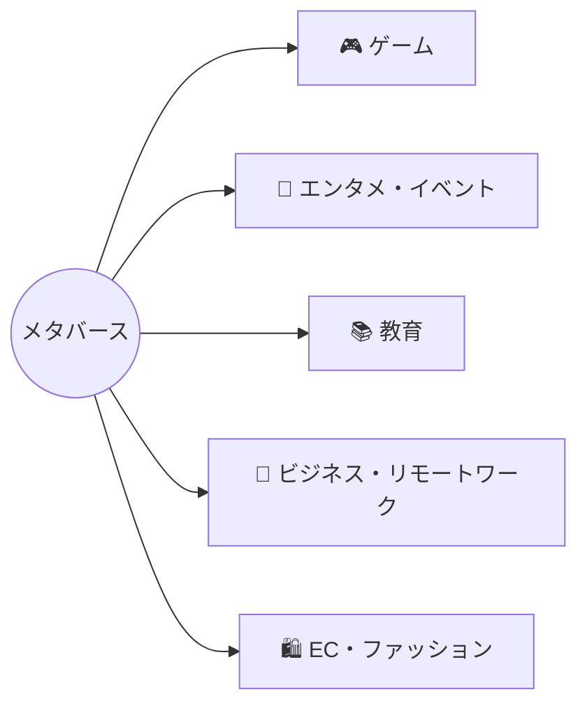
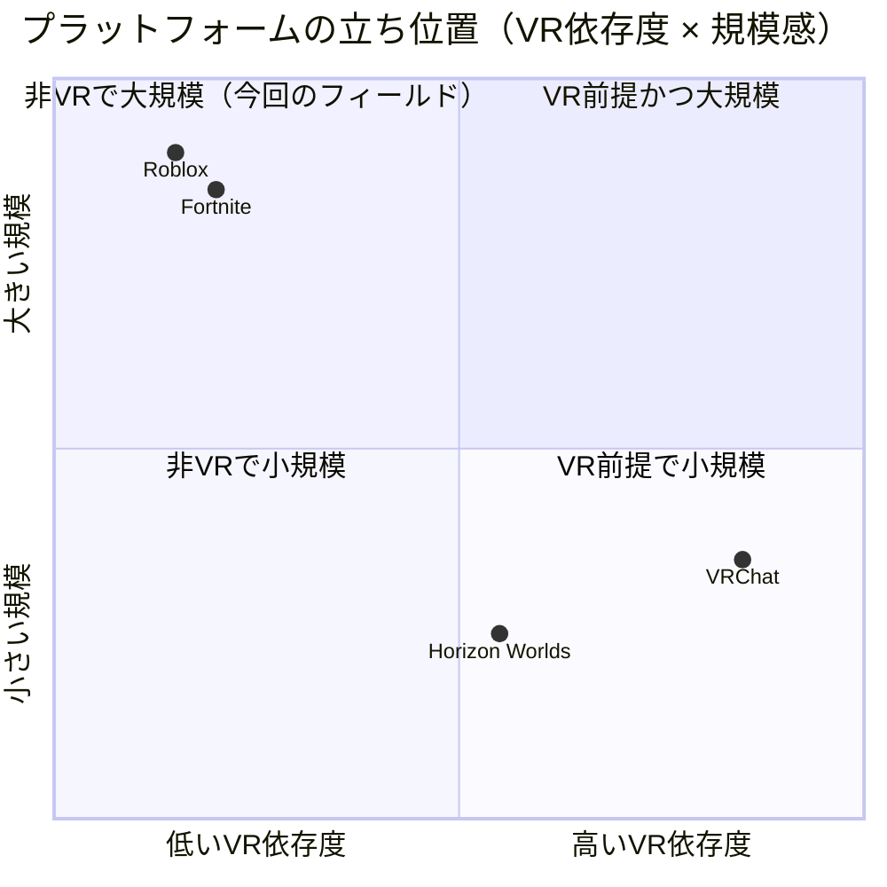
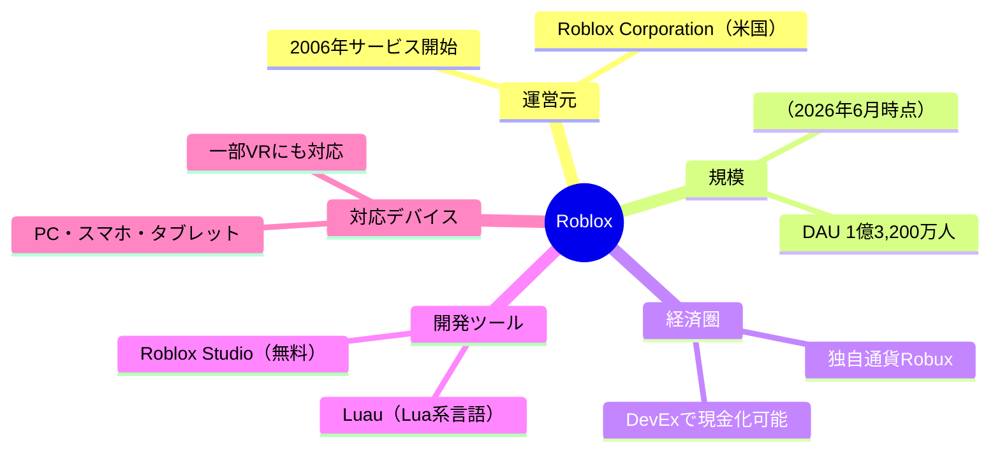

# メタバースとは？｜講習資料（スライド作成用・詳細版）

https://docs.google.com/presentation/d/1Bqr7btBxPQ2G4FwoV5qtPCcyZaHuGbA3Pfpm_eyqDbI/edit?slide=id.g3f5a7760ed2_2_2#slide=id.g3f5a7760ed2_2_2

対象：専門学校生（IT・ゲーム・クリエイティブ専攻）
想定用途：1日目1限（開会式・オリエンテーション）の導入トーク／スライド化の元資料

## この資料の位置づけ

1日目1限は「このハッカソンは実際のIT・ゲーム業界のチーム開発プロセスを体験するもの」という説明から始まるが、そもそも「メタバース」という言葉自体の共通認識が参加者間で揃っていないと、4日間通してのゴールイメージがぼやける。本資料は、開会式冒頭 or 事前配布で「メタバースとは何か」「よくある誤解」「なぜRobloxで作るのか」「これが自分たちのキャリアとどうつながるのか」を短時間で揃えるための資料。スライド1枚＝本資料の見出し1つ、という対応関係を意識して構成している。

## 1. 語源・歴史

- **語源**：1992年、SF作家ニール・スティーヴンスンの小説『スノウ・クラッシュ』内で、「meta（超越した）」＋「universe（宇宙）」の造語として初めて登場した架空の3D仮想空間の呼称
- **先行事例**：2003年公開の『Second Life』が、UGC・仮想通貨・土地売買を備えた初期メタバースの代表例として知られる（一時ブームになったが定着せず縮小）
- **転機**：2021年10月、Facebook社が社名を「Meta」に変更し、事業の軸足をメタバースに置くと発表 → この年が「メタバース元年」と呼ばれ、世界的にバズワード化した
- **現在**：Meta社のHorizon Worlds（現在はVRに加えモバイル・Web版でも展開）は思ったほど普及せず苦戦する一方、Roblox・Fortniteなど「ゲームプラットフォームとしてのメタバース」がユーザー数・経済規模の両面で先行している、というのが2020年代半ばの実態

## 2. メタバースの定義（4要素）

「メタバース」に業界統一の厳密な定義は存在しないが、語られる際に共通して出てくる要素は以下の4つ。

| 要素 | 内容 |
|---|---|
| 3D仮想空間 | 平面のWebページやアプリではなく、奥行きのある空間としてコンテンツが存在する |
| アバター | ユーザーは自分の分身（アバター）を介して空間内に存在し、他者から見える |
| 同時性・多人数性 | 複数のユーザーが同じ空間・同じ時間軸を共有し、リアルタイムに交流できる |
| 永続性・経済圏 | ユーザーがログアウトしても空間は存在し続け、アイテム売買などの経済活動が発生する |

一言でまとめると、「大勢の人が同時にアバターとして入り込み、交流したり何かを作ったり売買したりできる、持続する3D仮想空間」がメタバースの実態に近い。**重要なのは、この4要素の定義のどこにも「VRデバイスが必須」とは書かれていない**という点（詳細は次章）。

> 図解メモ：スライド化する際は4分割の均等なボックスに、それぞれアイコン＋短い言葉で並べると初心者にも一目で伝わる。

## 3. よくある誤解を正す

スライドで最も強調したいパート。参加者の頭の中にある「メタバース＝VRヘッドセットをかぶるSFっぽいもの」というイメージを、ここで解きほぐす。

### 誤解1：VR＝メタバース

- **VRはメタバースに入るための「アクセス手段の1つ」にすぎない**
- メタバースの定義（3D空間・アバター・同時性・経済圏）を満たしていれば、アクセス手段はPC・スマホ・VRヘッドセットのどれでもよい
- Robloxの利用者はPC・スマホ・タブレット・VRヘッドセットなど複数のデバイスにまたがっており、VRヘッドセット経由はその中の一部にすぎない
- 一方で、VRヘッドセットを使った体験のすべてがメタバースというわけでもない（単に一人称視点の没入型コンテンツを見ているだけの場合もある）。つまり**VRはメタバースの必要条件でも十分条件でもなく、あくまでアクセス手段の1つ**と捉えるのが正確
- 逆に言えば、このハッカソンで参加者がPC上のRoblox Studioで作る空間も、それ自体が立派な「メタバース」である（4日目に一部Meta Questで体験するのは、あくまでアクセス手段の1つを追加体験しているだけ）

> 図解メモ：4つのデバイスをすべて同じ大きさ・同じ矢印の太さで描くのがポイント。VRだけを特別扱いしないことで「入り口の1つに過ぎない」が視覚的に伝わる。

### 誤解2：メタバース＝ゲーム

- ゲームはメタバースの代表的な「ユースケースの1つ」であって、イコールではない
- 実際に展開されている用途の例：
  - **エンタメ・イベント**：Fortnite内での音楽ライブ（Travis Scottのイベントは同時接続1,230万人を記録。出典：Guinness World Records）
    - 📷 写真挿入：Fortnite内Travis Scottライブの画像
  - **教育**：バーチャルキャンパスでの授業・研修
  - **ビジネス・リモートワーク**：仮想オフィスでの会議・共同作業
  - **EC・ファッション**：デジタル衣装・アイテムの売買（NIKE、GUCCIなどブランドの参入事例）
- 「ゲームを作る」ことは、メタバースというより大きな概念を体験するための、最も学習コストが低く分かりやすい切り口として選ばれている、という位置づけ

> 図解メモ：「ゲーム」だけを他より目立たせず、5つを同列に並べることで「ゲームは数ある用途の1つ」だと伝わる。

### 誤解3：メタバースはまだSFの空想・実態がない

- 少なくともRobloxのようなプラットフォームでは、既に実体のある経済圏が機能している
- Robloxには独自通貨「Robux」があり、ユーザーが作ったゲーム内アイテムの売買が行われている
- 一定基準を満たしたクリエイターは、Robuxを実際の現金に換金できる「DevEx（Developer Exchange）」制度を利用できる＝クリエイター経済が実在する
- つまり「メタバースで生計を立てる人が実際に存在する」段階に来ている

### 誤解4：メタバース＝Web3・NFT必須

- メタバースとWeb3（ブロックチェーン・NFT）は混同されがちだが、技術的には別軸の話
- Roblox・Fortniteのような主要プラットフォームは、現状Web3技術に依存せずに巨大な経済圏を成立させている
- このハッカソンで使うRobloxも、ブロックチェーンの知識は一切不要

## 4. なぜ今メタバースが注目されているのか

- **VR/ARデバイスの低価格化・普及**（Meta Questなど）により、没入型の体験がより身近になった（ただし前述の通り、これはメタバース普及の一因ではあっても必須条件ではない）
- **UGC（ユーザー生成コンテンツ）経済の拡大**：プレイヤーがコンテンツの消費者であると同時に、制作者・販売者にもなれるプラットフォームが主流化している
- **Z世代を中心にゲーム内滞在時間がSNSを上回る**傾向があり、ゲーム空間がコミュニケーションのインフラ化している
- コロナ禍以降、**オンラインでの「集まる」体験**への需要が高まった

## 5. 代表的なメタバースプラットフォーム比較

| プラットフォーム | アクセス手段 | 特徴 |
|---|---|---|
| Roblox | PC／スマホ／タブレット／（一部VR対応） | UGC（ユーザーが作ったゲーム）中心。開発ツール（Studio）と経済圏（Robux）が一体化。VR必須ではない代表例 |
| Fortnite（Creative） | PC／コンソール／モバイル | 大規模IPを背景にしたUGCモード。ライブイベントなどエンタメ色が強い |
| VRChat | 主にVR（PCでも可） | VR体験・アバターコミュニケーションに特化。VR前提に近い数少ない例 |
| Horizon Worlds | VR／モバイル／Web | Meta社が展開。当初はVRヘッドセット前提だったが、現在はモバイル・Web版でもアクセス可能。それでも普及は当初想定より苦戦している |

📷 写真挿入：各プラットフォームのスクリーンショット（Roblox／Fortnite Creative／VRChat／Horizon Worldsの画面）

> 図解メモ：Roblox・Fortniteが「非VRで大規模」の象限に入ることが、そのまま「VR＝メタバース」という誤解を崩す視覚的な根拠になる。

**Roblox・Fortniteの存在自体が「VR＝メタバース」という誤解を否定する最良の実例**：Robloxだけでも1日あたりのアクティブユーザー数（DAU）が1億3,200万人規模（2026年6月時点）に達しており、その大半はVRヘッドセットなしでPC・スマホからアクセスしている（出典：Roblox公式IR）。

## 6. 今回使用する『Roblox』とは？

プラットフォーム比較表に何度も登場している「Roblox」自体について、ここで簡単に整理しておく。

- **運営元**：米国Roblox Corporation。2006年にサービス開始（現在の形に近いプラットフォームとしての展開は2000年代後半〜）
- **プラットフォームの性質**：一言で言うと「誰でもゲーム・体験を作って公開できる、UGC（ユーザー生成コンテンツ）中心のオンラインゲームプラットフォーム」。Roblox社自身がゲームを作るのではなく、場（プラットフォーム）と開発ツールを提供し、ゲーム自体は世界中のユーザー（クリエイター）が作っている
- **開発ツール**：無料の専用エディタ「Roblox Studio」で3D空間を構築し、「Luau（Luaベースのスクリプト言語）」でゲームロジックを組む。専門知識がなくても数日〜数週間で1つのゲームを形にできる学習コストの低さが特徴
- **利用者層**：世界で1日あたり1億3,200万人規模（2026年6月時点）がアクセスする巨大プラットフォームで、特に10代を中心としたZ世代・アルファ世代の利用比率が高い（出典：Roblox公式IR）
- **経済圏**：独自通貨「Robux」でアイテム・アクセサリー等を売買でき、一定条件を満たしたクリエイターは「DevEx（Developer Exchange）」制度でRobuxを現金に換金できる（詳細は誤解3を参照）
- **対応デバイス**：PC・スマホ・タブレットが中心で、VRヘッドセット（Meta Quest等）にも一部対応。VRは必須ではなくアクセス手段の1つという位置づけ（詳細は誤解1を参照）
- **このハッカソンとの関係**：「作る側」を体験する教材として、上記の学習コストの低さ・チーム開発機能（Team Create）・実際のユーザー規模の大きさの3点から選ばれている（詳細は次章）

📷 写真挿入：Roblox Studioの編集画面キャプチャ
📷 写真挿入：実際にRoblox上で人気のゲーム画面

> 図解メモ：中心の「Roblox」から5つの枝（運営元・規模・経済圏・開発ツール・対応デバイス）が伸びる形で、初見の生徒が全体像を1枚で掴めるようにする。

## 7. なぜこのハッカソンではRobloxを使うのか

- **UGCエコシステムが最も成熟している**：「遊ぶ」だけでなく「作る」「稼ぐ」までが1つのプラットフォームで完結する
- **開発のハードルが低い**：Studioという専用エディタとLua（Luau）というスクリプト言語で、専門知識がなくても数日でゲームを形にできる
- **Team Create機能**により、複数人が同じ空間を同時編集できる＝実際のチーム開発プロセスをそのまま体験できる
- **DAU（1日あたりのアクティブユーザー数）が1億3,200万人規模（2026年6月時点）と非常に大きい**プラットフォームであり、実際に人が集まる場所で公開・評価される経験ができる
- **VRデバイスがなくても本格的なメタバース制作を体験できる**＝ハッカソンの機材制約（BYOD、Quest 2台のみ）とも相性が良い

## 8. 業界・キャリアとのつながり

メタバース関連の仕事は「VRの専門家」だけを指すのではなく、実際には既存のIT・ゲーム職種の延長線上にある。

| 職種 | メタバース領域での役割の例 |
|---|---|
| ゲームプログラマー | ゲームロジック、マルチプレイ通信（RemoteEvent等）の実装 |
| 3D/UIデザイナー | 空間・アバター・UIのビジュアル制作 |
| プランナー・ディレクター | 企画立案、ゲームバランス設計、企画書作成 |
| プラットフォームエンジニア | サーバー・パフォーマンス最適化、負荷対策 |

このハッカソンでは、参加者はこれらの役割をチーム内で分担しながら一通り経験する。「メタバースを遊ぶ側」から「作る側」に回る体験そのものが、就職活動でのポートフォリオ・自己PR（「チームでメタバース空間を1から企画・実装した経験」）として語れる材料になる。

## 9. 現状の課題・批判的視点（バランスを取るためのパート）

ハイプ（誇大な期待）だけを伝えると、業界を目指す学生としてはミスリードになるため、あえて課題も提示する。

- **Meta社のHorizon Worldsは、巨額投資に見合うユーザー数を獲得できておらず苦戦が報じられている**＝「VR前提のメタバース」は現時点では市場に受け入れられていない
- 「メタバース」という言葉自体が2021〜2022年にバズワード化した反動で、2023年以降は投資・報道の熱量がやや落ち着いている
- 一方で、Roblox・Fortniteのような「ゲームプラットフォーム型メタバース」は言葉のブームに関係なく実利用者数・売上を伸ばし続けている
- **教訓**：「メタバース」という単語のトレンドに一喜一憂するのではなく、「UGC・同時多人数・経済圏」という中身が実際に機能しているかどうかで見極める視点が、業界を目指す上で重要

## スライド構成案（参考）

本資料の見出しをそのままスライド1枚ずつに割り当てる想定：

1. タイトル
2. メタバースの語源・歴史（1992年 Snow Crash／2021年 Meta改名）
3. メタバースの定義（4要素の図解）
4. 誤解1：VR＝メタバースではない
5. 誤解2：メタバース＝ゲームではない（用途の広がり）
6. 誤解3・4：もう実在する経済圏／Web3必須ではない
7. 代表的プラットフォーム比較表
8. Robloxとは？（運営元・UGCプラットフォームとしての特徴・規模）
9. なぜRobloxか
10. 業界・キャリアとのつながり
11. 課題・批判的視点（ハイプとファクトの整理）
